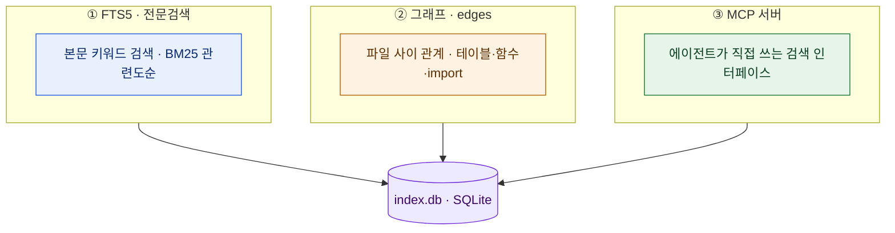
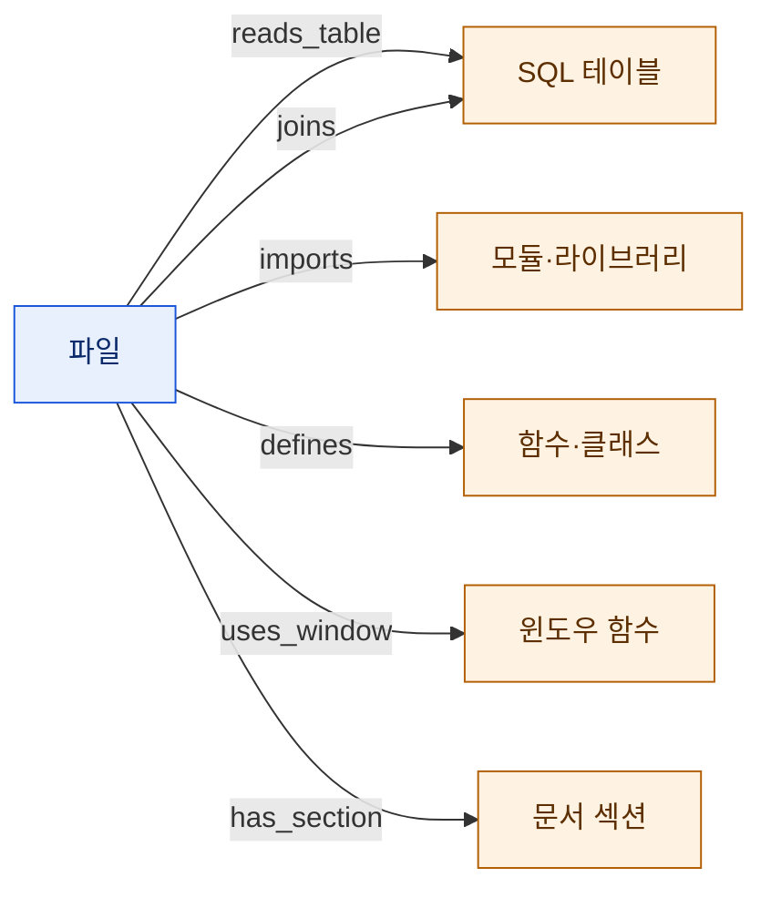
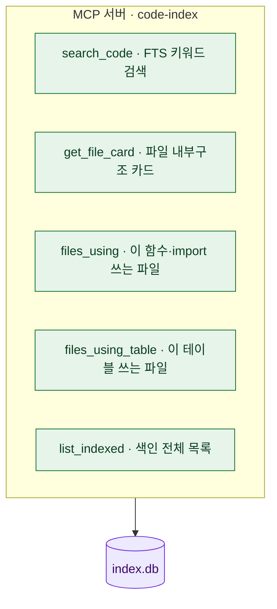
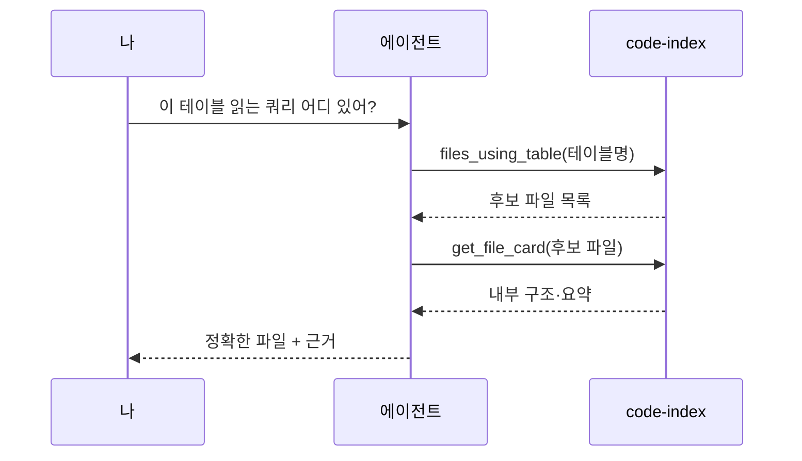
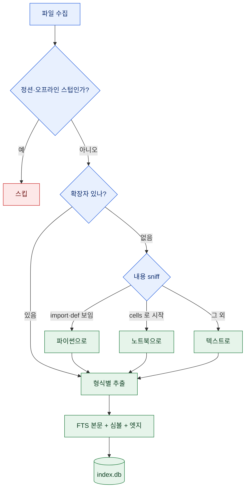
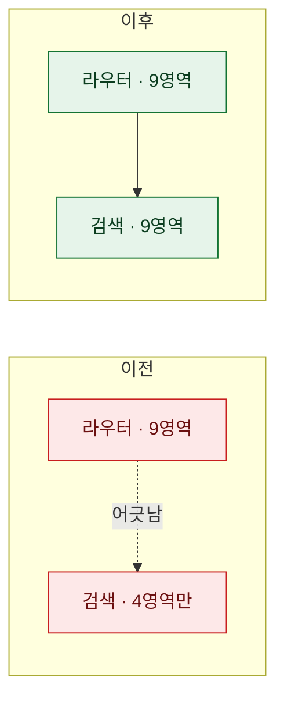

# 지식 볼트에 '검색엔진'을 얹었다

> 지난 편에서 볼트에 [[knowledge-vault-routing-index|라우팅 인덱스]]를 깔았다. 질문이 오면 "어느 영역, 어느 폴더"인지 짚어주는 지도. 그런데 지도가 폴더 앞까지 데려다줘도, 그 폴더 안 수천 개 파일에서 **정확히 그 코드 한 줄**을 찾는 건 여전히 내 손이었다. 라우터 다음에 필요한 건 검색엔진이었다. 그 다리를 놓은 이야기.

## 라우터까지 왔는데, 왜 아직 부족했나?

라우팅 인덱스는 훌륭한 **거친(coarse) 계층**이다. "예전 그 크롤러 어디 있어?" 하면 "외부 저장소 영역 → 그 폴더"까진 즉시 온다. 문제는 그다음. 폴더에 파일이 수백, 수천 개면 결국 하나씩 열어봐야 한다.

내가 진짜 던지고 싶은 질문은 이런 것들이었다.

- "**percentile 같은 윈도우 함수**를 쓰는 SQL이 어디 있지?"
- "이 **유틸 함수를 import**하는 스크립트 전부 보여줘"
- "특정 **테이블을 읽는** 쿼리만 골라줘"

이건 "어느 폴더"의 문제가 아니라 **"그 안에서 정확히 무엇"**의 문제다. 라우터는 폴더를 가리키지만, 폴더 안을 뒤지진 못한다.

그래서 **두 번째 계층**을 얹었다. 라우터가 "어느 폴더"를 찾으면, 그 안을 **키워드·함수·테이블 단위로 정밀검색**하는 계층.

재밌는 건, 이 발상을 나는 이미 **남의 프로젝트**로 소개한 적이 있다. [[codebase-memory-mcp-knowledge-graph|코드베이스를 '지식 그래프'로]] 편에서 다룬 codebase-memory-mcp가 바로 "임베딩 없이 코드 구조를 그래프로 만들어 MCP로 검색"하는 도구였다. 이번엔 같은 철학을 **내 볼트 전체**에 직접 구현한 셈이다.

## 정밀검색 계층은 뭘로 만들었나?

세 부품이다. 무거운 인프라는 하나도 없다 — SQLite 파일 하나(`index.db`)와 파이썬 스크립트 몇 개가 전부다.

하나씩 뜯어보자.

## FTS5 — 왜 grep이 아니라 '전문검색'인가?

FTS5는 SQLite에 내장된 **전문검색(Full-Text Search) 엔진**이다. 쉽게 말해 파일 본문을 미리 통째로 색인해두고, 키워드로 즉시 찾는 것. `grep`과 뭐가 다르냐면 이렇다.

| | grep · 매번 훑기 | FTS5 · 미리 색인 |
|---|---|---|
| 방식 | 파일을 매번 처음부터 스캔 | 색인 테이블에서 조회 |
| 속도 | 파일 수·크기에 비례해 느려짐 | 수만 파일도 즉시 |
| 정렬 | 매칭 여부만(예/아니오) | **관련도순(BM25)** |
| 대상 | 텍스트 파일 위주 | 문서·코드·노트북 본문까지 |

포인트는 **관련도순**이다. "이 키워드가 든 파일 500개"를 뭉텅이로 주는 게 아니라, **가장 관련 깊은 순서로** 준다. 그리고 색인 대상이 순수 텍스트만이 아니다 — 엑셀 시트명, PDF 본문, 노트북 셀, 문서 요약까지 다 넣어서, **형식과 무관하게 한 번에** 검색된다. 색인할 때 파일마다 "요약 카드 + 심볼 이름 + 원문"을 합쳐 FTS 본문으로 밀어넣기 때문이다.

## 그래프 — 파일 사이의 '관계'를 어떻게 색인하나?

FTS가 "어떤 단어가 있나"라면, 그래프는 **"어떤 관계가 있나"**다. 색인할 때 파일마다 구조를 정적 분석해서, 파일과 대상 사이의 **엣지(edge)**를 뽑아 따로 저장한다.

추출 방식은 언어마다 다르다.

- **SQL**은 파서로 테이블·조인·윈도우 함수·CASE 버킷·집계·CTE를 뽑는다.
- **파이썬**은 AST(구문 트리)로 함수·클래스·import·호출을 뽑는다.
- **그 외 언어**(자바스크립트·C#·셸·VBA 등)는 범용 패턴으로 함수·클래스·import를 근사 추출한다.
- **문서**(마크다운·PDF·docx)는 섹션 제목을 뽑아 `has_section` 엣지로 만든다.

이게 왜 강력하냐면, 이제 이런 질문에 **역방향**으로 답할 수 있다. "이 테이블을 읽는 SQL 전부" → `reads_table` 엣지를 거꾸로 타면 끝이다. 텍스트 검색이라면 테이블명으로 grep한 뒤 "진짜 읽는 건지, 주석인지, 컬럼명이 우연히 같은 건지"를 일일이 눈으로 걸러야 하지만, 그래프는 **관계 자체가 이미 색인**돼 있다.

## 왜 그냥 검색 스크립트가 아니라 'MCP'인가?

여기가 핵심이다. 색인을 아무리 잘 만들어도, 내가 매번 SQL을 두드려 조회하면 반쪽짜리다. 진짜 목표는 **AI 에이전트가 스스로 이 색인을 검색**하는 것이었다.

그래서 색인을 **MCP(Model Context Protocol) 서버**로 감쌌다. MCP는 에이전트에게 "도구"를 표준 방식으로 노출하는 규약. 이 색인을 다섯 개 도구로 열어줬다.

이제 실제 질문이 이렇게 풀린다. 도구가 한 번에 답을 주는 게 아니라, **엮여서** 답을 좁혀간다.

라우터가 폴더를 찾고, MCP가 그 안에서 정확한 파일을 집어 근거까지 대는 흐름. 이게 두 계층이 함께 도는 그림이다.

## 확장자 없는 파일까지 어떻게 다 넣나?

색인기를 처음 돌렸을 때 함정이 하나 있었다. 오래된 저장소엔 **확장자가 아예 없는 파일**이 잔뜩 있었다(노트북이나 스크립트를 내보내면서 확장자가 날아간 것들). 색인기는 확장자로 파일 종류를 판단하는데, 확장자가 없으니 통째로 스킵됐다. 정작 알맹이인 코드들이.

그래서 색인 파이프라인에 **내용 추측(sniff)** 단계를 끼웠다.

**sniff**는 파일 앞부분만 열어 내용으로 종류를 추측하는 것이다. `import`나 `def`가 보이면 파이썬, `{"cells"`로 시작하면 노트북, 나머진 텍스트. 이 한 단계로 스킵됐던 파일 수십 개가 되살아났다.

수집 단계의 **안전장치**도 그 못지않게 중요했다. 홈 디렉토리를 통째로 넣으면 개발툴 캐시·클라우드 동기화 껍데기·시스템 정션(무한 루프를 유발한다)까지 딸려온다. 그래서 규칙을 이렇게 못 박았다.

- **정션(reparse point)·클라우드 오프라인 스텁**은 따라가지 않는다 — 억지로 내려받지 않고 지나친다.
- 개발툴 캐시·패키지 폴더·대량 이미지 폴더는 **제외**한다.
- **다운로드 덤프**처럼 내 작업물이 아닌 대용량 폴더는 확인한 뒤 뺀다.

이 제외 규칙 하나로 "35만 파일·35GB"짜리 홈이 "약 1만 8천 파일·실제 작업물"로 정리됐다. 색인은 **다 넣는 게 아니라 잘 골라 넣는 것**이더라.

## 오늘 한 일 = 두 계층을 '일치'시킨 것

사실 정밀검색 계층은 예전에 절반만 만들어져 있었다. 라우터는 아홉 영역을 가리키는데, 검색 색인은 그중 **네 영역만** 담고 있었다. 지도와 검색 범위가 어긋난 상태였던 것.

빠져 있던 세 영역을 색인에 밀어넣었다.

1. **외부 공개 저장소** — 원격에만 있던 걸 로컬로 복제해서 넣었다. 원격 저장소는 로컬 파일만 훑는 색인기가 못 잡으니, 복제가 먼저다.
2. **클라우드 문서고의 일부** — 온라인 전용 껍데기는 건너뛰고, 로컬에 실재하는 소형 코드·텍스트만.
3. **홈 디렉토리의 실제 프로젝트들** — 위의 안전장치·제외 규칙을 그대로 적용해서.

결과적으로 라우터가 가리키는 **모든 영역이 이제 정밀검색된다**. 약 5만 8천 개 파일이 하나의 색인 안에 들어왔고, 새로 추가한 것들은 날짜 스탬프로 구분해뒀다(나중에 "언제 넣은 것"인지 되짚기 위해).

그리고 확인한 반가운 사실 하나. MCP 서버는 **재시작 없이** 갱신된 색인을 곧바로 검색했다. 색인 파일에 추가만 하면, 에이전트가 다음 질문부터 바로 새 내용을 찾는다. 서버를 다시 띄우는 건 도구 목록이 바뀔 때뿐, 데이터가 늘어난 것만으로는 필요 없다.

## 무엇이 달라졌나?

| 이전 | 이후 |
|---|---|
| 라우터가 폴더까지만 안내 | 폴더 안을 키워드·함수·테이블로 정밀검색 |
| 파일을 하나씩 열어 확인 | 관련도순 후보 + 내부구조 카드 즉시 |
| "이 테이블 읽는 쿼리?"에 grep + 눈 | 그래프 엣지 역방향으로 한 번에 |
| 검색은 4영역만 | 라우터와 동일한 9영역 전부 |
| 확장자 없으면 스킵 | 내용 sniff로 되살림 |

두 계층의 분업은 이렇게 요약된다. **라우터는 "어느 폴더"를, 검색엔진은 "그 안에서 정확히 무엇"을.** 거친 계층과 세밀한 계층이 포개지니, 몇 년치 파일 더미가 비로소 **질의 가능한 하나의 데이터베이스**가 됐다.

무겁지 않다는 게 이 접근의 미덕이다. 벡터DB도, 임베딩도, 클라우드도 없다. SQLite 파일 하나에 전문검색과 관계 그래프를 담고, MCP로 에이전트에 물려줬을 뿐이다. 그런데 이 소박한 조합이, 흩어진 창고를 **"물어보면 답하는 아카이브"**로 바꿨다.

> 정리의 끝은 파일을 쌓는 게 아니라, **질문이 정확한 한 줄까지 닿게 하는 것**이더라. 라우터가 길을 내고, 검색엔진이 그 길 끝의 문을 연다.
