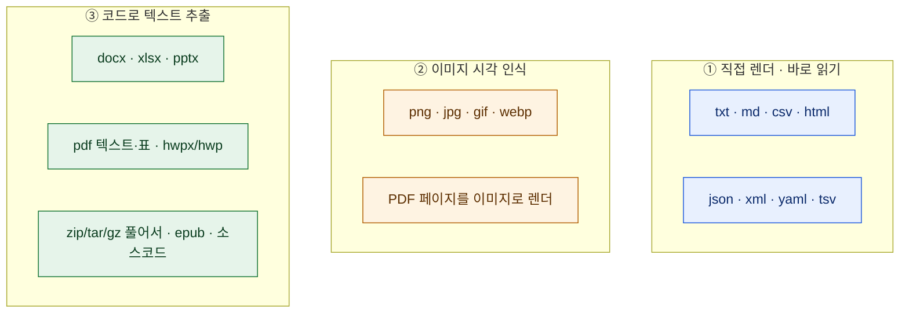
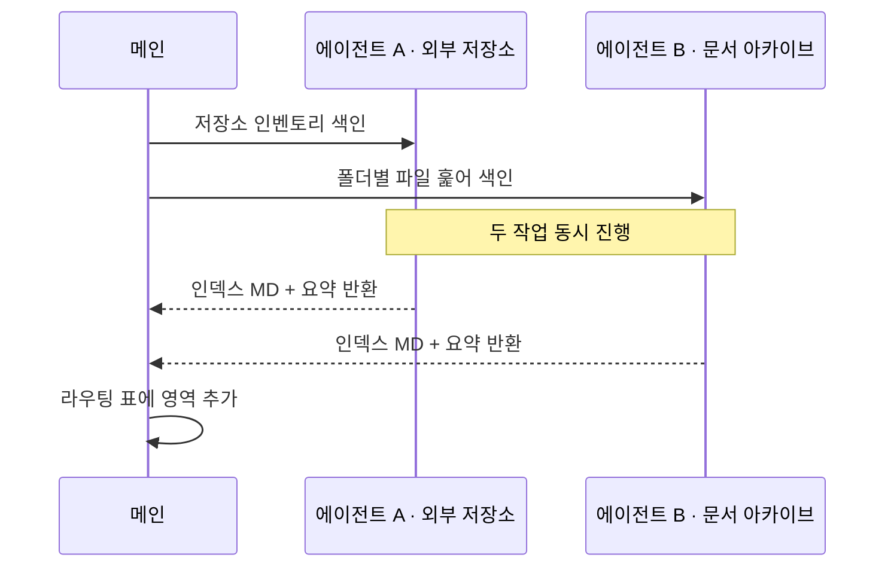
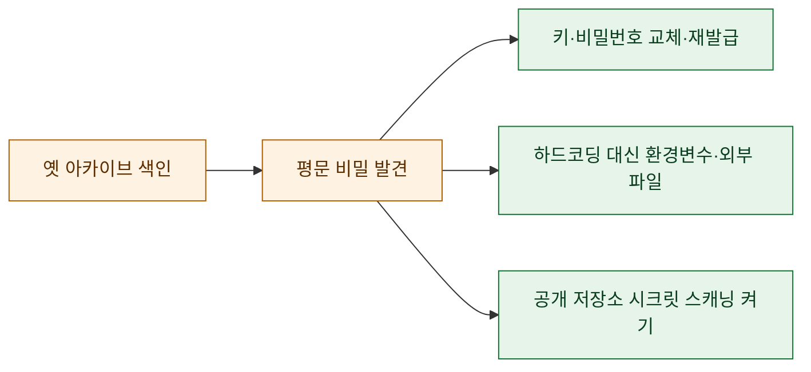

# 지식 볼트에 '라우팅 인덱스'를 깔았다

> 몇 년치 작업물을 평문 마크다운 볼트에 차곡차곡 색인해뒀다. 그런데 막상 "그때 그 분석 어디 있더라?" 하고 물으면, 에이전트가 **요약본**만 정갈하게 돌려줬다. 정작 내가 보고 싶은 건 그 요약이 가리키는 **원본 파일**인데. 요약과 원본 사이에 다리가 없었던 거다. 그 다리를 놓은 이야기.

## 요약 인덱스만으론 왜 부족했나?

내 볼트는 이미 영역별로 잘 색인돼 있었다. 개인 코드, 게임 데이터 분석 프로젝트, 마케팅 자동화 저장소, 문서 아카이브, 복구 드라이브… 각각 인덱스 노트가 있었다. 문제는 그 인덱스들이 **서로 연결되지 않은 섬**이었다는 것.

내가 "X 작업 찾아줘" 하면 에이전트가 거쳐야 할 경로가 머릿속에만 있고, 문서로는 없었다. 그래서 매번 전역 검색을 돌리거나, 요약 노트에서 멈췄다.

핵심 진단은 하나였다. **"질문을 원본 디렉토리로 내려보내는 라우터가 없다."**

## 라우팅 인덱스란 무엇인가?

간단하다. 질문을 세 단계로 흘려보내는 **한 장짜리 진입 문서**다.

기존 인덱스가 "무엇이 어디 있나"의 **목록**이었다면, 라우팅 인덱스는 "이 질문이 오면 어디부터 열어라"의 **지침**이다. 목록은 정적이고, 지침은 행동을 유발한다. 이 차이가 생각보다 컸다.

## 라우팅 표는 어떻게 생겼나?

핵심은 **영역 × 대표 키워드 × 인덱스 MD × 원본 경로 × 상태**를 한 줄로 묶은 표다. 실제 경로는 사적이라 여기선 라벨만 옮기면 이렇다.

| 영역 | 대표 키워드 | 상태 |
|---|---|---|
| 개인 코드 아카이브 | 잡다한 스크립트·유틸 | 색인 완료 |
| 게임 데이터 분석 | 매출·리텐션·BM 지표 | 색인 완료 |
| 마케팅 자동화 | 키워드·SEO·SNS 포스팅 | 색인 완료 |
| 문서 아카이브 | 리포트·데이터·문서 | 색인 완료 |
| 복구 드라이브 | 크롤링·수집 자동화 뿌리 | 색인 완료 |
| 외부 저장소 | 공개 코드 인벤토리 | 색인 완료 |

여기에 **주제 교차 라우팅**을 덧붙였다. "이 주제를 물으면 이 영역들을 보라"는 지름길이다. 한 주제가 여러 영역에 흩어져 있을 때(예: 어떤 분석의 뿌리 코드는 복구 드라이브에, 정리본은 문서 아카이브에) 이게 없으면 반쪽만 찾게 된다.

## 파일을 '다 읽는다'는 규칙

라우터가 원본 디렉토리를 가리켜도, 거기서 텍스트 파일만 읽고 엑셀·PPT·PDF·이미지를 건너뛰면 반쪽짜리다. 그래서 **"폴더를 읽어"라고 하면 아래 3계층을 전부 해당 방법으로 연다**는 규칙을 못박았다.

포인트는 **파일 형식이 읽기를 막는 핑계가 되면 안 된다**는 것. 엑셀은 표 추출로, PPT는 슬라이드 텍스트로, PDF는 텍스트+페이지 이미지로, 압축은 풀어서. 형식마다 도구가 다를 뿐, "못 읽음"은 없다. (다만 대용량 미디어나 클라우드에만 있는 껍데기 파일은 억지로 내려받지 않고 메타데이터만 — 이건 안전·비용 선.)

## 빈 칸은 병렬 서브에이전트로 채웠다

라우팅 표를 그리다 보니 아직 색인 안 된 영역 두 곳이 드러났다. 하나는 문서 아카이브의 일부, 하나는 외부 공개 저장소. 순차로 훑으면 지루하니 **백그라운드 서브에이전트 둘을 동시에** 띄웠다.

각 에이전트가 자기 몫을 훑어 **볼트 규격의 인덱스 MD를 직접 쓰고**, 요약만 돌려줬다. 내 메인 컨텍스트는 깨끗하게 유지되고, 결과만 라우팅 표에 병합했다. 이런 "훑고-요약-병합" 패턴은 대상이 클수록 이득이 크다.

## 옛 코드를 훑다 마주친 보안 교훈

여기서 예상 못 한 소득이 있었다. 몇 년 전 스크립트들을 형식별로 열어보니, **평문으로 박힌 자격증명**이 여기저기서 튀어나왔다. 오래된 테스트 파일 속 비밀번호, 스니펫에 그대로 남은 API 키, 로컬 경로에 노출된 계정명 같은 것들.

당장 값을 어디로도 옮기지 않고, 위치와 종류만 기록해뒀다. 그리고 교훈은 명확했다.

**과거의 나를 감사하는 가장 좋은 도구가, 결국 지금 만든 색인이었다.** 아카이브를 체계적으로 읽는 행위 자체가 보안 점검이 된다. 오래 방치한 코드 창고가 있다면, 형식별로 한 번 쭉 열어보길 권한다. 분명 뭔가 나온다.

## 무엇이 달라졌나?

이제 흐름은 이렇게 바뀌었다.

| 이전 | 이후 |
|---|---|
| 질문 → 요약 노트에서 멈춤 | 질문 → 라우터 → 원본 디렉토리 → 실제 파일 |
| 형식 다르면 스킵 | 3계층으로 전부 읽음 |
| 인덱스는 흩어진 섬 | 한 장짜리 진입점이 다 연결 |
| 색인은 수동·순차 | 필요하면 병렬 에이전트로 확장 |

라우팅 인덱스는 거창한 시스템이 아니다. **마크다운 한 장**이다. 그런데 이 한 장이 "요약을 읽는 도우미"를 "원본을 뒤지는 조수"로 바꿨다. 지식 볼트를 쌓아온 사람이라면, 목록 위에 지침 한 장을 얹는 것만으로 체감이 확 달라질 거다.

> 정리는 파일을 모으는 게 아니라, **질문이 파일까지 도달하는 길을 내는 것**이더라.
