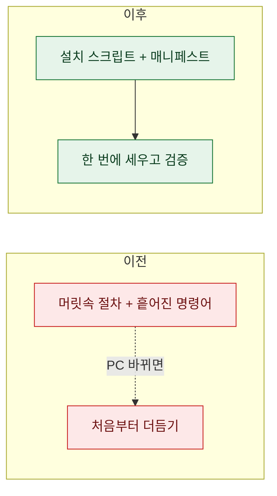
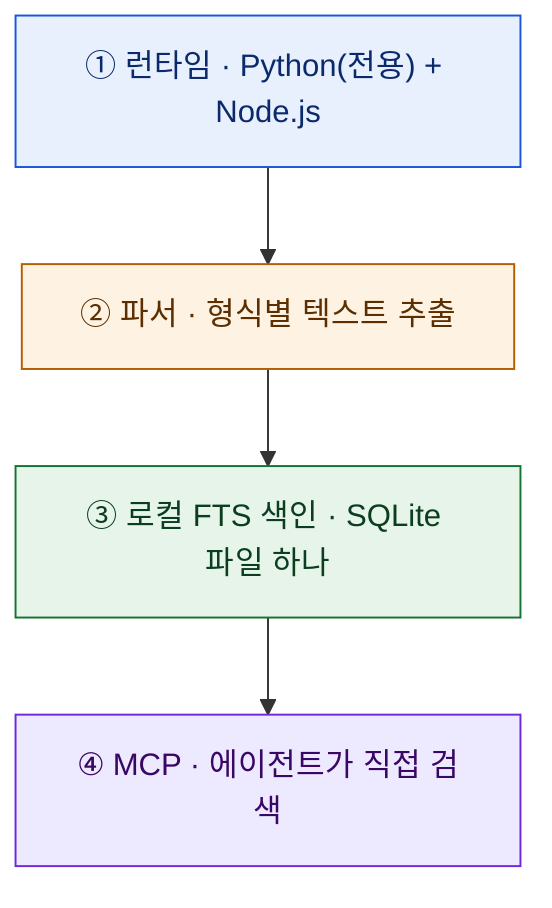
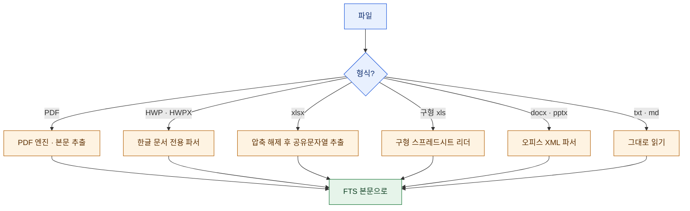
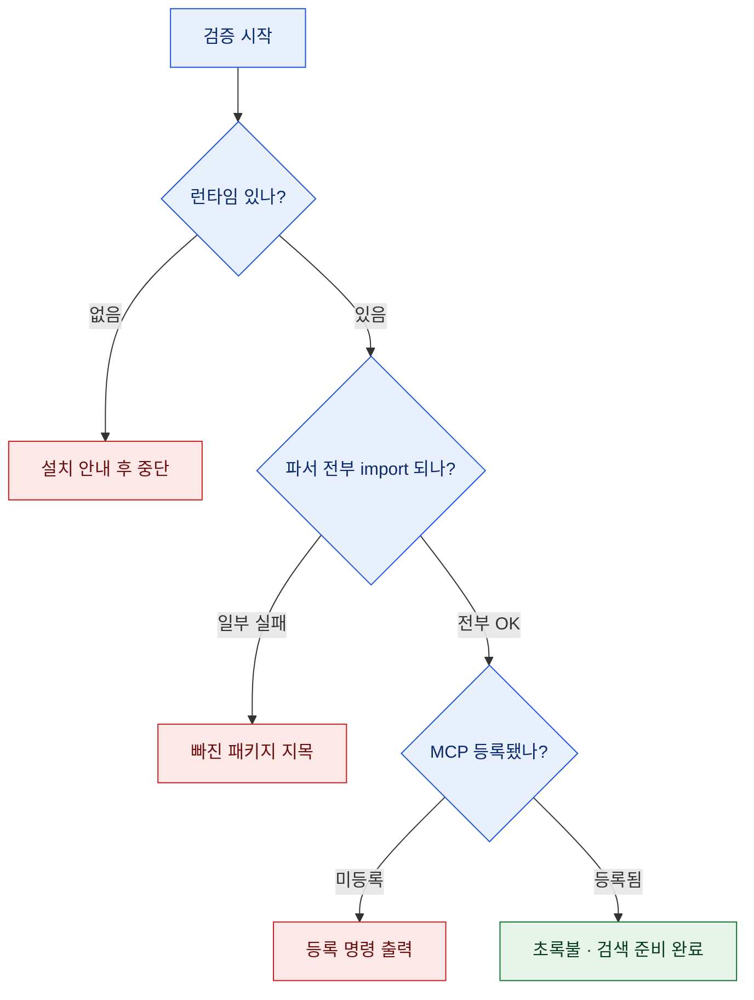

# 지식창고 검색을 '설치 가능한 것'으로 굳혔다

> 검색 시스템을 만드는 것과, 그 시스템을 **다시 세울 수 있게** 만드는 것은 다른 일이다. 나는 전자만 해두고 후자를 미뤄왔다. 그러다 "이거 새 노트북에 다시 깔려면 뭐부터 하지?"라는 질문 앞에서 멈칫했다. 절차가 전부 머릿속에만 있었던 것이다.

## 왜 '설치'를 굳혀야 했나?

나에겐 몇 년치 문서를 로컬에서 전문검색하는 시스템이 있다. 엑셀·PDF·한글(HWP)·워드·노트까지 형식을 가리지 않고 한 색인에서 찾는 물건인데, [[knowledge-vault-fts-graph-mcp-search|지난 편]]에서 그 검색 계층 자체를 다뤘다.

그런데 이 시스템엔 약점이 하나 있었다. **설치가 문서화돼 있지 않았다.** 파이썬은 어디 걸로, 파서는 뭐뭐, MCP는 어떻게 등록했는지가 전부 내 기억과 흩어진 명령어 히스토리에 있었다. 이건 "작동한다"이지 "재현된다"가 아니다.

그래서 이번엔 검색 기능을 하나 더 붙이는 대신, **"이 시스템을 어떻게 세우는가"**를 하나의 설치 절차로 굳혔다. 무엇이 필요한지 목록으로 적고(매니페스트), 그게 정말 깔렸는지 스스로 확인하는 스크립트를 짰다.

## 이 검색 시스템은 뭘로 되어 있나?

무겁지 않다. 네 겹이다.

- **런타임**은 파서를 돌릴 파이썬과, 일부 MCP를 띄울 Node.js.
- **파서**는 형식마다 다른 추출기 묶음. 여기가 뒤에서 따로 다룰 만큼 중요하다.
- **로컬 FTS 색인**은 문서 본문을 미리 색인해 둔 SQLite 파일 하나. 벡터DB도 클라우드도 없다.
- **MCP**는 그 색인을 에이전트에게 "검색 도구"로 열어주는 껍데기.

## 왜 클라우드도 벡터DB도 아니고 '로컬 FTS'인가?

이 선택은 취향이 아니라 제약에서 나왔다. 내가 뒤지는 문서 중에는 **바깥으로 내보내면 안 되는 것들**이 섞여 있다. 그러면 답은 하나로 좁혀진다 — 색인도 검색도 전부 내 기계 안에서 끝나야 한다.

| | 클라우드/벡터DB | 로컬 FTS |
|---|---|---|
| 데이터 위치 | 외부 업로드 | 내 디스크 안에서만 |
| 오프라인 | 대개 불가 | 완전히 됨 |
| 비용 | 저장·질의 과금 | 0(디스크만) |
| 정렬 | 의미 유사도 | 키워드 관련도(BM25) |
| 준비물 | 임베딩 파이프라인 | SQLite 하나 |

의미 검색이 필요한 순간이 없진 않다. 하지만 "그 표 어디 있더라", "이 함수 쓰는 스크립트 전부"처럼 내가 실제로 던지는 질문의 대부분은 **키워드로 정확히 잡힌다.** 무거운 인프라 없이 이게 되니, 굳이 데이터를 밖으로 꺼낼 이유가 없었다.

## 파서는 왜 형식마다 다른가?

"문서에서 텍스트를 뽑는다"는 한 문장이지만, 형식마다 속이 완전히 다르다. 그래서 파서는 **형식을 보고 엔진을 갈아끼운다.**

몇 가지는 겪어봐야 아는 함정이 있다.

- **엑셀(xlsx)**은 사실 ZIP 파일이다. 압축을 풀면 안에 문자열 저장고가 따로 있는데, 거기서 텍스트를 통째로 뽑는 게 셀을 하나씩 순회하는 것보다 훨씬 빠르다. 이 얘기는 [[excel-files-searchable-db-llm-fts|엑셀을 검색 가능한 DB로]] 편에서 자세히 풀었다.
- **한글(HWP/HWPX)**은 독자 포맷이라 전용 파서가 1순위다. 형식 자체의 뜯어보기는 [[hwp-hwpx-format-parsing-python|HWP·HWPX 파싱]] 편에.
- **구형과 신형은 다른 엔진**이 필요하다. `xls`와 `xlsx`, `doc`와 `docx`는 이름만 비슷하지 속은 남남이다([[doc-vs-docx-format-structure|doc vs docx]]).

이 라우팅을 매니페스트에 명시해두니, 새 기계에서 "무슨 라이브러리를 깔아야 하는가"가 곧바로 답이 됐다. 파서 목록이 곧 의존성 목록이니까.

## '설치됐다'를 어떻게 검증하나?

설치의 진짜 어려움은 까는 게 아니라 **"제대로 깔렸는지 확인하는 것"**이다. 그래서 상태 점검 스크립트를 짰다. 세 가지를 순서대로 본다.

핵심은 **실패했을 때 다음 행동을 알려주는 것**이다. "파서 import 실패"에서 끝나면 반쪽이다. "이 패키지가 빠졌다, 이렇게 깔아라"까지 뱉어야 검증이 곧 복구가 된다. 그렇게 만들었더니 점검 스크립트가 설명서 겸 진단기 겸 되살림 도구가 됐다.

## 겪어야 알았던 함정들

문서로 굳히는 과정에서 두 가지가 나를 붙잡았다.

**하나, 파이썬이 파이썬이 아니었다.** 최신 윈도우에선 `python`을 치면 진짜 파이썬이 아니라 스토어로 유도하는 껍데기가 실행돼 조용히 실패한다(종료 코드 49). 파서가 "왜 안 깔리지" 하게 만드는 주범이다. 해결은 단순하다 — 껍데기 말고 **실제 배포판의 전체 경로**를 박아 쓰는 것. 이걸 매니페스트 맨 위에 경고로 적어뒀다.

**둘, 색인은 기계마다 새로 지어야 한다.** 색인 파일은 수 기가바이트짜리라 "복사해서 옮기면 되지 않나" 싶지만, 파일 경로가 통째로 박혀 있어 그대로는 안 통한다. 새 기계에선 새로 짓는 게 원칙이다. 대신 데이터가 늘어나는 것과 도구가 늘어나는 것은 다르다 — **색인에 파일만 더 넣는 건 MCP 재시작이 필요 없고**, MCP 도구 목록 자체가 바뀔 때만 재시작하면 된다. 이 구분을 몰라 매번 껐다 켰던 시간이 아까웠다.

## 무엇이 달라졌나?

| 이전 | 이후 |
|---|---|
| 설치가 머릿속에만 | 매니페스트 + 검증 스크립트로 |
| "다시 깔려면?"에 멈칫 | 한 번에 세우고 초록불 확인 |
| 실패하면 원인 추적 | 스크립트가 빠진 것을 지목 |
| 재시작 여부 감으로 | 데이터 추가/도구 변경 규칙으로 정리 |

시스템을 만드는 일은 절반이었다. 나머지 절반은 그 시스템을 **잊어버려도 되게** 만드는 일이었다. 설치를 산출물로 굳혀두면, 몇 달 뒤의 나도, 새 기계도, 같은 초록불 앞에 설 수 있다. 그게 "작동한다"와 "재현된다" 사이의 거리였다.

> 정리의 다음 단계는 기능을 더 붙이는 게 아니라, 지금 있는 걸 **다시 세울 수 있게** 만드는 것이더라.

## 마무리

- 관련 글: [[knowledge-vault-fts-graph-mcp-search|볼트에 검색엔진을 얹다]] · [[knowledge-vault-routing-index|볼트 라우팅 인덱스]] · [[plaintext-md-llm-knowledge-vault|평문 MD 지식 볼트]]
- 다음 편에선 이 로컬 검색 바깥, **공공데이터 창구**를 에이전트에 물린 이야기를 다룬다.

<!-- 안전: 오픈소스 도구·일반 설치 절차만. 회사 실데이터·고객/제3자 PII·API키/쿠키/토큰 없음. -->
