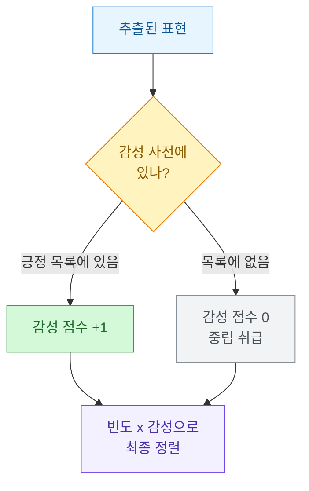
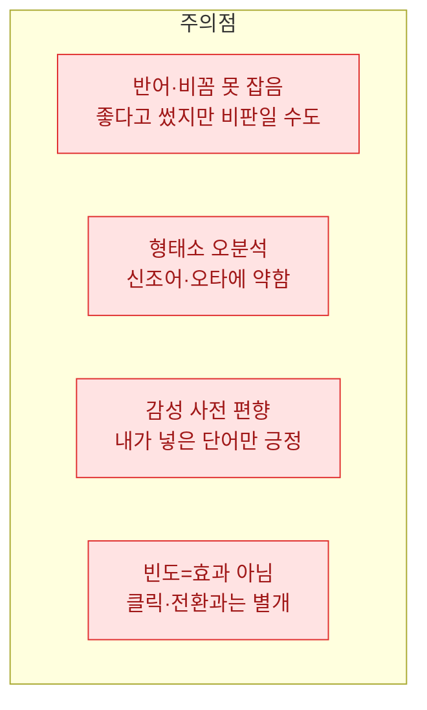

상세페이지 카피를 쓸 때마다 감으로 문구를 고르는 게 늘 마음에 걸렸다. "촉촉한", "가성비", "선물용으로 딱" 같은 표현이 정말 잘 먹히는 건지, 아니면 그냥 내가 자주 봐서 익숙한 건지 구분이 안 됐다. 그래서 이번엔 감을 데이터로 바꿔봤다. 사람들이 리뷰에 실제로 많이 쓰는 긍정 표현을 형태소 분석으로 세어보고, 그중에서 카피 후보를 뽑는 작업이다.

먼저 분명히 해둘 게 있다. **이 글의 모든 리뷰·수치·표는 합성(더미) 데이터다.** 실제 상품이나 고객 리뷰가 아니라, 설명을 위해 내가 지어낸 가짜 문장들이다. 브랜드명도 전부 "제품X" 같은 가상 이름으로 바꿨다.

## 전체 흐름은 어떻게 되나?

이 작업은 "리뷰 텍스트 뭉치"를 넣으면 "카피 후보 표"가 나오는 파이프라인이다. 큰 그림부터 보자.


핵심은 가운데 세 단계다. 리뷰를 단어로 쪼개고, 그중 의미 있는 품사만 남기고, 긍정 감성을 띤 표현에 가중치를 준다. 그러면 "많이 나오면서 동시에 긍정적인" 표현이 위로 떠오른다.

## 형태소 분석이 왜 필요한가?

한국어는 띄어쓰기만으로는 단어를 제대로 못 나눈다. "촉촉해서", "촉촉하고", "촉촉한"은 사람 눈엔 다 같은 말이지만, 컴퓨터가 공백으로만 자르면 전부 다른 단어로 센다. 그래서 **형태소(morpheme)**, 즉 뜻을 가진 가장 작은 말 단위로 쪼개고 기본형으로 묶어주는 도구가 필요하다. 그게 **KoNLPy(코엔엘파이)**다. 한국어 형태소 분석기 여러 개를 파이썬에서 쓰게 묶어놓은 라이브러리다.

띄어쓰기 방식과 형태소 방식의 차이를 표로 보자.

| 원문 | 단순 공백 분리 | 형태소 분석 후(명사·형용사) |
|---|---|---|
| "향이 은은하고 촉촉해요" | 향이 / 은은하고 / 촉촉해요 | 향 / 은은하다 / 촉촉하다 |
| "촉촉한 느낌이 좋아요" | 촉촉한 / 느낌이 / 좋아요 | 촉촉하다 / 느낌 / 좋다 |
| "은은한 향 만족스럽네요" | 은은한 / 향 / 만족스럽네요 | 은은하다 / 향 / 만족스럽다 |

공백 분리로는 "촉촉해요"와 "촉촉한"이 따로 세지지만, 형태소 분석을 거치면 둘 다 "촉촉하다"로 합쳐진다. 이렇게 기본형으로 묶어야 빈도수가 의미를 갖는다.

## 리뷰를 어떻게 단어로 쪼개나?

KoNLPy에는 분석기가 여러 개 들어 있는데, 여기선 `Okt`(옛 이름 트위터 분석기)를 쓴다. 설치가 비교적 쉽고 신조어에 무던한 편이라 리뷰 텍스트에 무난하다. 아래는 합성 리뷰 뭉치를 넣어 명사와 형용사만 뽑는 예시다.

```python
# 합성(더미) 데이터입니다 — 실제 리뷰가 아닙니다.
from konlpy.tag import Okt
from collections import Counter

reviews = [
    "향이 은은하고 촉촉해서 좋아요",
    "촉촉한 느낌이 정말 만족스럽네요",
    "은은한 향 덕분에 선물용으로 딱이에요",
    "가성비 좋고 촉촉한 마무리 마음에 들어요",
    "발림성이 부드럽고 향도 은은해서 재구매합니다",
]

okt = Okt()

def extract_terms(text):
    # norm=True: 문장을 정규화, stem=True: 기본형으로 환원
    tagged = okt.pos(text, norm=True, stem=True)
    # 명사(Noun)와 형용사(Adjective)만 남긴다
    return [word for word, pos in tagged if pos in ("Noun", "Adjective")]

all_terms = []
for r in reviews:
    all_terms.extend(extract_terms(r))

freq = Counter(all_terms)
for term, cnt in freq.most_common(10):
    print(f"{term}\t{cnt}")
```

여기서 두 옵션이 핵심이다. `stem=True`가 "촉촉한", "촉촉해서"를 모두 "촉촉하다"로 되돌려주고, 품사 필터가 조사("이", "가")나 어미처럼 뜻 없는 조각을 걸러낸다. 명사는 무엇에 대한 말인지(향, 느낌), 형용사는 어떤 느낌인지(촉촉하다, 은은하다)를 담고 있어서, 카피 재료로는 이 둘이 가장 쓸모 있다.

위 코드를 돌리면 대략 이런 빈도가 나온다(합성 데이터 기준).

| 표현 | 품사 | 빈도 |
|---|---|---|
| 촉촉하다 | 형용사 | 3 |
| 은은하다 | 형용사 | 3 |
| 향 | 명사 | 3 |
| 좋다 | 형용사 | 2 |
| 느낌 | 명사 | 1 |
| 만족스럽다 | 형용사 | 1 |
| 가성비 | 명사 | 1 |

## 그냥 많이 나온 단어를 쓰면 되나?

여기서 함정이 하나 있다. 빈도만 보면 "향", "느낌", "제품" 같은 **밋밋한 명사**가 상위를 차지하기 쉽다. 자주 나오긴 하지만 카피로 쓰기엔 밍밍한 말들이다. 카피에 힘을 주는 건 감성을 담은 표현, 즉 "촉촉하다", "만족스럽다" 쪽이다.

그래서 빈도 하나만 보지 말고 **감성 점수**라는 두 번째 축을 더한다. 긍정 표현을 모아둔 작은 사전을 만들어, 각 표현이 긍정인지 아닌지 표시해주는 것이다.



감성 사전은 거창할 필요 없다. 처음엔 손으로 만든 작은 긍정어 목록으로 시작해도 충분하다. 리뷰를 돌려보며 새로 눈에 띄는 긍정 표현을 계속 추가해 키워가면 된다.

```python
# 합성 긍정 감성 사전 — 실무에선 도메인에 맞게 키워간다
positive_lexicon = {
    "촉촉하다", "은은하다", "만족스럽다", "부드럽다",
    "좋다", "가성비", "재구매",
}

def sentiment_score(term):
    return 1 if term in positive_lexicon else 0

rows = []
for term, cnt in freq.items():
    s = sentiment_score(term)
    # 빈도와 감성을 곱해 '자주 나오면서 긍정적인' 표현을 위로
    rows.append((term, cnt, s, cnt * s))

rows.sort(key=lambda x: (x[3], x[1]), reverse=True)

print("표현\t빈도\t감성\t점수")
for term, cnt, s, score in rows:
    print(f"{term}\t{cnt}\t{s}\t{score}")
```

## 카피 후보는 어떤 표로 나오나?

빈도와 감성을 곱해 정렬하면, 밋밋한 명사는 감성 점수 0 때문에 자연히 아래로 밀리고 감성 형용사가 위로 올라온다. 합성 데이터로 돌린 최종 표는 이렇게 나온다.

| 순위 | 표현 | 빈도 | 감성 | 최종 점수 | 카피 활용 예 |
|---|---|---|---|---|---|
| 1 | 촉촉하다 | 3 | 1 | 3 | "하루 종일 촉촉하게" |
| 2 | 은은하다 | 3 | 1 | 3 | "은은하게 퍼지는 향" |
| 3 | 좋다 | 2 | 1 | 2 | (너무 일반적 — 보류) |
| 4 | 만족스럽다 | 1 | 1 | 1 | "만족스러운 마무리" |
| 5 | 가성비 | 1 | 1 | 1 | "부담 없는 가성비" |
| - | 향 | 3 | 0 | 0 | 단독 카피엔 약함 |
| - | 느낌 | 1 | 0 | 0 | 단독 카피엔 약함 |

여기서 사람의 판단이 들어간다. "좋다"는 점수는 높아도 너무 흔해서 카피로는 밋밋하니 보류하고, "촉촉하다"·"은은하다"처럼 구체적인 감각어를 골라 카피 문장으로 다듬는다. 데이터는 후보를 좁혀줄 뿐, 최종 문장은 사람이 쓴다. 이 순서를 지키는 게 중요하다.

## 이 방법의 한계는 무엇인가?

써보면서 느낀 약점도 솔직히 적어둔다. 과신하면 곤란한 지점들이다.



특히 마지막이 핵심이다. **리뷰에 많이 나온 표현이 곧 잘 팔리는 카피라는 보장은 없다.** 이건 "후보를 추리는" 도구지 "효과를 증명하는" 도구가 아니다. 뽑은 카피가 실제로 먹히는지는 상세페이지 A/B 테스트나 클릭률로 따로 확인해야 한다. 감성 사전도 결국 내가 넣은 단어만 긍정으로 잡으니, 주기적으로 리뷰를 다시 훑어 사전을 손봐야 편향이 줄어든다.

## 정리하면

- **형태소 분석(KoNLPy)**으로 리뷰를 기본형 단어로 쪼개면 "촉촉한/촉촉해서"가 하나로 묶여 빈도가 의미를 갖는다.
- **빈도만 보지 말고 감성 점수를 곱해** 밋밋한 명사를 걸러내고 감각적인 긍정 형용사를 위로 올린다.
- 나온 표는 **카피 후보일 뿐**, 최종 문장 선택과 효과 검증(A/B·클릭률)은 사람과 실측의 몫이다.

감으로 고르던 카피를 "왜 이 표현을 골랐는지" 설명할 수 있게 된 것만으로도 충분히 남는 장사였다.
