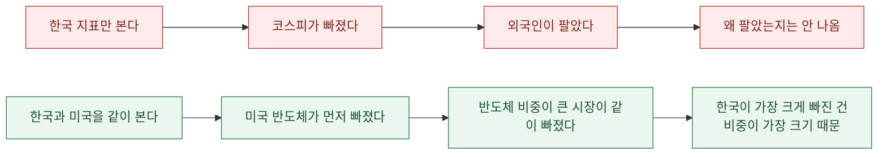
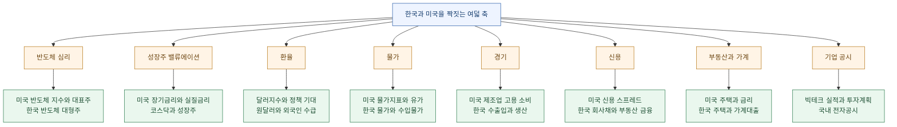
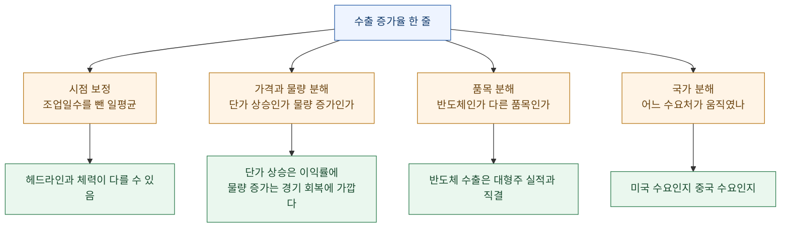
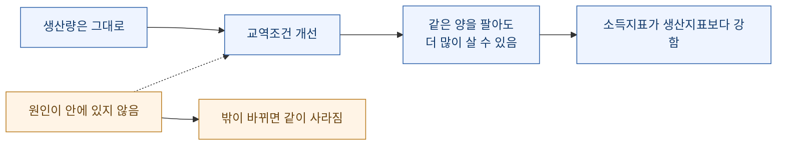
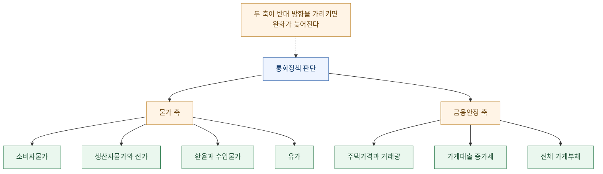

한국 증시가 하루에 크게 빠진 날, 국내 기사를 아무리 읽어도 원인이 안 나올 때가 있다. 기사에 나오는 건 대개 결과다. 얼마나 빠졌고, 외국인이 얼마를 팔았고, 어떤 업종이 약했는지.

**원인의 상당 부분은 전날 밤 미국에 있다.** 한국 시장은 미국이 닫힌 뒤에 열리므로, 아침에 보이는 갭은 이미 밤사이에 결정된 것이다.

그래서 지표를 나라별로 나눠 보는 대신 **주제별로 짝지어** 놓기로 했다. 한국 지표 하나마다 대응하는 미국 지표를 옆에 붙이는 방식이다.

이 글은 그 지도와, 매일 어떤 순서로 보는지, 그리고 한국 쪽에서만 봐야 하는 것들을 정리한 것이다. 시리즈 세 번째이자 마지막 편이고, 앞의 두 편은 [데이터 수집](https://dbhyeong.github.io/blog/yfinance-fred-market-data-pipeline)과 [반도체 하락 진단](https://dbhyeong.github.io/blog/semiconductor-selloff-five-step-diagnosis)이었다.

## 왜 짝지어 봐야 하나

2026년 7월 28일 아시아 지수를 보면 이유가 바로 나온다.

| 지수 | 1D | 1M |
|---|---:|---:|
| KOSPI | **-10.84%** | -28.39% |
| KOSDAQ | -7.72% | -17.09% |
| 대만 가권 | -4.65% | -6.66% |
| 니케이 225 | -3.95% | -10.09% |
| 항셍 | +0.41% | +11.64% |
| 인도 니프티 | -0.01% | +0.20% |

한국이 가장 크게 빠졌다. 그런데 **항셍과 인도는 멀쩡하다.**

이건 "아시아가 빠졌다"가 아니라 **"반도체 비중이 큰 시장이 빠졌다"**는 뜻이다. 한국·대만·일본은 반도체 민감국이고 홍콩·인도는 아니다.

그리고 그날 미국 반도체 지수는 한 달 -17%였다. **한국 뉴스만 읽으면 절대 안 나오는 연결이다.**

## 여덟 축 지표 지도

한국 자산을 볼 때 미국 지표를 어디에 끼워 넣는지를 여덟 개 주제로 정리했다.

표로 펼치면 이렇게 된다.

| 축 | 미국에서 볼 것 | 한국에서 볼 것 | 연결되는 논리 |
|---|---|---|---|
| 반도체 심리 | `^SOX`, `NVDA`, `AMD`, `MU`, `TSM`, `ASML` | 반도체 대형주, 코스피200, 반도체 수출 | 한국 반도체 주가의 **외부 원인** 확인 |
| 밸류에이션 | 10년물, 실질금리, 나스닥100 | 코스닥, 플랫폼·성장주 | 할인율 상승 시 성장주 압박 |
| 환율 | 달러지수, 10년물, 정책 기대 | 원달러, 외국인 수급 | 원화 약세 시 수급·물가·금리 부담 |
| 물가 | CPI, PCE, 유가 | CPI, PPI, 수입물가 | 물가 재상승 시 통화정책 부담 |
| 경기 | ISM, 고용, 소매판매, GDPNow | GDP, GDI, 수출입, 생산 | 미국 경기와 한국 수출 사이클 |
| 신용 | 하이일드·투자등급 스프레드, 금융여건지수 | 회사채 스프레드, 부동산 금융 | 신용 스트레스 확산 여부 |
| 부동산·가계 | 미국 주택·금리 | 주택가격, 주담대, 가계대출 | 금융안정 판단 |
| 공시 | 빅테크 실적·투자계획 | 전자공시, 대기업 투자 | 실적과 투자 사이클 |

**왼쪽에서 원인을 찾고 오른쪽에서 반응을 확인한다.** 이게 이 표를 쓰는 방향이다.

## 매일 보는 열 단계

지도가 있어도 순서가 없으면 매번 헤맨다. 그래서 순서를 고정했다. **미국에서 시작해 한국으로 내려온다.**

| 순서 | 볼 것 | 왜 이 자리인가 |
|---:|---|---|
| ① | 미국 반도체 지수, AI 대표주, 파운드리·장비 | 한국 반도체 주가의 **전날 밤 원인** |
| ② | 나스닥100, S&P500, 변동성지수 | 조정이 반도체 한정인지 전체인지 |
| ③ | 미국 10년물, 2년물, 실질금리 | 밸류에이션과 환율에 동시에 영향 |
| ④ | 달러지수, 원달러, 엔달러 | 아시아 통화 압력 |
| ⑤ | WTI, 브렌트 | 한국 물가·수입물가·정책 부담 |
| ⑥ | 코스피, 코스닥 | 국내 시장의 **반응** |
| ⑦ | 국내 반도체 대형주 | 한국 시장의 중심축 |
| ⑧ | 대만·일본 반도체 | 글로벌 체인 동조 여부 |
| ⑨ | 한국 수출입·반도체 수출 | 주가가 실적 사이클과 맞는지 |
| ⑩ | 가계대출, 주택가격 | 통화정책 압력 방향 |

이 순서에 담긴 판단이 두 개 있다.

**첫째, 국내 지수(⑥)를 여섯 번째에 둔 게 핵심이다.** 보통은 여기서 시작한다. 그런데 국내 지수는 **결과**다. 먼저 보면 그 숫자를 설명하려고 억지 서사를 만들게 된다. 원인 후보를 다섯 개 확인한 다음에 보면, 같은 숫자가 "①\~⑤ 중 무엇으로 설명되는가"라는 질문이 된다.

**둘째, ⑨와 ⑩은 매일 값이 바뀌지 않는다.** 수출입은 월간이고 주택가격은 주간이다. 그런데 순서에 넣어 둔 이유는, **주가가 실적과 어긋나기 시작하는 지점을 놓치지 않기 위해서**다. 주가는 매일 움직이고 실적은 가끔 나오는데, 매일 주가만 보면 둘이 벌어지는 걸 못 본다.

## 수출입은 한 줄로 보면 안 된다

한국 지표 중에 가장 정보량이 많은데 가장 대충 읽히는 게 수출입이다. 보통 "수출 몇 % 증가" 한 줄로 소비된다.

**분해해야 한다.** 최소 네 방향이다.

봐야 할 항목을 펼치면 이렇다.

| 지표 | 왜 중요한가 | 어떻게 읽는가 |
|---|---|---|
| 전체 수출 증가율 | 가장 큰 외부 수요 지표 | 헤드라인. 여기서 멈추면 안 됨 |
| **일평균 수출** | 조업일수 왜곡 제거 | 헤드라인보다 실제 체력에 가까움 |
| 반도체 수출 | 대형주 실적과 직결 | 지수 영향이 가장 큰 품목 |
| 대미 수출 | 미국 경기와 연결 | 미국 소비·투자 강도 |
| 대중 수출 | 중국 경기·중간재 수요 | 중국 둔화 시 부담 |
| 수입 증가율 | 내수·원자재·설비투자 | **원유 때문인지 설비 때문인지 구분 필요** |
| 에너지 수입 | 원유·가스·석탄 부담 | 유가 상승 시 무역수지·물가 부담 |
| 무역수지 | 수출입의 최종 결과 | 적자 확대 시 환율·수급 부담 |
| **수출물량** | 가격 효과 제외한 실제 물량 | 물량 증가가 진짜 경기 회복 |
| **수출단가** | 반도체 가격·제품 믹스 | 단가 상승은 이익률에 긍정적 |
| **교역조건** | 수출가격 대비 수입가격 | 개선 시 체감소득에 긍정적 |

굵게 표시한 넷이 헤드라인에 안 나오는 것들이다. 그리고 **읽는 사람의 판단을 가장 크게 바꾸는 것들**이다.

### 수출액이 늘었는데 물량이 부진하면

가장 자주 나오는 함정이다. 수출액은 **단가 × 물량**이므로, 단가가 오르면 물량이 그대로여도 금액은 는다.

| 조합 | 실제 뜻 |
|---|---|
| 수출액 증가 + 물량 증가 | 수요가 늘었다 |
| 수출액 증가 + 물량 정체 | **가격이 올랐다.** 수요 확대와는 다른 이야기 |
| 수출액 정체 + 물량 증가 | 가격이 내렸다. 점유는 늘었을 수 있음 |

반도체처럼 가격 변동이 큰 품목에서는 이 구분이 특히 중요하다. **가격 상승분은 이익률에 좋지만 사이클이 꺾이면 같은 속도로 사라진다.** 물량 증가는 더 느리게 오고 더 느리게 사라진다.

### GDP와 GDI가 벌어지는 이유

이 구조가 국민계정에도 그대로 나타난다.

| 지표 | 2026년 2분기 (전년동기 대비) |
|---|---:|
| GDP | +3.7% |
| **GDI** | **+15.6%** |

GDP는 **만든 양**이고 GDI는 그걸로 **살 수 있는 양**이다. 둘이 이만큼 벌어지면 그 차이 자체가 정보다.

차이를 만드는 게 **교역조건** — 수출가격 대비 수입가격이다. 수출품 값이 오르고 수입품 값이 안 오르면 같은 양을 만들어 팔아도 손에 쥐는 구매력이 커진다.

여기서 중요한 건 **원인의 위치**다. 교역조건 개선은 국내 생산성이 좋아져서가 아니라 **사고파는 값의 비율이 유리해져서** 생긴다. 밖에서 온 것이므로 밖이 바뀌면 같이 사라진다. 실력으로 착각하면 안 되는 구간이다.

물가 쪽도 같이 놓고 봐야 한다.

| 지표 | 2026년 2분기 (전년동기 대비) |
|---|---:|
| PPI (생산자물가) | +8.57% |
| CPI (소비자물가) | +3.16% |

생산자물가가 소비자물가보다 훨씬 높다. **생산 단계의 비용 상승분이 아직 소비자가격에 다 전가되지 않았다**는 뜻으로 읽힌다. 전가가 진행되면 소비자물가가 따라 오를 여지가 있고, 전가가 안 되면 기업 마진이 눌린다. 어느 쪽이든 다음 분기에 확인해야 할 항목이 된다.

## 조합별로 읽으면

수출·반도체 지수·환율·유가를 조합하면 같은 하락도 다르게 읽힌다.

| 조합 | 읽는 법 |
|---|---|
| 수출 증가 + 반도체 수출 증가 + 미국 반도체 강세 | 실적과 주가가 같은 방향. 상승 근거가 두껍다 |
| 수출 증가 + 미국 반도체 약세 | **실적은 괜찮은데 밸류에이션이 조정 중** |
| 수출 둔화 + 미국 반도체 약세 | 사이클 조정 가능성. 성격이 다르다 |
| 수출 증가 + 유가 급등 | 매출은 좋지만 무역수지·물가에 부담 |
| 수출 둔화 + 원화 약세 | 외국인 수급과 위험 프리미엄 확대 |

두 번째와 세 번째 줄의 차이가 이 표의 핵심이다. **주가는 똑같이 빠지는데 하나는 가격 문제고 하나는 실적 문제다.**

가격 문제라면 시간이 해결할 여지가 있고, 실적 문제라면 시간이 더 나쁘게 만든다. **그런데 차트에서는 구분이 안 된다.** 수출 데이터를 옆에 놓아야 갈린다.

## 한국에서만 봐야 하는 것들

미국에는 없거나 비중이 작은데 한국에서는 정책을 직접 움직이는 변수들이 있다.

| 구분 | 지표 | 왜 한국에서 더 중요한가 |
|---|---|---|
| 환율 | 원달러 | 원화 약세가 수입물가·외국인 수급에 동시에 작용 |
| 물가 | CPI, PPI, **수입물가** | 에너지 수입 의존도가 높아 외부 가격이 바로 들어옴 |
| 수출 | 전체·반도체·일평균 | 수출 의존도가 높아 기업 실적과 GDP에 직결 |
| 수입 | 원유·가스·석탄 | 무역수지와 물가를 동시에 흔듦 |
| 무역수지 | 월별 흑자·적자 | 환율과 외국인 수급으로 이어짐 |
| 부동산 | 주택가격, 거래량, 전세가율 | **금융안정 판단의 핵심 변수** |
| 가계대출 | 주담대, 신용대출 | 통화정책에서 물가와 나란히 놓이는 축 |
| 가계신용 | 전체 가계부채 | 구조적 부담 |
| 공시 | 전자공시 | 대형주 이벤트가 지수에 바로 반영 |
| 금융정책 | 대출규제, 신용평가 제도 | 시장 접근성을 직접 바꿈 |

여기서 미국과 가장 크게 다른 게 **부동산과 가계대출**이다.

미국 통화정책 논의에서 주택은 물가 구성요소로 들어가지만, 한국에서는 **금융안정이라는 별도 축**으로 들어간다. 물가가 잡혀도 주택가격과 가계대출이 재가속하면 완화가 어려워지는 구조다.

**물가만 보고 금리 경로를 예상하다가 자꾸 틀렸던 이유가 이거였다.** 축이 하나 더 있었다.

### 어떤 변수가 어느 방향으로 미나

두 축을 여덟 개 변수로 펼치면 방향이 명확해진다. 각 변수가 **긴축 쪽으로 미는 조건**을 적어 두면, 뉴스를 읽을 때 그게 어느 칸에 들어가는지가 바로 정해진다.

| 변수 | 긴축 압력으로 작동하는 조건 | 어느 축인가 |
|---|---|---|
| 환율 | 원화 약세가 커져 수입물가 압력이 커질 때 | 물가 |
| 유가 | 유가 상승으로 물가 기대가 올라갈 때 | 물가 |
| 소비자·생산자물가 | 목표보다 높고 생산자물가가 소비자물가로 전가될 때 | 물가 |
| 주택가격 | 가격 상승과 거래 증가가 재가속될 때 | 금융안정 |
| 가계대출 | 주담대·신용대출 증가세가 강할 때 | 금융안정 |
| 가계부채 | 총량 기준 금융안정 리스크가 커질 때 | 금융안정 |
| GDP·GDI | 경기가 버티면 긴축을 감내할 여력이 생김 | 여력 |
| 수출 | 수출이 견조하면 긴축 부담을 견딜 여지가 커짐 | 여력 |

**마지막 두 줄이 성격이 다르다.** 앞의 여섯은 "긴축해야 하는 이유"고, 뒤의 둘은 "긴축해도 버틸 수 있는가"다. 압력과 여력은 다른 질문이다.

이 구분이 실제로 쓰이는 자리가 있다. **물가가 높은데 경기가 나쁘면 긴축 압력은 있는데 여력이 없다.** 이 조합에서 정책은 보통 동결로 간다 — 올릴 이유는 있지만 올릴 수 없는 상태다. 반대로 물가가 높고 경기도 버티면 인상 가능성이 실제로 열린다.

그래서 뉴스를 읽을 때 던지는 질문이 하나 늘었다. **"이건 압력인가 여력인가."** 수출 호조 뉴스를 보고 "경기가 좋으니 주식에 좋겠네"로 끝내면 절반만 읽은 것이다. 같은 뉴스가 **긴축 여력을 키우는 쪽으로도** 작동한다.

## 수출입을 질문으로 바꾸면

지표 목록을 외우는 것보다 **질문 목록을 갖는 게** 실전에서 빠르다. 수출입 데이터를 열었을 때 던지는 질문을 여섯 개로 정리했다.

| 질문 | 봐야 할 지표 | 왜 그 지표인가 |
|---|---|---|
| 진짜 수출이 좋아졌나? | 일평균 수출, 수출물량 | 조업일수와 가격 효과를 뺀 값 |
| 반도체가 좋아졌나? | 반도체 수출액, 수출단가 | 대형주 실적과 직결 |
| 미국 수요가 좋은가? | 대미 수출 | 미국 소비·투자와 연결 |
| 중국 수요가 좋은가? | 대중 수출 | 중간재·소재 수요 |
| 수입 부담은 어떤가? | 원유·가스·석탄 수입 | 유가 상승분이 여기로 들어옴 |
| 체감소득은 어떤가? | 교역조건, GDI | 수출가격 대비 수입가격 |

**첫 질문이 가장 중요하다.** 헤드라인 수출 증가율은 조업일수와 가격에 흔들리기 때문에, 일평균과 물량을 확인하기 전까지는 "좋아졌다"고 말할 근거가 약하다.

그리고 다섯 번째 질문이 자주 빠진다. 수출만 보고 좋다고 하는데, **같은 기간 에너지 수입이 더 크게 늘었으면 무역수지는 나빠진다.** 무역수지가 나빠지면 환율에 압력이 가고, 환율이 오르면 수입물가가 오르고, 물가가 오르면 통화정책이 묶인다. **수출 호조 뉴스가 몇 단계를 거쳐 금리 부담으로 돌아오는 경로**가 여기 있다.

## 매일 또는 주간 리포트에 넣을 체크리스트

지금까지의 내용을 한 표로 압축하면 이렇게 된다. 실제로 리포트를 쓸 때 이 표를 그대로 채운다.

| 구분 | 체크 항목 | 이 줄이 답하는 질문 |
|---|---|---|
| 미국 반도체 | 반도체 지수, AI 대표주, 파운드리·장비 | AI 반도체 조정인가 |
| 미국 성장주 | 나스닥100, S&P500 | 조정이 반도체 한정인가 |
| 위험선호 | 변동성지수, 달러지수 | 리스크오프인가 |
| 금리 | 10년물, 2년물, 실질금리 | 밸류에이션 부담인가 |
| 유가 | WTI, 브렌트 | 물가·정책 부담인가 |
| 신용 | 하이일드·투자등급 스프레드, 금융여건 | 시스템 문제인가 |
| 미국 경기 | CPI, PCE, ISM, 고용, 소매판매 | 정책 경로가 바뀌나 |
| 한국 시장 | 코스피, 코스닥 | 국내 반응 크기 |
| 한국 반도체 | 반도체 대형주 | 지수 영향의 중심축 |
| 한국 환율 | 원달러 | 외국인 수급·물가 |
| 한국 수출입 | 전체 수출, 반도체 수출, 무역수지 | 실적 사이클과 맞나 |
| 한국 물가 | CPI, PPI, 수입물가 | 통화정책 압력 |
| 한국 부동산 | 주택가격, 거래량, 가계대출 | 금융안정 압력 |
| 공시 | 전자공시 주요사항 | 기업 이벤트 |

**위에서 아래로 갈수록 갱신 주기가 길어지고, 아래로 갈수록 되돌리기 어려운 변수다.** 주가는 하루면 되돌아오지만 가계부채는 몇 년이 걸린다.

## 결론 문장을 미리 만들어 두면

체크리스트를 채우고 나면 문장으로 옮겨야 하는데, 여기서 매번 헤맸다. 그래서 조합별 문장 틀을 만들어 뒀다.

| 상황 | 쓸 문장 |
|---|---|
| 미국 반도체 하락 + 수출 견조 + 변동성 안정 | "한국 반도체 조정은 실적 훼손보다 글로벌 밸류에이션 조정 성격이 강하다." |
| 미국 반도체 하락 + 반도체 수출 둔화 | "주가 조정이 실적 사이클 둔화로 연결될 가능성을 점검해야 한다." |
| 유가 상승 + 환율 상승 + 가계대출 증가 | "물가와 금융안정 양쪽에서 완화보다 긴축 경계가 커질 수 있다." |
| 변동성 급등 + 달러 급등 + 신용 스프레드 확대 | "단순 업종 조정이 아니라 글로벌 위험회피로 번졌는지 확인해야 한다." |

문장 틀을 미리 만들어 둔 게 생각보다 효과가 컸다. **매번 새로 문장을 지으면 그날의 기분이 섞여 들어간다.** 틀이 있으면 "오늘은 어느 줄인가"만 고르면 되고, **어느 줄도 아니면 그것 자체가 정보**가 된다 — 아직 이름 붙일 수 없는 조합이라는 뜻이니까.

## 확인 주기를 나눠야 하는 이유

모든 지표를 매일 볼 필요는 없다. 오히려 **월간 지표를 매일 열어 보면 안 바뀐 숫자를 계속 보게 되고, 안 바뀌었다는 사실이 정보처럼 느껴진다.**

| 주기 | 미국 | 한국 |
|---|---|---|
| 매일 | 반도체 지수·대표주, 나스닥100, S&P500, 변동성, 10년물, 달러지수, 유가 | 코스피, 코스닥, 반도체 대형주, 원달러, 국고채 금리 |
| 매주 | 신규 실업수당, 원유재고, 주요 연준 발언 | 주간 주택가격, 주간 대출 동향, 외국인 수급 |
| 매월 | CPI, PCE, ISM, 고용, 소매판매 | 수출입 동향, CPI, PPI, 수입물가, 산업활동 |
| 분기 | GDP, 기업 실적, 투자계획 | GDP, GDI, 가계신용, 기업 실적 |
| 이벤트 | FOMC, AI 칩 대표기업 실적, 빅테크 실적 | 금통위, 대출정책 발표, 대형 공시 |

주기를 나눠 두면 **뭔가를 안 본 날에도 안 본 이유가 명확하다.** 수출입을 오늘 안 본 건 게을러서가 아니라 월간이기 때문이다.

## 공시에서 볼 것

대형주는 뉴스보다 공시가 먼저다. 특히 지수 편입 비중이 큰 종목의 자본 관련 공시는 지수 전체에 영향을 준다.

| 공시 유형 | 왜 보는가 |
|---|---|
| 실적발표 | 이익 추세 확인 |
| 시설투자 | 증설은 장기 수요·공급 신호 |
| 공급계약 | 매출 가시성 |
| 유상증자 | 희석과 자금조달. 성장투자면 다르게 읽힘 |
| 자사주 소각 | 주주환원, 희석 부담 완화 |
| 주요사항보고서 | 합병·분할·투자·자금조달 |
| 지분공시 | 대주주·기관 수급 변화 |

여기서 오늘 실제로 나온 사례가 하나 있다. **대형 플랫폼 기업이 해외 반도체 기업으로부터 지분 투자를 받으면서 동시에 자사주 소각을 발표했다.**

이 조합을 읽는 법은 [오늘 다이제스트](https://dbhyeong.github.io/blog/ai-llm-it-news-2026-07-28)와 겹치는데, 짧게 적으면 이렇다. 신주 발행은 지분 희석이고, 자사주 소각은 그 반대 방향이다. **둘이 같은 날 나오면 어느 쪽 뉴스만 읽어도 결론이 반대로 나온다.** 순증감을 직접 계산해야 한다.

그리고 방어책을 같이 붙였다는 사실 자체가 정보다 — **발행하는 쪽도 희석이 문제가 될 걸 알고 있었다는 뜻**이다.

## 공식 데이터 소스

마지막으로 실제로 데이터를 가져오는 곳을 정리해 둔다. 앞 편에서 미국 쪽은 FRED로 해결했고, 한국 쪽은 기관이 나뉘어 있다.

| 데이터 | 출처 | 무엇을 얻나 |
|---|---|---|
| GDP, 물가, 금리, 수출입물가 | [한국은행 ECOS](https://ecos.bok.or.kr/) | 국민계정, 교역조건, 수출단가·수입물가 |
| 상장사 공시·재무 | [OpenDART](https://opendart.fss.or.kr/) | 실적, 주요사항보고서, 지분공시 |
| 수출입 통계 | [TRASS](https://api.bandtrass.or.kr/index.do) | 관세청 기반 월별 수출입, 무역수지 |
| 국가·품목별 무역 | [한국무역협회 K-Stat](https://stat.kita.net/) | 반도체·자동차 등 품목별, 국가별 |
| 주택가격·실거래 | [한국부동산원 R-ONE](https://www.reb.or.kr/r-one) | 주택가격지수, 실거래가격지수 |
| 월별 수출입 해석 | 산업통상자원부 보도자료 | 월초 수출입 동향 |

ECOS와 OpenDART는 **인증키가 필요**하고, 나머지는 웹 조회가 가능하다. 이 연결이 아직 자동화 안 된 부분이라 다음 작업 목록에 올려 뒀다.

미국 쪽과 비교하면 차이가 뚜렷하다. FRED는 **한 기관이 시리즈 ID 하나로 다 내주는데**, 한국은 국민계정은 한국은행, 공시는 금융감독원, 수출입은 관세청·무역협회, 주택은 부동산원으로 **기관마다 흩어져 있다.** 그래서 미국 지표는 스크립트 하나로 끝나고 한국 지표는 소스별로 따로 붙여야 한다.

이게 자동화 우선순위를 정하는 기준이 됐다. **하나로 묶여 있는 쪽을 먼저 자동화하고, 흩어져 있는 쪽은 수동으로 두되 주기를 정해 둔다.** 수출입은 어차피 월간이라 매일 자동화할 이유가 없다.

## 시리즈를 마치며

세 편을 관통하는 구조가 하나 있었다.

| 편 | 다룬 것 | 남은 질문 |
|---|---|---|
| 1편 수집 | 데이터를 가져오는 파이프라인 | 가져온 게 내가 생각한 그건가 |
| 2편 진단 | 원인 범위를 좁히는 5단계 | 어디까지 번졌나 |
| 3편 연결 | 한국과 미국을 짝짓는 지도 | 원인이 안에 있나 밖에 있나 |

세 편 모두 같은 실수를 막으려는 것이었다. **숫자 하나를 보고 결론으로 바로 가는 것.**

1편에서는 그 숫자가 내가 생각한 것과 다를 수 있다는 걸 봤고, 2편에서는 하나로는 원인이 안 나온다는 걸 봤고, 3편에서는 원인이 아예 다른 나라에 있을 수 있다는 걸 봤다.

가장 크게 남은 문장은 이거다.

**국내 지수를 여섯 번째에 놓기로 한 것.**

원래는 거기서 시작했다. 지금은 다섯 개를 먼저 보고 간다. 순서 하나 바꿨을 뿐인데, 같은 숫자가 **설명해야 할 대상**에서 **설명된 결과**로 바뀌었다. 데이터를 더 모아서가 아니라 보는 순서를 바꿔서 생긴 변화다.

> 이 글은 시장 데이터를 읽는 방법론과 데이터 소스 정리다. 특정 종목·상품에 대한 투자 권유나 자문이 아니며, 인용된 수치는 특정 시점의 값으로 이후 변동한다.

---

### 시리즈

1. [값이 안 나오는 것보다 다른 값이 나오는 게 무섭다 — yfinance·FRED 시장 데이터 수집 파이프라인](https://dbhyeong.github.io/blog/yfinance-fred-market-data-pipeline)
2. [반도체가 빠졌다는 건 관찰이고, 왜 빠졌나는 조합에서만 나온다](https://dbhyeong.github.io/blog/semiconductor-selloff-five-step-diagnosis)
3. 한국 지표만 보면 원인을 놓친다 (이 글)

### 데이터 소스

- [한국은행 ECOS](https://ecos.bok.or.kr/) · [OpenDART](https://opendart.fss.or.kr/) · [TRASS](https://api.bandtrass.or.kr/index.do) · [한국무역협회 K-Stat](https://stat.kita.net/) · [한국부동산원 R-ONE](https://www.reb.or.kr/r-one)
- [FRED](https://fred.stlouisfed.org/series/DGS10) · [Atlanta Fed GDPNow](https://www.atlantafed.org/research-and-data/data/gdpnow) · [BLS CPI](https://www.bls.gov/news.release/cpi.nr0.htm)
