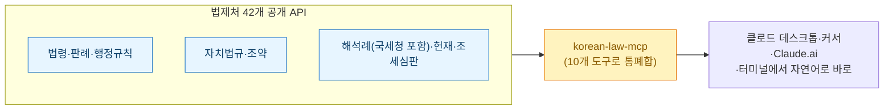
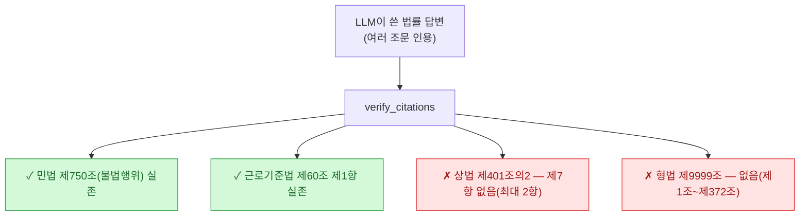
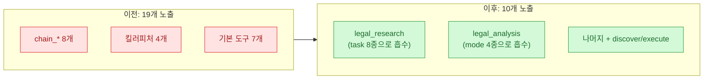
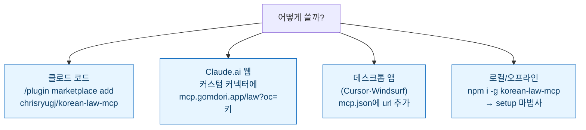

> 관련: [[useful-mcp-servers-for-developers|개발자용 MCP 모음]] · [[claude-code-mcp-servers-github-pat-oauth-dcr-fix|MCP 설치 트러블슈팅]] · [[k-skill-korean-agent-skills-collection|k-skill 모음]]

내 작업의 밑바닥 원칙은 하나다 — **"수치와 인용엔 1차 출처를 박는다."** 그래서 이 프로젝트를 보고 반가웠다. **chrisryugj/korean-law-mcp**는 그 원칙을 **법률 도메인에 통째로 구현한** MCP 서버다. 2026-07-10 기준 **⭐2.2k·포크 413·MIT·TypeScript**, 조코헌트 주간 1등. 만든 사람이 *"법제처를 수백 번 수동 검색하다 지친 공무원"*(류주임 @ 광진구청 AI동호회)이라는 점부터 마음에 든다. 실무 통증에서 나온 도구다.

## 무엇을 하나 — 42개 API를 10개 도구로

대한민국엔 현행 법률 1,600개+, 행정규칙 10,000개+, 그리고 대법원·헌재·조세심판원·관세청까지 이어지는 방대한 판례가 있다. 다 법제처 한 사이트에 있지만 개발자 경험은 최악이다. 이 프로젝트는 그 전체를 **10개 도구**로 감싼다.

그런데 단순 검색 래퍼였으면 이 글을 안 썼다. 진짜 값어치는 **환각을 잡는 킬러 기능들**에 있다.

## 킬러 기능 ① — LLM이 지어낸 가짜 조문 잡기 (verify_citations)

ChatGPT·클로드가 쓴 법률 답변을 그대로 믿으면 사고 난다. 존재하지 않는 조문을 그럴듯하게 지어내니까. `verify_citations`는 인용된 모든 조문을 **법제처 공식 DB로 실시간 교차검증**한다.

v4.6.0부터는 **내용까지** 본다. 민법 제750조처럼 **존재하는 조문에 엉뚱한 제목을 붙인** 환각(`CONTENT_MISMATCH`)도 잡는다. 조문 번호만 맞으면 통과시키던 걸 넘어, **인용한 제목이 실제와 일치하는지**까지 대조한다. 이게 [[llm-wiki-newsroom-multi-agent-knowledge-wiki|내가 볼트에서 하는 적대적 팩트체크]]와 정확히 같은 결의 작업이라 반가웠다.

## 킬러 기능 ② — 폐기된 판례를 살아있는 것처럼 인용하지 않기 (Citator)

법률 실무에서 가장 위험한 실수 둘을 잡는 기능이 v4.3에 들어갔다.

- **`cite_check`(한국형 Shepard's Citator)**: "이 판례 아직 유효해?" — 그 사건번호를 인용한 후속 판례를 역추적하고, 전원합의체 판결 본문을 정밀 스캔해 **변경·폐기 선언을 감지**한다. 판결문이 사건번호 대신 *"(이하 '2008년 전원합의체 판결'이라 한다)"* 같은 별칭으로 변경을 선언하는 관행까지 추적한다. **무료 도구 중 유일**하다고.
- **`applicable_law`(행위시법 판단)**: "2023.5.10 당시 도로교통법 제44조는?" — 그 시점에 시행 중이던 버전을 특정하고, 현행과 비교하고, 이후 개정 부칙의 경과조치까지 발췌한다. LLM이 **현행법으로 오답**하는 걸 구조적으로 막는다.

## 킬러 기능 ③ — 조문 영향 그래프와 시점 diff

- **`impact_map`**: "민법 제103조를 인용한 판례" → 대법원·헌재·해석례·자치법규를 역방향 탐색하고 **mermaid 그래프를 자동 생성**한다. 도식으로 구조를 보는 걸 좋아하는 나로선 이 발상이 특히 마음에 든다.
- **`time_travel`**: "개인정보보호법 2020-01-01 vs 2025-11-01" → 두 시점 본문을 자동으로 가져와 **조문 단위 diff**(추가/삭제/변경)를 낸다.
- **`ordinance_radar`**(v4.7.0): "상위법 바뀌었는데 우리 조례는 그대로 아닌가?" — 조례의 근거 상위법 개정을 자동 대조해 정비 대상을 플래그한다. 만든 사람이 공무원인 게 여기서 드러난다.

## 배울 점 — MCP 설계 교훈: 도구를 19개→10개로 줄이다

기능 나열보다 내가 더 눈여겨본 건 **v4.4.0의 도구 통폐합**이다. MCP 클라이언트는 매 세션 **도구 목록(ListTools)을 통째로 읽는다** — 도구가 많을수록 컨텍스트를 먹는다. 이 프로젝트는 노출 도구를 **19개 → 10개로 줄여 목록을 \~15.1KB에서 \~7.2KB로(약 52%) 감축**했다.

`chain_*` 8개를 `legal_research` 하나의 **task 파라미터**로, 킬러피처 4개를 `legal_analysis`의 **mode 파라미터**로 접었다. 하위호환(기존 도구명 직접 호출)은 유지하면서 광고 목록에서만 뺐다. 이건 [[claude-code-context-window-token-optimization|컨텍스트 최적화]]·[[claude-md-context-optimization|CLAUDE.md 다이어트]]에서 내가 강조한 것과 같은 원칙 — **"매 세션 읽히는 것부터 줄여라"** — 를 MCP 도구 설계에 적용한 좋은 사례다.

## 설치 — 목적별 경로

공통으로 **법제처 Open API 인증키(OC)** 하나만 무료 발급받으면 된다(예: `honggildong`). 원격 엔드포인트(`mcp.gomdori.app`)를 쓰면 설치조차 없이 커넥터 주소만 넣으면 끝이다.

## ⚠️ 쓰기 전에 짚을 것

- **⭐2.2k·MIT·10개 도구**는 2026-07-10 기준. 버전이 빠르게 오르니(글 작성 시점 v4.7.1) 발행 시점 스냅샷으로 읽자.
- 이건 **조회·검증 보조 도구**지 법률 자문이 아니다. 등기·지급명령 같은 실제 신청은 사람이 로그인·결제·제출을 직접 한다.
- 그럼에도 **AI 법률 답변을 그대로 믿지 말라**는 이 도구의 문제의식은 정확하다. 로펌·법률 AI 서비스·계약서 검토에서 **인용 검증은 필수 안전장치**다.

## 마무리 — 두 갈래가 만나는 지점

이 글로 오늘의 5부작을 마친다. 앞의 [[harness-engineering-for-self-improvement-lilian-weng|하네스 3편]]이 "에이전트가 스스로 똑똑해지는" 미래를 다뤘다면, k-skill과 이 법제처 MCP는 **"지금 당장 한국에서 쓸 수 있는" 에이전트 도구**의 현재다. 그리고 둘을 관통하는 실은 같다 — **AI를 믿되, 검증은 코드로 박아라.** verify_citations가 법조문에 하는 일은, 내가 볼트에서 수치에 1차 출처를 박는 일과 정확히 같은 정신이다. 실무 통증에서 나온 도구가 대개 그렇듯, 이 MCP도 그 정신을 잘 담았다.

## 참고자료

- [chrisryugj/korean-law-mcp (GitHub)](https://github.com/chrisryugj/korean-law-mcp) · [npm](https://www.npmjs.com/package/korean-law-mcp) · MIT
- 관련: [[k-skill-korean-agent-skills-collection|k-skill 모음]] · [[useful-mcp-servers-for-developers|개발자용 MCP]] · [[claude-code-context-window-token-optimization|컨텍스트 최적화]]

<!-- 안전: 회사 실데이터·고객/제3자 PII·API키/쿠키/토큰 없음. 오픈소스 소개·논평 + 출처 링크. 별점·버전은 조회 시점 명시. 법률 자문 아님 면책. -->
