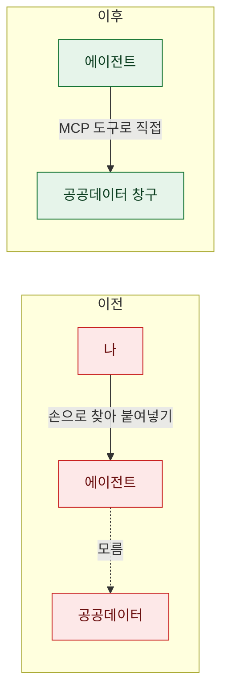
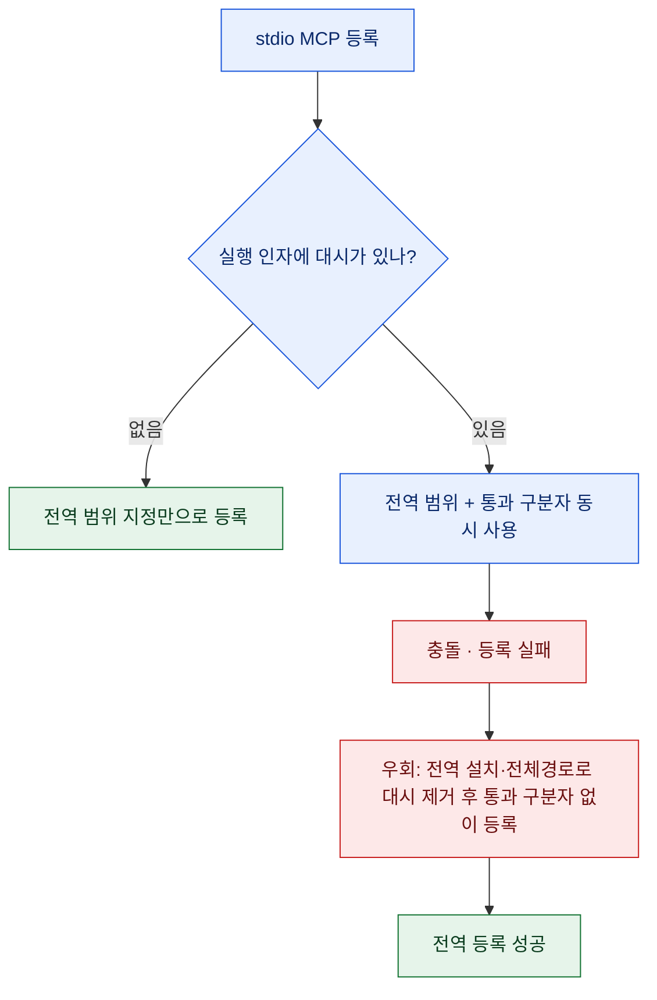
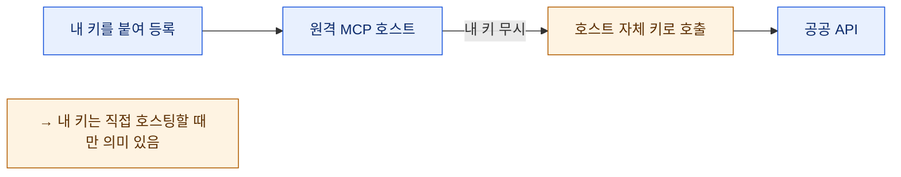

# 에이전트에게 '공공데이터 창구'를 열어줬다

> 로컬 검색이 아무리 좋아도, 에이전트가 아는 세계는 결국 내 디스크 안이었다. "이 조문 현행이 뭐야?"라고 물으면 답이 막혔다. 데이터가 없어서가 아니라, **바깥으로 나가는 문**이 없어서였다.

## 로컬 검색 다음은 '바깥 데이터'였다

[[knowledge-vault-search-install-verify-skill|지난 편]]에서 내 문서를 로컬에서 전문검색되게 만들었다. 그런데 실무 질문의 절반은 내 문서 안에 답이 없다. 현행 법령, 통계청 수치, 특허 출원인, 건축물대장, 학교 정보 — 전부 **공공기관이 공개해 둔 바깥 데이터**다.

이걸 매번 내가 브라우저로 찾아 에이전트에게 붙여넣는 건 자동화가 아니다. 목표는 에이전트가 **스스로 그 창구를 두드리는 것**이었다. 그 방식이 MCP(Model Context Protocol)다 — 외부 기능을 에이전트에게 "도구"로 표준화해 노출하는 규약.

## MCP를 '전역'으로 다는 것과 '프로젝트'로 다는 것

MCP를 등록할 땐 범위(scope)를 고른다. 프로젝트 하나에만 붙일 수도, 사용자 전역으로 붙일 수도 있다. 공공데이터 창구는 프로젝트를 안 가린다 — 법령·통계는 어느 작업에서든 물어볼 수 있어야 한다. 그래서 전부 **전역(user scope)**으로 등록했다. 한 번 달면 모든 세션에서 열린다.

## 어떤 창구들을 열었나?

세 부류를 달았다. 원격 HTTP MCP 한 묶음, 로컬에서 도는 문서파서, 그리고 법령 미러.

| 창구 | 무엇을 여나 | 방식 |
|---|---|---|
| 법령 | 현행 법령·조문·개정이력 | 원격 HTTP |
| 통계 | 인구·경제 등 공식 통계 | 원격 HTTP |
| 특허 | 출원·등록·상표·디자인 | 원격 HTTP |
| 건축 | 건축물대장·인허가 | 원격 HTTP |
| 학교 | 학교 공시·급식·일정 | 원격 HTTP |
| 문서파서 | 한글(HWP) 등 문서 변환 | 로컬 stdio |
| 법령 미러 | 법령·판례를 마크다운으로 | 로컬 stdio |

원격 HTTP는 등록이 간단하다. 주소만 가리키면 된다. 문제는 **로컬에서 실행 파일로 띄우는(stdio) 쪽**이었다. 여기서 함정이 나왔다.

## 함정 1 — `--scope`와 `--`는 같이 못 쓴다

로컬 stdio MCP는 보통 "이 명령을 이 인자로 실행해라" 형태로 등록한다. 그런데 실행 인자에 대시(`-y` 같은)가 들어가면, 등록 도구가 그걸 자기 옵션으로 오해한다. 그래서 "여기부터는 그대로 넘겨라"는 통과 구분자(`--`)를 쓰는데 — **전역 범위 지정(`--scope`)과 이 통과 구분자를 동시에 쓰면 충돌**한다.

해결은 **애초에 대시가 필요 없게** 만드는 것이었다. 패키지를 전역 설치해 실행 이름만으로 부르거나, 콘솔 스크립트의 전체 경로를 박아 통과 구분자 자체를 없앴다. 그러면 `--scope`만으로 깔끔하게 전역 등록된다.

## 함정 2 — 원격 호스트가 '내 키'를 무시하더라

이게 제일 흥미로운 발견이었다. 공공데이터 API는 대개 발급받은 키가 필요하다. 그래서 나는 원격 MCP 주소에 내 키를 붙여 등록했다. 그런데 실제로 조회해보니 **키가 있든 없든 똑같이 응답**이 왔다.

이유는 이랬다. 이 원격 호스트는 **자체 키를 이미 품고 있어서**, 사용자가 넘긴 키를 무시하고 자기 키로 API를 대신 호출해 주고 있었다. 편하긴 한데, 착각하기 딱 좋다 — "내 키로 도는 줄" 알았는데 실은 남의 할당량 위에 얹혀 있는 것이다.

교훈은 둘이다. 첫째, **원격 공용 호스트에 붙인 내 키는 대개 무의미**하다 — 내 키를 진짜 쓰고 싶으면 직접 띄워야(self-host) 한다. 둘째, 그중 한 창구는 예외적으로 "키를 넘기면 그 키의 할당량으로 돈다"고 확인돼서, 거기만은 **내 발급 키로 다시 등록**해뒀다. 창구마다 동작이 다르니, "붙였으니 되겠지"가 아니라 실제 응답으로 확인해야 한다.

## 같은 '법령'인데 왜 두 개를 달았나?

법령 창구를 두 개 달았다. 겹쳐 보이지만 성격이 정반대라 상호보완이다.

| | 실시간 공식 API형 | Git 마크다운 미러형 |
|---|---|---|
| 데이터 출처 | 공식 API를 실시간 조회 | 법령을 마크다운으로 미러링 |
| 강점 | 개정이력·신구대조 등 분석 | 버전관리·오프라인 |
| 약할 때 | 방대한 법은 응답이 느릴 수 있음 | 실시간성은 미러 갱신에 의존 |
| 쓰는 순간 | "이 조문 지금 어떻게 됐나" | "이 법 전문을 통째로 읽고 싶다" |

하나는 **"지금 상태를 분석"**하는 데, 다른 하나는 **"통째로 확보"**하는 데 강하다. 실시간 분석형은 특히 조문의 개정 전후를 나란히 보여주는 기능이 있어서, "이게 언제 어떻게 바뀌었나"를 따질 때 결정적이다 — 이 얘기는 다음 편에서 제대로 풀 예정이다.

## 설치 다음엔 꼭 재시작

마지막 실무 팁. MCP를 새로 등록하면 **에이전트를 재시작해야** 도구 목록에 뜬다. 이걸 몰라 "분명 등록했는데 안 보인다"로 한참 헤맸다. 반대로 앞 편에서 말한 **로컬 색인에 데이터만 더 넣는 건 재시작이 필요 없다.** 정리하면 이렇다.

- **도구 자체가 늘거나 바뀜**(MCP 등록) → 재시작 필요
- **데이터만 늘어남**(색인 추가) → 재시작 불필요

## 무엇이 달라졌나?

| 이전 | 이후 |
|---|---|
| 공공데이터는 내가 찾아 붙여넣기 | 에이전트가 도구로 직접 조회 |
| 세션마다 다시 세팅 | 전역 등록 한 번으로 상시 |
| "키 붙였으니 되겠지" | 응답으로 실제 동작 확인 |
| 법령 하나로 애매하게 | 분석형·확보형 두 창구 분업 |

로컬 검색이 "내가 가진 것"을 뒤지는 일이라면, 이번 작업은 "세상이 공개해 둔 것"까지 에이전트의 손이 닿게 한 일이었다. 창구를 여는 건 명령 몇 줄이지만, 그 몇 줄 뒤에 대시 충돌과 무시되는 키 같은 잔가시가 숨어 있었다. 하나씩 뽑고 나니, 에이전트가 물으면 바깥 데이터로 답하기 시작했다.

## 마무리

- 관련 글: [[useful-mcp-servers-for-developers|개발자를 위한 MCP 서버들]] · [[claude-code-mcp-servers-github-pat-oauth-dcr-fix|MCP 등록 함정(PAT·OAuth)]]
- 다음 편: 목록만 주고 본문은 안 주는 공공 사이트에서, **본문을 뽑아 검색엔진에 담은** 이야기.

<!-- 안전: 공개 공공데이터 MCP·일반 설치 절차만. 회사 실데이터·고객/제3자 PII·개인 API키/쿠키/토큰 값 없음. -->
