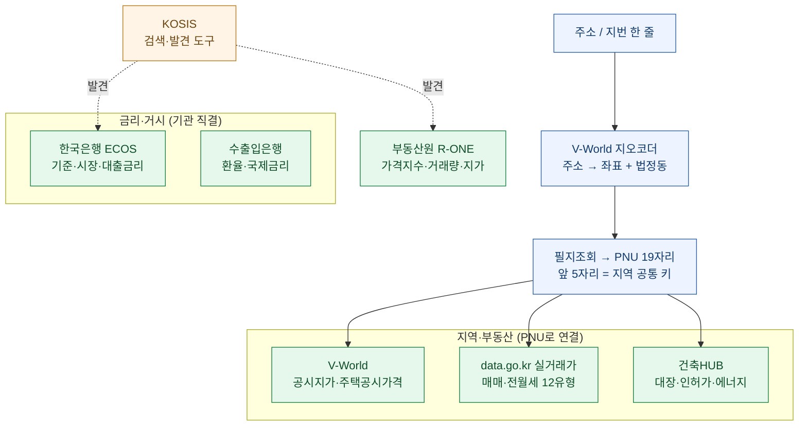
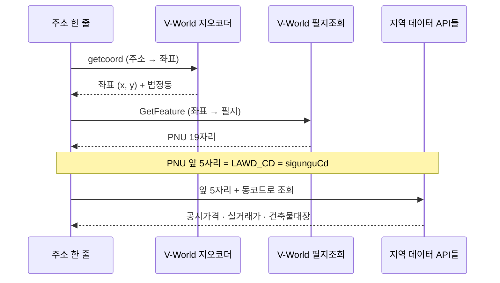
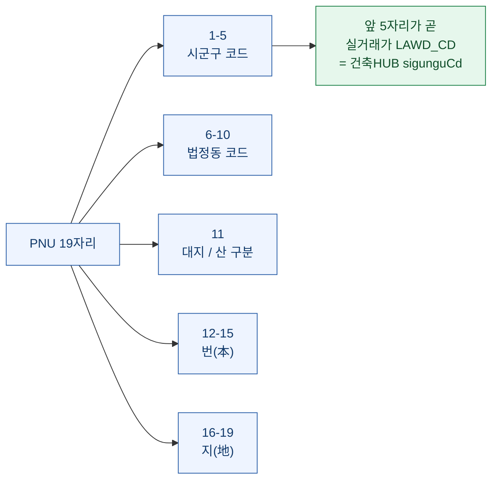
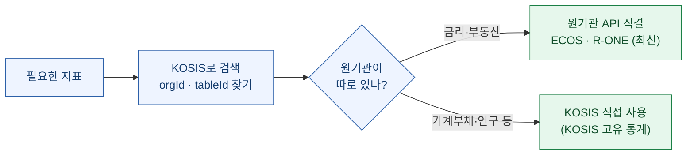
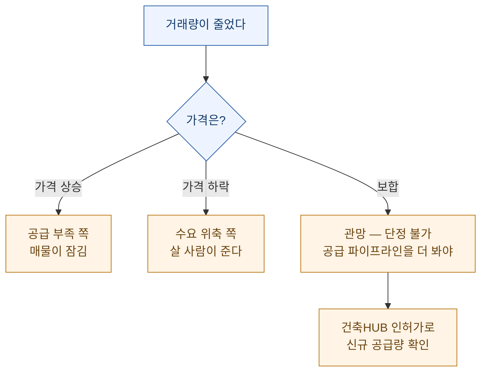

개인적으로 한국 부동산·금융 데이터를 한 화면에서 보고 싶었다. 금리가 어디로 가는지, 특정 동네의 공시가격과 실거래가가 얼마인지, 그 지역에 새 건물이 얼마나 올라오는지를 **한 번에** 보려는 것이다. 그런데 막상 시작하니 데이터가 **기관마다 다른 문 뒤에** 있었다. 한국은행은 금리, 부동산원은 가격지수, 국토부 V-World는 공시가격, data.go.kr은 실거래가, 건축HUB는 인허가 — 전부 별도 API에 별도 인증이었다.

며칠 붙잡고 나서야 이 흩어진 문들을 하나로 여는 **공통 열쇠**를 찾았다. **주소 하나를 좌표로 바꾸고, 좌표로 필지 번호(PNU)를 얻으면, 그 19자리의 앞부분이 여러 API가 공유하는 지역 키**라는 것이다. 이 글은 그 연결 구조를 정리한 기록이다.

> ⚠️ 이 글은 **공개된 정부 오픈데이터 API**를 개인적으로 엮은 기법·구조 정리다. 등장하는 수치는 정부가 공표한 공개 통계이며 **특정 시점(2026년 5~6월) 기준**이다. 투자 판단 근거나 회계·법률 자문이 아니다. API 키는 전부 `.env`에 두고 본문엔 값을 싣지 않는다.

## 오늘 엮은 데이터 지도는 어떻게 생겼나?

핵심은 왼쪽 위의 **주소 한 줄**이 오른쪽의 지역 데이터 전부로 뻗어 나간다는 것이다. 금리·환율은 지역과 무관하니 기관 API에 직결하고, 지역 데이터는 전부 **PNU라는 공통 키**로 묶인다.

## 왜 데이터가 기관마다 따로 노는가?

한국 공공데이터는 "누가 만드는가"에 따라 창구가 갈린다. 정리하면 이렇다.

| 데이터 | 출처 | 호스트 | 갱신 |
|---|---|---|---|
| 기준·시장·대출·수신금리, 연체율 | 한국은행 ECOS | `ecos.bok.or.kr/api` | 일~월 |
| 환율·국제금리(SOFR 등) | 한국수출입은행 | `koreaexim.go.kr` | 일별 |
| 아파트·연립·오피스텔 가격지수·거래량·지가 | 부동산원 R-ONE | `reb.or.kr/r-one/openapi` | 월 |
| 공시지가·주택공시가격·지오코딩 | 국토부 V-World | `api.vworld.kr` | 연·상시 |
| 실거래가(매매·전월세) 12유형 | data.go.kr | `apis.data.go.kr/1613000` | 월 |
| 건축물대장·인허가·에너지·폐쇄말소 | 건축HUB | `apis.data.go.kr/1613000` | 월 |

문이 여섯 개다. 각각 인증 방식도, 응답 형식도, 지역을 가리키는 코드 체계도 다르다. 처음엔 이걸 어떻게 하나로 묶나 싶었는데, **지역을 가리키는 코드**가 결국 한 뿌리에서 갈라진 것이었다.

## 열쇠는 어떻게 만들어지나 — 주소에서 PNU까지

연결의 출발은 **V-World 지오코더**다. 주소를 넣으면 좌표와 법정동 구조가 나오고, 그 좌표로 필지를 조회하면 **PNU(필지고유번호) 19자리**가 나온다. 이 19자리가 열쇠다.

PNU 19자리는 이렇게 쪼개진다.

이걸 알고 나면 나머지는 조립이다. **앞 5자리**만 있으면 실거래가 API의 `LAWD_CD`와 건축HUB의 `sigunguCd`에 그대로 넣을 수 있고, 전체 PNU가 있으면 V-World 공시가격 조회에 쓴다. 주소 한 줄이 곧 세 종류 데이터의 입력값이 되는 것이다.

## data.go.kr 키 하나로 실거래가와 건축물대장을 함께

의외의 이득이 하나 있었다. **실거래가와 건축HUB가 같은 data.go.kr 계정 키를 공유**한다는 점이다. 둘 다 `apis.data.go.kr/1613000/` 아래에 있고, 계정에서 API별로 "활용신청"만 각각 하면 **키 하나**로 둘 다 쓴다.

- 실거래가 12유형: 아파트·연립·단독다가구·오피스텔의 매매/전월세 + 분양권·토지·상업업무용·공장창고
- 건축HUB 5종: 건축물대장 · 건축인허가 · 주택인허가 · 건물에너지 · 폐쇄말소대장

주소를 PNU로 바꾸는 순간, **거래(실거래가)와 공급(인허가)과 현황(대장)을 같은 키로 한꺼번에** 볼 수 있게 된다.

## KOSIS는 1차 소스가 아니라 '검색엔진'이다

처음엔 KOSIS(국가통계포털)에서 다 받으려 했다. 통계가 다 모여 있으니까. 그런데 금리·부동산 지표를 KOSIS에서 받아 보니 **원기관보다 갱신이 늦었다.** 금리는 한국은행 표의 미러이고 부동산은 부동산원 미러라, 최신치가 몇 달씩 밀려 있었다.

그래서 역할을 나눴다. **KOSIS는 "어떤 통계가 어디 있는지 찾는 검색 도구"**로 쓰고, 실제 최신 수치는 원기관 API에 직결해 받는다. 다만 가계금융복지조사(분위별 부채)·주택보급률처럼 **KOSIS에만 있는 고유 통계**는 KOSIS를 1차로 쓴다. 도구의 성격을 오해하면 낡은 숫자를 최신인 줄 알고 쓰게 된다.

## 그래서 무엇을 할 수 있게 됐나

주소 한 줄을 넣으면 이런 게 한 번에 나온다(전부 공개 API 실측).

- **공시가격**: 개별공시지가(원/㎡)·개별주택가격·공동주택가격을 여러 해치
- **실거래가**: 그 지역의 아파트·빌라·오피스텔 매매/전월세 실거래
- **건축물대장·인허가**: 그 필지의 표제부, 그 동네에 올라오는 신규 건축 인허가

작은 응용 하나. **거래량이 줄었을 때 그게 수요가 식은 건지, 팔 물건이 없는 건지**는 실거래가만으로는 못 가른다. 판별 원리는 단순하다.

거래량이 줄고 가격이 **보합**이면 어느 쪽도 단정하기 어렵다. 이때 **건축HUB 인허가**를 붙여 신규 공급 파이프라인이 마른 상태인지까지 봐야 그림이 완성된다. 실거래가(거래·가격)와 건축HUB(공급)를 **같은 키로 잇는 이유**가 바로 여기 있다 — 한 데이터로는 못 가르는 걸 두 데이터를 겹쳐야 판별한다.

> ⚠️ 위 판별은 **일반적 해석 틀**일 뿐이고 특정 지역·시점의 투자 판단이 아니다. 중위가는 평형·연식이 섞인 값이라 동일 물건 비교가 아니며, 진행 중인 달(신고 마감 전)은 건수가 적어 왜곡될 수 있다.

## 정리하면

여섯 개의 흩어진 정부 API를, **주소 → PNU → 앞 5자리**라는 공통 키 하나로 엮었다. 배운 것을 한 줄로 줄이면 이렇다.

- **연결의 열쇠는 데이터가 아니라 코드 체계에 있었다.** PNU 앞 5자리가 여러 API의 지역 키를 겸한다는 사실이, 흩어진 문들을 한 번에 열었다.
- **KOSIS 같은 종합 포털은 '발견 도구'로, 최신 수치는 '원기관 직결'로.** 미러의 지연을 최신으로 착각하지 않기.
- **한 데이터로 못 가르는 질문은 두 데이터를 겹쳐서 푼다.** 거래량의 의미는 공급 데이터를 붙여야 드러난다.

다음엔 이 연결을 자동화해서, 단지 하나를 지정하면 그 단지의 공시가격·실거래가·건축물대장이 한 장으로 매칭되게 만들 참이다. 그 과정에서 겪은 API 함정들은 [따로 정리](/blog/public-data-api-troubleshooting-13-pitfalls)해 뒀다 — 200을 받고도 빈 응답이 오는, 문서엔 안 나오는 것들이다.
