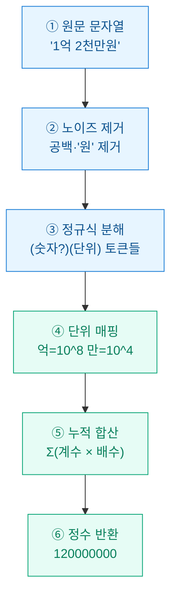
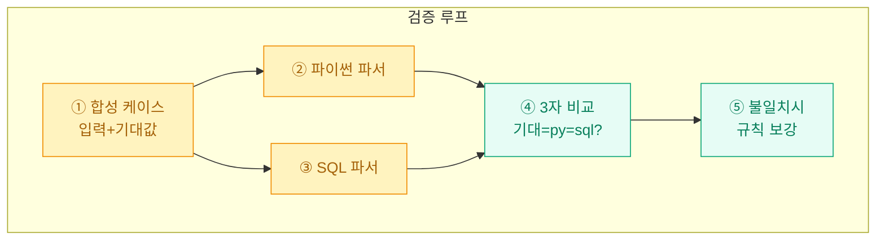

크롤링해 온 매물가·연봉·거래액 컬럼이 죄다 `'1억 2천만'`, `'3천5백만원'` 같은 한글 문자열로 들어와 있었다. 정렬도 안 되고 합계도 안 난다. "이걸 언제 다 손으로 고치나" 싶어 한숨이 나왔는데, 결국 규칙만 잡히면 파서 하나로 끝나는 문제였다. 오늘은 그 파서를 SQL과 파이썬 양쪽으로 만들고, 합성 데이터로 두 결과가 일치하는지까지 검증한 기록을 남긴다.

> 이 글의 모든 데이터는 합성/더미 값이며, 회사 실무 데이터가 아니다.

## 왜 한글 단위 표기는 파싱이 까다로운가?

한국어 금액 표기는 **십진(decimal)**이 아니라 **만 단위 묶음**으로 자릿수가 올라간다. 억은 만의 만 배, 즉 10^8이다. 문제는 사람마다 표기가 제각각이라는 것.

| 입력 문자열 | 뜻 | 정수값 |
| --- | --- | --- |
| `1억 2천만` | 1×10^8 + 2000×10^4 | 120,000,000 |
| `3천5백만원` | 3500×10^4 | 35,000,000 |
| `1억5000` | 1억 + 5000 | 100,005,000 |
| `천이백만` | 1200×10^4 | 12,000,000 |
| `억` | 단독(=1억) | 100,000,000 |

핵심 난관은 세 가지다. 공백·`원` 같은 노이즈, 단위 사이에 숫자가 생략되는 경우(`억` = 1억), 그리고 `천`·`백` 같은 소단위가 만/억 앞에 붙는 중첩 구조.



## 파이썬 파서는 어떻게 짜는가?

전략은 단순하다. 노이즈를 지우고, `(숫자 여러 자리)?(단위 하나)` 패턴을 **정규식(regex)**으로 훑으면서 단위별 배수를 곱해 누적한다. 단위 앞 숫자가 없으면 1로 본다.

```python
import re

UNIT = {"억": 10**8, "만": 10**4, "천": 10**3, "백": 10**2, "십": 10}
TOKEN = re.compile(r"(\d+)?\s*([억만천백십])")

def parse_kor_amount(text: str) -> int:
    s = re.sub(r"[\s,원]", "", text)          # 노이즈 제거
    total, tail = 0, s
    for num, unit in TOKEN.findall(s):
        coef = int(num) if num else 1
        total += coef * UNIT[unit]
        tail = tail.split(unit, 1)[-1]         # 마지막 단위 뒤 잔여 숫자
    if tail.isdigit():                          # '1억5000'의 5000 처리
        total += int(tail)
    return total

for x in ["1억 2천만", "3천5백만원", "1억5000"]:
    print(x, "->", parse_kor_amount(x))
# 1억 2천만 -> 120000000
# 3천5백만원 -> 35000000
# 1억5000 -> 100005000
```

한 가지 함정: `천이백만`처럼 아라비아 숫자 없이 순 한글 수사(`이`, `삼`)로 쓴 경우는 정규식 `\d`에 안 걸린다. 실무에서는 입력 소스가 대개 `숫자+단위` 혼용이라, 아래처럼 한글 수사만 먼저 치환해 두면 커버 범위가 넓어진다.

| 전처리 대상 | 치환 규칙 | 예시 |
| --- | --- | --- |
| 한글 수사 | 일=1 … 구=9 치환 | `이백` → `2백` |
| 콤마·공백 | 삭제 | `1,200 만` → `1200만` |
| 통화 기호 | `원`·`₩` 삭제 | `35000원` → `35000` |

## SQL만으로도 같은 계산이 되는가?

ETL 파이프라인에서는 파이썬을 거치지 않고 **DB 안에서(in-database)** 바로 변환하고 싶을 때가 많다. 표준 SQL의 문자열 함수(`REPLACE`, `SUBSTRING`, `POSITION`)만으로 억·만 두 단위는 충분히 처리된다.

```sql
-- 합성 더미 테이블
CREATE TABLE listings (id INT, price_text VARCHAR(32));
INSERT INTO listings VALUES
  (1, '1억 2천만'), (2, '3천5백만원'),
  (3, '9천만'),     (4, '2억');

-- '억' 앞/뒤를 나눠 각각 배수로 환산
SELECT
  id, price_text,
  CASE WHEN POSITION('억' IN t) > 0
       THEN CAST(NULLIF(SUBSTRING(t FROM 1 FOR POSITION('억' IN t)-1),'') AS INT) * 100000000
       ELSE 0 END
  +
  COALESCE(
    CAST(NULLIF(REPLACE(REPLACE(
      CASE WHEN POSITION('억' IN t) > 0
           THEN SUBSTRING(t FROM POSITION('억' IN t)+1) ELSE t END,
      '천만',''),'만',''),'') AS INT), 0) * 10000
  AS price_num
FROM (
  SELECT id, price_text,
         REPLACE(REPLACE(REPLACE(REPLACE(price_text,' ',''),'원',''),'백만','000만'),'천만','000만') AS t
  FROM listings
) s;
```

`천만`은 계수 그대로 만 단위에 실리므로, 전처리에서 `백만`을 `000만`으로 펴 주는 식의 정규화가 필요하다. SQL 쪽은 표기 변형이 늘수록 `CASE` 가지가 길어져서, 나는 보통 **표기가 단순하면 SQL, 자유 서식이면 파이썬 UDF**로 선을 긋는다.

## 두 구현이 정말 같은 값을 내는가?

파서는 "짰다"가 끝이 아니라 **양쪽 결과가 일치**해야 신뢰할 수 있다. 합성 데이터로 파이썬 결과와 SQL 결과를 대조하는 검증표를 만들었다.

| 입력 | 기대값 | 파이썬 | SQL | 일치 |
| --- | --- | --- | --- | --- |
| `1억 2천만` | 120,000,000 | 120,000,000 | 120,000,000 | O |
| `3천5백만원` | 35,000,000 | 35,000,000 | 35,000,000 | O |
| `9천만` | 90,000,000 | 90,000,000 | 90,000,000 | O |
| `2억` | 200,000,000 | 200,000,000 | 200,000,000 | O |



검증을 돌리면서 실제로 `1억5000`(만 단위 아닌 원 단위 잔여)에서 SQL이 5000을 누락하는 버그를 잡았다. 이래서 파서는 눈으로 훑지 말고 기대값 테이블로 못 박아 두는 게 안전하다.

## 정리하면

- 한글 금액은 **만 단위 묶음(억=10^8, 만=10^4)**이라, 정규식으로 `숫자+단위` 토큰을 뽑아 배수 누적하면 정수로 환산된다.
- **파이썬**은 자유 서식·한글 수사까지, **SQL**은 정형 표기에 강하다. 둘을 상황에 맞게 나눠 쓴다.
- 무엇을 짜든 **합성 데이터 기대값 테이블로 3자(기대·py·sql) 대조**를 해야 잔여 숫자 누락 같은 버그가 드러난다.

크롤링 원본의 지저분한 문자열 컬럼 하나가, 파서 30줄과 검증표 한 장으로 정렬·집계 가능한 정수 컬럼이 됐다. 데이터 분석은 결국 이런 전처리에서 승부가 갈린다.
