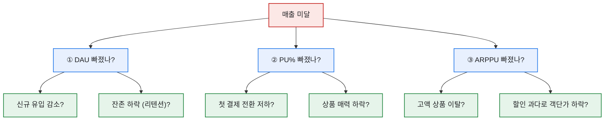
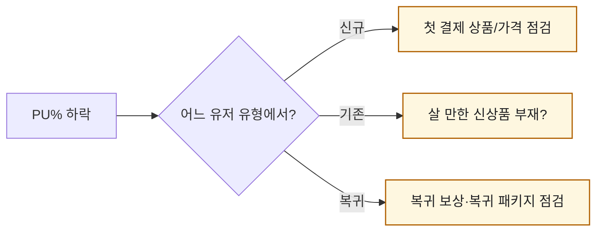

# KPI 미달, 5분 안에 원인 변수 찾기 — 매출 분해 트리

> "이번 달 목표 미달인데 왜죠?"라는 질문만큼 사람을 얼어붙게 하는 게 없다. 원인이 수십 개처럼 느껴지니까. 그런데 매출을 트리로 쪼개 놓으면, 이 막막한 질문이 **'세 갈래 중 어디가 빠졌나'** 라는 답할 수 있는 질문으로 바뀐다. 이 글은 내가 매달 돌리던 그 분해 순서를 합성 데이터로 정리한 것이다.

## 왜 '트리'로 내려가나?

매출은 앞 글에서 봤듯 세 변수의 곱이다. 미달했다는 건 그 곱의 결과가 낮다는 뜻이고, 그럼 **곱을 이루는 가지 중 하나 이상**이 빠진 거다. 위에서부터 순서대로 내려가면 원인 후보가 자동으로 좁혀진다.

## 실제로는 어떤 순서로 훑나?

나는 항상 **목표 대비 실제**를 세 변수로 나란히 놓는 표부터 만들었다. 어느 칸의 '달성률'이 유독 낮은지가 범인이다.

| 변수 | 목표 | 실제 | 달성률 |
|---|--:|--:|--:|
| DAU | 10,000 | 9,700 | 97% |
| PU% | 5.0% | 3.6% | **72%** |
| ARPPU | 30,000원 | 31,000원 | 103% |
| **매출** | 1,500만원 | **1,083만원** | **72%** |

표를 보는 순간 답이 나온다. DAU도 ARPPU도 멀쩡한데 **PU%만 72%로 주저앉았다.** 즉 "사람은 왔고 쓰는 금액도 괜찮은데, 지갑을 여는 사람이 줄었다"는 이야기다. 그럼 원인 탐색은 자동으로 '첫 결제 전환'과 '상품 매력' 쪽으로 좁혀진다.

## 한 칸을 짚었으면 다음은?

여기서 멈추면 안 된다. PU%가 범인이라는 걸 알았으면, 그 아래 가지를 한 단계 더 판다.

유형별 PU%를 다시 쪼개보면, 보통 한 유형에서 유독 크게 빠져 있다. 거기가 이번 달 손봐야 할 지점이다.

## 오늘의 기록

이 트리를 손에 쥔 뒤로 "왜 미달했지"라는 회의의 공기가 바뀌었다. 막연한 불안이 아니라 **"PU%, 그중에서도 신규 첫 결제"** 라는 좌표가 찍히니까, 다들 대응책을 이야기하기 시작한다. 분석가의 일은 범인을 색출하는 게 아니라, 팀이 손댈 곳을 좁혀주는 거더라.

*모든 수치는 합성 가정값입니다. 실제 게임·회사 데이터와 무관합니다.*
