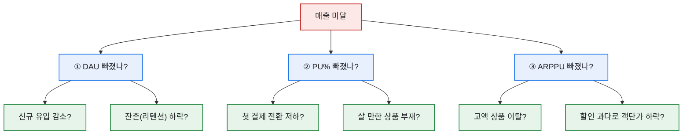
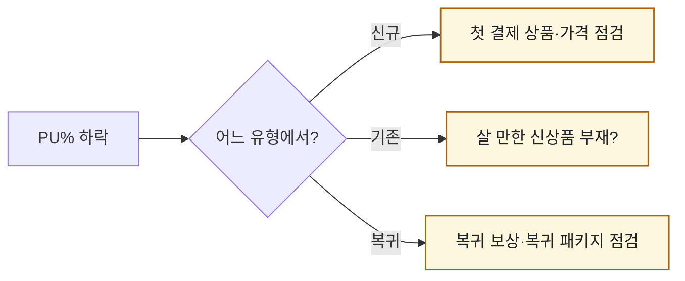

# KPI 미달, 5분 안에 원인 변수 찾기 — 매출 분해 트리

> "이번 달 목표 미달인데 왜죠?"라는 질문만큼 사람을 얼어붙게 하는 게 없다. 원인이 수십 개처럼 느껴지니까. 매출 시뮬레이션을 만든 뒤로 이 질문이 편해졌다. 매출을 트리로 쪼개 놓으면, 막막한 질문이 **'세 갈래 중 어디가 빠졌나'** 라는 답할 수 있는 질문으로 바뀐다. 이 글은 미달 회의 때마다 돌리던 분해 순서다. (수치는 가데이터다.)

## 왜 '트리'로 내려가나?

매출은 세 변수의 곱이다. 미달했다는 건 곱의 결과가 낮다는 뜻이고, 그럼 곱을 이루는 **가지 중 하나 이상**이 빠진 거다. 위에서부터 내려가면 원인 후보가 자동으로 좁혀진다.

## 실제로는 어떤 순서로 훑나?

나는 항상 **목표 대비 실제**를 세 변수로 나란히 놓는 표부터 만들었다. 어느 칸의 달성률이 유독 낮은지가 범인이다.

| 변수 | 목표 | 실제 | 달성률 |
|---|--:|--:|--:|
| DAU | 10,000 | 9,700 | 97% |
| PU% | 5.0% | 3.6% | **72%** |
| ARPPU | 30,000원 | 31,000원 | 103% |
| **매출** | 1,500만원 | **1,083만원** | **72%** |

표를 보는 순간 답이 나온다. DAU도 ARPPU도 멀쩡한데 **PU%만 72%로 주저앉았다.** "사람은 왔고 쓰는 금액도 괜찮은데, 지갑 여는 사람이 줄었다"는 이야기다. 그럼 탐색은 자동으로 '첫 결제 전환'과 '상품 매력'으로 좁혀진다.

## 한 칸을 짚었으면 다음은?

여기서 멈추면 안 된다. PU%가 범인이면 그 아래를 **유형별로 한 번 더** 쪼갠다. 매출 시뮬레이션을 신규·복귀·기존으로 나눠 만들어 뒀기 때문에, 이 재분해가 바로 됐다.

유형별 PU%를 다시 쪼개면 보통 **한 유형에서 유독 크게 빠져** 있다. 거기가 이번 달 손봐야 할 지점이다. 예컨대 신규 PU%만 무너졌다면 온보딩·첫 결제 설계, 기존만 빠졌다면 '살 게 없다'는 콘텐츠 공백을 의심했다.

## 왜 이 순서가 중요한가?

미달은 감정을 부른다. "마케팅이 부족했다", "상품이 별로였다" 같은 인상론이 회의를 채운다. 트리는 그걸 **좌표**로 바꾼다. "PU%, 그중 신규 첫 결제"라고 찍히면, 다들 인상 싸움을 멈추고 대응책을 이야기한다. 분석가의 일은 범인을 색출하는 게 아니라, 팀이 손댈 곳을 좁혀주는 거였다.

## 준비는 미달이 나기 전에 — 자동 분해 리포트

트리가 5분 만에 도는 비결은 사실 '미리 깔아둔 판'에 있었다. 나는 매일 도는 Stored Procedure로 **유형별(신규·복귀·기존) DAU·PU%·ARPPU를 이미 뽑아두고** 있었다. 그래서 미달이 터진 순간, 새로 쿼리를 짤 필요 없이 그 표를 목표와 나란히 놓기만 하면 됐다.

이렇게 **일간 리포트를 고정 템플릿으로 자동화**해두면, 분석가가 매번 손으로 표를 만드는 시간이 사라진다. 미달 회의에서 "잠깐만요, 쿼리 좀 짜볼게요"가 아니라 "이미 뽑혀 있어요, PU% 신규 구간이 범인입니다"라고 즉답할 수 있는 건 이 준비 덕이었다.

교훈은 하나로 모인다. **분해의 준비는 위기 전에 해둬야 한다.** 매출을 처음부터 `DAU × PU% × ARPPU`로, 그것도 유형별로 쪼개 매일 적재해 두는 것 — 그 습관이 미달 회의를 추궁에서 대응으로 바꿨다.

## 오늘의 기록

이 트리를 손에 쥔 뒤로 미달 회의의 공기가 바뀌었다. 막연한 불안이 아니라 좌표가 찍히니까. 그리고 이게 가능했던 건 매출을 처음부터 `DAU × PU% × ARPPU`로, 그것도 유형별로 쪼개 놨기 때문이다. **분해의 준비는 미달이 나기 전에 해둬야 한다** — 터진 뒤에 구조를 짜면 이미 늦다.

*실제 KPI 미달 원인분석 경험을 바탕으로 하되, 모든 수치는 가데이터이고 내부 구조는 일반화했습니다.*
