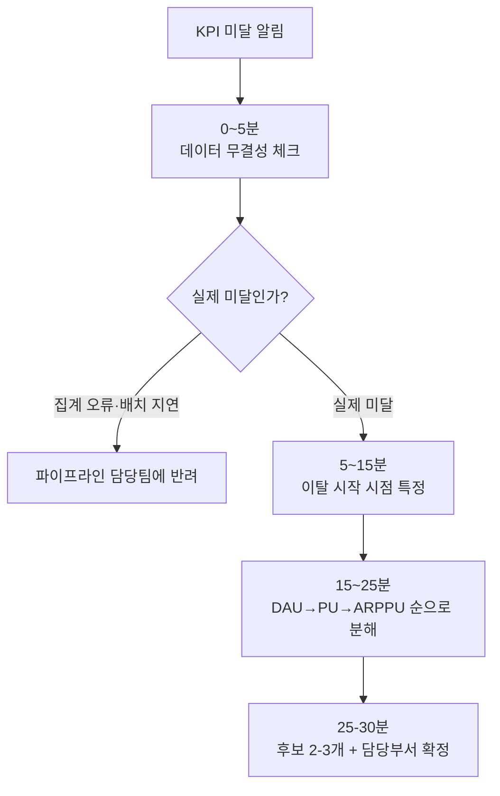
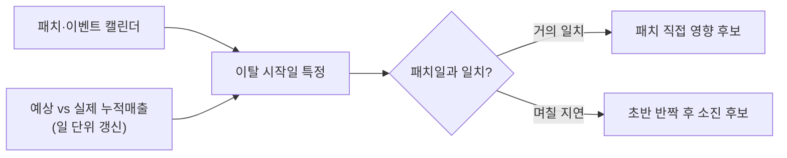

"이번 달 매출이 KPI를 못 채웠습니다." 이 한 줄이 올라오면 예전의 나는 우왕좌왕했다. DAU 그래프 열고, 결제 로그 뒤지고, 패치 노트 다시 읽고, 마케팅팀에 트래픽부터 물어보고. 그러다 반나절, 심하면 하루가 갔다. 지금은 다르다. 정해진 순서대로 30분만 돌리면 "무엇이 빠졌는지"까지는 아니어도 "누구에게 무엇을 물어야 하는지"는 나온다.

전에 쓴 글에서 매출을 `DAU × PU(%) × ARPPU`로, 그리고 신규/복귀/기존 유형으로 쪼개는 **분해 구조** 자체를 다뤘다. 이번 글은 그 구조를 실제로 쓰지 않는다. 이번 글의 초점은 그 분해를 **KPI 미달이라는 사건이 터진 순간, 어떤 순서로 돌려야 헛다리를 안 짚는지**다. 같은 도구라도 순서를 잘못 잡으면 30분이 반나절이 된다.

## KPI 미달 보고를 받으면 왜 분해부터 하면 안 되나?

첫 5분은 분해가 아니라 **이 숫자가 진짜인지**를 확인하는 데 쓴다. 나는 라이브 서비스를 돌리면서 매출·DAU를 Stored Procedure로 매일 자동 집계해뒀는데(합성 스키마 기준 `daily_kpi_check`), 이 자동 체크 결과부터 먼저 봤다. 집계 배치가 늦게 끝났거나, 특정 서버 로그가 하루 비었거나, 정산이 지연된 것뿐인데 매출이 반짝 빠진 것처럼 보이는 경우가 실제로 종종 있었다. 이걸 걸러내지 않고 바로 변수 분해에 들어가면, 있지도 않은 원인을 30분 내내 쫓는다.



이 단계에서 최소 두 가지만 본다. 어제·오늘 배치가 정상 종료했는지, 그리고 서버 전체가 아니라 특정 서버만 숫자가 비는지. 후자면 십중팔구 데이터 이슈지 비즈니스 이슈가 아니다.

```sql
-- 개념 예시(합성). 실제 스키마 아님.
-- 서버별 집계 여부와 편차만 빠르게 훑는 일일 체크
SELECT
    server_id,
    actual_revenue,
    expected_revenue,
    CAST(actual_revenue AS FLOAT) / NULLIF(expected_revenue, 0) - 1 AS deviation_rate,
    CASE WHEN actual_revenue IS NULL THEN 'MISSING_BATCH' ELSE 'OK' END AS batch_status
FROM   daily_kpi_summary
WHERE  kpi_date = @target_date;
```

## 이탈이 시작된 지점은 어떻게 잡나?

데이터가 진짜라고 확인되면, 다음 5\~15분은 **며칠부터 벌어지기 시작했나**를 잡는 데 쓴다. 여기서 쓰는 게 전에 만들어둔 월간 예상 vs 실제 누적매출 그래프(값은 가데이터)다. 이 그래프는 월말에 한 번 보는 리포트가 아니라, 이벤트나 패치가 몰린 시기엔 거의 매일 새로 갱신하며 굴리던 진단 도구였다. 실제로 예상매출 비교 자료의 버전이 날짜별로 계속 새로 찍혀 나갔다는 게 그 흔적이다 — "오늘자 기준으로 목표선과 실제선이 얼마나 벌어졌는지"를 언제든 바로 열어볼 수 있게 만들어둔 것이다.

벌어지기 시작한 날짜를 패치·이벤트·서버점검 캘린더와 겹쳐보면, 원인 후보가 저절로 몇 개로 좁혀진다.



"이탈 시작일 = 패치일"이면 패치 자체를 의심한다. "이탈 시작일이 패치일보다 며칠 늦다"면 초반 반짝 유입이 소진된 뒤 빠지는 패턴일 확률이 높다. 같은 "매출 하락"이어도 시점을 특정하는 것만으로 뒤에서 볼 변수 후보가 절반으로 줄어든다.

## DAU·PU·ARPPU는 어떤 순서로 봐야 헛다리를 안 짚나?

이탈 시점을 잡았으면, 15\~25분은 세 변수 중 어디가 빠졌는지 **순서대로** 확인한다. 순서가 중요한 이유는 변수마다 외부 검증이 가능한 난이도가 다르기 때문이다. 검증하기 쉬운 것부터 소거해야 30분 안에 담당 부서까지 특정된다.

| 순위 | 변수 | 왜 이 순서인가 | 걸리면 누구에게 |
|---|---|---|---|
| 1 | **DAU**(일일 활성 유저) | 마케팅 집행·UA(유저 획득) 리포트와 바로 대조 가능 | 마케팅·획득팀 |
| 2 | **PU(%)**(결제 유저 비율) | DAU가 정상일 때만 의미 있음. 퍼널 상세는 다음 단계로 | 결제 UX·기획팀 |
| 3 | **ARPPU**(결제 유저 1인당 평균 결제액) | 객단가 문제는 원인이 여러 갈래라 30분 안에 다 못 봄 | BM팀 |

DAU가 정상인데 매출만 빠졌으면 1순위는 넘어가고 PU를 본다. 여기서는 "PU가 빠졌다"는 사실만 30분 안에 확정하고, 결제 퍼널(결제 화면까지 이어지는 단계별 이탈 경로) 어디서 새는지는 다음 단계 담당자에게 넘긴다. DAU·PU 둘 다 정상인데 매출만 빠졌다면 ARPPU, 즉 객단가 문제다 — 고액 결제 구간이 안 팔리는지, 신규 패키지가 안 먹히는지는 여기서 다 못 보므로 "ARPPU가 빠졌다"까지만 확정해 BM팀에 넘긴다.

이 순서로 보는 이유가 하나 더 있다. 원인을 못 찾아도, "이 순서대로 봤는데 여기까지는 정상이었다"는 소거 기록 자체가 다음 사람에게 넘길 때 근거가 된다.

## 후보가 좁혀지면 그다음엔 뭘 하나?

25\~30분 구간에서 하는 일은 **정답 찾기가 아니라 누구에게 무엇을 물을지 확정하는 것**이다. 변수가 좁혀지면 신규/복귀/기존 유형으로 한 번 더 쪼개 후보를 구체화하고(전에 다룬 유형 분해), 필요하면 픽률·재구매율 같은 콘텐츠·과금 지속성 지표와 교차 검증해 가설에 살을 붙인다. 예를 들어 PU 하락과 특정 강화 단계 이후 재구매율 하락이 같은 시점에 겹치면 "BM 밸런싱" 가설로 넘어가는 식이다.

이 시점에 내가 반드시 남기는 건 세 줄뿐이다. 이탈 시작일, 어느 변수·어느 유형에서 빠졌는지, 그리고 아직 확인 안 된 부분(다음 담당자가 이어받을 지점). 정답을 다 채우지 못해도 이 세 줄만 있으면 관련 부서 회의 시간이 절반으로 줄었다.

## 정리 — 30분의 목표는 정답이 아니라 다음 행동이다

- 분해보다 먼저: 데이터 무결성부터 걸러야 헛다리를 안 짚는다.
- 분해보다 먼저 하나 더: 이탈 시작 시점을 캘린더와 겹쳐보면 후보가 절반으로 준다.
- DAU→PU→ARPPU는 **검증 난이도 순**이지 중요도 순이 아니다. 쉬운 것부터 소거한다.
- 30분 안에 나와야 하는 건 최종 원인이 아니라 **이탈 시작일 + 빠진 변수·유형 + 담당 부서**, 이 세 줄이다.

AI가 쿼리를 대신 짜주는 시대에도, "이 순서로 봐야 30분 안에 후보가 좁혀진다"는 판단은 같은 상황을 여러 번 겪어본 사람의 감각에 가깝다. 다음 글에서는 이 30분 안에 다 못 본 결제 퍼널 — 어느 단계에서 결제가 새는지를 깊게 들여다보는 방법을 정리한다.

- 방법론·합성 스키마 레시피: [github.com/DBhyeong/game-data-recipes](https://github.com/DBhyeong/game-data-recipes)
