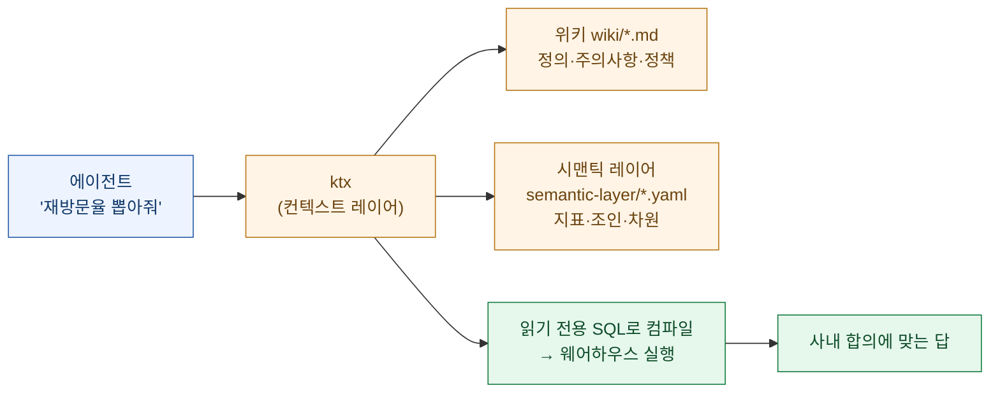
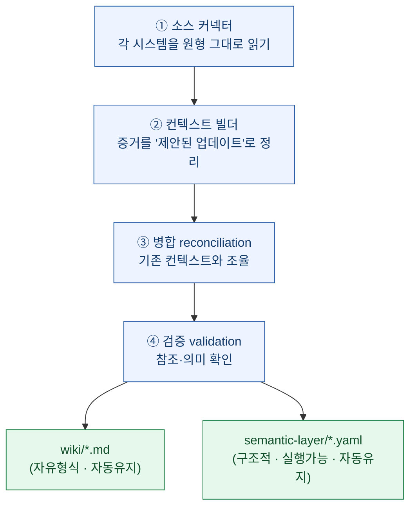
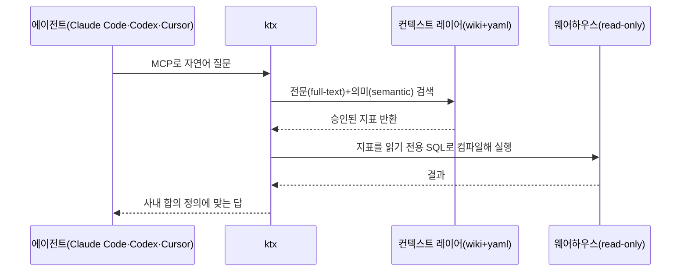

데이터 분석을 업으로 하다 보면 요즘 이런 장면이 잦다. 코딩 에이전트한테 "지난달 재방문율 뽑아줘" 했더니, **스키마를 처음부터 다시 뒤지고**, 재방문율 계산식을 **제멋대로 지어내고**, 결국 사내에서 합의한 정의와 **다른 숫자**를 자신 있게 내놓는다. 틀린 게 아니라 **'우리 회사가 부르는 그 지표'가 아닌** 게 문제다.

붙여준 글은 이 문제를 정면으로 겨눈 오픈소스 **ktx**다(PyTorch KR 소개글 · 공식 repo `github.com/Kaelio/ktx`, Apache 2.0). 데이터·분석 에이전트용 **컨텍스트 레이어(context layer)**를 표방한다. 마침 어제 정리한 [빌 인먼의 'AI 시대 데이터 관리'](https://dbhyeong.github.io/blog/data-management-age-of-ai-inmon-explained)와 결이 똑같아서 — "AI 품질은 모델이 아니라 **먹인 데이터**에서 갈린다" — 실물 구현처럼 읽혔다. 정리해 둔다. (아래 기능 설명은 프로젝트가 소개하는 내용이고, 내 판단은 따로 표시했다.)

## 한눈에 — ktx는 에이전트 앞에 무엇을 끼우나

핵심 아이디어는 하나다. 에이전트가 **SQL을 쓰기 전에**, 승인된 정의를 먼저 검색해 가져가게 하는 것.



전통적인 **시맨틱 레이어(semantic layer)**도 이 문제를 다루지만, ktx는 그것만으로 부족한 두 가지를 메운다고 말한다 — ① **수작업 유지보수**가 계속 필요하고, ② 위키·문서에 흩어진 **회사의 나머지 지식을 흡수하지 못한다**는 점이다. ktx는 데이터 스택을 자동으로 파악해 시맨틱 레이어를 짓는 일과, 문서 지식을 받아들이는 일을 **함께 자동화**하려 한다.

## ktx는 컨텍스트를 어떻게 '만드는가'? (인제스트)

ktx는 네 부류의 소스를 **각자의 형태 그대로** 읽어들인다.

| 소스 | 무엇을 읽나 |
|---|---|
| 데이터베이스 | 스키마·키·행 수·쿼리 이력 |
| BI 도구 | 대시보드·탐색·사용 패턴·신뢰할 예시 |
| 모델링 코드 | 기존 지표·모델·조인·엔티티(dbt·LookML·MetricFlow) |
| 문서·노트 | 정책·주의사항·팀 정의(Notion·Google Drive·텍스트) |

이걸 하나의 파이프라인으로 정리한다.



산출물이 **딱 두 개**라는 점이 좋다. 하나는 정의·주의사항·정책을 담아 에이전트가 검색하는 **위키(`wiki/*.md`)**, 다른 하나는 지표·조인·차원·필터를 담아 ktx가 SQL로 컴파일하는 **시맨틱 레이어(`semantic-layer/*.yaml`)**. 둘 다 **git 기반 파일**이라 사람이 diff·리뷰·머지할 수 있다. ktx는 위키를 정리하며 **중복을 제거**하고, 소스 간 **모순은 사람이 검토하도록 표시**한다.

여기서 데이터 모델러라면 반가울 대목 — 시맨틱 레이어가 원시 테이블과 상위 지표를 **조인 그래프(join graph)**로 엮어 **채즘 트랩(chasm trap)**과 **팬 트랩(fan trap)**을 자동으로 해소한다고 한다.

> **채즘 트랩·팬 트랩이 뭔가?** 여러 테이블을 조인해 집계할 때 값이 **뻥튀기(팬 트랩: 1:N 조인으로 합계 중복)**되거나 **엉뚱하게 곱해지는(채즘 트랩: 공통 차원으로 두 팩트를 잇다 카테시안 곱)** 고전적 함정이다. 손으로 SQL 짜다 제일 많이 틀리는 지점이라, 이걸 그래프로 자동 처리한다는 건 실무에서 꽤 큰 값어치다.

## ktx는 컨텍스트를 어떻게 '내주는가'? (서빙)

런타임에 에이전트는 **MCP(Model Context Protocol)**로 ktx에 질문한다.



포인트는 **컨텍스트 레이어와 웨어하우스를 건드리는 건 오직 ktx 하나**이고, 모든 DB 연결이 **읽기 전용**이라는 것이다. 에이전트는 매 질문마다 정규 SQL을 새로 쓰지 않고, **승인된 지표를 선언적으로 가져온다.**

## 기존 방식과 무엇이 다른가?

ktx가 저장소에서 스스로 내세우는 비교표를 옮기면 이렇다.

| 항목 | 범용 에이전트 | 전통적 시맨틱 레이어 | ktx |
|---|:---:|:---:|:---:|
| 웨어하우스 컨텍스트 자동 구축 | — | — | ✓ |
| 조인 컬럼 탐지 + 팬/채즘 트랩 해소 | — | 수작업 | ✓ |
| 승인된 재사용 지표 정의 | — | ✓ | ✓ |
| 위키·Notion·팀 지식 흡수 | — | — | ✓ |
| 소스 간 모순 표시 | — | — | ✓ |
| 에이전트 실행용 CLI + MCP | 부분적 | — | ✓ |

내 판단을 덧붙이면, ktx의 진짜 차별점은 **'승인된(approved)'**이라는 단어에 있다. 범용 에이전트의 약점은 문법이 아니라 **거버넌스**다 — 그럴듯한 SQL을 짜도 그게 **우리가 합의한 지표냐**는 별개 문제다. ktx는 그 합의를 **파일로 고정**하고 에이전트가 거기서만 뽑게 한다.

## 설치와 사용 (로컬·읽기 전용·데이터는 기기 밖으로 안 나감)

npm 패키지로 설치한다.

```bash
npm install -g @kaelio/ktx
ktx setup     # 프로젝트 생성/이어서 설정
ktx status
```

주요 명령은 이렇다.

- `ktx ingest` — 연결마다 컨텍스트 빌드
- `ktx sl "revenue"` — 시맨틱 소스(지표) 검색
- `ktx wiki "refund policy"` — 로컬 위키 검색
- `ktx mcp start` — 에이전트 클라이언트용 MCP 서버 기동

지원 범위도 넓다. **DB**는 PostgreSQL·Snowflake·BigQuery·ClickHouse·MySQL·SQL Server·SQLite·DuckDB·Amazon Athena·MongoDB, **연동**은 dbt·MetricFlow·LookML·Looker·Metabase·Sigma·Notion·Google Drive, **LLM 백엔드**는 Anthropic API·Google Vertex AI·AI Gateway, 그리고 **로컬 에이전트 로그인**(Claude Code의 Claude Pro/Max 구독, 로컬 Codex 인증)까지 쓸 수 있다. 별도 호스팅 서비스가 없고, 사용자가 지정한 LLM 제공자로 보내는 것 외에는 **어떤 데이터도 기기를 떠나지 않는다**고 한다.

## 데이터 분석가로서 어디가 좋고, 어디를 확인할까

좋게 본 지점.

- **'컨텍스트를 코드로'** — 위키·시맨틱 정의가 git diff로 리뷰되는 구조는, 지표 정의가 **누가 언제 왜 바꿨는지** 추적된다는 뜻이다. 데이터 신뢰의 절반은 여기서 온다.
- **자동 인제스트 + 사람 검토** — 자동으로 긁되 **모순은 사람에게 표시**하는 설계가 현실적이다. 완전 자동은 위험하고, 완전 수작업은 안 굴러가니까.
- **읽기 전용·로컬** — 웨어하우스에 절대 쓰지 않고 데이터가 기기를 안 떠난다는 전제는, 사내 도입 문턱을 크게 낮춘다.

확인하고 싶은 지점(도입 전 체크리스트).

- **'승인'을 누가 하나** — 지표를 approved로 올리는 **검토 주체·절차**가 팀에 없으면, 자동 생성된 정의가 그대로 '승인'처럼 굳을 위험이 있다. 도구가 거버넌스를 대신 만들어 주진 않는다.
- **자동 병합의 오판** — reconciliation이 소스 간 차이를 어떻게 판정하는지는 실측이 필요하다. 잘못 합쳐진 정의가 '승인된 지표'로 서빙되면, 틀린 숫자에 **권위**만 붙는다.
- **성능·비용** — 매 질의가 검색→컴파일→실행 3단이라, 큰 조인 그래프에서 지연·토큰 비용이 어떻게 나오는지는 워크로드로 재봐야 한다.

이건 결국 어제 인먼이 말한 **의미적 중앙화(ELDM)**와 **간접 통제**의 도구판이다. 데이터가 사방에 흩어져도 "같은 지표를 같은 뜻으로" 맞추는 한 곳을 두고(위키+시맨틱 레이어), 에이전트는 그걸 통해서만 웨어하우스에 닿는다. 나도 로컬 파일 수만 개를 FTS로 색인해 **에이전트가 MCP로 직접 뒤지게** 만들어 뒀는데, ktx는 그 발상을 **'승인된 지표'라는 거버넌스**까지 끌어올린 셈이다. 로컬 검색이 "찾게" 했다면, ktx는 거기에 **"올바로 세게"**를 얹었다.

한 줄로 줄이면 — **에이전트에게 필요한 건 더 많은 데이터 접근이 아니라, 합의된 정의로 가는 좁은 문이다.**
