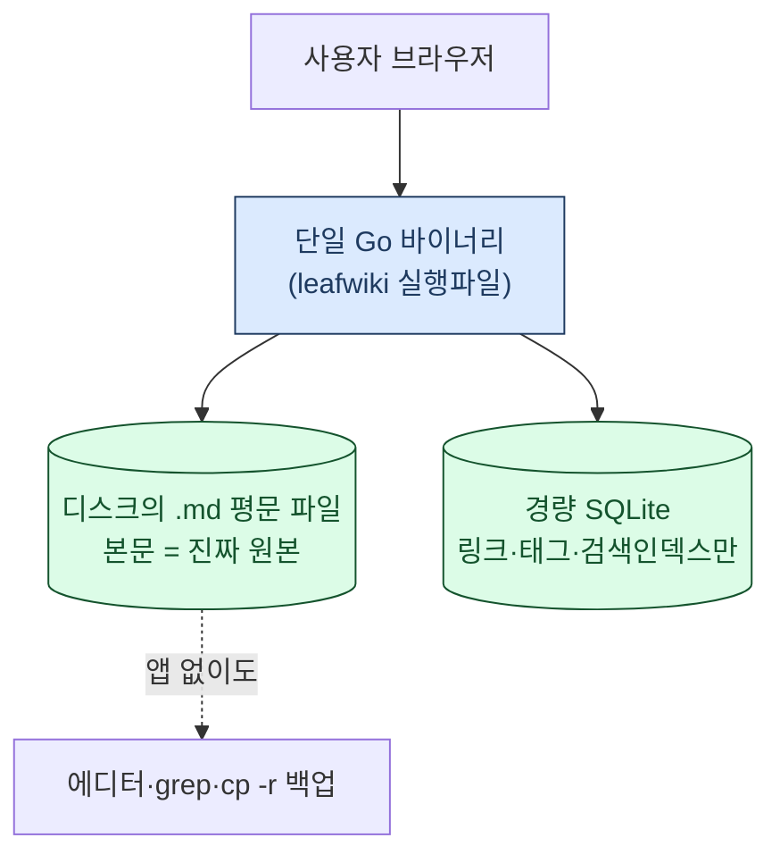
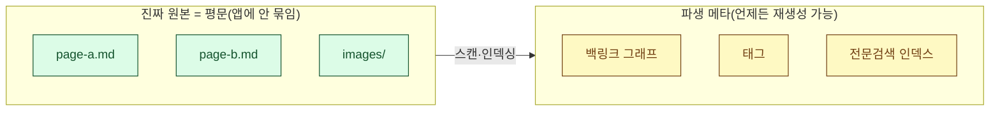
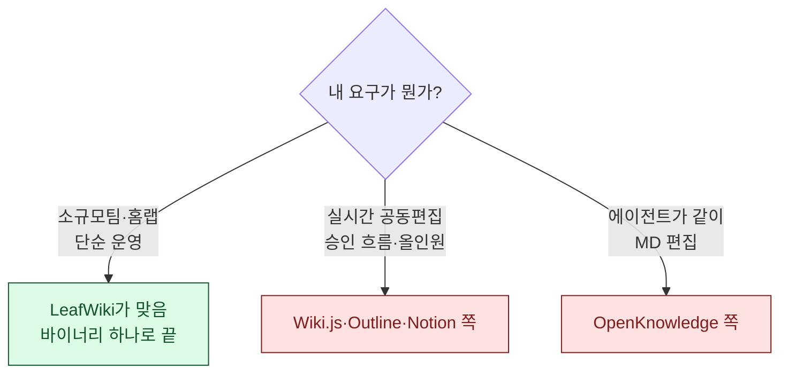

어제 [[openknowledge-local-markdown-llm-wiki-editor]](inkeep OpenKnowledge, 평문 MD를 에이전트와 같이 편집하는 위키 에디터)를 정리하고 나니, "평문 마크다운을 그대로 두는" 계열 도구가 요즘 왜 이렇게 눈에 띄는지 궁금해졌다. 나는 이미 codex_loof라는 평문 MD 지식볼트를 몇 달째 굴리고 있어서, 이런 도구를 볼 때마다 습관적으로 묻게 된다. **"이거 붙이면 내 볼트에 대체 뭐가 남나?"**

오늘 뜯어본 건 LeafWiki다. 한 줄로 요약하면 **서버도 DB도 없이 단일 Go 바이너리 하나로 실행하는 셀프호스팅 위키**다. 실측(2026-07-18) 기준 github.com/perber/leafwiki는 별 836개, 포크 57, 열린 이슈 35개, 버전 v0.11.4, 라이선스 MIT다. 2025년 3월 생성됐으니 이제 막 1년 조금 넘은 프로젝트다.



## 서버·DB가 없다는 게 실제로 뭘 뜻하나?

셀프호스팅 위키라고 하면 보통 Wiki.js나 Outline처럼 **Node 런타임 + PostgreSQL + Redis** 조합을 떠올린다. docker-compose 파일이 화면을 꽉 채우고, 컨테이너 세 개가 서로를 기다리는 구조다. 홈랩(집에 두는 개인 서버)이나 소규모 팀에겐 이게 과하다는 게 LeafWiki 저자의 출발점이다.

LeafWiki는 그 스택을 **실행파일 하나로 접었다**. 리눅스·맥·윈도우·라즈베리파이에서 바이너리만 내려받아 실행하면 끝이다. 별도 DB 프로세스를 띄우지 않는다.

여기서 내가 가장 마음에 들었던 설계는 **저장 방식의 분리**다. 콘텐츠 본문은 디스크에 `.md` 평문 파일로 그대로 쌓인다. 링크·태그·검색인덱스 같은 **메타데이터만** 파일 옆에 붙는 경량 SQLite(파일 하나짜리 임베디드 DB)에 담긴다.



이 그림이 내가 평문 볼트를 고집하는 이유 그 자체다. **본문이 앱에 인질로 잡히지 않는다.** LeafWiki를 끄고 지워도 `.md` 파일은 어느 에디터로든 열리고, `grep`으로 검색되고, `cp -r` 한 줄로 통째로 백업된다. SQLite 쪽이 깨져도 그건 파생물이라 원본에서 다시 만들면 된다. 내 볼트 철학과 완전히 같은 결이다.

## 에디터로서는 얼마나 쓸 만한가?

바이너리 하나라고 해서 기능이 빈약한 건 아니다. 오히려 이 부분이 어제 본 OpenKnowledge와 방향이 갈리는 지점이다. LeafWiki가 저자 주장으로 내세우는 편집 경험은 이렇다.

- **라이브 프리뷰 에디터**: 원문과 렌더 화면을 나란히 놓고 쓴다. 자동저장.
- **Ctrl+V 이미지 붙여넣기**: 스크린샷을 붙이면 자동으로 업로드·링크된다.
- **`[[wikilink]]` 자동완성**: 옵시디언(Obsidian) 호환 문법이라 내 볼트 습관 그대로다.
- 표·작업목록·각주·콜아웃(`::: info` / `::: warning`)·Mermaid·KaTeX(수식) 지원.
- 전문검색(Ctrl+Shift+F), 빠른 이동(Ctrl+Alt+P), 트리 내비게이션.

특히 눈길이 간 두 옵션은 실험적 플래그로 켜는 기능이다.

```bash
# 리비전 히스토리: 변경 이력 저장, 한 클릭 복원
leafwiki --enable-revision

# 링크 리팩터: 페이지 이름변경·이동 시 링크 자동갱신, 깨진 링크 표시
leafwiki --enable-link-refactor
```

`--enable-link-refactor`가 특히 반갑다. 평문 볼트를 굴리다 보면 파일 하나 이름 바꿨다가 `[[...]]` 링크가 우수수 깨지는 게 고질병인데, 그걸 도구가 추적해서 고쳐준다는 것이다(저자 주장, 나는 아직 미검증).

## 세 가지 실행 모드는 어떻게 쓰는 건가?

LeafWiki는 같은 바이너리를 **세 모드**로 돌린다. admin/editor/viewer 역할 권한, CSRF 보호, 인증 레이트리밋이 기본으로 깔려 있고, Authentik·Authelia·Keycloak 같은 외부 인증(SSO)도 연동된다.

| 모드 | 접근 방식 | 어디에 쓰나 |
|---|---|---|
| 사설 위키 | 전체 로그인 필수 | 팀 내부 문서, 비공개 |
| 퍼블릭 문서 | 누구나 읽기·인증 에디터만 수정 | 공개 매뉴얼·핸드북 |
| 로컬 노트패드 | 무인증 | 내 PC 개인 노트 |

나한테 현실적인 건 세 번째다. 인증 없이 로컬에서 띄워 `.md` 볼트 위에 얹으면, 옵시디언과는 또 다른 **웹 기반 읽기·편집 레이어**가 하나 생긴다.

## 그래서 안 되는 건 뭔가?

여기가 이 도구를 신뢰하게 된 대목이다. 저자 Patrick Erber(@perber, socradev GmbH)는 **못 하는 걸 명시**해뒀다. 실시간 협업 편집, 노션류 올인원, 승인 워크플로, 복잡한 권한 체계는 지원하지 않는다. 그리고 "그게 핵심"이라고 못을 박았다. 스코프를 의도적으로 좁힌 것이다.



어제의 OpenKnowledge와 나란히 두면 차이가 선명하다. 둘 다 **로컬 평문 MD** 계열이지만, OpenKnowledge는 에이전트 협업편집·WYSIWYG(보는 그대로 편집)에 무게를 두고, LeafWiki는 **단일 Go 바이너리·서버리스·홈랩 운영 단순성**에 무게를 둔다. 같은 재료(평문 MD)로 정반대 방향의 단순함을 판 셈이다. 로드맵에는 리치텍스트 붙여넣기, Git 저장소 동기화가 올라 있다.

## 내 볼트엔 뭐가 남나?

정리하면, LeafWiki를 내 볼트에 얹었을 때 남는 건 세 가지다.

첫째, **원본은 여전히 내 것**이다. 본문이 `.md`로 남으니 도구를 갈아치워도 데이터가 볼모가 아니다. 둘째, **운영 부담이 거의 없다**. DB 컨테이너를 돌볼 필요 없이 바이너리 하나면 라즈베리파이에서도 돈다. 셋째, **깨진 링크 관리**를 도구에 위임할 여지가 생긴다. 그동안 손으로 하던 링크 리팩터를 실험 플래그가 대신해줄 수 있다.

다만 별 836개짜리 1년차 프로젝트이고, 편집 경험·링크 자동갱신 같은 건 전부 저자 주장 단계라 나는 아직 직접 확인하지 않았다. 커뮤니티 지원 오픈소스가 14개월째 이어지고 있다는 것 정도가 지금 내가 아는 지속성의 근거다.

다음에 할 것: 로컬 노트패드 모드로 볼트 사본 위에 한 번 띄워보고, `--enable-link-refactor`가 실제로 내 `[[...]]` 링크를 얼마나 안전하게 고치는지 직접 재본다. 그 실측이 나오면 이 글에 이어 붙이겠다.

*이 글은 특정 도구 사용 권유가 아니라 내 작업 관점의 기록이다. 수치는 실측 시점(2026-07-18) GitHub 값이며, 편집·리팩터 기능은 저자 주장으로 아직 내 손으로 검증하지 않았다.*
