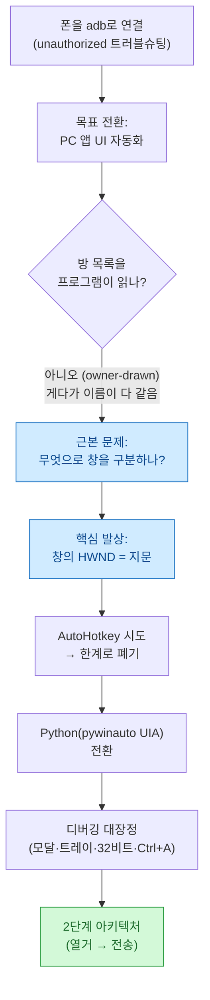
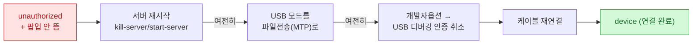
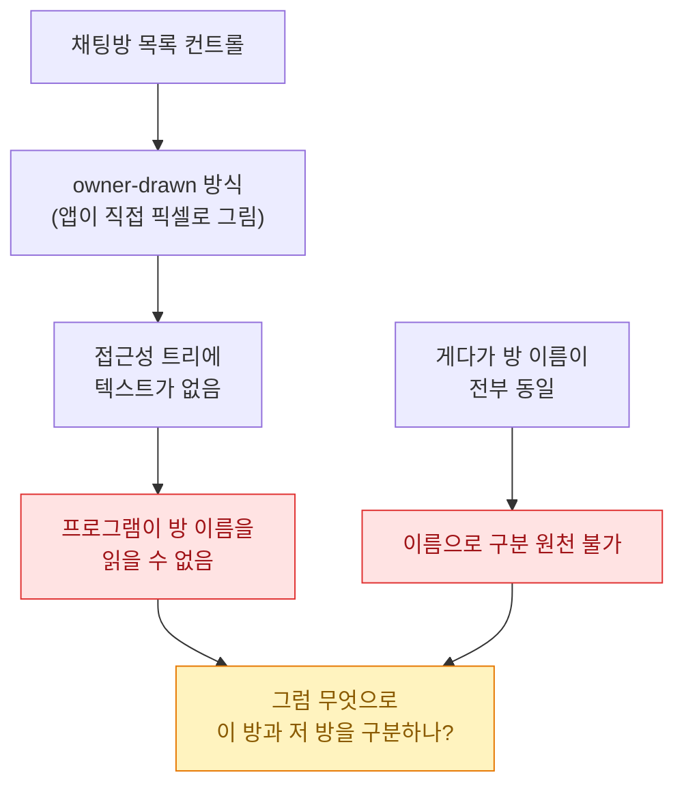
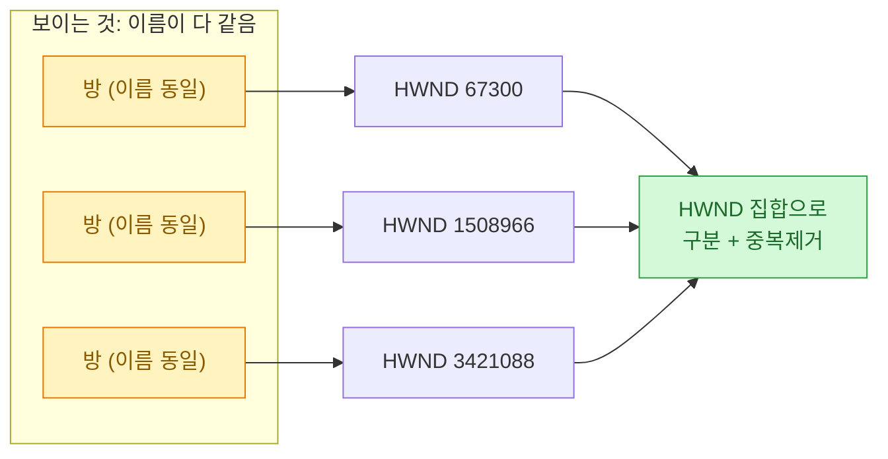
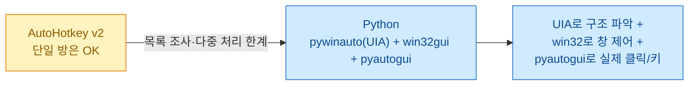
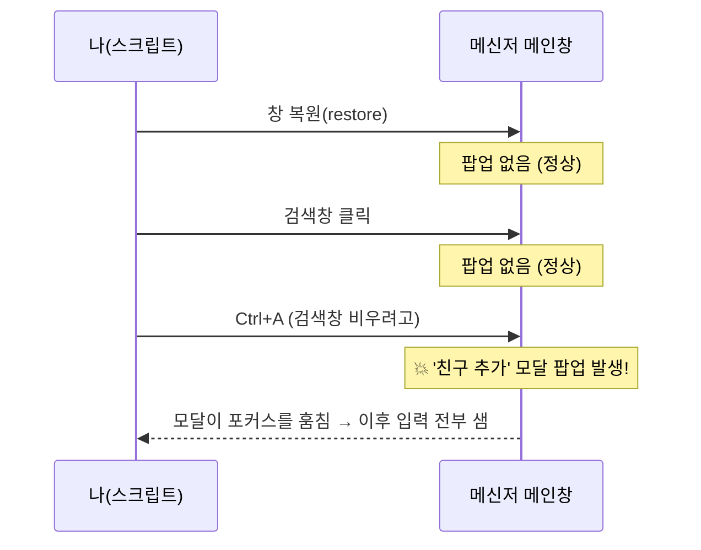
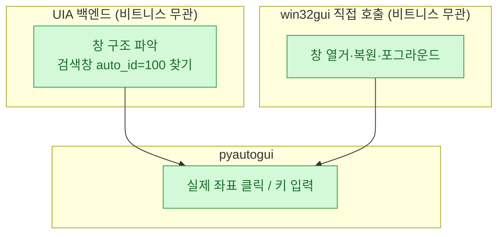
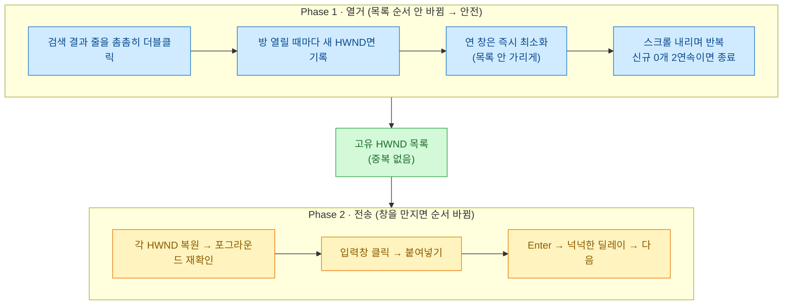
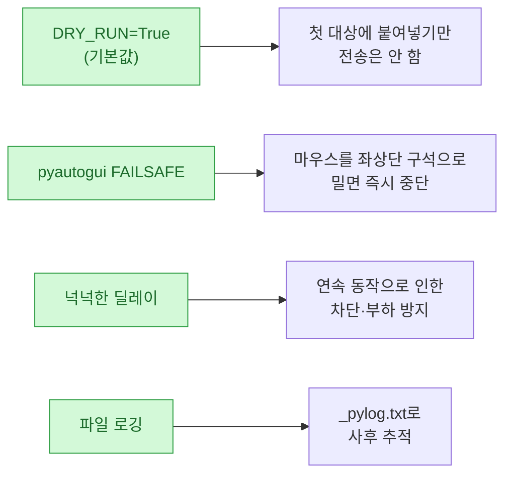
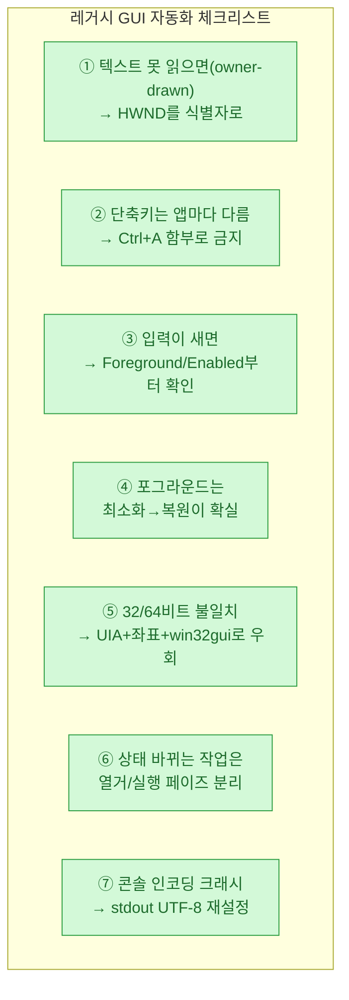

> 오늘의 일기 겸 삽질 기록. 성공담이 아니라 **실패를 순서대로 밟아간 로그**에 가깝다. 원래 기록 자체가 "성공한 방법뿐 아니라 도중에 실패했던 모든 시도와 원인까지" 남기는 식이라, 그대로 옮기면 나 같은 사람에게 쓸모가 있겠다 싶었다.

시작은 사소했다. "폰을 PC에 **adb**로 붙여보자." 그런데 하다 보니 목표가 옮겨갔다 — 결국 내가 붙든 문제는 **"이름이 전부 똑같은 창 여러 개에, 같은 작업을 중복 없이 시키기"** 였다. 이게 생각보다 고약했고, 그 과정에서 레거시 윈도우 앱을 자동화할 때 두고두고 쓸 교훈이 잔뜩 나왔다.

> ⚠️ **먼저 선을 긋는다.** 내 구체적 케이스는 "PC 메신저에서 이름이 같은 여러 채팅방에 같은 메시지 붙여넣기"였다. 하지만 **여러 방·다수에게 동일 홍보글을 대량 발송하는 건 대부분 서비스 약관상 매크로/스팸으로 제재(계정 이용제한) 대상**이고, 홍보 금지 규칙이 있는 방에선 강퇴·신고 사유다. 이 글의 가치는 "스팸 자동화"가 아니라 **고집 센 레거시 앱을 어떻게 자동화하느냐**는 기법에 있다. 따라 한다면 반드시 *본인이 소유·관리하는 공간*에서, 소량으로, 책임지고.

## 한눈에 — 이 삽질은 어떤 경로로 흘러갔나?



아래부터 한 칸씩 푼다. 각 단계마다 "무엇이 문제였고, 뭘 시도했다가 왜 깨졌고, 어떻게 풀었나"를 도식으로 붙였다.

## 폰부터 붙여봤다 — adb는 왜 `unauthorized`에서 안 넘어갔나?

출발점은 **ADB(Android Debug Bridge)** — PC에서 안드로이드 기기를 명령어로 제어하는 도구다. `winget install Google.PlatformTools`로 깔고 USB로 붙였는데, 첫 상태가 이랬다.

```
adb devices -l
→ (기기 시리얼)   unauthorized   transport_id:1
```

`unauthorized`는 "기기는 붙었는데 USB 디버깅 승인이 안 됐다"는 뜻이다. 문제는 **폰에 허용 팝업이 안 뜨는 것**이었다.



가장 확실했던 해법은 **개발자 옵션 → "USB 디버깅 인증 취소" → 케이블 재연결**이었다. 그러면 폰이 인증 상태를 초기화해서 허용 팝업을 새로 띄운다. (삼성폰은 **화면 잠금이 풀려 있어야** 팝업이 뜬다는 것도 함정이었다.)

부수적으로 하나 더. 패키지 목록을 보려는데 이런 게 떴다.

```
adb shell pm list packages | grep (앱이름)
→ SecurityException: Shell does not have permission to access user 150
```

폰에 사용자가 여럿(주인 `0`, 듀얼앱 `95`, 보안폴더 `150`)이라 그런 거였다. **`--user 0`**(주인 계정)을 명시하니 통과했다. 여기까지가 몸풀기였고, 곧 목표가 "PC 쪽 앱 자동화"로 넘어가면서 adb는 손을 뗐다.

> 💡 adb 트러블슈팅 핵심만: `unauthorized`면 **인증 취소 후 재연결**, 다중 사용자 폰이면 **`--user 0`**, USB는 **테더링 말고 파일전송(MTP)**.

## 왜 '방 목록'을 프로그램이 못 읽었나?

목표는 이거였다 — 어떤 메신저 PC 앱에서, 이름이 전부 똑같은(예: 전부 "OO코드") 여러 채팅방을 찾아 **같은 메시지를 중복 없이** 넣기. 그런데 첫 벽이 근본적이었다.



> **owner-drawn 컨트롤** — 표준 윈도우 컨트롤이 아니라 앱이 **직접 그림(픽셀)으로 그려내는** UI다. 그래서 접근성 트리(UI Automation)에 텍스트 노드가 없다. 화면엔 글자가 보여도, 프로그램에겐 그냥 그림이라 **읽히지 않는다.**

즉 "방 이름 목록을 뽑아서 하나씩 처리한다"는 상식적 접근이 **처음부터 불가능**했다. 이름도 다 같으니 텍스트가 읽혔어도 소용없었을 거다. 문제가 "어떻게 자동화하지"에서 **"무엇을 식별자로 삼지"**로 바뀐 순간이었다.

## 이름이 같은 창을 어떻게 구분하나 — HWND라는 '지문'

여기서 실마리가 나왔다. 목록의 텍스트는 못 읽어도, **방을 열면 각 방마다 고유한 창(HWND)이 생긴다.**

> **HWND(윈도우 핸들)** — 운영체제가 창 하나하나에 부여하는 **고유 번호**다. 이름·제목이 겹쳐도 HWND는 안 겹친다. 사람으로 치면 동명이인이라도 지문은 다른 것과 같다.



이 한 줄이 전체 설계를 결정했다. **"이름으로 구분"을 버리고 "HWND로 구분"으로 갈아탄다.** 방을 하나 열 때마다 새 HWND가 나오면 기록하고, 이미 본 HWND면 건너뛴다 → **중복이 원천적으로 사라진다.** 열려 있는 대상 창만 골라내는 열거 코드의 뼈대는 이렇다.

```python
import win32gui

def target_windows(keyword):
    """열려 있는 '대상 방' 창을 {hwnd: 제목}으로."""
    res = {}
    def cb(h, _):
        if not win32gui.IsWindowVisible(h):
            return
        t = win32gui.GetWindowText(h).strip()
        # 클래스·제목으로 '방 창'만 선별(메인/모달/광고 제외)
        if t and t != "메인창제목" and keyword in t:
            res[h] = t
    win32gui.EnumWindows(cb, None)
    return res
```

## AutoHotkey로 시작했다가 왜 Python으로 갈아탔나?

처음엔 **AutoHotkey(AHK) v2**로 붙었다. 단일 방 붙여넣기(`ControlFocus "RICHEDIT50W1"` → `Send "^v"`)는 금방 됐다. 그런데 다중 방으로 넓히자 실패가 줄줄이 나왔다.

| 실패 | 원인 | 교훈 |
|---|---|---|
| 스크립트가 아예 실행 안 됨 | 변수명 `log`가 **AHK 내장 함수명과 충돌** | 흔한 이름(`log`·`count`)은 예약어 충돌 의심 |
| 검색이 엉뚱한 팝업으로 샘 | (이땐 원인 몰랐음 — 나중에 진범 확정) | 증상만 보고 서두르지 말 것 |
| `FileDelete("없는파일")`에서 중단 | AHK v2는 파일 없으면 **예외** | `try`로 감싸기 |

AHK가 나빠서가 아니라, **owner-drawn 목록을 읽거나 창을 세밀하게 조사하는 힘이 부족**했다. 창 내부 구조를 UI Automation으로 깊게 파려면 파이썬 쪽(pywinauto)이 나았다. 그래서 **Python + pywinauto(UIA 백엔드) + pyautogui**로 전환했다.



## 가장 오래 잡아먹은 범인 — `Ctrl+A`가 왜 자꾸 '친구추가' 창을 띄웠나?

이게 이 삽질의 하이라이트다. 검색창에 검색어를 넣어도 값이 **옛날 값 그대로**였고, 입력이 자꾸 엉뚱한 데로 샜다. 며칠 헤매다, **한 동작씩** 실행하며 언제 팝업이 뜨는지 관측했다.



범인은 **`Ctrl+A`** 였다. 이 앱에서 `Ctrl+A`는 "전체 선택"이 아니라 **"친구 추가" 단축키**였던 것이다. 검색창을 비우려고 습관적으로 보낸 `Ctrl+A`가 매번 모달을 열었고, 그 모달이 입력 포커스를 가로채 이후의 모든 입력이 **엉뚱한 팝업의 이름칸으로** 새들어갔다. 그동안의 모든 미스터리(값이 안 바뀜, 팝업 반복 출현)가 이 한 줄로 전부 설명됐다.

해결은 단순했다 — **입력 클리어에 `Ctrl+A`를 절대 안 쓴다.** 대신 `End`로 커서를 끝에 보내고 `Backspace`를 넉넉히 반복한다.

```python
# ❌ pyautogui.hotkey("ctrl", "a")   # 이 앱에선 '친구 추가'가 열린다
pyautogui.press("end")
pyautogui.press("backspace", presses=40, interval=0.005)  # 짧은 입력이라 40회면 충분
```

> 🔑 교훈: **단축키는 앱마다 의미가 다르다.** 표준일 거라 가정한 `Ctrl+A`/`Ctrl+W` 같은 게 그 앱에선 전혀 다른 기능일 수 있다. 입력이 안 먹으면 **키를 의심**하라.

## 입력이 자꾸 샜다 — 모달·트레이·포그라운드 3종 함정

`Ctrl+A` 말고도, "입력이 엉뚱한 데로 간다"는 증상 뒤엔 세 가지 함정이 겹쳐 있었다. 이건 레거시 윈도우 앱 자동화의 단골이라 표로 남긴다.

| 함정 | 증상 | 진단 | 해결 |
|---|---|---|---|
| **모달 팝업** | 입력이 메인창에 안 닿음 | 메인창 `IsWindowEnabled=0`(모달이 비활성화) | 모달은 `WM_CLOSE` 무시 → **`ESC`로 닫기** |
| **트레이 숨김** | 창 열거가 갑자기 0개 | 포커스 잃으면 트레이로 숨어 `IsWindowVisible=0` | `visible_only=False`로 찾기 |
| **포그라운드 실패** | 클릭·키가 다른 창으로 | `SetForegroundWindow`가 포커스 잠금에 막힘 | **최소화 → 복원**으로 강제 |

특히 마지막이 실전 꿀팁이었다. `SetForegroundWindow`는 윈도우의 포커스 도난 방지 때문에 **그냥 실패하기도 한다**. 가장 확실했던 건 창을 **최소화했다가 복원**하는 것 — 그러면 포그라운드가 확실히 넘어온다.

```python
import win32gui, win32con, time

def force_foreground(hwnd):
    if not win32gui.IsWindowVisible(hwnd):
        win32gui.ShowWindow(hwnd, win32con.SW_SHOW)
    if win32gui.GetForegroundWindow() == hwnd:
        return
    try:
        win32gui.ShowWindow(hwnd, win32con.SW_RESTORE)
        win32gui.SetForegroundWindow(hwnd)
    except Exception:
        pass
    if win32gui.GetForegroundWindow() != hwnd:      # 그래도 안 되면
        win32gui.ShowWindow(hwnd, win32con.SW_MINIMIZE)  # 최소화 →
        time.sleep(0.25)
        win32gui.ShowWindow(hwnd, win32con.SW_RESTORE)   # 복원 = 확실한 포그라운드
```

> 그래서 "입력이 안 먹으면 **`GetForegroundWindow()`와 `IsWindowEnabled()`부터 찍어보라**"가 몸에 뱄다. 십중팔구 모달이 훔쳤거나 창이 숨은 거였다.

## 32비트 앱을 64비트 파이썬으로? — UIA + 좌표 클릭 우회

또 하나의 벽. 이 앱은 **32비트**였고 내 파이썬(Anaconda)은 **64비트**였다.

```
UserWarning: 32-bit application should be automated using 32-bit Python (you use 64-bit Python)
```

pywinauto의 **win32 백엔드로 컨트롤을 조회하면 비트니스가 안 맞아 불안정**했다. 그래서 전략을 갈랐다.



- **구조 파악은 UIA**로 (여긴 비트니스 영향 적음),
- **창 제어는 `win32gui` 직접 호출**로 (32/64 무관),
- **실제 입력은 좌표 클릭 + 키**(`pyautogui`)로.

여기서도 잔가시가 있었다. 검색창을 UIA `auto_id=100`으로 찾았더니 **3개**가 걸렸다(탭마다 검색창이 따로 있어서). 보이는 것 중 **화면 최상단(rect.top 최소)**을 고르는 식으로 풀었다. 그리고 콘솔 로그가 **이모지에서 죽는** 문제(`UnicodeEncodeError: cp949`)는 시작할 때 stdout을 UTF-8로 재설정하고 파일에도 남겨 해결했다 — 이건 [pymssql로 한글을 넣다 다 깨졌던 그 인코딩 전투]([[pymssql-korean-encoding-mssql|pymssql 한글 인코딩]])와 정확히 같은 결의 함정이었다.

```python
import sys
sys.stdout.reconfigure(encoding="utf-8", errors="replace")  # cp949 콘솔 크래시 방지
```

## 최종 아키텍처 — 왜 '열거'와 '전송'을 2단계로 나눴나?

모든 함정을 넘고 나니 설계가 깔끔해졌다. 핵심은 **한 번에 하지 않고 두 페이즈로 쪼갠 것**이다.



왜 굳이 나눴냐면 — **열거는 목록 순서를 안 바꾸지만, 전송은 창을 만지느라 순서를 바꾼다.** 두 일을 섞으면 목록이 흔들려서 뭘 처리했는지 꼬인다. 그래서 "먼저 열어서 HWND만 다 모으고(안전)", "그다음 모은 HWND로만 전송(순서 무관)"으로 분리했다. 열거 종료 판정은 **"새 HWND가 0개인 페이지가 2번 연속"** = 바닥 도달로 삼았다.

## 결과, 그리고 스스로 건 안전장치

돌려보니 의도대로 **중복 없이** 대상 창들을 식별해 처리했다. 개수는 실행마다 살짝 달랐지만(스크롤·샘플링 특성) **HWND 중복제거 덕에 같은 창에 두 번 가는 일은 없었다.** 다만 더 중요한 건 사고 방지 장치였다.



- **`DRY_RUN=True`가 기본**: 실수로 실행해도 전송이 아니라 "첫 대상에 붙여넣기만". 실제 동작은 명시적으로 꺼야 켜진다.
- **FAILSAFE**: `pyautogui`가 실제 커서·키를 움직이므로, 폭주하면 **마우스를 화면 좌상단 구석으로 밀어** 즉시 멈춘다.
- **딜레이 + 로깅**: 동작 사이 넉넉한 간격, 그리고 UTF-8 파일 로그.

> ⚠️ 다시 강조 — 이 안전장치들은 **"대량 발송을 안전하게 하는 법"이 아니다.** 애초에 다수에게 동일 홍보를 뿌리는 건 약관 위반·제재 대상이다. DRY_RUN·FAILSAFE는 *자동화 실험 자체의 사고를 막는* 장치로 이해하시길. 실제로 내 케이스에서도 어떤 방은 자체 홍보금지 필터가 메시지를 지웠을 정황이 있었다.

## 배운 점 — 다음에 레거시 앱을 자동화한다면

이 삽질에서 남은, 앱을 안 가리고 재사용할 원칙들.



가장 크게 남은 건 **관점의 전환**이다. "이름으로 대상을 구분한다"는 당연한 전제가 깨졌을 때, **운영체제가 이미 부여해 둔 고유 식별자(HWND)**로 눈을 돌리니 문제가 통째로 풀렸다. 그리고 이 기록의 원래 정신 — *성공한 방법만이 아니라 실패한 시도와 원인까지 순서대로 남기는 것* — 이 다음의 나를 제일 많이 도와줄 거라는 것.

> 같이 보면 좋은 글: [[insane-search-playwright-two-tier-setup|브라우저 자동화를 두 갈래로 세팅한 기록]] · [[pymssql-korean-encoding-mssql|한글 인코딩이 어디서 무너지는지 추적한 기록]] · [[telegram-claude-code-remote-bot|메신저로 내 PC의 에이전트 부려먹기]] · [[youtube-api-mp4-srt-thumbnail-shorts-pipeline|MP4 하나로 유튜브 업로드 자동화]]

---

*이 글은 내가 로컬에 남긴 작업 기록(ADB 연결 + PC 앱 UI 자동화 삽질)을 블로그용으로 정리한 것입니다. **다수에게 동일 메시지를 대량 발송하는 행위는 대부분 서비스 약관 위반이며 계정 제재·강퇴·신고 대상**입니다 — 이 글은 그 방법을 권하는 글이 아니라, 레거시 윈도우 앱을 자동화하며 겪은 기술적 함정과 해법을 공유하는 글입니다. 특정 앱의 컨트롤명·단축키·좌표는 버전·환경에 따라 다릅니다. 기기 식별자·개인정보는 마스킹했습니다.*
