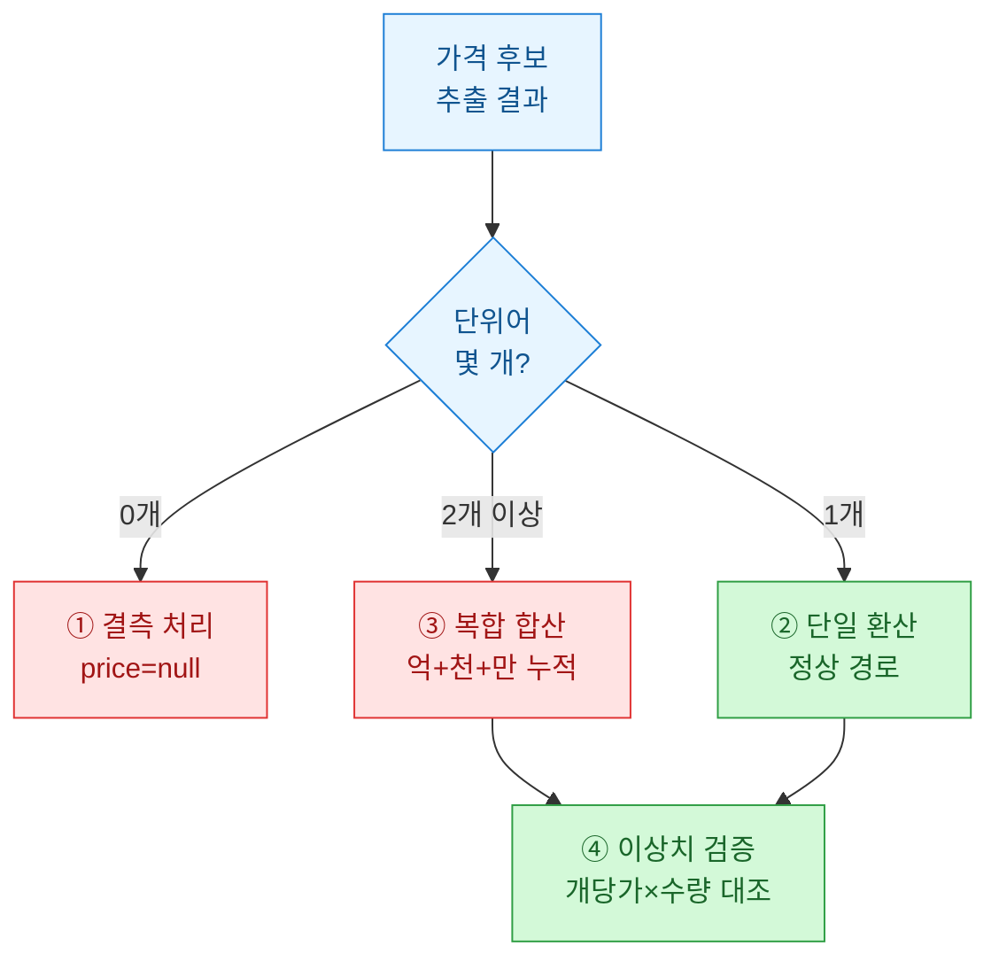

크롤링으로 매물 데이터를 긁어모으면 항상 같은 벽에 부딪힌다. 리스트 페이지에서 `제목`, `가격`, `본문` 세 칸을 얻긴 했는데, 정작 내가 분석하고 싶은 값은 그 안에 **자연어(natural language)로** 뭉개져 있다는 것. "아이템 300개 일괄 50만원 (분할가능/현거래X)" 같은 문장에서 수량 300, 총액 500000, 조건들을 각각 뽑아내야 비로소 표가 된다. 오늘은 이 지저분한 텍스트를 구조화하는 정규식 레시피를 정리했다.

## 왜 곧바로 `int()`로 못 바꾸나?

처음엔 나도 순진했다. 가격 칸에서 숫자만 떼면 되지 않나? 그런데 실제 데이터를 열어보니 이런 것들이 섞여 있었다.

```python
samples = [
    "골드 1억 5천 팝니다 개당 8원",   # 단위어 혼합
    "50만  일괄",                     # 만 단위 축약
    "500,000원 / 분할가능",           # 콤마 + 조건
    "5,0000원",                       # 오타(자릿수 붕괴)
    "가격은 쪽지주세요",              # 숫자 자체가 없음
]
```

`int()` 하나로는 절대 처리 못 한다. 그래서 나는 파싱을 **한 방에** 하지 않고, 아래처럼 **파이프라인(pipeline)으로** 쪼갰다.


단계를 나누면 각 정규식이 짧아지고, 실패했을 때 어느 칸에서 깨졌는지 바로 보인다. 이게 유지보수의 핵심이다.

## 정규화(normalize)는 왜 먼저 해야 하나?

추출 정규식을 아무리 잘 짜도, 입력이 들쭉날쭉하면 패턴이 폭발한다. 그래서 **추출 전에** 입력 모양부터 통일한다.

```python
import re

def normalize(text: str) -> str:
    text = text.replace(" ", " ")          # 비가시 공백(NBSP) 제거
    text = re.sub(r"[／/｜|]", " / ", text)      # 전각 구분자 통일
    text = re.sub(r"[,，]", "", text)            # 천단위 콤마 삭제
    text = re.sub(r"\s+", " ", text)             # 연속 공백 → 1칸
    return text.strip()
```

콤마를 먼저 지우는 이유는 뒤의 숫자 정규식을 `\d+`처럼 단순하게 유지하기 위해서다. `500,000`을 그대로 두면 `\d{1,3}(,\d{3})*` 같은 괴물 패턴을 계속 끌고 다녀야 한다.

## 수량·가격·조건은 각각 어떤 패턴으로 잡나?

핵심 세 필드를 나눠서 잡는다. 아래 표가 내가 실제로 쓰는 패턴 모음이다.

| 필드 | 정규식(요지) | 잡아내는 예 | 주의점 |
|------|-------------|------------|--------|
| **수량(qty)** | `(\d+)\s*(개\|장\|묶음)` | `300개`, `5묶음` | 단위어 화이트리스트로 한정 |
| **가격(price)** | `(\d+)\s*(억\|천\|만)?\s*원` | `50만원`, `1억원` | 단위어를 캡처해 환산 단계로 넘김 |
| **개당가(unit)** | `개당\s*(\d+)\s*원` | `개당 8원` | 총액과 구분 필수 |
| **조건(cond)** | `(분할\|일괄\|택배\|직거래\|네고)` | `일괄`, `네고` | `findall`로 다중 수집 |

```python
UNIT = {"억": 100_000_000, "천": 1_000, "만": 10_000, None: 1}

def parse_price(text: str):
    m = re.search(r"(\d+)\s*(억|천|만)?\s*원", text)
    if not m:
        return None
    value = int(m.group(1)) * UNIT[m.group(2)]
    return value

def parse_conditions(text: str):
    return re.findall(r"(분할|일괄|현거래|택배|직거래|네고)", text)
```

`억|천|만`을 **캡처 그룹으로** 잡아 딕셔너리로 환산하는 게 포인트다. "50만원"을 문자열 그대로 두면 나중에 정렬·합산이 안 된다. 숫자로 바꿔야 데이터가 된다.

## 여러 값이 섞여 나올 때 어느 걸 믿나?

여기서 진짜 트러블슈팅이 시작된다. "1억 5천"처럼 **복합 단위(억+천)가** 붙어 나오면 위 정규식은 앞의 `1억`만 잡고 `5천`을 흘린다. 나는 이런 케이스를 세 갈래로 나눠 처리한다.



복합 단위는 `finditer`로 모든 `(숫자, 단위)` 쌍을 훑어 누적한다.

```python
def parse_price_multi(text: str):
    total, found = 0, False
    for m in re.finditer(r"(\d+)\s*(억|천|만)", text):
        total += int(m.group(1)) * UNIT[m.group(2)]
        found = True
    return total if found else None

# "1억 5천" -> 100_000_000 + 5_000 ... 어? 5천이 5000?
```

바로 이 지점에서 데이터 검증이 필요하다. "5천"이 5,000원인지 5,000만원(=천만)인지는 문맥마다 다르다. 매물 카테고리(고가재/저가재)별 **가격 밴드(band)로** 검증해, 밴드를 벗어나면 자동으로 플래그를 세우고 사람이 확인하도록 큐에 넣는다. 정규식만으로 100%를 노리면 반드시 조용히 틀린다.

## 마지막 검증: 개당가 × 수량 ≈ 총액인가?

내가 가장 애용하는 자기검증 트릭이다. 수량·개당가·총액 세 값이 다 잡혔다면, 이들은 서로 곱셈 관계여야 한다. 어긋나면 어딘가 파싱이 틀린 것이다.

```python
def cross_check(qty, unit_price, total, tol=0.15):
    if not (qty and unit_price and total):
        return "insufficient"
    expected = qty * unit_price
    diff = abs(expected - total) / total
    return "ok" if diff <= tol else "mismatch"
```

`mismatch`가 뜬 레코드만 따로 모아 보면, 대개 오타(자릿수 붕괴)나 "개당"과 "일괄"을 헷갈린 케이스다. 전체를 손으로 볼 필요 없이 **의심 레코드만** 걸러내는 이 필터 하나로 검수 시간이 크게 줄었다.

## 정리하면

| 원칙 | 이유 |
|------|------|
| 파싱을 파이프라인으로 쪼개라 | 실패 지점이 눈에 보인다 |
| 추출 전에 정규화하라 | 패턴 폭발을 막는다 |
| 단위어는 캡처해 정수로 환산하라 | 정렬·합산 가능한 데이터가 된다 |
| 곱셈 관계로 자기검증하라 | 조용한 오류를 잡는다 |

정규식은 만능이 아니다. "대부분을 자동으로 잡고, 의심스러운 소수를 사람에게 넘기는" 구조를 설계하는 게 실전 파싱의 전부다. 완벽한 하나의 정규식보다, 틀렸을 때 그 사실을 알려주는 파이프라인이 낫다.

> 본문의 데이터·수치·매물 텍스트는 모두 합성·더미 예시이며, 특정 서비스나 실거래를 나타내지 않는다. 투자권유나 회계판단이 아니다.