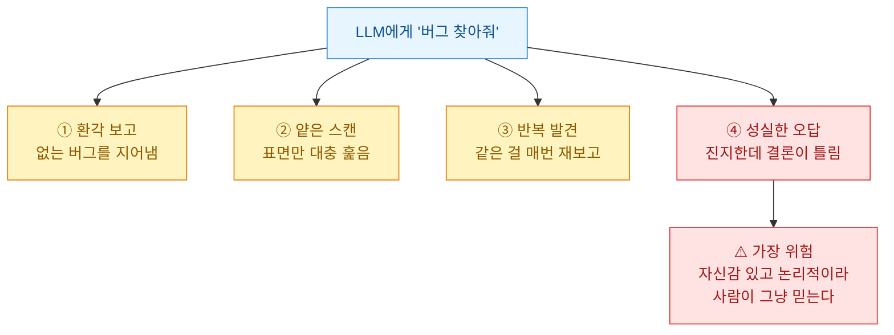
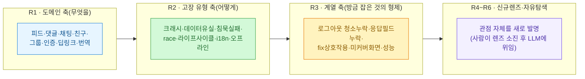
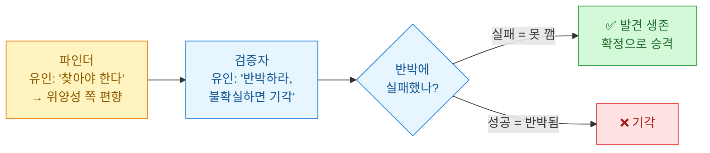
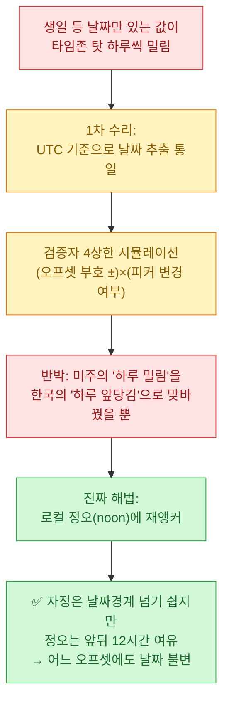
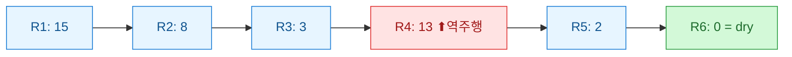
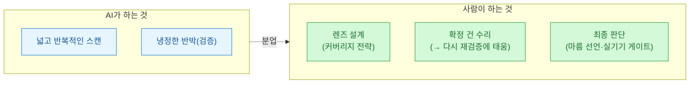

어제([[ai-llm-it-news-2026-07-14|7/14 다이제스트]]) GhostApproval을 정리하면서 "에이전트에게 자율 권한을 줄 땐 겉보기 승인을 믿지 마라"고 적었다. 그리고 바로 다음, [[partial-understanding-codebase-naur-theory|코드베이스를 다 이해 못 해도 괜찮다]]에서 "큰 시스템은 아무도 전부 이해 못 하니 부분 이론으로 일한다"고 썼다. 오늘 소개할 글은 이 둘이 만나는 지점에 있다 — **아무도 전수로 못 훑는 코드베이스를, 반박하는 에이전트로 감사하는 법.**

버질(Virgil)의 글 '에이전트 함대의 해부'(약 19시간 전)는 **13만 줄·131개 Swift 파일·21개 언어로 운영 중인 iOS SNS 앱**을 하루 동안 **LLM 에이전트 약 180개**로 정적 감사해 **확정 버그 55건**을 수리하고, 마지막 라운드에서 신규 발견 0으로 '마름(dry)'을 선언한 파이프라인을 해부한다. 코드 해부가 아니라 **검증 파이프라인 해부**다. 결론 한 줄부터 옮긴다.

> LLM 감사의 가치는 '버그를 찾는 AI'에 있지 않고 **'찾았다는 주장을 반박하는 AI'**에 있다. 생성자와 검증자의 유인을 분리하고, 판정 기준을 '다수결'이 아니라 **'반박 실패'**로 잡는 순간, 성실한 오답이 사용자에게 도달하기 전에 걸러진다.

## 왜 사람도, 테스트도, 정적 분석기도 부족한가?

13만 줄, 131개 파일, 피드·댓글·채팅·친구·그룹·일정·인증·딥링크·번역이 서로 물려 도는 앱. 사람 한 명이 "전수로" 훑는 건 불가능하다. 기존 대안 셋은 각자 다른 이유로 부족하다.

| 대안 | 잡는 것 | 못 잡는 것 |
|---|---|---|
| 정적 분석기(SwiftLint류) | 스타일·얕은 패턴 | "답글 수정 시 응답 필드 누락으로 캐시 오염" 같은 의미론적 버그 |
| 테스트 | 이미 상상한 케이스 | 상상 못 한 버그(정의상 테스트가 없다) |
| 사람 코드 리뷰 | 깊은 통찰 | 느리고·리뷰어 관심사에 편향·하루 131파일 전수 불가 |

그래서 택한 게 **LLM 에이전트 함대(fleet)**다. 그런데 여기 함정이 있다. "버그 찾아줘"라고 던지면 네 가지 실패 모드가 즉시 튀어나온다.

이 파이프라인의 설계는 통째로 **이 네 실패 모드를 각각 하나씩 봉쇄하는 장치**로 이루어져 있다. 글 전체를 이 대응표로 요약할 수 있다 — 이게 우연이 아니라 설계의 축이었다.

| 실패 모드 | 대응 장치 |
|---|---|
| ① 환각 보고 | JSON 스키마 + "빈 배열이 정답" + 투표 |
| ② 얕은 스캔 | file/line 필수 + evidence 강제 + 렌즈 직교화 |
| ③ 반복 발견 | 기지(旣知) 목록 누적 주입 |
| ④ 성실한 오답 | 적대 투표(유인 분리, 반박 실패만 생존) |

> 전제 하나. 이 환경은 **빌드가 불가능**하다(시뮬레이터·실기기 없음). 순수 정적 분석이다. 문법 게이트는 컴파일이 아니라 `swiftc -parse`를 여러 파일에 일괄로 돌리는 배치로 대신했다. 이 제약이 뒤의 역할 분담을 규정한다.

## 파인더는 왜 '직교 렌즈'로 fan-out하나?

첫 발상. **"버그를 찾아라"는 나쁜 프롬프트다.** 너무 넓어서 LLM이 스스로 관심사를 좁히는데, 그 좁힘이 매번 비슷해 커버리지가 편향된다. 열 개 에이전트에게 똑같이 시키면 열 개가 비슷한 데를 본다.

그래서 라운드마다 **렌즈(lens)**를 명시적으로 설계해 각 파인더에 하나씩 배정했다. 렌즈란 "무엇을 어떤 각도에서 볼지"를 규정하는 관점이다. 관건은 렌즈들이 **직교(orthogonal)**여야 한다는 것 — 서로 겹치지 않으면서 합치면 넓은 공간을 덮어야 한다. 하루 6라운드를 돌리며 **직교화의 축 자체를 매번 바꿨다.**

- **R1 도메인 축(무엇을)**: 기능 영역으로 쪼갠다. 파일 위치로 나뉜다.
- **R2 고장 유형 축(어떻게)**: 같은 코드를 결함의 종류로 다시 훑는다. 도메인 축과 완전히 직교한다 — "채팅×race"와 "친구×race"를 다른 파인더가 본다. **같은 코드를 두 개의 다른 격자로 스캔하는 셈.**
- **R3 계열 축(방금 잡은 것의 형제)**: 이게 가장 생산적이었다. 버그 하나를 잡으면 대개 혼자가 아니다 — 같은 실수가 곳곳에 복제돼 있다. "방금 잡은 버그와 같은 계열을 전수로 찾아라"는 렌즈다. 축의 정의가 "파일 위치"도 "고장 종류"도 아니고 **"이미 확인된 한 결함과의 유사성"**이다.
- **R4 신규 12렌즈**: 앞이 안 본 각도를 발명(보안·소켓 핸들러 중복·캐시 마이그레이션·FCM 파싱·타임존·웹뷰·입력 경계·업로드·재진입 취소 등).
- **R5·R6 라스트콜**: 규칙 하나만 줬다 — "기존 각도 전부 금지, 관점을 새로 발명하라." **파인더에게 커버리지 축의 설계권까지 넘긴 것.**

정리하면 커버리지를 늘리는 축이 라운드마다 다르다 — 도메인 × 고장 유형 × 계열 × 자유. 같은 코드를 네 종류의 서로 다른 격자로 겹쳐 스캔하면, 한 격자가 놓친 걸 다른 격자가 잡는다. 이 직교화가 '얕은 스캔'을 커버리지 차원에서 봉쇄한다.

## 환각은 어떻게 스키마로 막나?

파인더가 산문으로 보고하면 두 가지가 벌어진다. **집계가 불가능**해지고(180개 서술을 손으로 병합 못 한다), **산문이 불확실을 숨긴다**("문제가 있어 보입니다" 같은 헤지가 발견인지 잡담인지 구분 안 된다).

그래서 파인더는 **JSON 스키마로만** 보고하게 강제했다. `severity`(HIGH/MED/LOW)·`title`·`file`·`line`·`description`·`evidence`.

- `file`·`line` 필수 → **실제로 그 파일을 열어봐야** 채운다. "채팅 쪽에 문제 있을 수 있다"는 두루뭉술한 보고가 불가능해진다(얕은 스캔을 한 번 더 조인다).
- `evidence` 필수 → 판단의 이유를 코드로 제시 못 하면 그 발견은 스키마를 못 채운다(근거 없는 단정 차단).

그리고 프롬프트에 딱 한 줄. **"확신이 없으면 보고하지 마라. 빈 배열이 정답이다(empty array is a valid, correct answer)."** 효과가 컸다. LLM은 기본적으로 빈손 귀환을 실패로 여겨 억지로 발견을 지어낸다. "빈 배열이 정답"이라고 명시적으로 허가하면 지어낼 유인이 사라진다.

## '다수결'과 '반박 실패'는 뭐가 다른가?

파인더가 아무리 정밀해도 **'성실한 오답'은 남는다.** 이걸 거르는 게 이 파이프라인의 심장이다. 발상은 **유인의 분리**다.

검증자의 임무는 확인이 아니라 **반박**이다. "이건 진짜 버그다"를 증명하는 게 아니라 "이건 버그가 아니다"를 시도하고, **반박에 실패했을 때만** 발견이 살아남는다. 판정 기준이 "몇 명이 찬성했나"가 아니라 **"반박이 실패했나"**인 것 — 이게 다수결과 결정적으로 다르다.

투표 구조: HIGH/MED 발견마다 독립된 검증자 2명이 각자 반박 시도(LOW는 신호 대비 비용이 안 맞아 투표에서 뺌). 둘이 갈리면 3번째가 타이브레이크. 과반 생존만 확정 승격. 검증자들은 **서로의 결론을 모른 채** 독립 판단한다(한 명의 확신이 다른 한 명을 오염시키지 않게).

실측 기각률이 작동 증거다.

- **1차 감사: 8건 발견 → 8건 전부 생존.** 기각률 0은 검증이 무력한 게 아니라 그 라운드 발견 품질이 높았다는 신호.
- 이후 라운드: 1\~4건씩 기각.
- **결정적 수치: 오탐이 사용자에게 도달한 건 0건.** 기각된 것들이 그대로 수리로 갔다면 멀쩡한 코드를 건드려 새 버그를 만들었을 것.

## 왜 '고친 코드'를 다시 반박하게 하나?

여기서부터가 실효가 가장 컸다. 대부분의 감사는 "발견 → 수리"에서 끝나고 **수리 자체는 검증하지 않는다.** 이게 놓치기 쉬운 생략이다 — 수리는 코드를 바꾸는 행위고, 바꾸면 새 버그가 생긴다.

그래서 **수리 자체를 다시 검증자에 태웠다.** "이 fix가 정말 고쳤나? 그 과정에서 다른 걸 깨뜨리지 않았나?" 그 결과 **반쪽 수리(half-fix)**가 여러 건 잡혔다.

대표 사례가 교과서적이다 — **date-only 타임존 버그**.

UTC 통일 수리는 밀림 방향을 뒤집었을 뿐 여전히 틀렸다 — 반쪽 수리다. 검증자의 4상한 반박이 없었으면 "고쳤다"고 배포하고, 반대 방향 지역에서 새 제보가 들어왔을 것이다.

그 밖에 잡힌 반쪽 수리들의 공통점은 **로직이 아니라 순서/방향의 결함**이라는 점이다.

- **바깥 catch가 현지화 메시지를 raw로 덮어씀** — 안쪽에서 현지화한 걸 바깥 catch가 서버 원문으로 되돌려 수리를 무력화.
- **즉시 반영 코드가 fallback 원본을 먼저 오염** — 롤백할 원본을 반영 전에 건드려, 정작 되돌릴 때 이미 오염된 값으로 복귀.

가장 아찔했던 건 **수리가 만든 회귀**였다. 번역용으로 어떤 뷰를 SwiftUI 래퍼로 감싸다 분기의 `else`가 누락돼, **번역 안 켠 사용자에게 콘텐츠가 통째로 사라지는** 치명 회귀. 이건 논리 검증이 아니라 **회귀 스윕**이 잡았다 — 검증자가 뷰 `body` 타입을 재구성했더니 반환 타입이 `Optional<View>` 꼴이었다(어떤 분기가 nil을 반환한다는 뜻). `else`가 있었다면 모든 경로가 뷰를 반환해 Optional이 될 수 없다. **타입의 모양이 누락된 분기를 고발했다.** 정적 분석이 실행 없이 회귀를 잡은 사례.

## 언제 '마름(dry)'을 선언하나?

라운드별 확정 버그 수를 나열하면 곡선이 보인다.

자연스러운 기대는 단조 감소인데, **R4에서 역주행해 13으로 튀었다.** 원인은 렌즈 하나가 **광맥(vein)을 열었기** 때문이다. R4의 '에러 문구' 렌즈가 서버 에러 원문이 사용자에게 그대로 노출되는 지점을 **11곳** 찾았다 — 11개의 다른 버그가 아니라 **하나의 결함이 11곳에 복제된 계열**이다.

이 패턴이 종료 조건 설계에 결정적이다. **"발견이 줄었다"만으로 종료하면 안 된다.** R3에서 3건까지 떨어졌다고 멈췄다면 R4가 연 11곳 광맥을 통째로 놓쳤을 것이다. 그래서 종료 조건을 "발견 수 감소"가 아니라 **"자유 탐색 2연속 라운드에서 마지막 라운드 확정 0"**으로 잡았다. 관점을 새로 발명해도 더 이상 안 나올 때 — 그때 '마름'이다.

## 무엇을 잡았고, 사람은 어디에 있었나

전부 정적 분석만으로 잡은 대표 수확 몇 건. 공통점은 전부 **'조용한(silent)' 버그** — 크래시가 아니라 데이터가 슬쩍 어긋나거나 상태가 계정 사이로 새는 것들이다.

- **답글 수정 시 응답 selection에 parentCommentId 누락** → 클라이언트 캐시가 답글을 최상위 댓글로 오인, '답글의 답글'(2단 중첩)이 생겨 1단만 허용하는 불변식이 깨짐.
- **콜드 런치에서 딥링크 플래그 초기값 미포착** → `.onChange`는 값이 바뀔 때만 불려, 앱 켜지는 순간의 초기값을 못 잡아 푸시 탭 유실.
- **로그아웃 시 UserDefaults pending 키 잔존** → 같은 기기 다음 계정이 이전 계정의 초대 그룹에 자동 가입되는 계정 간 상태 누출.
- **소켓 끊김 상태 전송 시 입력창 선(先)클리어** → 전송 실패해도 입력창을 먼저 비워 사용자 텍스트 증발.
- **2월 29일 생일이 평년에 3월 1일로 조용히 normalize** → 안내 없이 자동 변경.

비용은 부풀리지 않고 그대로 — 워크플로 6회, 에이전트 약 180개(전부 대형 모델), 하루. 동시 실행 캡 약 10, 라운드당 10\~30분. 여기서 **사람의 자리**가 명확하다.

**AI는 탐색과 반박을, 사람은 전략과 결정을 한다.** 이 분업이 뒤집혀 LLM이 무엇을 고칠지까지 결정하면, 앞서 본 반쪽 수리가 그대로 배포로 흘러간다.

## 트레이드오프와 한계 — 정직하게

이 파이프라인은 공짜가 아니다.

- **비용 vs 커버리지**: 180개 에이전트는 싸지 않다. 넓은 커버리지를 돈으로 산 것. 손익분기는 코드베이스 규모에 달렸다 — 파일 몇 개짜리면 이 오케스트레이션은 과하다.
- **속도 vs 정밀**: 적대 투표는 발견당 검증자 2\~3명을 더 태운다. 그냥 믿으면 3배 빠르지만, 그 대가가 반쪽 수리·회귀 배포다. **오탐 배포 0을 위해 속도를 포기**했다.
- **재현율 vs 확정률**: "확신 없으면 보고 금지 / 반박 실패만 생존"은 위양성을 강하게 누르는 대신 **위음성(놓침)**이 늘 수 있다. 의도적으로 이 방향을 택했다 — 멀쩡한 코드를 망가뜨리는 것보다 애매한 버그를 다음 라운드로 미루는 게 낫다. 자유 탐색 라운드가 안전망.

근본 한계도 있다. **정적 분석이라 타입체크를 못 한다**(`swiftc -parse`는 파싱만, 타입 검사·심볼 해석은 안 함). 그리고 **실기기 검증은 여전히 사람 몫**이다. 그래서 게이트를 두 층으로 나눴다 — **parse 게이트(기계)**는 문법·중복 심볼 수준의 명백한 깨짐을 앞단에서 막고, **실기기 게이트(사람)**는 런타임 타이밍·실서버를 최종 확인한다. **정적 감사는 실기기 게이트로 넘길 후보를 좁히는 필터이지, 대체가 아니다.** 이 분담을 흐리면 "AI가 다 봤으니 배포"라는 위험한 결론으로 미끄러진다.

## 내가 챙긴 것 — 생성은 쉽고, 반박이 어렵다

나는 예전에 [[event-net-effect-baseline-separation|maker≠checker]] 얘기를 쓴 적 있다. 만드는 자와 검사하는 자를 분리하라는 것. 이 글은 그 원칙을 **LLM 오케스트레이션의 유인 설계**로 밀어붙인 완성형이다.

내가 자동화·데이터 파이프라인을 짤 때도 똑같이 새긴다. **버그를 찾는 건 LLM이 제법 잘한다 — 넓게 뿌리면 뭐라도 잡는다.** 문제는 그다음이다. 찾은 게 진짜인지, 고친 게 정말 고쳐졌는지, 고치면서 다른 걸 깨뜨리진 않았는지. 이 세 질문은 **찾는 유인으로 움직이는 에이전트가 스스로 답할 수 없다.** 파인더는 자기가 찾은 걸 사랑하고, 수리자는 자기가 고친 걸 믿는다. 그 편향을 깨는 유일한 방법이 **유인이 반대인 검증자를 붙이는 것.**

그래서 이 함대에서 가장 중요한 배는 발견을 쏟아낸 180척의 파인더가 아니라, **사람의 수리를 4상한 시뮬레이션으로 반박한 한 척의 검증자**였다. 55건이라는 숫자는 파인더의 성과처럼 보이지만, **그 55건이 오탐 0으로 도달했다는 사실은 검증자의 성과**다. 자동화된 감사에서 진짜 설계 대상은 "얼마나 많이 찾느냐"가 아니라 **"틀린 걸 어떻게 걸러내느냐"**다.

---

*원문: 버질(Virgil), '에이전트 함대의 해부 — AI 180개로 하루에 버그 55개를 잡은 검증 파이프라인'(약 19시간 전, iOS 시스템 딥다이브 시리즈). 수치·사례·설계는 원문에 귀속하며, 해석과 실무 적용은 내 관점이다. 관련: [[ai-llm-it-news-2026-07-14]] · [[partial-understanding-codebase-naur-theory]].*
