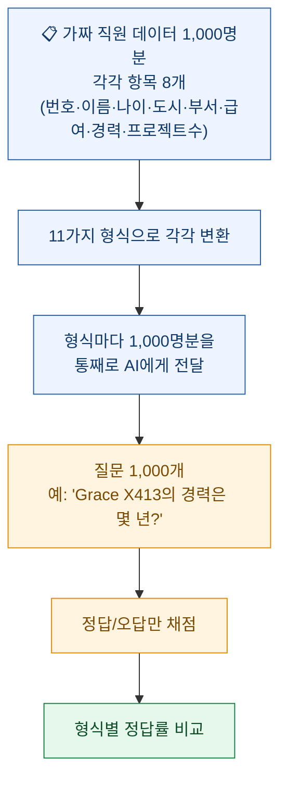
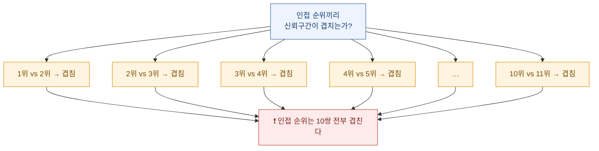
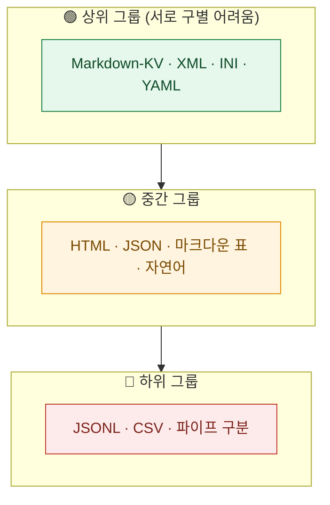
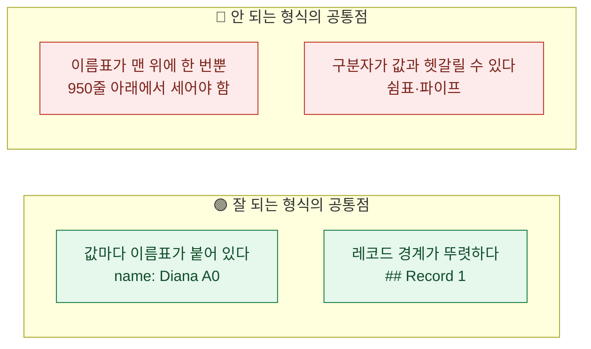

AI에게 표(表)를 건네야 할 일이 자주 있다. 엑셀에서 뽑은 매출 데이터, 데이터베이스에서 긁은 목록, 문서에서 추출한 표 같은 것들이다.

그런데 **똑같은 데이터라도 어떤 모양으로 적어서 주느냐**는 보통 아무도 고민하지 않는다. 그냥 CSV로 붙여넣거나 JSON으로 던진다.

이걸 실제로 실험한 곳이 있다. **11가지 형식**으로 같은 데이터를 주고, 같은 질문 1,000개를 던져서 정답률을 쟀다. 결과가 꽤 극적이다.

- 1위 **60.7%**
- 꼴찌 **41.1%**

**19.6포인트 차이.** 데이터는 똑같은데 적는 방식만 바꿔서 이만큼 벌어졌다.

여기까지가 화제가 된 부분이다. 그런데 원문에는 정확도 옆에 **신뢰구간**이 함께 실려 있었다. 그걸 넣고 다시 계산해봤더니 이야기가 좀 달라졌다.

## 먼저, "형식"이 뭔지부터

프로그래밍을 모르면 CSV니 JSON이니 하는 게 낯설 텐데, 사실 **같은 내용을 적는 서로 다른 방법**일 뿐이다. 주소를 적는 방법이 여러 가지인 것과 비슷하다.

직원 한 명의 정보를 예로 들어보자.

| 항목 | 값 |
|---|---|
| 이름 | Diana A0 |
| 나이 | 46 |
| 도시 | London |
| 부서 | Engineering |

이걸 다섯 가지 방식으로 적어보면 이렇다.

**① CSV — 쉼표로 구분** (엑셀에서 저장하면 이 모양)

```
id,name,age,city,department
1,Diana A0,46,London,Engineering
```

**② JSON — 이름표를 매번 붙인다**

```json
{"id": 1, "name": "Diana A0", "age": 46, "city": "London", "department": "Engineering"}
```

**③ 마크다운 표 — 사람이 보기 좋은 모양**

```
| id | name | age | city | department |
| --- | --- | --- | --- | --- |
| 1 | Diana A0 | 46 | London | Engineering |
```

**④ XML — 태그로 감싼다**

```xml
<employee id="1">
  <name>Diana A0</name>
  <age>46</age>
  <city>London</city>
</employee>
```

**⑤ Markdown-KV — 한 줄에 하나씩, 제목을 붙여서**

```
## Record 1

id: 1
name: Diana A0
age: 46
city: London
department: Engineering
```

다섯 개 다 **똑같은 정보**다. 차이는 오직 모양이다.

## 실험은 어떻게 했나?



질문은 이런 식이다.

> **Q.** "Grace X413의 경력은 몇 년입니까? (숫자만 답하세요.)"
> **A.** "15"

**아주 단순한 질문이다.** 계산도 추론도 필요 없고, 1,000명 중에서 그 사람을 찾아 값 하나만 읽어오면 된다.

그런데 정답률이 41~61%밖에 안 나왔다. **왜 이렇게 낮을까?**

일부러 어렵게 만들었기 때문이다. 원문이 밝힌 조건은 이렇다.

- 모델은 **소형 모델 한 종류**(GPT-4.1-nano)만 썼다
- **1,000건을 한 번에** 다 넣었다(보통은 필요한 것만 골라서 넣는다)
- **헤더(제목 줄)를 중간에 반복하지 않았다**

두 번째가 특히 중요하다. CSV나 마크다운 표는 **맨 위 한 줄에만 항목 이름이 있다.**

```
id,name,age,city,department,salary,years_experience,project_count   ← 여기만 이름이 있음
1,Diana A0,46,London,Engineering,141015,7,17
2,Grace B1,59,Berlin,Engineering,100066,11,32
... (998줄 더)
```

**950번째 줄쯤 가면 "이 여섯 번째 숫자가 뭐였더라"를 950줄 위의 헤더에서 찾아와야 한다.** 사람이라면 스크롤을 올려서 확인하겠지만, 그게 어렵다. 반면 JSON이나 Markdown-KV는 줄마다 이름표가 붙어 있어서 그럴 일이 없다.

원문도 이 점을 한계로 명시했다 — *"헤더를 주기적으로 반복하면(예: 100건마다) 이해에 도움이 될 수 있는데, 단순화를 위해 여기서는 하지 않았다."*

## 결과는 어땠나?

| 순위 | 형식 | 정답률 | 95% 신뢰구간 | 토큰 |
|---|---|---|---|---|
| 1 | **Markdown-KV** | **60.7%** | 57.6 ~ 63.7 | 52,104 |
| 2 | XML | 56.0% | 52.9 ~ 59.0 | 76,114 |
| 3 | INI | 55.7% | 52.6 ~ 58.8 | 48,100 |
| 4 | YAML | 54.7% | 51.6 ~ 57.8 | 55,395 |
| 5 | HTML | 53.6% | 50.5 ~ 56.7 | 75,204 |
| 6 | JSON | 52.3% | 49.2 ~ 55.4 | 66,396 |
| 7 | 마크다운 표 | 51.9% | 48.8 ~ 55.0 | **25,140** |
| 8 | 자연어 문장 | 49.6% | 46.5 ~ 52.7 | 43,411 |
| 9 | JSONL | 45.0% | 41.9 ~ 48.1 | 54,407 |
| 10 | CSV | 44.3% | 41.2 ~ 47.4 | **19,524** |
| 11 | 파이프 구분 | 41.1% | 38.1 ~ 44.2 | 43,098 |

**토큰**은 AI가 글자를 세는 단위다. 대략 "분량"이라고 보면 되고, **요금이 여기에 비례**한다.

여기서 두 가지가 눈에 띈다.

**첫째, 1위와 꼴찌가 19.6포인트 차이다.** 데이터는 똑같은데.

**둘째, 1위가 가장 비싸다.** Markdown-KV는 52,104토큰을 썼는데 CSV는 19,524토큰이다. **2.67배**다.

## 그런데 신뢰구간을 보면?

여기서부터가 내가 다시 계산해본 부분이다.

**신뢰구간**을 쉽게 설명하면 이렇다. 1,000번 시험을 봐서 60.7%가 나왔다고 해서 이 형식의 "진짜 실력"이 정확히 60.7%인 건 아니다. 우연이 섞여 있다. 신뢰구간은 **"진짜 실력이 이 범위 안에 있을 것"** 이라고 말하는 구간이다.

그래서 **두 형식의 구간이 겹치면, 둘 중 어느 쪽이 나은지 이 데이터로는 말할 수 없다.**

인접한 순위끼리 겹치는지 전부 확인해봤다.



**인접 순위 10쌍이 전부 겹친다.** 즉 "2위가 3위보다 낫다" 같은 말은 이 데이터로 할 수 없다.

더 민감한 방법(두 비율의 차이를 직접 검정)으로도 확인해봤다. 이쪽은 신뢰구간 겹침보다 차이를 잘 잡아낸다.

| 비교 | p값 | 판정 |
|---|---|---|
| Markdown-KV vs XML | 0.033 | 경계 |
| Markdown-KV vs INI | 0.023 | 경계 |
| Markdown-KV vs JSON | 0.0002 | 차이 있음 |
| **XML vs INI** | 0.89 | 차이 없음 |
| **XML vs YAML** | 0.56 | 차이 없음 |
| **JSON vs 마크다운 표** | 0.86 | 차이 없음 |

그런데 여기엔 함정이 하나 더 있다. **11개를 서로 비교하면 비교 쌍이 55개**가 된다. 이렇게 많이 비교하면 **순전히 우연으로도 "차이 있음"이 몇 개는 나온다.** 그래서 그만큼 기준을 엄격하게 조정해야 하는데(다중비교 보정), 그러고 나면 상위 7개 안에서 살아남는 비교는 **딱 2개**뿐이다.

**즉 "1위 Markdown-KV가 2위 XML보다 낫다"고 말할 근거는 이 데이터에 없다.**

그리고 가장 깨끗한 결과는 이거다.

> **2위부터 7위까지 여섯 형식은, 15개 비교 쌍 전부에서 서로 구별되지 않는다.**

신뢰구간으로 봐도 그렇고 검정으로 봐도 그렇다. **순위표에 줄만 서 있을 뿐이다.**

그래서 이 실험을 정직하게 읽으면 **11칸짜리 순위표가 아니라 대략 세 덩어리**다.



**이렇게 읽으면 결론이 오히려 실용적으로 바뀐다.** "무조건 Markdown-KV를 써라"가 아니라 **"하위 그룹에서 벗어나라"** 가 된다. 그 이동은 확실히 의미가 있다.

참고로 55개 비교 쌍 전체로 보면 **27쌍은 구별되고 28쌍은 구별되지 않는다.** 절반은 순위가 의미 없다는 뜻이다.

## 그럼 뭘 쓰라는 건가? — 가성비를 계산해봤다

정확도만 보면 안 된다. 토큰이 곧 돈이기 때문이다. **정답률 1퍼센트포인트를 얻는 데 토큰이 얼마나 드는지** 계산했다.

| 형식 | 정답률 | 토큰 | 1%p당 토큰 |
|---|---|---|---|
| **CSV** | 44.3% | 19,524 | **441** |
| **마크다운 표** | 51.9% | 25,140 | **484** |
| Markdown-KV | 60.7% | 52,104 | 858 |
| INI | 55.7% | 48,100 | 864 |
| 자연어 | 49.6% | 43,411 | 875 |
| YAML | 54.7% | 55,395 | 1,013 |
| 파이프 구분 | 41.1% | 43,098 | 1,049 |
| JSONL | 45.0% | 54,407 | 1,209 |
| JSON | 52.3% | 66,396 | 1,270 |
| XML | 56.0% | 76,114 | 1,359 |
| HTML | 53.6% | 75,204 | 1,403 |

여기서 **마크다운 표**가 눈에 띈다. 정답률은 중간 그룹인데 토큰이 CSV 다음으로 적다. **가성비로는 사실상 최상위**다.

반대로 눈에 띄게 나쁜 것도 있다.

**파이프 구분 형식이 최악의 조합이다.** 정답률 꼴찌(41.1%)인데 토큰은 43,098로 CSV의 두 배가 넘는다. **비싸면서 부정확하다.** 원문 표현도 같다 — *"두 축 모두에서 비효율적"*.

**JSONL도 애매하다.** JSON을 한 줄씩 쓴 형식인데, 정답률은 하위 그룹인데 토큰은 54,407로 상위권만큼 든다.

## 형식이 왜 차이를 만드나?

숫자 뒤의 이유를 짚어보면 규칙이 하나 보인다.



**핵심은 "이 값이 무엇인지"를 그 자리에서 알 수 있느냐**다.

`name: Diana A0`라고 적혀 있으면 그 자리에서 끝난다. 그런데 `1,Diana A0,46,London,...`은 **몇 번째 칸인지를 세어야** 하고, 그 답은 950줄 위에 있다.

**그래서 이 실험은 사실 "형식의 우열"보다 "이름표의 유무"를 잰 것에 가깝다.** 그리고 헤더를 100건마다 반복했다면 CSV·마크다운 표의 점수가 올라갔을 것이다. 원문도 그렇게 예상한다고 적었다.

## 이 실험을 인용할 때 조심할 것

원문이 스스로 밝힌 한계가 네 가지다. **다 중요해서 옮긴다.**

| 한계 | 무슨 뜻이냐면 |
|---|---|
| **모델 1종만 테스트** | 소형 모델 한 종류로만 쟀다. 다른 모델은 다른 형식을 선호할 수 있다 — 원문은 "그 모델 학습에 많이 쓰인 형식"일 가능성을 언급한다 |
| **데이터 패턴 1종만** | 직원 명부 하나로만 쟀다. 다른 성격의 데이터는 결과가 다를 수 있다 |
| **헤더 반복 안 함** | CSV·HTML·마크다운 표에 **구조적으로 불리한** 조건이었다 |
| **질문 유형 1종만** | 전부 "특정 레코드의 값 하나 찾기"였다. 합계·비교·추론 같은 질문은 안 쟀다 |

세 번째와 네 번째가 특히 크다.

그리고 **원문이 밝히지 않은 한계**도 하나 있다. **프롬프트 전문, 채점 코드, 원시 데이터가 공개되지 않았다.** 정확도를 어떻게 채점했는지(글자 그대로 일치인지, 다른 방식인지), 몇 번 반복 실행했는지도 없다. **즉 제3자가 재현할 수 없다.** 그리고 이 글은 학술 논문이 아니라 **AI 에이전트 컨설팅 회사의 자체 블로그 실험**이고, 저자 실명도 없다.

## 후속 실험이 결론을 뒤집은 대목

같은 팀이 두 편을 더 냈는데, 여기서 중요한 게 나온다.

**① 중첩된 데이터에서는 순위가 달라진다.** 표가 아니라 **계층 구조 데이터**(설정 파일 같은 것)로 다시 재봤더니, 본편에서 2위였던 **XML이 최하위로 떨어졌다.** 그리고 이번엔 **YAML**이 가장 좋았다.

더 중요한 건, 이 후속 실험은 **모델 3종**으로 돌렸는데 **모델마다 순위가 달랐다**는 점이다.

| 모델 | 1위 | 최하위 |
|---|---|---|
| 소형 모델 A | YAML (62.1%) | XML (44.4%) |
| 소형 모델 B | JSON (52.7%) | 마크다운 (48.0%) — 형식 선호가 거의 없음 |
| 소형 모델 C | YAML (51.9%) | XML (33.8%) |

**본편이 스스로 밝힌 한계 ①("모델 1종만 테스트")이 후속 실험에서 그대로 실증된 셈이다.** 두 번째 모델은 형식에 따른 차이가 거의 없었다.

**② 새 형식 TOON도 재봤다.** 정확도 **47.5%**, 토큰 21,518로 12개 중 9위였다. 원문 결론이 담백하다 — *"TOON과 (더 토큰 효율적인) CSV 사이의 정확도 차이는 **통계적으로 유의하지 않았다**"*, 그리고 *"우리 테스트에서는 TOON이 최고 성능을 낸 상황을 찾지 못했다"*.

**여기서 얻을 교훈은 하나다.** 형식 순위는 **모델이 바뀌면 바뀌고, 데이터 구조가 바뀌면 바뀐다.** 그래서 남의 순위표를 그대로 가져다 쓰는 것보다, 자기 데이터로 두세 개만 비교해보는 게 빠르다. **"CSV가 나쁘다"가 아니라 "헤더 없이 1,000건을 통째로 넣고 값 하나를 찾게 하면 CSV가 불리하다"** 가 정확한 진술이다.

그리고 원문에도 이런 단서가 붙어 있다. *"실무에서는 큰 데이터를 쪼개거나 질의해서 관련 레코드만 추출해 넣는 경우가 많다."* — **애초에 1,000건을 통째로 넣는 상황 자체가 정상이 아니라는 얘기다.**

## 그래서 나는 뭘 하기로 했나

이 실험이 결정적 증거는 아니지만, 방향은 분명하다. 내 작업에 이렇게 반영하기로 했다.

**① 1,000건을 통째로 넣는 상황부터 없앤다.**
정답률 41~61%는 형식 문제이기도 하지만 **입력 설계 문제**다. 필요한 것만 골라 넣으면 형식 차이는 훨씬 줄어든다. 이게 1순위다.

**② 그래도 표를 통째로 넣어야 하면, 마크다운 표를 기본으로 쓴다.**
가성비가 좋고 사람도 읽을 수 있다. **그리고 100줄마다 헤더를 다시 넣는다** — 원문이 안 해서 불리했던 바로 그 조치다.

**③ 정확도가 정말 중요한 소수 작업만 이름표 붙은 형식으로 바꾼다.**
Markdown-KV처럼 값마다 이름을 붙이면 토큰이 2.7배 든다. 전부에 적용할 게 아니라 **틀리면 곤란한 작업에만** 쓴다.

**④ 지금 파이프 구분이나 JSONL을 쓰고 있다면 바꾼다.**
이 둘은 "비싸면서 부정확"한 조합이라 바꿔서 손해 볼 게 없다.

## 마지막으로 남은 생각

이 실험에서 내가 제일 마음에 들었던 건 순위표가 아니라 **원문이 신뢰구간을 함께 실었다는 점**이다.

신뢰구간을 안 실었으면 "1위 Markdown-KV, 2위 XML, 3위 INI…"라는 깔끔한 순위표만 남았을 것이다. 그리고 아무도 **1위와 4위가 구별되지 않는다**는 걸 몰랐을 것이다.

숫자를 공개하는 것과 **그 숫자를 어디까지 믿을 수 있는지 함께 공개하는 것**은 다른 일이다. 뒤쪽이 훨씬 성실하고, 훨씬 드물다.

---

## 참고

- Improving Agents, *"Which Table Format Do LLMs Understand Best? (Results for 11 Formats)"* (2025-09-30 발행). ⚠️ 본편 상단에 "2025년 11월 업데이트"로 표기돼 있으나 링크된 TOON 관련 글 2편의 실제 발행일은 **2025-10-28**이다
- 후속: *"Which Nested Data Format Do LLMs Understand Best?"* (2025-10-14, 모델 3종) / TOON 벤치마크 (2025-10-28)
- ⚠️ 학술 논문이 아니라 **AI 에이전트 컨설팅 회사의 자체 블로그 실험**이며, 저자 실명·프롬프트·채점 코드·원시 데이터가 공개되지 않아 **제3자 재현 불가**
- 실험 조건: 합성 직원 레코드 1,000건(속성 8개) · 질문 1,000개 · 형식 11종 · 소형 모델 1종
- 본문의 신뢰구간 겹침 판정, 1%p당 토큰 계산, 그룹 구분은 **원문이 공개한 정확도·신뢰구간·토큰 수를 그대로 써서 직접 계산**한 것이다
- 원문에 없는 수치는 어떤 형태로도 추정하지 않았다

*⚠️ 이 결과는 특정 모델·특정 데이터·특정 질문 유형에서 얻은 것이다. 형식을 바꾸기 전에 **본인 데이터로 직접 비교해보는 것**이 원문의 권고이기도 하다.*
