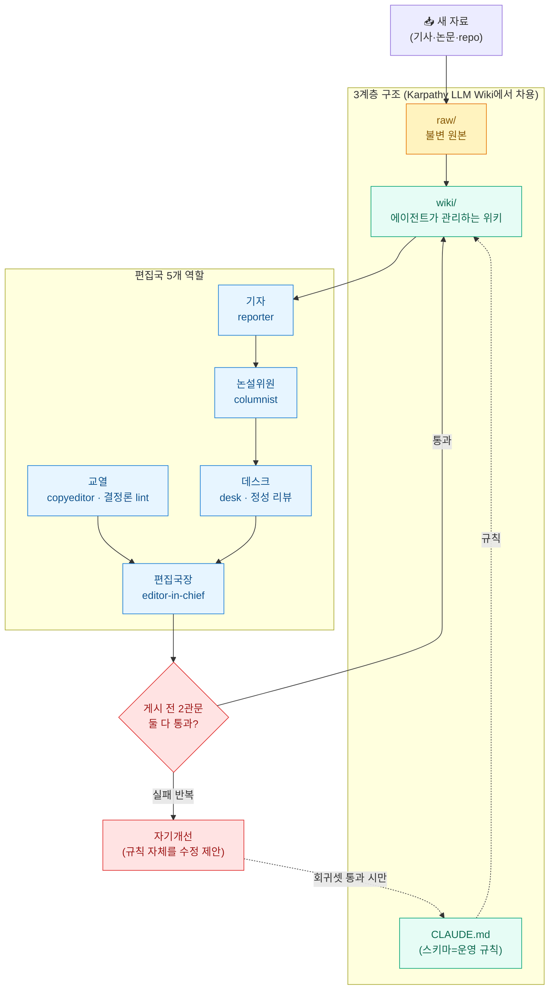
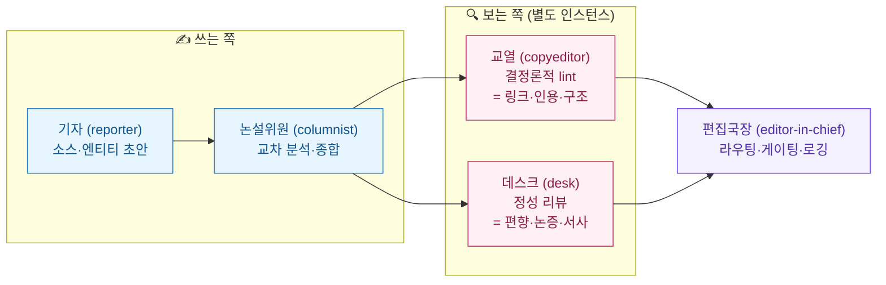
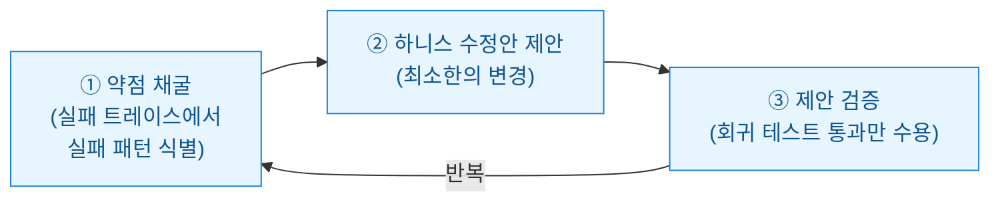
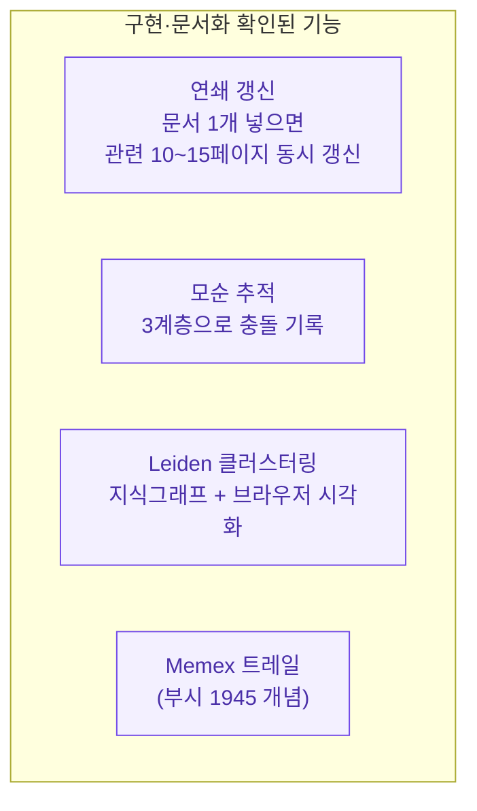
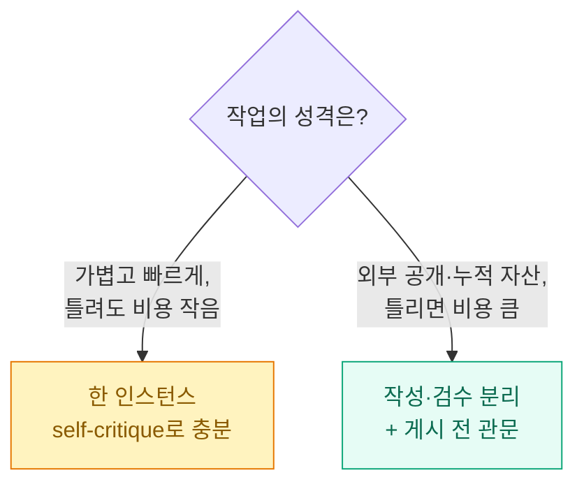

며칠 전 한 포럼에서 흥미로운 글을 봤다. `alfadur7`이라는 분이 만든 **LLM Wiki Newsroom**이라는 프로젝트인데, 한 줄로 줄이면 이렇다.

**"LLM이 관리하는 지식 위키를, 만능 비서 하나가 아니라 신문사 편집국처럼 여러 역할로 쪼개서 굴린다."**

나는 평소에 [[ai-news-digest-multi-agent-factcheck|AI 뉴스를 여러 에이전트로 나눠 팩트체크하는 워크플로]]를 직접 굴리고 있어서, "작성하는 AI와 검수하는 AI를 아예 다른 인스턴스로 분리했다"는 대목에서 손이 멈췄다. 내가 막연히 좋다고 느끼던 걸 누군가 구조로 정리해 둔 느낌이었기 때문이다.

그래서 이 글은 두 가지를 한다. 하나는 이 프로젝트가 **무슨 구조로 굴러가는지** 도식으로 정리하는 것, 다른 하나는 글에 적힌 주장들을 **실제 저장소·논문 원문과 대조해 팩트체크**하는 것이다. (블로그에 옮기기 전에 과장이 없는지 보는 건 내 습관이다. 결과부터 말하면, 이 프로젝트는 비교적 정직한 편이었다.)

> 먼저 분명히 해둘 것. 이 프로젝트는 내가 만든 게 아니라 `alfadur7`의 것이고, 라이선스는 MIT다. 나는 사용자 입장에서 구조를 뜯어보고 소개할 뿐이다.

## 한눈에 보는 전체 구조

이 그림 하나가 사실상 전부다. 아래에서 한 덩어리씩 풀어본다.

## 그래서 'LLM Wiki'가 뭐였더라?

이 프로젝트는 무에서 나온 게 아니라, **Andrej Karpathy의 'LLM Wiki'** 라는 아이디어에서 출발한다. 이건 내가 [[karpathy-llm-knowledge-bases|예전에 원문을 정리해 둔 적]]이 있어서 다시 확인해 봤는데, 핵심만 추리면 이렇다.

- 우리는 보통 **RAG**(Retrieval-Augmented Generation), 즉 *질문이 들어올 때마다 원문 더미에서 관련 조각을 검색해 붙이는 방식*을 쓴다. 그런데 이 방식은 질문할 때마다 매번 지식을 "처음부터 다시 발견"하느라 누적이 안 된다.
- LLM Wiki는 반대다. **LLM이 새 자료를 읽을 때마다 마크다운 위키를 점진적으로 갱신**하게 한다. 한 번 정리한 지식이 파일로 남고, 계속 최신화된다. Karpathy의 표현으로는 위키가 **"복리처럼 쌓이는 산출물(compounding artifact)"** 이 된다.

여기서 나오는 구조가 **raw → wiki → schema 3계층**과 **ingest(수집)·query(질의)·lint(점검)** 세 가지 연산이다. 이 개념들은 전부 Karpathy 원문 gist에 문자 그대로 등장한다(내가 raw 본문을 직접 받아 확인했다). LLM Wiki Newsroom은 이 골격을 **그대로 차용**한 뒤, 그 위에 "편집국"을 얹은 것이다.

| 계층 | 역할 | 누가 건드리나 |
|---|---|---|
| `raw/` | 원본 자료(기사·논문·데이터) | LLM은 **읽기만** |
| `wiki/` | 요약·엔티티·개념·종합 페이지 | LLM이 생성·유지 |
| `CLAUDE.md` (스키마) | 위키 구조·규칙·워크플로 지시 | 사람이 설정, LLM이 따름 |

> 한 가지 짚고 넘어가면, 저장소는 "**RAG의 구조적 대안**"이라고 스스로를 소개한다. 그런데 이건 프로젝트의 자기 포지셔닝에 가깝다. Karpathy 원문도 RAG를 "완전히 대체한다"기보다 보완적인 컴파일 계층으로 제안하는 톤이고, 실제로 이 프로젝트가 쓰는 검색 도구(QMD)도 내부적으로는 BM25+벡터 하이브리드 검색을 쓴다. 그러니 "RAG를 없앴다"가 아니라 "지식을 매번 재검색하지 말고 한 번 컴파일해 누적하자"는 쪽으로 이해하는 게 정확하다.

## 그래서 'Newsroom(편집국)'은 뭘 더 했나?

Karpathy의 원형이 "LLM 한 명이 위키를 관리한다"였다면, 이 프로젝트의 차별점은 그 한 명을 **5개 역할로 쪼갠 것**이다. 저장소의 `.claude/agents/` 폴더에 실제로 다섯 개의 에이전트 정의 파일이 들어 있다(확인했다).

| 역할 | 하는 일 | 비유 |
|---|---|---|
| 기자(reporter) | 새 소스를 읽고 엔티티·페이지 초안을 잡음 | 현장 취재 |
| 논설위원(columnist) | 페이지들을 교차 분석해 종합 글을 씀 | 사설·해설 |
| 교열(copyeditor) | **결정론적 lint** — 링크·인용·구조를 기계적으로 점검 | 오탈자·형식 검수 |
| 데스크(desk) | **정성 리뷰** — 편향·논증·서사를 사람처럼 다시 읽음 | 데스크의 빨간펜 |
| 편집국장(editor-in-chief) | 누구에게 일을 줄지 라우팅하고, 게시 여부를 결정하고, 로그를 남김 | 편집 총괄 |

여기서 **결정론적(deterministic)** 이라는 말이 한 번 나오는데, 이건 *"같은 입력이면 항상 같은 결과가 나오는, AI 판단이 아니라 코드(파이썬)로 돌아가는"* 점검을 뜻한다. 교열의 lint는 LLM이 아니라 `tools/lint.py`라는 파이썬 스크립트다. 링크가 깨졌는지, 인용이 붙어 있는지 같은 건 굳이 LLM에게 물어볼 필요 없이 코드로 확정할 수 있으니까.

## 왜 쓰는 Claude와 검수하는 Claude를 굳이 나눴을까?

이 프로젝트에서 내가 제일 공감한 설계가 이거다. 저장소 README에 이렇게 적혀 있다.

> 본문을 쓰는 Claude 인스턴스와, 그걸 처음 보듯 다시 읽고 검수하는 Claude 인스턴스를 **아예 다른 인스턴스로 분리**한다.

왜 그럴까. 한 모델이 자기가 쓴 글을 자기가 채점하면, 사람으로 치면 "내가 쓴 거니까 대충 통과"가 되기 쉽다. 자기편향이다. 작성자와 검수자를 분리하면 검수자는 백지에서 시작하니까 더 깐깐해진다.

게다가 게시 전에 **두 개의 관문**을 둔다. 둘 다 통과해야 위키에 올라간다.

| 관문 | 누가 | 무엇을 본다 | 성격 |
|---|---|---|---|
| 1관문 | 교열(copyeditor) | 링크·인용·구조 | **결정론적**(파이썬 lint) |
| 2관문 | 데스크(desk) | 편향·논증·서사 흐름 | **정성적**(LLM 리뷰) |

기계로 잡을 수 있는 건 기계가(1관문), 사람 같은 판단이 필요한 건 별도 인스턴스가(2관문) 본다. 역할이 깔끔하게 갈린다.

> ⚠️ 다만 정직하게 적어둘 게 하나 있다. 저장소는 "분리했더니 통과 남발이 줄었다"고 말하지만, 이건 **측정된 수치가 아니라 설계상의 근거**다. A/B로 검증한 데이터가 올라와 있는 건 아니다. 그러니 "분리하면 무조건 좋아진다"가 아니라 "이렇게 설계하면 자기편향을 줄일 여지가 있다" 정도로 받아들이는 게 맞다. 원작자도 일부는 "실험 중"이라고 솔직하게 밝혀 두었다.

## 규칙이 스스로 고쳐진다고?

가장 실험적이면서 흥미로운 부분이다. 같은 종류의 리뷰 실패가 반복되면, 개별 케이스만 고치는 게 아니라 **글쓰기 규칙(가이드라인) 자체를 고치자**는 제안을 만든다. 그런데 아무 제안이나 반영하면 위험하니까, **블라인드 A/B + 회귀셋**을 통과할 때만 반영한다.

- **블라인드 A/B** — 채점자가 어느 쪽이 새 규칙인지 모른 채 두 결과를 비교한다(편향 방지).
- **회귀셋(regression set)** — 미리 고정해 둔 검증 문제 묶음. 새 규칙이 기존에 잘 되던 걸 망가뜨리지 않는지 확인한다.

저장소에는 `proposal-validation-runbook.md`라는 문서에 Control/Treatment, 블라인드, canary 같은 검증 절차가 실제로 들어 있다. 이 아이디어의 출처로 두 가지를 인용하는데, 내가 둘 다 실존하는지 직접 확인했다.

| 출처 | 정체 | 확인 결과 |
|---|---|---|
| **Self-Harness** (arXiv:2606.09498) | "스스로 개선하는 하니스" 논문 | ✅ 실존. 2026-06-08 제출(cs.CL), 저자 8명 |
| **Microsoft SkillOpt** (github.com/microsoft/SkillOpt) | frozen LLM용 스킬을 학습시키는 최적화기 | ✅ 실존. MIT, 9천 개 이상 stars |

여기서 **하니스(harness)** 라는 말이 낯설 수 있는데, *모델 자체가 아니라 모델을 둘러싸고 도구·프롬프트·워크플로를 엮어 굴리는 "운영 골격"* 을 뜻한다. (내가 [[harness-engineering-claude-code-design-guide|하니스 엔지니어링]]을 따로 정리해 둔 적이 있다.)

Self-Harness 논문의 핵심은 이 골격을 **사람이 일일이 손보지 않고 에이전트가 스스로 개선**하게 하는 것이다. 논문이 제시한 3단계 루프가 이 프로젝트의 자기개선과 거의 같은 결이다.

SkillOpt도 결이 비슷하다. **모델 가중치는 안 건드리고**, 스킬을 적은 마크다운 문서(`best_skill.md`)를 마치 학습 파라미터처럼 다뤄서, 점수화된 실행 궤적을 보고 문서를 조금씩 add/delete/replace 편집한다. 그리고 검증 점수가 좋아질 때만(validation-gated) 반영한다. 이것도 [[ai-news-digest-multi-agent-factcheck|내가 쓰는 워크플로]]에서 "프롬프트/규칙을 손으로 계속 다듬는" 그 작업을 자동화하려는 시도로 읽힌다.

> ⚠️ 단, 두 논문/저장소가 내세우는 성능 향상 수치(예: SkillOpt가 어떤 모델에서 수십 점 올랐다, Self-Harness가 통과율을 약 20%p 올렸다 등)는 **각자의 자기보고**다. 내가 독립적으로 재현·교차검증한 게 아니고, 두 arXiv 논문 모두 2026년 6월의 아주 최신 제출본이라 아직 "정설"이라고 부를 단계는 아니다. 아이디어가 흥미롭다는 것과, 효과가 입증됐다는 건 다른 얘기다.

## 그 밖에 눈에 띈 것들

나머지 기능들도 실제 저장소 코드에서 확인되는 것들이라 짧게 묶는다.

- **연쇄 갱신(cascading update)** — 자료 하나를 넣으면 그것과 엮인 페이지 10~15개가 같이 갱신된다. Karpathy 원문에도 "한 소스가 10~15페이지를 건드린다"는 표현이 있고, 이걸 구현한 것이다.
- **모순 추적** — 자료끼리 주장이 충돌하면 그걸 따로 기록해 둔다(파일 3계층 구조).
- **Leiden 클러스터링** — 위키 페이지들의 연결을 그래프로 만들고, 비슷한 것끼리 군집(community)으로 묶어 Sigma.js 기반 `graph.html`로 브라우징한다. ([[graphify-llm-wiki-ast-preprocessing|지식그래프 전처리]]를 정리할 때 봤던 결과 같은 거다.)
- **Memex 트레일** — 1945년 바네바 부시의 'Memex'에서 따온, 페이지 사이를 잇는 탐색 경로 개념.

그리고 한국 사용자라면 솔깃할 **WIKI_LANG=ko** 모드도 있다. 다만 이건 확인해 보니 보정이 필요하다.

## 직접 써보기 전에 알아둘 것 (정직한 한도 표시)

여기가 이 글에서 제일 중요한 부분이다. "좋아 보인다"와 "검증됐다"는 다르니까, 1차 출처로 확인한 한도를 분명히 적어둔다.

| 들리는 말 | 실제 확인 결과 |
|---|---|
| "한국어로 굴릴 수 있다 (WIKI_LANG=ko)" | ⚠️ **옵트인 모드**. 기본은 영어이고, 동봉된 예시도 전부 영어다. 프론트매터·섹션 헤더의 **'키'는 도구가 grep으로 읽는 데이터 포맷이라 항상 영어로 유지**되고, 본문·일부 값만 한국어가 된다. "본문+프론트매터 전부 한국어"는 과장. |
| "API 키가 필요 없다" | ⚠️ **결정론적 파이썬 도구(빌드·lint·검색)에 한한 말**. 위키를 실제로 집필·유지하는 에이전트 계층은 Claude Code(=LLM)에 의존한다. "전 과정 무(無)API키"는 아니다. |
| "검증된 프로젝트" | ⚠️ 저장소는 **2026-06-26 생성, 별 6개·포크 2의 신생·소규모**(템플릿 저장소)다. 아이디어 정리는 훌륭하지만 실전에서 검증된 대형 프로젝트는 아니다. |
| "MIT로 새로 공개됐다" | ⚠️ 라이선스 종류가 MIT인 건 맞지만, LICENSE 저작권 줄은 원본 프로젝트(`SamurAIGPT/llm-wiki-agent`)에서 상속된 `Copyright (c) 2023 SamurAIGPT`다. |
| "~2,300노드 한국어 위키 스크린샷" | ⚠️ 저장소에 없는 **별도 비공개 인스턴스** 기준이라 외부 검증 불가. 저장소에 실제로 동봉된 예시는 '오픈소스 AI 정의 논쟁'을 다룬 **15노드(엣지 80)** 코퍼스다. |

오해는 말자. 이건 이 프로젝트를 깎으려는 게 아니다. 원작자는 비공개 인스턴스라는 점, "실험 중"이라는 점을 글에서 비교적 솔직하게 밝혔다. 다만 내가 블로그에 옮길 때는 "무엇이 만들어졌는가(=신뢰 가능)"와 "얼마나 효과적이고 규모가 큰가(=자기보고·검증 불가)"를 갈라서 적는 게 맞다고 봤다.

## 그래서 내 결론은

`alfadur7`이 던진 질문은 사실 이거였다. **"작성과 검수를 굳이 다른 인스턴스로 나눌 가치가 있나, 아니면 한 에이전트한테 self-critique 시키면 충분한가?"**

내 경험상의 답은 "나눌 가치가 있다, 단 비용이 받쳐줄 때"다.

나는 [[ai-news-digest-multi-agent-factcheck|뉴스 다이제스트]]나 이 블로그 글을 정리할 때, 수집하는 에이전트와 적대적으로 팩트체크하는 에이전트를 따로 돌린다. 한 번에 끝내는 것보다 토큰은 더 들지만, "그럴듯한데 틀린" 내용이 공개물로 새어 나가는 걸 막는 데는 그만한 값을 한다. 이 프로젝트가 "신문사 편집국"이라는 비유로 정리한 것도 결국 같은 직관이다. 쓰는 사람과 보는 사람은 달라야 한다.

LLM으로 지식을 관리하는 흐름 자체에 관심이 있다면, [[karpathy-llm-knowledge-bases|Karpathy 원문]]과 [[plaintext-md-llm-knowledge-vault|평문 마크다운 지식 볼트]] 정리도 같이 보면 그림이 맞춰질 거다.

## 참고자료

- [LLM Wiki Newsroom (alfadur7, MIT)](https://github.com/alfadur7/llm-wiki-newsroom) — 이 글의 주인공 저장소
- [Andrej Karpathy, "LLM Wiki" gist](https://gist.github.com/karpathy/442a6bf555914893e9891c11519de94f) — 3계층·ingest/query/lint의 원형 개념
- [Self-Harness: Harnesses That Improve Themselves (arXiv:2606.09498)](https://arxiv.org/abs/2606.09498) — 하니스 자기개선 3단계 루프
- [Microsoft SkillOpt (github.com/microsoft/SkillOpt)](https://github.com/microsoft/SkillOpt) — frozen LLM용 스킬을 학습시키는 text-space optimizer
- [원본 프로젝트 SamurAIGPT/llm-wiki-agent](https://github.com/SamurAIGPT/llm-wiki-agent) — MIT 저작권 표기가 상속된 원본
- [QMD (github.com/tobi/qmd)](https://github.com/tobi/qmd) — 온디바이스 검색 도구

<!-- 안전: 회사 실데이터·고객/제3자 PII·API키/쿠키/토큰 없음. 외부 OSS 프로젝트 소개·팩트체크 글(합성·일반화). -->
