요즘 자동화를 만들 때마다 같은 걸 느낀다. **"좋은 모델"만으로는 일이 안 굴러간다.** 모델은 똑똑한데, 그걸 *반복적으로·믿을 수 있게* 일 시키는 건 결국 그 주변에 짜놓은 **구조**의 문제였다.

마침 LangChain의 [The Art of Loop Engineering](https://www.langchain.com/blog/the-art-of-loop-engineering)(Sydney Runkle, 2026-06-16)을 읽었는데, 이 막연한 감각을 **"루프를 4겹으로 쌓는다"** 는 깔끔한 그림으로 정리해줬다. 그래서 이 글은 원문을 번역한 게 아니라, **그 4단계 개념을 내 식으로 다시 도식화하고, 내가 하는 크롤링·공시 수집·다이제스트 자동화에 대입해 본 기록**이다. (원본 글·원본 도식은 위 링크에 있다.)

> **하네스(harness)**란? 모델을 감싸는 **작업용 골격**이다. 모델이 엔진이라면, 하네스는 그 엔진에 연료를 넣고·바퀴를 달고·브레이크를 거는 **차체**에 가깝다. 같은 모델이라도 하네스를 어떻게 짜느냐에 따라 결과의 신뢰도가 완전히 달라진다.

## 전체 그림 — 에이전트는 '루프 위에 루프'다

핵심 발상은 하나다. 에이전트는 단일 루프가 아니라 **안쪽 루프를 바깥 루프가 감싸는 양파 구조**라는 것. (swyx는 이걸 *"loopcraft — 루프를 쌓는 기술"* 이라 불렀다고 원문은 인용한다.)

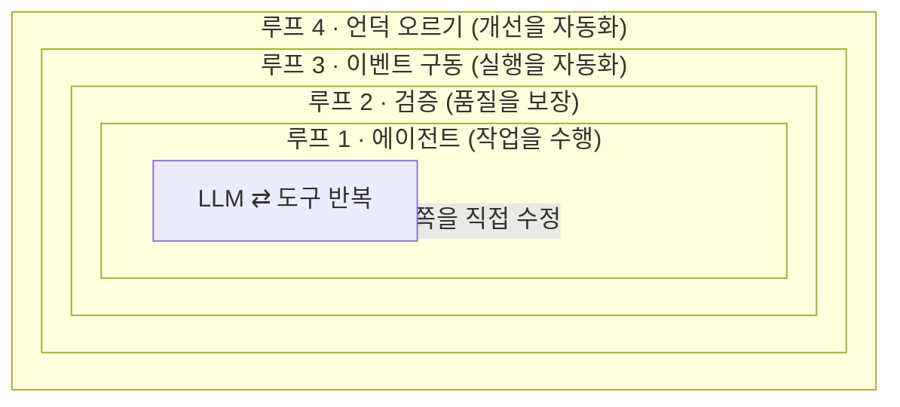

- **루프 1**: 모델이 도구를 반복 호출해 일을 *한다*.
- **루프 2**: 그 결과가 맞는지 *채점*하고, 틀리면 피드백을 줘 다시 시킨다.
- **루프 3**: 사람이 안 불러도 *이벤트가 알아서* 에이전트를 깨운다.
- **루프 4**: 실행 기록을 분석해 *하네스 자체를 더 좋게* 고친다.

아래는 한 겹씩 풀어본 것이다. 각 루프마다 **① 일반 형태 → ② LangChain의 '문서 작성 에이전트' 예시** 순서로 도식을 두 개씩 놓았다.

## 루프 1 — '에이전트 루프'란 뭔가?

가장 밑바닥 루프다. 정의는 한 줄이면 끝난다 — **모델에게 맥락을 주고, 작업이 끝날 때까지 도구를 반복 호출하게 두는 것.** 도구(tool)는 에이전트가 현실에 손을 뻗는 통로다(파일 읽기, API 호출, 셸 실행 등).

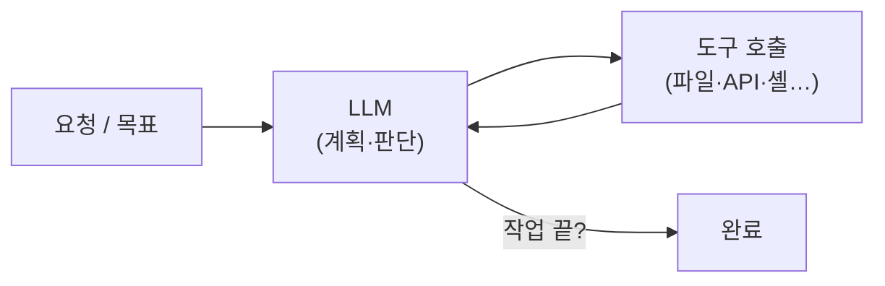

LangChain에선 `create_agent`로 이 루프를 바로 얻는다. 모델 고르고 도구 꽂으면 끝. 원문의 예시인 **'사내 문서 작성 에이전트'** 로 보면 이렇게 돈다.

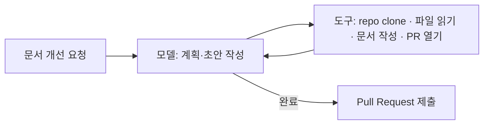

개념 코드로는 이 정도다. (실제 API 이름은 LangChain 문서 기준으로 확인하는 게 안전하다.)

```python
# 개념 예시 — 루프 1: 모델 + 도구 = 에이전트 루프
from langchain.agents import create_agent

agent = create_agent(
    model=my_model,
    tools=[clone_repo, read_file, write_doc, open_pr],
)
# 이제 agent는 "끝날 때까지 도구를 반복 호출"한다.
```

내 일로 치면 이건 **크롤러 한 대, 공시 수집 스크립트 한 본**이다. 시키면 한다. 문제는 그다음이다 — *제대로* 했는지는 아무도 안 본다.

## 루프 2 — 결과를 어떻게 믿을 수 있나?

루프 1은 일을 *하지만*, 한 번에 *맞게* 한다는 보장이 없다. 그래서 일관성이 중요할 땐 **채점기(grader)** 로 한 겹 감싼다. 산출물을 기준표(루브릭)에 대보고, 미달이면 **피드백과 함께 되돌려** 다시 시킨다.

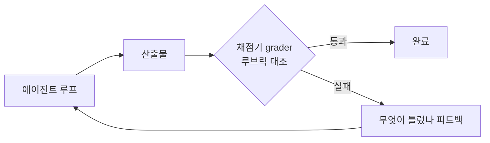

> **루브릭(rubric)**은 채점 기준표다. **LLM-as-judge**는 그 채점을 사람이 아니라 *또 다른 LLM*에게 맡기는 방식(예: "이 PR이 요청 범위만 건드렸는지 판단해줘"). 채점기는 이렇게 LLM일 수도, 그냥 규칙(테스트 통과 여부)일 수도 있다.

문서 에이전트 예시에선, 매 시도마다 채점기가 **테스트를 돌려** ①링크가 다 해석되는지 ②CI가 통과하는지 ③diff가 요청한 범위만 건드렸는지 확인한다. 이 부류의 오류는 **사람 리뷰 없이** 걸러진다.

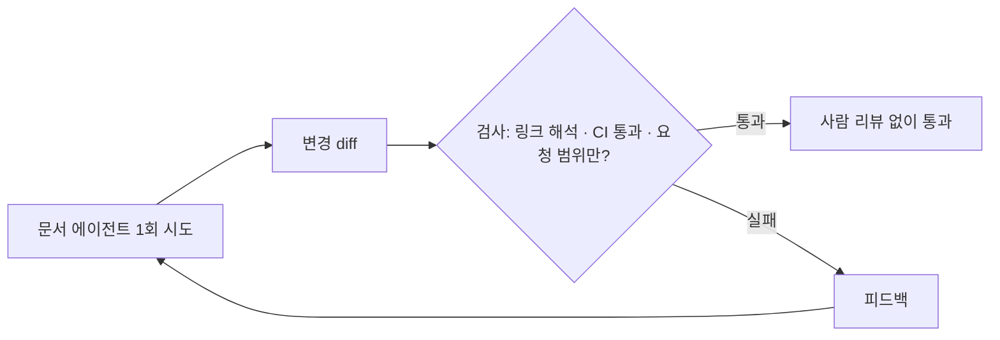

대가가 없진 않다. **검증을 넣으면 실행당 시간·비용이 늘어난다.** 속도보다 품질이 중요할 때(=대부분의 실서비스) 치를 가치가 있는 비용이다.

이건 내가 이미 하던 패턴이라 반가웠다. 공시·재무 데이터를 수집할 때 나는 **차변=대변, 소계=합계 같은 산술 검증**을 붙여 파싱 오류를 자동으로 잡는다. 그게 바로 "결정적(규칙 기반) 채점기"다. [내 AI 뉴스 다이제스트의 다중 에이전트 팩트체크]([[ai-news-digest-multi-agent-factcheck]])도 같은 구조 — 수집(루프1) 위에 검증(루프2)을 얹은 것이다.

## 루프 3 — 사람이 안 불러도 알아서 돌게 하려면?

여기서부터가 진짜 가치라고 원문은 말한다. 에이전트를 **내 생태계에 연결해 백그라운드에서 돌게** 하는 단계다. 내가 매번 손으로 실행하는 게 아니라, **이벤트가 에이전트를 깨운다.**

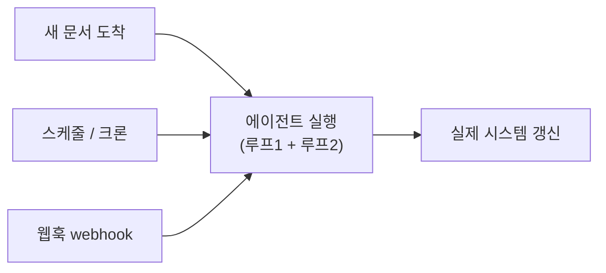

> **크론(cron)**은 "매일 아침 8시"처럼 **정해진 시간에 자동 실행**하는 스케줄러다. **웹훅(webhook)**은 반대로, 어떤 사건이 터지면 *상대가 내 주소로 신호를 쏴주는* 방식이다(예: 새 글이 올라오면 알림). 둘 다 "사람의 클릭" 없이 루프를 시작시키는 방아쇠다.

원문의 문서 에이전트는 **Fleet 채널**로, 슬랙 `#docs-plz` 채널에 메시지가 올라오면 자동으로 깨어난다. (openclaw의 *"heartbeats"* 처럼, 에이전트를 *상시 대기형 비서*로 만드는 사례도 든다.)

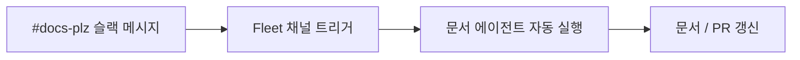

내 자동화에 바로 꽂히는 지점이다. 지금은 내가 `node digest.js`를 **직접** 쳐서 다이제스트를 돌리는데, 이걸 **크론(매일 아침)** 이나 **웹훅(새 공시가 뜨면)** 으로 바꾸면 루프 3이 된다. 글을 발행하면 자동으로 IndexNow 핑을 쏘는 것도 작은 이벤트 루프다.

## 루프 4 — 에이전트가 스스로 나아지게 하려면?

앞의 셋이 *일*을 자동화했다면, 넷째는 **개선**을 자동화한다. 원문이 "가장 중요하다"고 꼽는 루프다.

모든 실행은 **트레이스(trace)** 를 남긴다. 이 기록을 **분석 에이전트**가 훑어, 무엇이 잘 되고 안 되는지 찾아내 **하네스 설정(프롬프트·도구·채점 기준)을 다시 쓴다.**

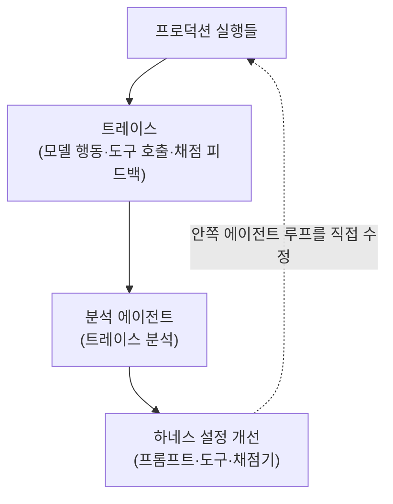

> **트레이스(trace)**는 에이전트가 한 일의 **블랙박스 비행기록**이다 — 어떤 도구를 어떤 순서로 불렀고, 채점기가 뭐라 했고, 어디서 막혔는지가 다 찍힌다. 개선의 *원재료*가 바로 이 기록이다.

핵심은 화살표 방향이다. 이 바깥 루프는 그냥 맨 위로 돌아오는 게 아니라, **안쪽 에이전트 루프에 손을 뻗어 직접 고친다.** 바깥 루프가 한 바퀴 돌 때마다 안쪽 루프들이 더 똑똑해진다. 문서 에이전트 예시에선 **Engine**(트레이스 분석 에이전트)을 돌려, **여러 트레이스가 같은 문제를 신호하면 이슈를 자동 생성**해 해당 프롬프트·도구 수정을 요청한다.

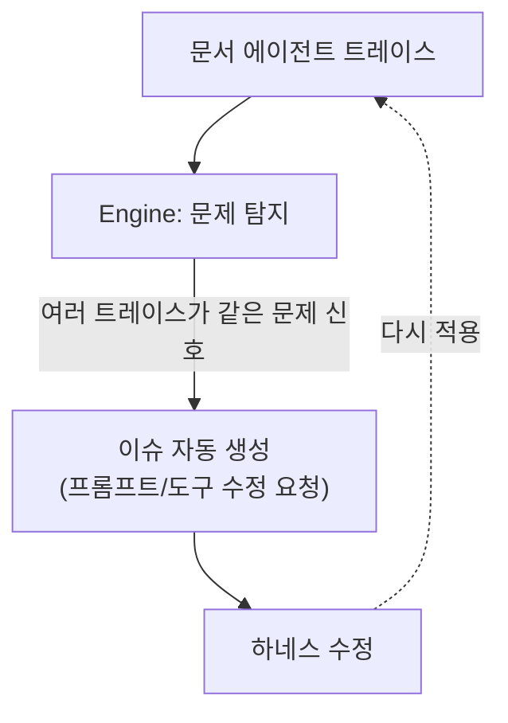

프롬프트·도구 수정이 가장 쉬운 시작점이지만 끝은 아니다. 오픈웨이트 모델을 쓰면 이 루프가 **RL 파인튜닝**의 학습 신호로도 이어지고, **메모리·스킬** 같은 보조 컨텍스트도 같은 식으로 개선할 수 있다. *"루프가 패턴이고, 무엇을 최적화할지는 내 선택"* 이라는 말이 인상 깊었다.

## 그럼 사람은 어디에 있나?

자동화한다고 사람을 빼는 게 아니다. 원문이 분명히 선을 긋는다 — **링크가 해석되는지는 채점기가 보지만, "독자에게 이 톤이 맞나"는 사람이 본다.** 맥락·경험·취향에서 나오는 그 판단이 사람 리뷰가 값을 하는 자리다. 그래서 각 루프마다 사람이 끼는 자연스러운 지점이 있다.

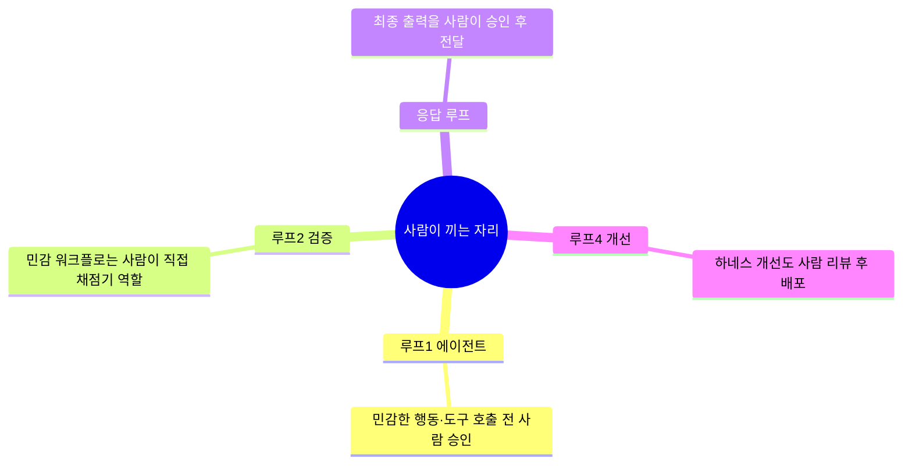

특히 **금융 거래·DB 변경 같은 민감 작업은 실시간 사람 검토가 필수**라고 강조한다. 나도 공시·재무 데이터를 다루다 보니 이 부분은 100% 공감이다 — 숫자를 자동으로 *읽는* 건 맡겨도, 그걸 근거로 *판단*하는 건 사람 몫이다.

## 4단계를 한 표로 — '루프 엔지니어링'의 뼈대

원문이 정리한 표를 내 말로 옮기면 이렇다.

| 루프 | 하는 일 | 효과 | (LangChain 기준) 도구 |
|---|---|---|---|
| **1. 에이전트 루프** | 모델이 작업 끝까지 도구를 반복 호출 | 작업 자동화 | `create_agent` |
| **2. 검증 루프** | 산출물을 루브릭으로 채점, 실패 시 피드백 후 재시도 | 품질·정확성 보장 | RubricMiddleware |
| **3. 이벤트 구동 루프** | 이벤트가 실행을 트리거해 실제 시스템을 갱신 | 대규모 자동 실행 | 크론/웹훅, Fleet 채널 |
| **4. 언덕 오르기 루프** | 트레이스를 분석 에이전트가 훑어 하네스를 개선 | 하네스 자체 개선 | LangSmith Engine |

원문은 *"우리는 루프 1·2는 오래 고민해왔지만, 이제 가치가 복리로 쌓이는 **루프 3·4로 무게중심을 옮겨야 한다**"* 고 말한다. (Steipete·Boris·Andrej 같은 이들도 결국 "에이전트의 잠재력은 그 주변에 짜는 루프에 있다"는 같은 결론에 도달했다고 인용한다.)

## 이걸 내 자동화에 어떻게 대입할까?

읽고 나서 내 자동화를 이 4겹으로 다시 봤다. 지금 내 위치와 다음 한 칸이 선명해졌다.

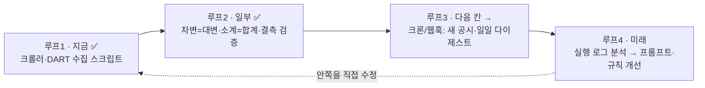

- **루프 1·2는 이미 하고 있다.** 수집 스크립트 + 산술/결측 검증.
- **다음 한 칸은 루프 3.** 손으로 돌리던 다이제스트를 크론으로, 발행 후 핑을 웹훅으로. "내가 실행"에서 "이벤트가 실행"으로.
- **루프 4는 그다음.** 실행 로그를 모아 "어디서 자주 틀리나"를 분석해 프롬프트·검증 규칙을 고치는 단계. 가장 멀지만, 복리가 가장 크게 붙는 곳.

## 배운 점

가장 크게 남은 건 **관점의 전환**이다. 그동안 나는 자동화를 "스크립트(루프 1)"로만 생각했다. 그런데 진짜 신뢰성과 복리는 **그 바깥에 검증·이벤트·개선 루프를 한 겹씩 더 두를 때** 생긴다.

그리고 이 글을 쓰며 한 번 더 확인한 습관 — **개념을 글이 아니라 "루프 도식"으로 그려놓으면, 내 시스템에서 빠진 루프가 한눈에 보인다.** 나는 지금 2.5겹쯤에 있고, 다음 목표는 3겹이다.

> 같이 보면 좋은 글: [[loop-vs-harness-vs-ralph-when-to-use|루프 엔지니어링, 못 따라가도 괜찮다 — 언제 써야 하나(현실 점검편)]] · [[ai-news-digest-multi-agent-factcheck|AI 뉴스 다이제스트에 다중 에이전트 팩트체크를 붙인 기록]](=루프1+2 실전) · [[plaintext-md-llm-knowledge-vault|벡터DB 없이 만든 평문 MD 지식볼트]] · [[build-tech-blog-with-quartz-github-pages|Quartz로 블로그를 0원에 만든 기록]]

---

*이 글은 LangChain의 [The Art of Loop Engineering](https://www.langchain.com/blog/the-art-of-loop-engineering)(Sydney Runkle)을 읽고 그 4단계 루프 개념을 **내 식으로 다시 도식화하고 내 자동화에 대입해** 정리한 것입니다. 모든 mermaid 도식은 원본 이미지를 그대로 옮긴 게 아니라 개념을 직접 다시 그린 것이고, 제품·기능명(create_agent·LangSmith·Fleet 등)은 LangChain 문서 기준입니다. 더 정확한 내용은 원문을 참고하세요.*
