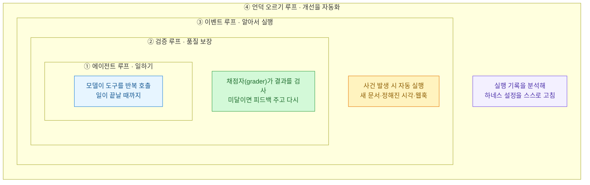
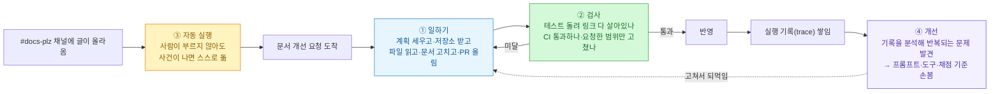
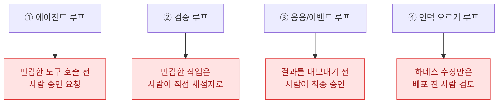

지난달에 [에이전트의 4겹 루프](https://dbhyeong.github.io/blog/loop-engineering-four-loops-loopcraft)를 한 번 정리했다. 그때는 "에이전트는 결국 루프다"라는 **개념**을 도식으로 그리는 데 집중했다. 그런데 그 글을 올리고 나서도 뭔가 손에 안 잡히는 느낌이 남았다. **"그래서 이걸 실제로는 뭘로 만들지?"** 그리고 **"자동화가 커지면 사람은 다 빠지는 건가?"** 이 두 개가.

그래서 같은 [LangChain 글](https://www.langchain.com/blog/the-art-of-loop-engineering)(Sydney Runkle, 2026-06-16)을 이번엔 다른 눈으로 다시 읽었다. 개념 말고 **부품**과 **사람 자리**만 보면서. 이 글은 그 두 번째 독해 기록이다.

## 루프가 4겹이라는 게 무슨 소리였나?

짧게만 복습하자. **하네스(harness)**라는 말이 자꾸 나오는데, 어렵게 생각할 것 없다. 모델(똑똑한 두뇌) 하나만 있어선 일이 안 굴러가고, 그 두뇌 **주변에 짜 놓는 작업 구조 전체**를 하네스라고 부른다. 말(모델)에 씌우는 마구(안장·고삐)를 떠올리면 된다.

그 하네스를 루프 4겹으로 쌓는다는 얘기다.

바깥으로 갈수록 하는 일이 달라진다. **①은 일을 하고, ②는 그 일을 검사하고, ③은 알아서 켜지고, ④는 그 모든 걸 더 낫게 고친다.** 안쪽 세 겹은 "일을 자동화"하고, 가장 바깥 ④는 "개선을 자동화"한다는 게 핵심이었다.

## 문서 고치는 에이전트 하나로 따라가 보자

개념만 보면 붕 뜨니까, 원문이 든 예시 하나를 끝까지 따라가 보는 게 제일 낫다. **"우리 회사 문서를 고쳐 주는 에이전트"** 하나가 네 루프를 차례로 통과하는 그림이다.

- **① 에이전트 루프** — 요청을 받으면 모델이 계획을 세우고, 저장소를 받아 오고, 파일을 읽고, 문서를 고쳐 **PR(코드 변경 제안)**까지 올린다. 도구를 반복해서 부르며 일이 끝날 때까지 도는 이 루프가 가장 밑바닥이다.
- **② 검증 루프** — 근데 한 번에 제대로 나오는 법이 별로 없다. 그래서 **채점자(grader)**를 하나 붙인다. 여기선 사람이 아니라 자동 검사다 — 테스트를 돌려 링크가 다 살아 있는지, CI(자동 검사)가 통과하는지, **딱 요청한 부분만 고쳤는지**를 본다. 미달이면 피드백을 달아 ①로 돌려보낸다. 대신 이걸 붙이면 매번 느려지고 비용도 는다. 속도보다 품질이 중요한 일에만 쓰는 게 맞다.
- **③ 이벤트 루프** — 여기서부터가 진짜다. 이 에이전트는 내가 손으로 부르는 게 아니라, **`#docs-plz` 채널에 누가 메시지를 남기면 그걸 신호 삼아 저절로 켜진다.** 새 문서가 들어오거나, 정한 시각이 되거나(크론), **웹훅**(다른 서비스가 "일 생겼다"고 두드리는 신호)이 오면 알아서 돈다. 시스템 안에 상주하는 부품이 되는 거다.
- **④ 언덕 오르기 루프** — 모든 실행은 **트레이스(trace)**, 즉 "무슨 도구를 어떻게 불렀고 채점은 어땠는지"의 기록을 남긴다. 이 기록들을 분석 에이전트가 훑어서 **반복되는 문제**를 찾고, 그 결과로 프롬프트·도구·채점 기준을 고쳐 준다. 여러 기록에서 같은 문제가 잡히면 "이 프롬프트 고쳐라"는 이슈가 자동으로 열린다.

## ④번이 특별한 이유

처음엔 ④가 그냥 "맨 위로 돌아가는 루프"인 줄 알았다. 그런데 원문이 콕 집어 준 대목이 이거다. **④의 되먹임 화살표는 맨 위로 돌아가는 게 아니라, 안쪽으로 손을 뻗어 ①번 루프 자체를 고친다.**

무슨 말이냐면, ①\~③은 "정해진 방식대로 일을 반복"할 뿐 자기를 못 바꾼다. ④는 **일하는 방식 자체를 조금씩 개선**한다. 그래서 바깥 루프가 한 바퀴 돌 때마다 안쪽 루프들이 조금 더 똑똑해진다. 프롬프트·도구를 손보는 게 가장 쉬운 축이고, 여기서 더 나가면 실행 기록을 **모델 자체를 재훈련(RL 파인튜닝)**하는 재료로도 쓸 수 있다고 한다. 기억이나 스킬을 다듬는 것도 같은 원리다. **루프는 틀이고, 그 안에서 뭘 최적화할지는 내 선택**이라는 말이 오래 남았다.

## 그럼 사람은 다 빠지는 건가?

이게 내가 이번에 제일 알고 싶었던 거였다. 답은 "아니다"였고, 오히려 **각 루프마다 사람이 들어갈 자연스러운 자리**가 따로 있었다.

자동 채점자는 "링크가 살아 있나"는 잡아내도, **"이 글의 톤이 이 독자한테 안 맞는다"는 건 못 잡는다.** 그건 맥락과 경험에서 나오는 판단이라 사람 몫이다. 특히 **되돌리기 어려운 행동**(돈이 오가거나, 데이터베이스를 건드리거나)은 반드시 사람이 한 번 보고 넘겨야 한다.

이 그림이 이번 독해의 핵심 소득이다. **자동화한다는 게 사람을 다 걷어낸다는 뜻이 아니었다.** 자동으로 돌리되, 위험한 길목마다 사람의 판단을 심어 두는 것 — 그게 "사람을 루프 안에 둔다(human in the loop)"는 말의 실제 모양이었다.

## 한 장으로 정리

| 루프 | 하는 일 | 효과 | 사람은 어디에 |
|---|---|---|---|
| ① 에이전트 | 모델이 도구를 반복 호출해 일 완수 | 일을 자동화 | 민감한 호출 전 승인 |
| ② 검증 | 결과를 기준으로 채점, 미달이면 재시도 | 품질·정확성 보장 | 민감 작업의 채점자 |
| ③ 이벤트 | 사건이 실제 시스템에서 에이전트를 자동 실행 | 규모 있는 자동화 | 최종 출력 승인 |
| ④ 언덕 오르기 | 실행 기록을 분석해 하네스 설정 개선 | 하네스 자체 개선 | 수정안 배포 전 검토 |

## 나한테 뭐가 남았나

내 자동화들을 이 자로 대 보면 부끄럽게도 대부분 **①에서 멈춰 있다.** 크롤링하고, 다이제스트 모으고 — 일은 하는데 **자기를 검사하고(②) 알아서 켜지고(③) 스스로 나아지는(④)** 층은 얇다. [요전에 뉴스 정리에 검증을 붙인 것](https://dbhyeong.github.io/blog/ai-news-digest-maker-checker-behind-the-scenes)이 겨우 ②의 흉내였던 셈이다.

그래서 다음 목표는 분명해졌다. **가장 자주 돌리는 자동화 하나에 ③(자동 실행)과 ④(기록 보고 개선)를 얹어 보는 것.** 그리고 그 위험한 길목마다 내 판단을 심어 두는 것. 개념으로 그렸던 4겹을, 이번엔 부품과 사람 자리로 다시 봤으니, 다음엔 실제로 한 겹을 더 쌓아 볼 차례다.

> 개념 버전(지난 글) → [AI 에이전트는 결국 '루프'다](https://dbhyeong.github.io/blog/loop-engineering-four-loops-loopcraft)
> 원문 → [The Art of Loop Engineering (LangChain)](https://www.langchain.com/blog/the-art-of-loop-engineering)

<!-- 안전: 회사 실데이터·고객/제3자 PII·API키·실경로 없음. 외부 글(LangChain) 개념을 재도식화·논평하고 원문 링크 명시. 제품명은 일반 개념어로 풀어 씀. -->
