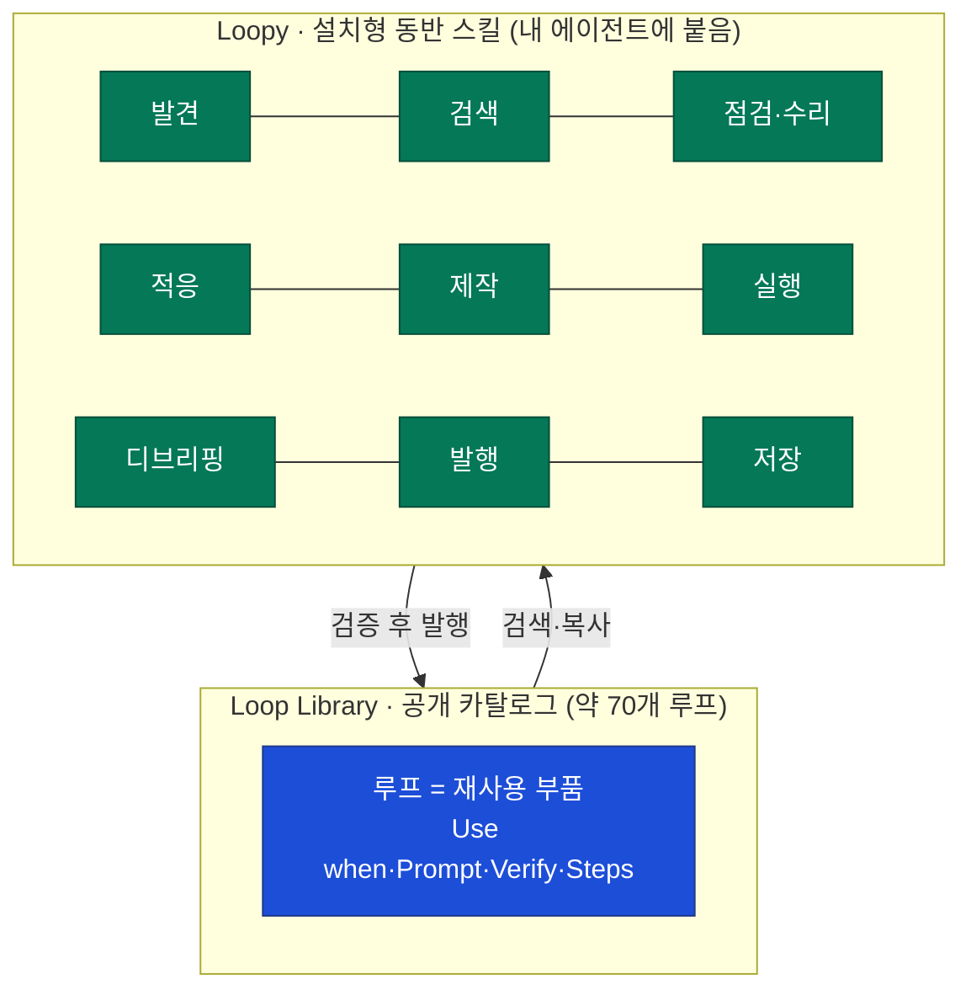
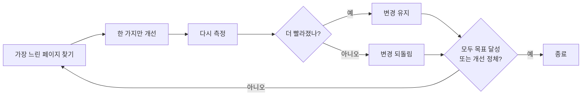
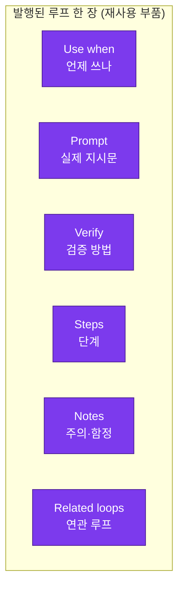
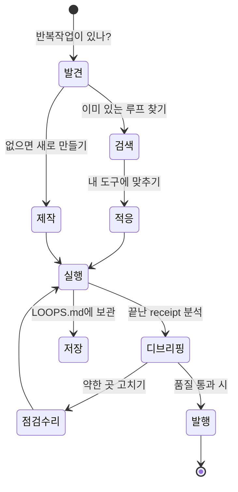
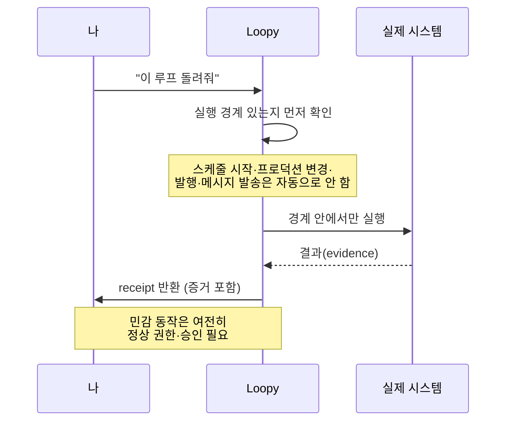
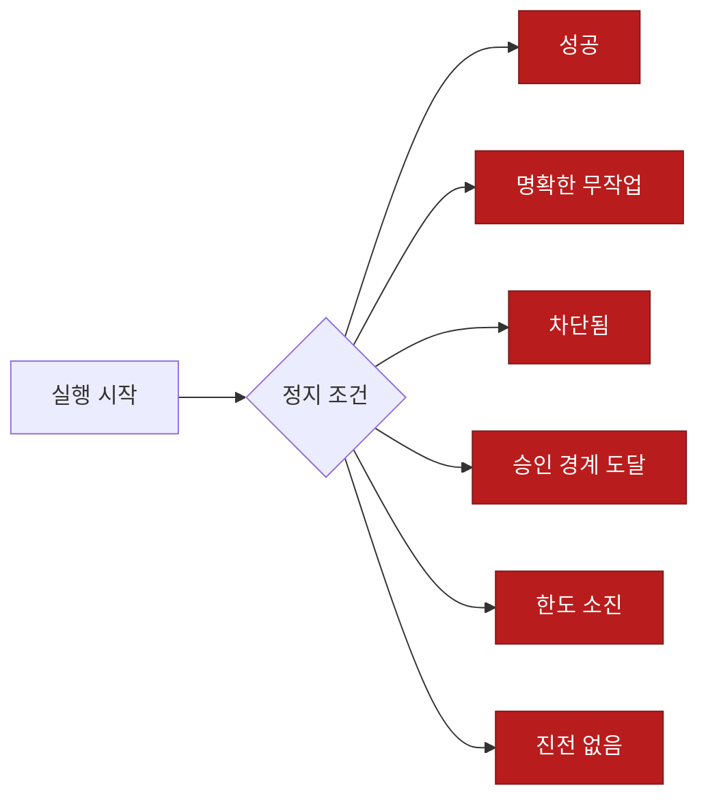
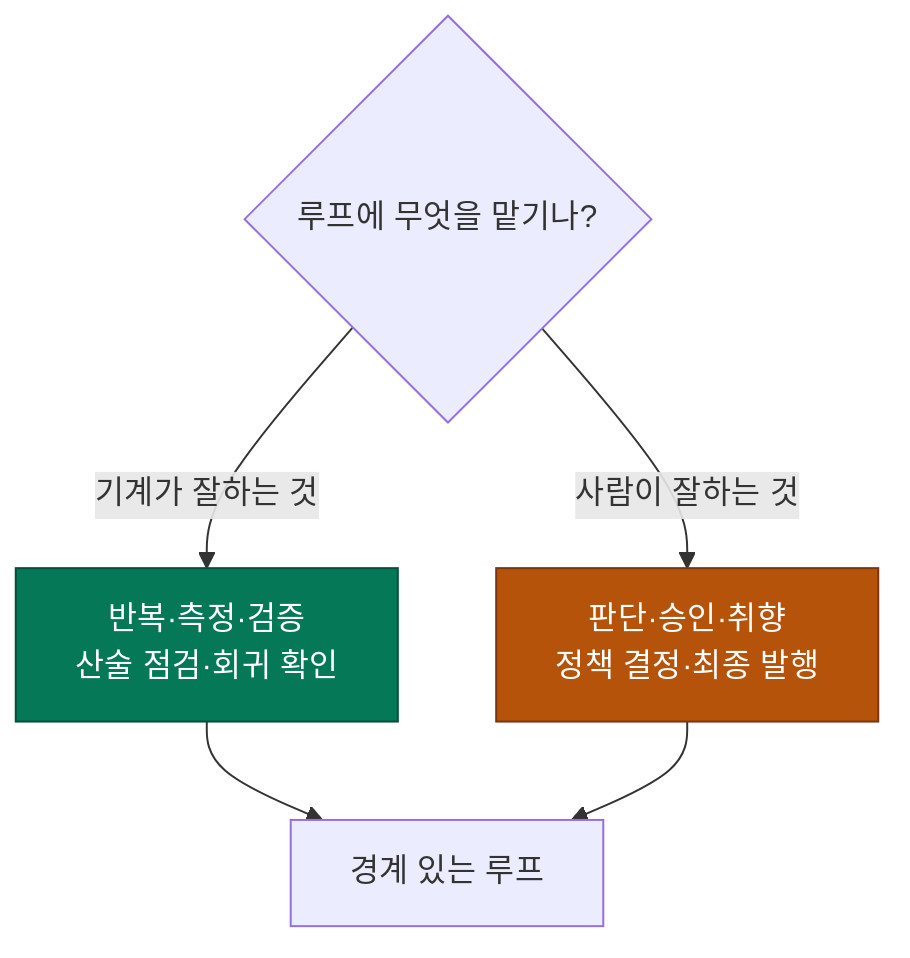

나는 루프를 꽤 오래 붙잡고 있었다. 크롤러 한 대, DART 공시 수집 스크립트 한 본, 매일 아침 도는 AI 뉴스 다이제스트 — 전부 "돌려놓으면 알아서 도는" 무언가를 만드는 일이었다. 그래서 [[loop-engineering-four-loops-loopcraft|루프 엔지니어링 4단계]]를 정리하면서도 계속 남은 갈증이 하나 있었다. **좋은 루프를 만들었으면, 그걸 매번 처음부터 다시 짜지 않고 남한테서 통째로 가져다 쓸 순 없나?**

그러다 PyTorch KR에 올라온 9bow님의 소개 글로 **Loop Library**를 알게 됐다. 첫인상은 "루프를 GitHub 스타처럼 모아둔 곳인가" 싶었는데, 뜯어보니 결이 달랐다. 이건 **루프를 '복사해 붙여 쓰는 부품(artifact)'으로 만든 시도**였다. 그래서 이 글은 소개 글 번역이 아니라, 내가 읽고 **내 자동화 머릿속에 다시 배치해 본 기록**이다.

> **루프(loop)** — 결과를 보고 다음 단계를 정하는 반복 장치. 한 번 시키고 끝나는 게 아니라, "해보고 → 됐는지 확인하고 → 다시 조정"을 정지 조건이 올 때까지 돈다.

## 전체 그림 한눈에 — Loop Library와 Loopy는 뭐가 다른가?

먼저 헷갈리기 쉬운 두 이름부터 갈라놓고 시작하자. **Loop Library**는 *공개 카탈로그*(약 70개의 루프가 올라온 도서관)이고, **Loopy**는 그 도서관을 실제로 뒤지고·고치고·돌려주는 *설치형 동반 스킬*이다. 도서관과 사서, 라고 나는 이해했다.



- **Loop Library** = 잘 만든 루프들을 남이 그대로 재사용하도록 규격화해 모아둔 곳.
- **Loopy** = 내 코딩 에이전트(Claude Code·Codex·Cursor)에 붙어서, 그 도서관을 **찾고·맞추고·돌리고·되먹임**해주는 스킬.
- 저장소는 [github.com/Forward-Future/loopy](https://github.com/Forward-Future/loopy) (MIT, Forward Future 프로젝트, ⭐ 약 2.4k, JavaScript로 작성).

아래부터 한 겹씩 푼다. 먼저 "루프란 대체 뭐길래 부품이 되나"부터.

## 그래서 '루프'가 프롬프트랑 뭐가 다른가?

이 프로젝트의 출발점은 한 문장이다. **한 방(one-shot) 프롬프트를, 되먹임이 박힌 반복 가능한 플레이북으로 바꾼다.** 말로는 추상적이니 소개 글의 대비 예시를 그대로 가져와 본다.

```text
[한 방 프롬프트]
"이 웹사이트를 더 빠르게 만들어줘."

[루프]
"가장 느린 페이지를 찾아 한 가지만 개선하고 다시 측정하라.
 도움이 될 때만 변경을 유지하고,
 모든 페이지가 목표를 만족하거나
 더 이상 개선이 안 나올 때까지 반복하라."
```

차이가 확 온다. 한 방 프롬프트는 "빨라졌는지"를 아무도 안 본다. 루프는 **측정 → 한 가지 변경 → 재측정 → 도움될 때만 유지**라는 되먹임과, **언제 멈출지**가 문장 안에 박혀 있다.



좋은 루프는 이 4가지 질문에 답한다고 소개 글은 정리한다.

| # | 질문 | 왜 필요한가 |
|---|---|---|
| 1 | **무엇을** 이루려 하는가 | 목표(결과)가 흐릿하면 무한 반복 |
| 2 | 방금 시도가 **통했는지** 어떻게 아는가 | 진짜 검증이 없으면 자기기만 |
| 3 | 배운 것으로 **무엇을** 할까 | 되먹임을 다음 스텝에 반영 |
| 4 | 언제 **끝내거나** 사람에게 넘길까 | 정지·에스컬레이션 경계 |

**여기가 내가 가장 공감한 지점이다.** 좋은 루프는 "영원히 돌아도 된다는 허가증"이 아니라, **일부러 경계를 씌운(deliberately bounded)** 것이다. 진짜 검증, 명확한 정지점, 그리고 판단·승인이 필요한 순간엔 사람에게 키를 넘긴다. 나는 재무 데이터를 파싱할 때 **차변=대변, 소계=합계 같은 산술 검증**을 붙여 왔는데, 그게 바로 질문 2의 "통했는지 아는 법"이었다. 그래서 "경계 있고 검증된 루프"라는 철학이 낯설지 않았다.

## 루프를 부품으로 만들려면 안에 뭐가 들어가나?

남이 처음부터 다시 안 만들고 재사용하려면, 루프가 **규격화된 포장지**를 입어야 한다. Loop Library에 올라오는 루프는 이 6칸을 채운 형태로 발행된다.



핵심은 **Verify 칸이 필수라는 점**이다. "언제 쓰는지"와 "실제 프롬프트"만 있으면 그냥 스니펫이지만, 검증·단계·주의가 붙으니 남이 그대로 돌려도 자기기만에 안 빠진다. 실제로 소개 글이 소개하는 대표 루프들을 보면 감이 온다.

| 루프 이름 | 저자 | 하는 일 |
|---|---|---|
| The full product evaluation loop | Matthew Berman | 제품을 끝까지 평가 |
| The five-minute repository maintainer loop | Peter Steinberger | 5분마다 깨어나 리포 트리아지 |
| The docs sweep | — | 문서를 현재 구현에 맞게 갱신 후 PR |
| The production error sweep | — | 프로덕션 로그 훑어 근본원인 고치고 검증 후 PR |

"5분마다 깨어나 리포를 정리한다"는 [[loop-engineering-four-loops-loopcraft|루프 엔지니어링 4단계]]에서 내가 정리한 **이벤트 구동 루프(루프 3)** 그 자체다. 다른 점은, 그걸 이제 *남이 만든 완제품으로 가져다 쓸 수 있다*는 것.

## Loopy는 어떻게 설치하고 부르나?

Loopy는 내 코딩 에이전트에 얹는 스킬이다. Node.js와 `npx`가 있으면 한 줄로 붙는다.

```bash
# Loopy 설치 (Claude Code, 모든 프로젝트에 전역)
npx skills add Forward-Future/loopy --skill loopy --agent claude-code -g -y
# -g = 모든 프로젝트, -y = 자동 승인
```

여러 에이전트에 동시에 붙이려면 `--agent`를 더 얹는다.

```bash
npx skills add Forward-Future/loopy --skill loopy \
  --agent claude-code --agent codex --agent cursor -g -y
```

부르는 법은 에이전트마다 다르다.

| 에이전트 | 호출 |
|---|---|
| Claude Code | `/loopy <요청>` |
| Codex | `$loopy` |
| Cursor | `/loopy` |

설치는 이게 전부다. 문제는 "그래서 얘가 뭘 해주냐"인데, Loopy가 요청을 받으면 **8(+1)개의 길** 중 맞는 걸로 분기한다.

## Loopy는 요청을 받으면 어떤 길로 가나?

이 부분이 스킬의 진짜 몸통이다. Loopy는 "루프 하나 돌려줘"라는 단일 명령이 아니라, **내가 지금 어느 단계에 있느냐에 따라 8가지 경로**로 갈라진다. 발견부터 발행까지, 루프의 생애주기 전체를 덮는다.



하나씩 풀면 이렇다.

- **발견(Discover)** — 코드베이스·대화 스레드를 훑어 반복 작업을 찾아, 경계 있는 루프 후보로 만든다.
- **검색(Find)** — 라이브 카탈로그에서 최대 3개까지 추천. *실행은 안 한다*, 딱 골라만 준다.
- **점검·수리(Loop Doctor)** — 기존 루프의 **약한 검증·위험한 동작·불명확한 정지**만 집어 고친다.
- **적응(Adapt)** — 남의 루프를 내 도구·제약에 맞게 손본다.
- **제작(Craft)** — 결과·성공정의·범위·검증·정지를 **하나씩 질문해가며** 새 루프를 짓는다.
- **실행(Run)** — 경계 있는 패스로 돌리고, **증거가 담긴 receipt**를 돌려준다.
- **디브리핑(Debrief)** — 완료된 실행의 receipt를 분석해 *최소한의* 개선을 제안한다.
- **발행(Publish)** — 품질·중복을 점검하고, **승인을 받아야** 카탈로그에 제출한다.

> 곁가지 하나 — 현재 저장소엔 **저장(Save, 루프를 프로젝트의 `LOOPS.md`에 보관)** 경로도 추가돼 실질 9개 경로다. 소개 글은 8개로 소개하지만, 리포를 보면 하나 더 있다.

내 눈엔 이게 [[loop-engineering-four-loops-loopcraft|루프 엔지니어링 4단계]]의 각 층을 **작업 동사로 쪼갠 것**처럼 보였다. 제작·적응은 루프를 *만드는* 일(루프 1 설계), 실행은 *돌리는* 일, 디브리핑·점검수리는 트레이스로 *개선하는* 일(루프 4)에 대응한다.

## 마음대로 돌다가 사고 치는 거 아닌가? — 안전 경계

여기서 내가 가장 궁금했던 게 "그래서 얘가 멋대로 프로덕션 건드리는 거 아냐?"였다. 소개 글과 리포를 보면, **경계를 먼저 확인하고 나서만** 움직이도록 설계돼 있다.



구체적으로 내가 메모해 둔 안전장치들.

- **말없이 시작하지 않는다.** 스케줄(크론)을 걸거나, 프로덕션을 바꾸거나, 무언가를 발행하거나, 내 이름으로 메시지를 보내는 일은 **자동으로 하지 않는다.** 그런 건 여전히 평소의 권한·승인 절차를 거친다.
- **"반복"의 기준이 보수적이다.** 발견(Discover)은 코딩 스레드에서 **서로 다른 두 개의 사례**가 관측될 때만 "반복 작업"으로 표시한다. 실행 이력이 없는 코드 패턴은 *증명된 루프*가 아니라 **잠재(POTENTIAL) 루프**로만 표시한다.
- **실행엔 유한한 경계가 필수다.** Run은 반드시 끝나는 조건을 요구하고, 다음 중 하나에서 멈춘다.



이 "여섯 개의 멈춤"이 앞서 말한 **일부러 경계를 씌운다**는 철학의 구현이다. 무한 루프가 아니라, **끝을 6가지 방식으로 미리 정의해 둔 유한 루프.** 나는 크롤러를 돌릴 때 레이트리밋·최대 페이지·연속 실패 횟수로 스스로 브레이크를 걸어왔는데, 정확히 같은 감각이었다.

## 이걸 내 자동화에 어떻게 대입할까?

읽고 나서 내 자동화를 Loopy의 렌즈로 다시 봤다. 지금까지 나는 루프를 **내 머릿속에만** 갖고 있었다. 크롤러의 재시도 규칙, DART 파싱의 산술 검증, 다이제스트의 중복 제거 — 전부 코드에 흩어져 있고 남한테 넘길 형태가 아니었다.


- **발견**: 내 코드 곳곳의 "매번 손으로 하던 일"을 루프 후보로 끌어낸다. (예: 매주 하는 공시 데이터 정합성 점검)
- **제작**: 그걸 결과·성공정의·검증·정지가 박힌 루프로 명문화한다. 내 산술 검증(차변=대변)은 이미 완성된 Verify 칸이다.
- **저장·공유**: `LOOPS.md`에 부품으로 박아두면, 다음 프로젝트에서 **처음부터 다시 안 짜도 된다.**

핵심 전환은 이거다. 그동안 나는 좋은 루프를 만들어도 **매번 처음부터 다시 만들었다.** Loop Library의 발상은 *루프를 복사 가능한 아티팩트로 만들어 그 재작업을 없앤다*는 것이고, 이게 내가 [[loop-engineering-four-loops-loopcraft|루프 엔지니어링 4단계]] 뒤에 느낀 갈증의 답이었다.

## 그럼 이건 '루프를 영원히 돌리자'는 얘기인가?

아니다. 오히려 반대라서 마음에 들었다. Loop Library가 강조하는 건 **자율(autonomy)이 아니라 경계(boundary)** 다. 이 지점은 우리 생태계에서 계속 논쟁 중인 주제이기도 하다.



루프는 **검증과 정지가 명확한 반복**을 기계에 맡기고, **판단이 필요한 순간엔 사람에게 넘기는** 장치다. 이 균형을 어떻게 잡느냐가 결국 핵심이고, 나와 비슷한 고민을 다룬 글들을 아래에 걸어둔다.

> 같이 보면 좋은 글: [[loop-engineering-four-loops-loopcraft|루프 엔지니어링 4단계]] · [[loop-vs-harness-vs-ralph-when-to-use|루프·하네스·랄프 언제 쓰나]] · [[the-coming-loop-armin-ronacher-harness-critique|'루프의 시대가 온다']] · [[fable5-from-instructing-agents-to-designing-loops|목표만 주고 물러서기]]

## 배운 점

가장 크게 남은 건 **"루프를 자산으로 본다"는 관점**이다. 그동안 나에게 루프는 *코드에 녹아 있는 습관*이었다. Loop Library를 보고 나서는, 잘 만든 루프 하나가 **Use when·Prompt·Verify·Steps·Notes·Related로 포장된, 남과 주고받을 수 있는 부품**으로 보이기 시작했다.

그리고 다시 확인한 건 **경계의 중요성**이다. 좋은 루프의 조건은 "얼마나 오래 자율로 도느냐"가 아니라 "**어떻게 검증하고 어디서 멈추느냐**"였다. 나는 이미 산술 검증과 브레이크로 그걸 하고 있었으니, 다음 할 일은 그것들을 머릿속에서 꺼내 `LOOPS.md`에 부품으로 박아두는 것이다.

한 줄 교훈 — **좋은 루프는 "영원히 돌 자유"가 아니라 "잘 멈출 규율"이고, 이제 그 규율을 복사해 쓸 수 있게 됐다.**

---

*이 글은 PyTorch KR에 올라온 9bow님의 Loop Library·Loopy 소개 글을 읽고, 그 개념을 **내 식으로 다시 도식화하고 내 자동화에 대입해** 정리한 것입니다. Loop Library는 Forward Future의 오픈소스 프로젝트(MIT 라이선스)이며, 모든 mermaid 도식은 원문 이미지를 옮긴 게 아니라 개념을 직접 다시 그린 것입니다. 경로 이름·설치 명령·기능(발견·제작·실행 등)은 계속 갱신되니, 정확한 최신 내용은 원본 저장소 [github.com/Forward-Future/loopy](https://github.com/Forward-Future/loopy)에서 확인하세요.*
