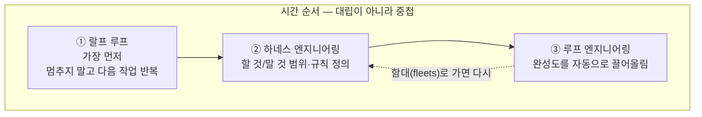
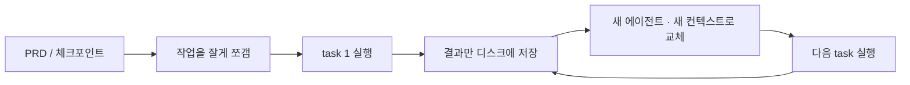
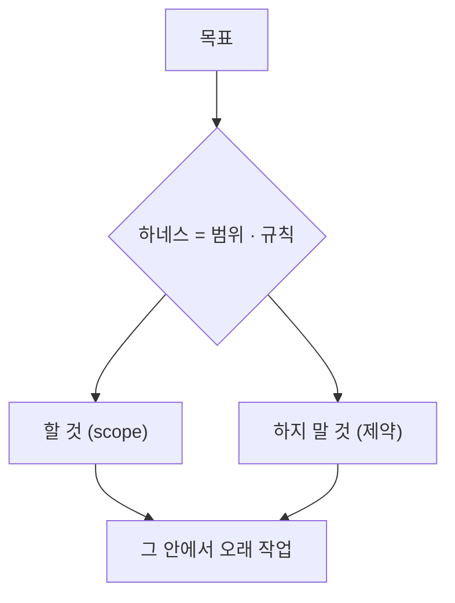
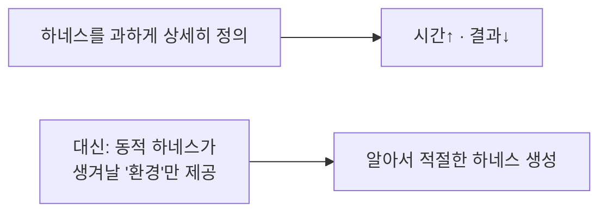
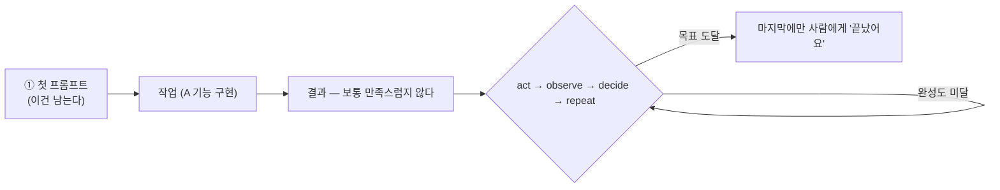
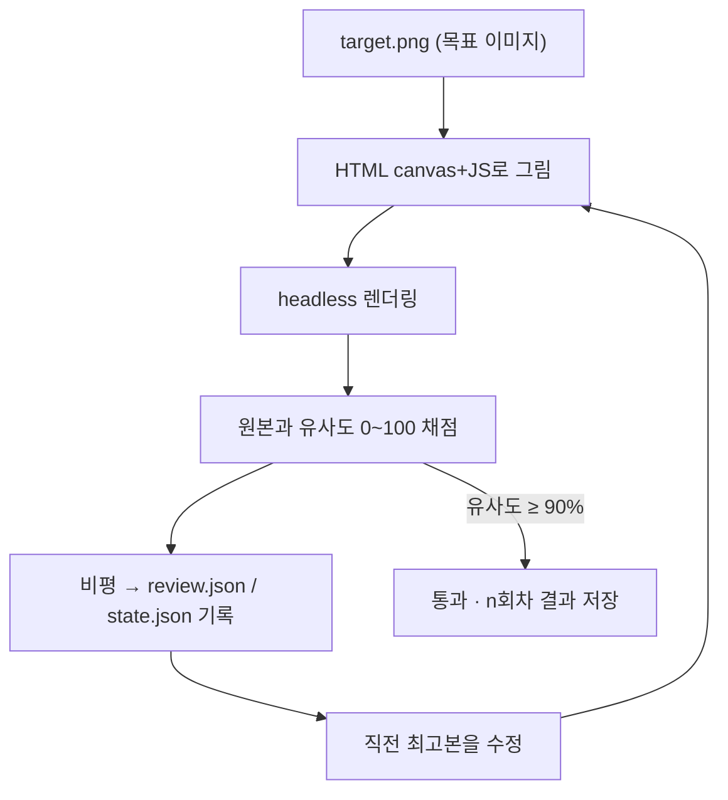
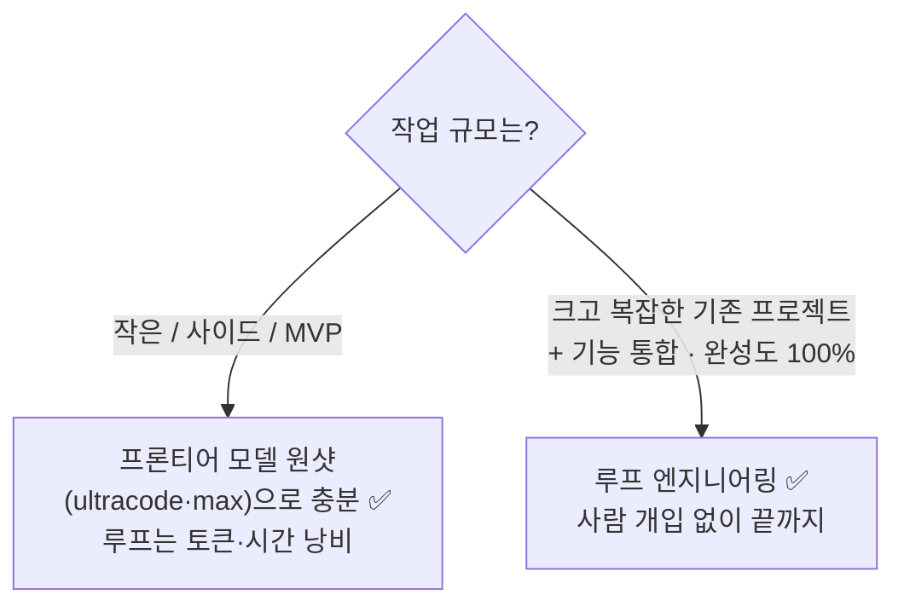
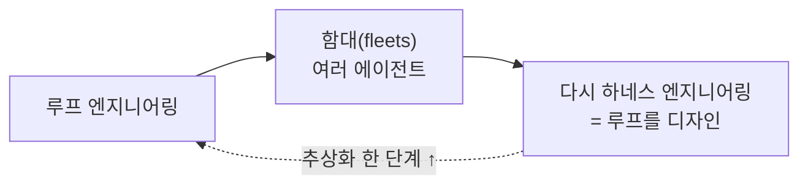

"이제 에이전트한테 **프롬프팅도 하지 말라**"는 말을 처음 들었을 때, 솔직히 좀 버거웠다. 랄프 루프, 하네스 엔지니어링, 루프 엔지니어링 — 용어가 쏟아지는데 다 비슷해 보였고, "와 또 따라가야 하는 게 생겼네" 싶었다.

그런데 며칠 들여다보고 나니, 헷갈림이 두 가지로 정리됐다. **① 이것들은 서로 대립이 아니라 '중첩'이다. ② 전부 다 써야 하는 게 아니라, 내 작업 규모에 맞는 걸 골라 쓰는 거다.** 결론부터 말하면, 못 따라가서 불안할 필요가 없었다.

> 이 글은 [내가 앞서 정리한 LangChain의 '4겹 루프' 글]([[loop-engineering-four-loops-loopcraft|루프 엔지니어링 4단계]])과 짝이다. 그 글이 *"루프를 어떻게 쌓나"* 라면, 이 글은 *"그래서 언제 쓰고 언제 안 쓰나"* 의 현실 점검에 가깝다.

## 전체 그림 — 대립이 아니라 '중첩'이다

세 기법은 경쟁자가 아니다. **나온 순서가 있고, 뒤엣것이 앞엣것을 품는다.** 각 기법은 그때그때의 *반복되는 고통(페인포인트)* 에서 태어났다.

- **랄프 루프**: "다음 거, 다음 거" 매번 내가 시켜야 하는 게 귀찮아서 → 알아서 반복하게.
- **하네스**: "이건 하지 마, 저건 하지 마"를 매번 말해야 하는 게 귀찮아서 → 규칙으로 박제.
- **루프 엔지니어링**: 완성도 올리려고 "더 고쳐, 더 고쳐"를 매번 해야 하는 게 귀찮아서 → 그 반복마저 자동화.

## 랄프 루프? — 왜 이게 가장 먼저 나왔나

랄프 루프는 **롱러닝 에이전트(오래 도는 에이전트)라는 개념이 없던 시절**에 나왔다. 한 번 프롬프팅하면 금방 끝나버리니, "사람이 매번 다음 작업을 눌러주지 않아도 알아서 계속 돌게" 만든 단순무식한 기법이다.

> **컨텍스트 열화(context degradation)**란? 모델의 문맥 창이 꽉 찰수록 성능이 떨어지는 현상이다("건초 더미에서 바늘 찾기" 문제). 지금은 많이 나아졌지만 여전히 유효하다.

그래서 랄프 루프의 핵심은 **작업을 잘게 쪼개고, 끝난 결과만 디스크에 남긴 뒤, 새 컨텍스트로 다음 작업을 시작하는 것**이었다. 같은 문맥에 계속 쌓는 것보다 빠르고 효율적이다. 포커스는 *완성도*가 아니라 **진행(0 → 10까지 나아가기)** 에 있었다.

## 하네스 엔지니어링? — 무엇을 하고 하지 말지 정하는 것

하네스 엔지니어링은 **목표를 향해 오래 작업하는 동안, 정해둔 조건을 벗어나지 않게 제한하는 방식**이다. "루프"라기보다 *"0에서 100까지 가는 길에서 뭘 해도 되고 뭘 하면 안 되는지"* 의 정의에 가깝다. 메타프롬프트 한 장일 수도, 여러 에이전트가 유기적으로 도는 동적 구조일 수도 있다.

여기서 내가 가장 공감한 포인트 — **하네스를 너무 디테일하게 짜는 데 집착하면 오히려 손해다.** 시간은 시간대로 걸리고, 결과는 더 나빠지기도 한다.

요즘처럼 강력한 모드(소위 "울트라/맥스")를 쓰면 하네스가 **동적으로 알아서 생성**된다. 그러니 내가 할 일은 모든 걸 미주알고주알 적는 게 아니라, **그런 동적 하네스가 생겨날 수 있는 환경(맥락)만 깔아주는 것**이다. 스코프는 두되, 과설계는 금물.

## 루프 엔지니어링? — '프롬프팅하는 나'를 없앤다는 진짜 의미

루프 엔지니어링의 한 줄 정의는 *"나를 대체하는 시스템"* 이다. 매번 내가 프롬프트를 직접 안 쳐도 된다는 것. 그런데 여기서 오해가 시작된다 — **"그럼 내가 아무것도 안 해도 자비스처럼 다 해주는 거야?"** 아니다.

핵심은 이거다. **첫 프롬프트는 있어야 한다.** 루프 엔지니어링이 없애려는 건, 결과를 보고 "이거 더 고쳐 → 또 보고 → 또 고쳐" 하는 **2번째·3번째·n번째 반복 프롬프트**다. 그 반복을 사람 대신 루프가 돌며 **완성도를 자동으로 끌어올리고, 맨 마지막에만 사람에게 돌아온다.**

> 즉 루프 엔지니어링은 **무(無)에서 유(有)를 창조하는 마법**이 아니라, **이미 정한 하나의 목표를 완성도까지 자동으로 밀어올리는 방식**이다. "쇼핑몰 만들어줘, 알아서 완성해"가 아니라, "경쟁사 B의 A/B 테스트 방식과 우리 방식이 *완전히 일치할 때까지* 반복하고 매 회차 리포트를 남겨"처럼 **측정 가능한 목표**가 있을 때 빛난다.

## 고양이 한 마리로 본 루프 (데모)

영상에서 본 예시가 직관적이었다. **목표 이미지(고양이)를 HTML 캔버스로 최대한 비슷하게 그려내는 루프.**

매 회차 **그리기 → 렌더 → 유사도 채점 → 비평 → 수정**을 반복하니, 23번째쯤엔 처음의 대충 그린 그림이 꽤 입체적인 고양이가 됐다. 포인트는 **"유사도 90%"라는 측정 가능한 목표**가 있었다는 것. (단, 창작물·아트워크는 이 임계값을 숫자로 정하기 어렵다는 한계도 같이 봐야 한다.)

## 그럼 언제 쓰고, 언제 쓰면 안 되나?

여기가 이 글에서 제일 하고 싶은 말이다. **루프 엔지니어링은 모두에게, 모든 작업에 맞는 게 아니다.**

루프 엔지니어링이 가장 빛나는 순간은 **이미 완성된 거대한 프로젝트에 새 기능을 끼워 넣을 때**다. 이때는 새 기능이 *기존 기능을 안 깨고 완벽히 융화되는지* 검증하는 게 제일 중요한데, 이 "만들고 → 검증하고 → 완성도 올리고 → 테스트"의 반복을 한 번 정의해두면 **100% 완성될 때까지 무인으로 돌릴 수 있다.**

반대로 작은 사이드 프로젝트·MVP라면? 요즘 프론티어 모델이 워낙 좋아서 **한 방(원샷)에 끝나는 경우가 많다.** 그걸 굳이 루프로 쪼개 반복시키면 루프 짜는 시간 + 도는 시간 + 토큰까지 다 낭비된다. "위대한 사람들이 좋다니까 나도" 하고 따라 하다 *"왜 나만 안 되지?"* 싶어지는 건, 못 해서가 아니라 **작업 규모에 안 맞는 기법을 써서**다.

> 보리스 체니(Claude Code)가 *"내 일은 루프를 짜는 것"* 이라 한 건, 그가 **어마어마하게 큰 프로젝트**를 다루기 때문이다. 우리 스코프와는 다르다. **Right tool for the right job.**

## 이 흐름은 결국 어디로 가나?

재밌는 건, 루프 엔지니어링의 다음이 **다시 하네스 엔지니어링**이라는 점이다. 여러 에이전트를 **함대(fleets)** 로 굴리게 되면, 그 함대(=루프들)를 *설계*해야 하고, 그게 곧 하네스 엔지니어링이다. (OpenClaw를 만든 피터 스타인버거도 *"걱정 마라, 그때쯤이면 fleets와 네 루프를 디자인하는 얘기를 하고 있을 것"* 이라 했다고 한다.)

초창기부터 AI를 써온 사람이라면 느낄 거다 — **완전히 새로운 개념이 생긴다기보다, 원래 하던 것의 추상화가 한 칸씩 올라가는 것**에 가깝다.

## 배운 점

가장 크게 남은 건 **안심**이다. 새 기법이 트렌드라고 무조건 따라가야 하는 게 아니었다. 이런 기법들은 *"작업하다 반복되는 고통이 생길 때"* 자연스럽게 필요해지는 것이고, 그때 찾아 쓰면 된다. 신격화할 필요도, 못 따라간다고 불안해할 필요도 없다.

내 자동화(크롤링·공시 수집·다이제스트)는 대부분 작은~중간 규모라, 지금은 **원샷 + 검증**으로 충분하다. 루프 엔지니어링은 *"큰 기존 시스템에 기능을 무인으로 통합·완성"* 해야 할 때 꺼낼 카드로 남겨뒀다. 도구를 아는 것만큼, **언제 안 써도 되는지를 아는 것**도 실력이더라.

> 같이 보면 좋은 글: [[loop-engineering-four-loops-loopcraft|루프 엔지니어링 4단계 — 에이전트는 결국 루프다]] · [[ai-news-digest-multi-agent-factcheck|다중 에이전트 팩트체크 다이제스트]]

---

*이 글은 루프 엔지니어링을 다룬 한 해설 영상과 [LangChain의 글](https://www.langchain.com/blog/the-art-of-loop-engineering), 그리고 내 작업 경험을 토대로 **내 관점에서 다시 도식화·정리**한 것입니다. 인물 발언(보리스 체니·피터 스타인버거 등)은 영상에서의 인용을 옮긴 것으로, 맥락에 따라 원래 취지와 다를 수 있습니다.*
