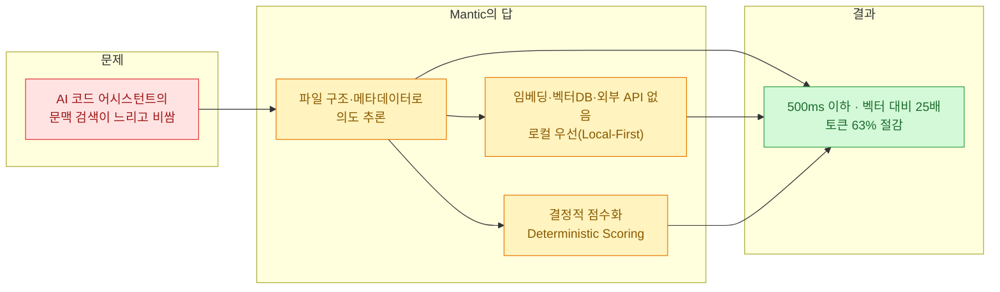
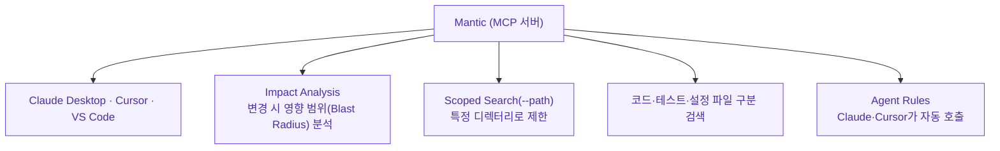

나는 전 파일형식을 뒤지는 [[knowledge-vault-fts-graph-mcp-search|코드·문서 검색 도구를 직접 만들어]] 쓴다. 재밌는 건 그걸 만들 때 나도 **벡터 임베딩을 안 썼다**는 점이다. FTS(전문검색)와 그래프, 그리고 MCP로 붙였다. 임베딩은 강력하지만, 인덱싱 비용·비결정성·"왜 이게 나왔는지 설명이 안 됨"이 늘 걸렸기 때문이다. 그래서 GeekNews에서 [`Mantic`](https://github.com/marcoaapfortes/Mantic.sh)을 봤을 때 반가웠다 — **"임베딩 없이 구조로 검색한다"**는 같은 고집이 보였다.

## Mantic이 뭔가 — 한 문장으로

한마디로 **구조적(structural) 코드 검색 엔진**이다. 파일 구조와 메타데이터를 분석해 **의도를 추론**하고, **임베딩·벡터DB·외부 API 없이 로컬에서** 500ms 이하로 검색한다. Git 기반 파일 스캐닝으로 추적 파일을 우선 처리하고, **결정적 점수화(deterministic scoring)**를 적용한다. TypeScript로 만들어졌고 npm 패키지(`mantic.sh`)로 배포된다.

## 왜 임베딩(벡터)을 안 쓰나?

요즘 "코드 검색" 하면 반사적으로 **임베딩 → 벡터DB → 유사도 검색**을 떠올린다. Mantic은 그 반대로 간다. 이유는 로컬 우선(Local-First) 설계에 있다.

- **인덱싱 파이프라인이 없다** — 임베딩을 만들고 벡터DB를 띄우고 동기화하는 비용이 통째로 빠진다.
- **결정적이다** — 같은 질의엔 같은 결과. 벡터 유사도의 "이게 왜 상위지?"가 없다.
- **규모에 강하다** — 대규모 모노레포(예: **Chromium 48만 개 파일**)에서도 일관된 성능을 낸다.

임베딩이 잘하는 것(자연어 뜻 기반 검색)이 분명히 있다. 하지만 **"이 함수 쓰는 데가 어디"**, **"이 설정 파일 어디서 읽나"** 같은 구조적 질문엔, 파일 구조와 메타데이터를 직접 읽는 결정적 검색이 더 빠르고 설명 가능하다. 내가 [[knowledge-vault-fts-graph-mcp-search|내 코드 인덱스]]를 FTS+그래프로 짠 것도 같은 판단이었다.

## 얼마나 빠르고 싼가?

| 지표 | Mantic |
|---|---|
| 검색 지연 | **0.3~0.4초**(500ms 이하) |
| 벡터 검색 대비 | 최대 **25배** 빠름 |
| 토큰 사용량 | 최대 **63% 절감**(불필요한 파일 접근 최소화) |
| 규모 | Chromium 48만 파일에서 일관된 성능 |

여기서 **토큰 63% 절감**이 눈에 띈다. 에이전트가 코드베이스를 헤맬 때 관련 없는 파일을 잔뜩 열어 컨텍스트에 밀어 넣는 게 비용의 큰 축인데, 정확한 검색으로 **읽을 파일을 줄이면 그대로 토큰이 절약**된다. 이건 오늘 정리한 [[gpt-5-6-model-guidance-prompt-diet-and-agent-skills|GPT-5.6 가이드의 '프롬프트/컨텍스트 다이어트']]와 정확히 같은 자리에서 만난다 — **덜 넣는 게 더 잘하고 더 싸다.**

## 에이전트엔 어떻게 붙나?

Mantic은 처음부터 **AI 에이전트용**으로 설계됐다.

- **MCP(Model Context Protocol) 서버**로 작동해 Claude Desktop·Cursor·VS Code 등과 통합된다.
- **Impact Analysis** — 코드를 바꿨을 때 **영향 범위(blast radius)**를 분석해 준다. "이거 고치면 어디가 깨지나"를 미리 본다.
- **Scoped Search(`--path`)**로 특정 디렉터리 내로 검색을 좁히고, 코드/테스트/설정 파일을 구분해 찾는 세분화된 CLI 옵션을 준다.
- **Agent Rules**로 Claude나 Cursor가 **자동으로 Mantic을 호출**하도록 설정할 수 있다. 환경 변수로 파일 수·타임아웃·무시 패턴을 제어한다.

## 라이선스는 꼭 확인 — 이중 라이선스

여기가 ⚠️ 주의 지점이다. Mantic은 **AGPL-3.0 + 상용의 이중 라이선스** 구조다.

- **내부 사용·오픈소스 통합은 무료**
- **상용 IDE·SaaS 통합 시 별도 상용 라이선스 필요**

AGPL은 전염성이 강한 카피레프트라, 제품에 엮을 생각이라면 조건을 반드시 확인해야 한다. "무료처럼 보여서 그냥 붙였다가" 나중에 곤란해지는 대표적 라이선스이니, 개인·사내 도구로 쓰는 것과 상용 제품에 태우는 것을 구분해야 한다.

## 내 생각 — '임베딩이 늘 답은 아니다'

Mantic을 보며 내 판단에 확신이 생겼다. 요즘 코드 검색·문맥 주입이라고 하면 무조건 벡터·RAG로 가는데, **구조적 질문엔 구조적 검색이 낫다.** 빠르고(500ms), 결정적이고(설명 가능), 인프라가 가볍다(로컬·임베딩 없음). 내가 [[codebase-memory-mcp-knowledge-graph|코드베이스를 지식 그래프로 인덱싱한 글]]과 [[knowledge-vault-fts-graph-mcp-search|FTS+그래프 검색 도구]]에서 밀어붙인 방향과 같아서 반가웠다.

동시에 냉정하게 볼 점도 있다. Mantic은 **구조·메타데이터 기반**이라, "결제 실패를 우아하게 처리한 코드 찾아줘" 같은 **의미 기반 질의**엔 임베딩이 더 나을 수 있다. 그러니 이건 벡터 검색의 대체라기보다 **보완**으로 보는 게 맞다 — 구조적 질문은 Mantic 같은 결정적 검색으로, 의미적 질문은 임베딩으로. 그리고 상용이라면 **AGPL 조건**을 먼저 확인할 것. 어쨌든 "에이전트가 코드베이스를 덜 헤매고 토큰을 아끼게" 만드는 도구가 늘어나는 건, 매일 코딩 에이전트를 굴리는 나로선 환영이다.

## 참고자료

- Mantic 저장소: [marcoaapfortes/Mantic.sh (GitHub)](https://github.com/marcoaapfortes/Mantic.sh) · npm 패키지 `mantic.sh`
- 소개: [GeekNews — Mantic, AI 에이전트를 위한 구조적 코드 검색 엔진](https://news.hada.io/) (by xguru)
- 배경: [Model Context Protocol(MCP)](https://modelcontextprotocol.io/)
- 관련(내 글): [[knowledge-vault-fts-graph-mcp-search|전 파일형식 코드·문서 검색 도구(FTS+Graph+MCP)]] · [[codebase-memory-mcp-knowledge-graph|코드베이스를 지식 그래프로]] · [[gpt-5-6-model-guidance-prompt-diet-and-agent-skills|GPT-5.6 — 컨텍스트 다이어트]]

<!-- 안전: 회사 실데이터·고객/제3자 PII·API키/쿠키/토큰 없음. 공개 저장소(Mantic.sh)와 GeekNews 소개를 요약·논평하고 1차 출처 링크. 라이선스(AGPL-3.0+상용)는 ⚠️로 명시. -->
