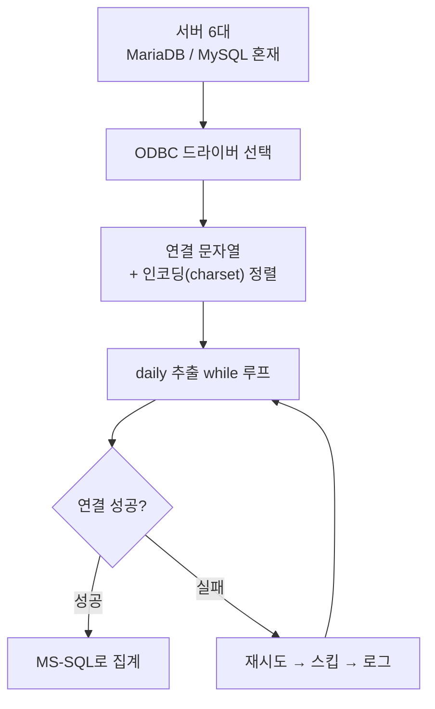
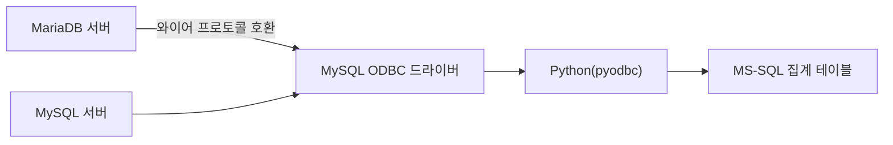
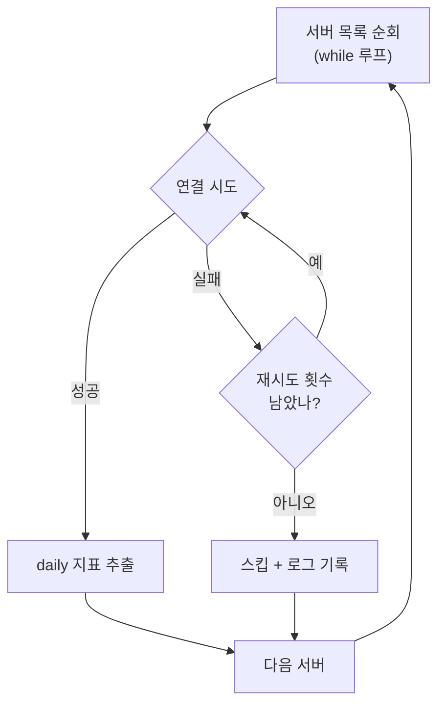

라이브 게임 지표는 서버 하나에서 안 나온다. 서비스가 커지면 서버가 늘고, 늘어난 서버마다 DB 엔진이 미묘하게 다르다. 내가 픽률·과금 지표를 매일 뽑아야 했던 환경도 그랬다. 서버 6개, 그중 일부는 MariaDB, 일부는 MySQL, 내가 주력으로 쓰던 집계 쪽은 MS-SQL이었다. "어차피 다 SQL이니 ODBC로 연결하면 되겠지"라고 처음엔 가볍게 생각했다. 실제로 돌려보니 드라이버, 인코딩, 연결 안정성 세 군데에서 계속 걸렸다. 이 글은 그 삽질을 정리한 것이다.



## 왜 서버마다 DB 엔진이 다르고, 하나로 못 합쳤나?

라이브 서비스는 세팅된 순서와 시점이 제각각이다. 서버를 늘릴 때마다 그 시점에 편한 DB로 올렸을 뿐, 처음부터 통일 계획이 있었던 게 아니다. 나중에 와서 "전부 하나로 마이그레이션하자"는 말은 쉬워도, 서비스 중단 없이 라이브 DB를 옮기는 리스크를 감당하긴 어렵다. 그래서 현실적인 선택은 **있는 걸 그대로 두고, 잇는 방법을 찾는 것**이었다. 그 이음매가 ODBC였다.

ODBC(Open Database Connectivity)는 서로 다른 DB를 같은 방식으로 다루게 해주는 표준 인터페이스다. 이론대로면 드라이버만 맞으면 어떤 DB든 같은 코드로 붙는다. 문제는 "드라이버만 맞으면"이라는 전제 자체였다.

## MariaDB 서버를 MySQL ODBC 드라이버로 연결해도 되나?

MariaDB는 애초에 MySQL에서 갈라져 나온 프로젝트라 와이어 프로토콜 호환성이 높다. 그래서 별도 MariaDB 전용 ODBC 드라이버를 새로 깔지 않고, 이미 설치돼 있던 **MySQL ODBC 드라이버로 MariaDB 서버에 그대로 붙는** 경우가 실무에선 흔하다. 나도 그렇게 했고, 대부분의 쿼리는 문제없이 돌았다.

문제는 '대부분'이지 '전부'가 아니라는 데 있었다. 문자셋 옵션 이름이나 일부 함수의 미묘한 동작이 두 드라이버 사이에서 갈렸다. 처음엔 서버 쪽 데이터 문제로 의심했는데, 나중에야 드라이버·서버 조합 문제였다는 걸 깨달았다. 여기서 얻은 원칙은 하나다. **연결이 된다고 완전히 같은 DB로 취급하면 안 된다.** 연결 문자열에 옵션을 드라이버 기본값에 맡기지 않고 명시적으로 박아두는 습관이 이때 생겼다.



```python
import os
import pyodbc

# 실제 서버 목록·스키마 아님 — 합성 예시
conn_str = (
    "DRIVER={MySQL ODBC 8.0 Driver};"
    f"SERVER={os.environ['DB_HOST']};"
    f"UID={os.environ['DB_USER']};"
    f"PWD={os.environ['DB_PASSWORD']};"
    "CHARSET=utf8mb4;"          # 드라이버 기본값에 맡기지 않는다
)
conn = pyodbc.connect(conn_str, timeout=5)
```

## 한글이 깨지는 인코딩 문제는 어디서 터지고 어떻게 잡았나?

드라이버가 붙어도 끝이 아니었다. 한글 닉네임이나 이벤트 텍스트가 물음표나 깨진 문자로 넘어오는 경우가 종종 있었다. MariaDB·MySQL 쪽은 utf8(한글 완성형은 되지만 일부 확장 문자는 못 담는 3바이트 utf8)과 utf8mb4(4바이트, 더 넓은 범위)가 서버마다 섞여 있었고, ODBC 연결 문자열에 charset을 명시하지 않으면 드라이버 기본값에 따라 결과가 달라졌다.

MS-SQL 쪽으로 옮길 때도 마찬가지였다. 이건 이 작업과 별개로, pymssql로 MS-SQL에 데이터를 적재하던 다른 프로젝트에서도 똑같이 겪은 문제다. `charset='utf8'`, `codepage='65001'`을 명시적으로 맞춰주지 않으면 한글이 깨졌다. 결국 원칙은 같았다. **인코딩은 드라이버가 알아서 맞춰줄 거라 기대하지 말고, 연결 시점에 명시적으로 선언한다.**

## 6개 서버를 매일 순회하는 while 루프, 연결은 왜 끊기나?

매일 아침 6개 서버를 순서대로 돌면서 픽률·과금 로그를 뽑는 배치를 while 루프로 돌렸다. 처음 짠 버전은 순진했다. 서버 하나에서 연결이 실패하거나 타임아웃이 나면 배치 전체가 죽었다. 밤새 배치가 죽어 있으면 아침에 발견해도 그날 지표는 이미 없는 채로 하루를 시작해야 했다.

그래서 루프 구조를 바꿨다. 서버 하나의 연결 실패가 나머지 다섯 개까지 끌고 내려가지 않도록, 실패한 서버는 **재시도 → 그래도 안 되면 스킵 + 로그 남기고 다음 서버로** 넘어가게 했다. 완벽한 데이터보다 "오늘 어디가 비었는지 아는" 게 더 중요했다.



```python
servers = [...]  # 서버 접속정보 목록 (실제 값은 .env/설정파일)
for server in servers:
    for attempt in range(3):
        try:
            conn = pyodbc.connect(build_conn_str(server), timeout=5)
            extract_daily(conn, table="pick_log")   # 합성 테이블명
            break
        except pyodbc.Error as e:
            log.warning(f"{server['id']} 연결 실패 {attempt+1}/3: {e}")
    else:
        log.error(f"{server['id']} 스킵 — 오늘자 데이터 없음")
```

## 정리 — 이종 DB 연동에서 남은 원칙

- 드라이버 호환은 "된다"와 "완전히 같다"는 다르다 — 옵션은 명시적으로 선언한다.
- 인코딩은 드라이버 기본값에 맡기지 않는다 — charset·codepage를 연결 시점에 못 박는다.
- while 루프는 한 서버의 실패가 전체를 죽이지 않게 **재시도 → 스킵 → 로그** 구조로 짠다.

이 삽질은 화려하지 않다. 하지만 이 이음매가 안 튼튼하면, 그 위에 올리는 픽률·매출 분석 전부가 "오늘 데이터가 왜 비었지"라는 질문 앞에서 멈춘다. 분석 모델이 아무리 정교해도 재료가 안 들어오면 소용없다. 다음 글에서는 이렇게 모은 daily 로그에 붙이는 과금/무과금 플래그가 어떻게 재구매율 조기경보로 이어지는지 정리한다.

- 파이프라인 코드: [github.com/DBhyeong/game-data-analysis](https://github.com/DBhyeong/game-data-analysis)
