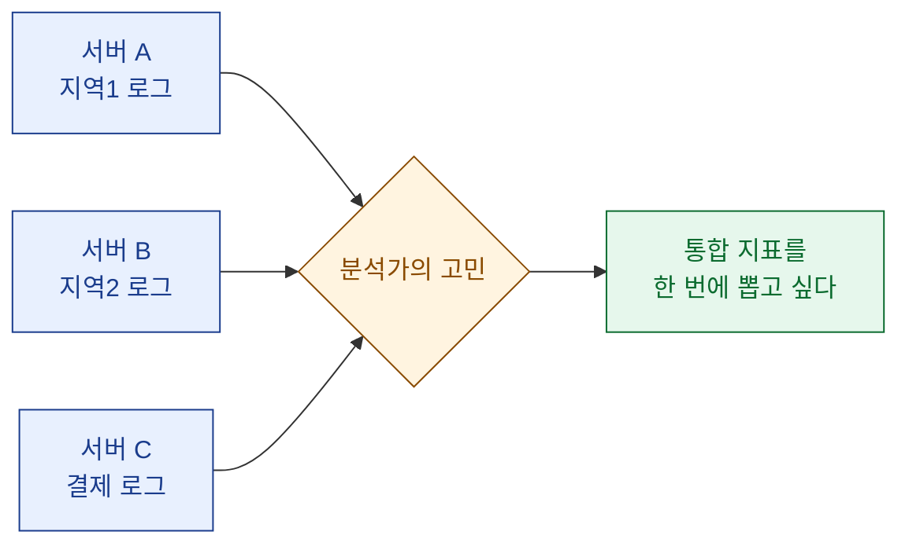
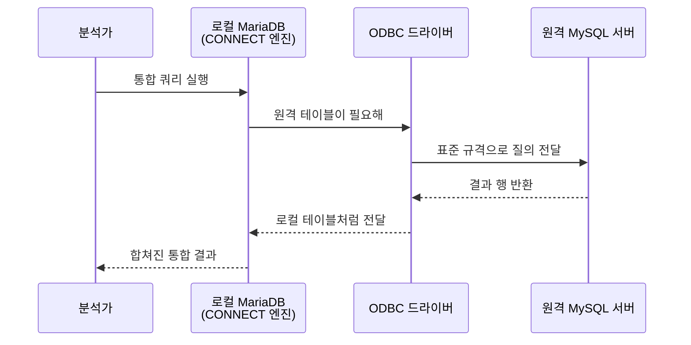
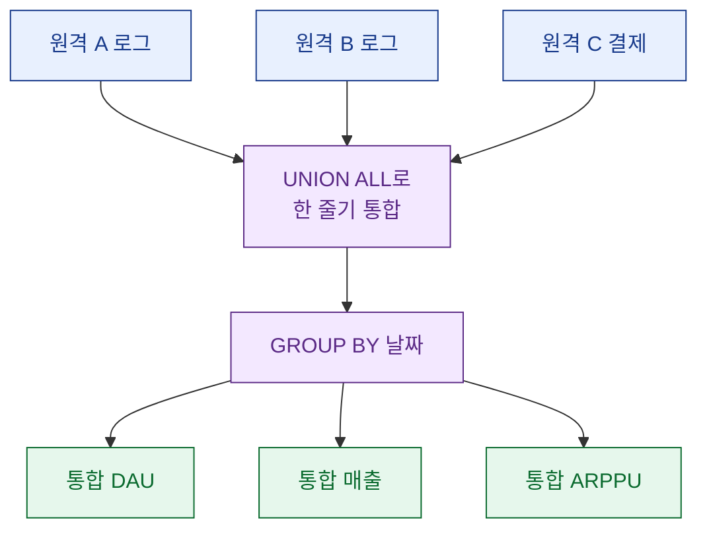

> "지표는 하나여야 하는데, 데이터는 서버 세 곳에 흩어져 있다." — 이 문장 하나가 오늘 글의 전부다.

데이터 분석가로 일하다 보면 이상하게도 가장 자주 발목을 잡는 건 화려한 모델이 아니라 "데이터가 한곳에 없다"는 지극히 물리적인 문제다. 오늘은 여러 대의 MySQL/MariaDB 서버에 흩어진 데이터를 ODBC로 묶어서, 마치 한 데이터베이스인 것처럼 통합 지표를 뽑아낸 경험을 일기처럼 풀어보려 한다. (미리 말해두면, 아래 나오는 테이블명·수치는 전부 설명용으로 지어낸 합성 더미다.)

## 왜 서버가 여러 개로 쪼개져 있을까?

처음 이 상황을 마주하면 "왜 애초에 한 서버에 안 넣었지?"라는 생각이 든다. 그런데 현장에 들어가 보면 이유가 다 있다. 트래픽이 커지면서 지역별로 서버를 나눴거나, 서비스마다 DB를 따로 운영했거나, 인수·합병으로 이질적인 시스템이 한 조직 안에 공존하게 된 경우다.

문제는 분석가에게 필요한 건 "서버 A의 지표"가 아니라 "전체 지표"라는 점이다. 예를 들어 일일 활성 사용자(DAU, Daily Active Users, 하루에 한 번이라도 접속한 사람 수)를 보고할 때, 서버별로 세 번 쿼리해서 손으로 더하는 방식은 실수가 나기 딱 좋다.



예전에 MS-SQL 환경에서 저장 프로시저(Stored Procedure, DB 안에 저장해두고 호출하는 쿼리 묶음)로 매일 도는 집계 자동화를 짜본 적이 있는데, 그때 얻은 교훈이 여기서도 똑같이 통했다. "집계 로직은 사람 손을 최대한 떠나야 한다"는 것.

## ODBC 연동이라는 게 정확히 뭘까?

ODBC(Open Database Connectivity)는 이름 그대로 "데이터베이스에 붙는 공용 표준 규격"이다. 쉽게 말하면 서로 다른 DB끼리 대화할 수 있게 해주는 만국 공용어 어댑터라고 보면 된다. 내 로컬 DB가 원격 DB에게 "네 테이블 좀 보여줘"라고 요청하면, ODBC 드라이버가 그 말을 통역해서 원격 DB의 데이터를 마치 내 테이블처럼 가져다준다.

MariaDB에는 이걸 아주 자연스럽게 처리해주는 CONNECT라는 스토리지 엔진이 있다. 일반 테이블은 InnoDB 엔진에 데이터를 실제로 저장하지만, CONNECT 엔진으로 만든 테이블은 데이터를 저장하지 않는다. 대신 "이 테이블의 진짜 내용은 저 원격 서버에 있어"라는 주소만 들고 있다가, 조회할 때 실시간으로 끌어온다.

| 구분 | 일반 테이블(InnoDB) | ODBC 연동 테이블(CONNECT) |
| --- | --- | --- |
| 데이터 실제 저장 | 로컬에 저장 | 저장 안 함(원격 참조) |
| 조회 시점 | 로컬 디스크 읽기 | 원격 서버에 실시간 질의 |
| 용도 | 원본 적재 | 여러 서버를 하나로 묶는 창구 |
| 주의점 | 없음 | 네트워크·권한·속도 |

이 구조 덕분에 분석가는 원격 서버 세 곳을 일일이 신경 쓰지 않고, 로컬 MariaDB 한 곳에만 접속해서 전부 조회할 수 있다.

## 어떻게 연결 창구를 만들까?

큰 그림은 단순하다. 각 원격 서버로 향하는 ODBC 연결 정의를 만들고, 그 연결을 가리키는 CONNECT 테이블을 로컬에 하나씩 얹는다. 아래는 순서를 도식으로 정리한 것이다.



실제 연동 테이블 정의는 대략 이런 모양이다. (접속 정보는 전부 더미다.)

```sql
-- 원격 서버 A의 일별 활성 로그를 로컬에서 참조하는 창구 테이블
CREATE TABLE ext_active_a (
    log_date   DATE,
    user_id    BIGINT,
    server_tag VARCHAR(16)
)
ENGINE = CONNECT
TABLE_TYPE = ODBC
CONNECTION = 'DSN=remote_a;UID=readonly;PWD=dummy';
```

여기서 핵심은 `ENGINE = CONNECT`와 `TABLE_TYPE = ODBC`다. 이 선언 하나로 로컬 테이블 `ext_active_a`는 껍데기만 존재하고, 실제 데이터는 원격 서버 A에서 그때그때 가져온다. 서버 B, C도 같은 방식으로 `ext_active_b`, `ext_purchase_c`처럼 하나씩 만들어두면 준비 끝이다.

한 가지 습관처럼 챙기는 게 있는데, 원격 접속 계정은 반드시 읽기 전용으로 판다. 분석 창구가 원본을 건드릴 일은 없어야 하고, 사고를 구조적으로 막아두는 편이 마음이 편하다.

## 흩어진 걸 어떻게 하나의 지표로 합칠까?

창구 테이블이 준비되면 그다음은 익숙한 SQL의 영역이다. 여러 서버의 활동 로그를 `UNION ALL`로 한 줄기로 이어붙이고, 그 위에서 집계하면 된다. `UNION ALL`은 여러 조회 결과를 위아래로 쌓아 하나의 결과처럼 만드는 문법인데, 중복 제거를 하지 않아 빠르다(정말 중복 제거가 필요할 때만 `UNION`을 쓴다).

```sql
-- 세 서버의 활동 로그를 합쳐 일별 통합 DAU 집계
WITH all_active AS (
    SELECT log_date, user_id FROM ext_active_a
    UNION ALL
    SELECT log_date, user_id FROM ext_active_b
    UNION ALL
    SELECT log_date, user_id FROM ext_active_c
)
SELECT
    log_date,
    COUNT(DISTINCT user_id) AS dau
FROM all_active
GROUP BY log_date
ORDER BY log_date;
```

`COUNT(DISTINCT user_id)`로 세는 이유는, 같은 사람이 하루에 여러 번 접속해도 한 명으로 세기 위해서다. 이 부분을 놓치면 활성 사용자 수가 슬금슬금 부풀어 오른다.

매출을 볼 때도 원리는 같다. 여러 서버의 결제 로그를 합친 뒤, 결제 사용자 수(PU)와 결제 사용자당 평균 결제액(ARPPU, Average Revenue Per Paying User)을 통합 기준으로 계산한다. 참고로 이 지표들의 관계는 예전 글에서 정리한 그대로다. 매출은 대략 `DAU × 결제율(PU%) × ARPPU`로 분해되고, 서버가 나뉘어 있어도 이 분해식 자체는 변하지 않는다. 다만 분자와 분모를 반드시 "전 서버 합산" 기준으로 맞춰야 숫자가 어긋나지 않는다.



## 이 방식의 함정은 없을까?

당연히 있다. 편해 보이는 도구일수록 함정을 미리 알아두는 게 실무자의 몫이다. 내가 실제로 데인 지점들을 표로 정리해봤다.

| 함정 | 무슨 일이 벌어지나 | 대응 |
| --- | --- | --- |
| 네트워크 지연 | 조회할 때마다 원격에 붙어 느려짐 | 무거운 집계는 야간 배치로 스냅샷 적재 |
| 타임존 불일치 | 서버마다 "하루 경계"가 달라 날짜가 어긋남 | 집계 전 UTC 등 한 기준으로 통일 |
| 중복 로그 | 같은 이벤트가 두 번 들어와 지표 뻥튀기 | DISTINCT·중복 제거 기준을 명시 |
| 스키마 드리프트 | 원격 서버 컬럼이 바뀌면 창구가 깨짐 | 컬럼 변경 감지·계약 문서화 |

특히 타임존과 중복 로그는 서버가 하나일 때도 지겹게 만나는 문제인데, 서버가 여러 개로 늘어나면 그 위험이 곱하기로 커진다. 서버 A는 현지 시각, 서버 B는 UTC로 날짜를 기록하고 있으면, 아무리 SQL을 예쁘게 짜도 D1 리텐션(가입 다음 날 다시 돌아온 비율)이 미묘하게 틀어진다. 그래서 나는 통합 쿼리를 짜기 전에 "모든 서버의 시각 기준이 같은가?"를 먼저 확인하는 걸 습관으로 삼았다.

또 하나. ODBC 실시간 조회는 탐색과 검증엔 훌륭하지만, 매일 도는 리포트를 그때그때 원격에서 끌어오게 두면 성능이 부담스럽다. 그래서 실무에서는 밤사이 배치로 통합 집계 결과만 로컬에 스냅샷으로 떨어뜨려 두고, 낮에는 그 요약본을 조회하는 2단 구조를 즐겨 쓴다. 이건 예전에 저장 프로시저로 매일 지표를 자동 집계하던 습관이 그대로 이어진 셈이다.

## 마무리

정리하면 이렇다. ODBC 연동은 "서버가 여러 개"라는 물리적 제약을, "한 데이터베이스처럼 본다"는 논리적 편의로 바꿔주는 도구다. MariaDB의 CONNECT 엔진과 MySQL ODBC 드라이버로 원격 서버를 창구 테이블로 얹고, `UNION ALL`로 합쳐 통합 지표를 뽑는다. 개념 자체는 어렵지 않다.

정작 중요한 건 도구가 아니라 데이터 위생이었다. 타임존을 맞추고, 중복을 걷어내고, 읽기 전용 계정으로 안전하게 붙고, 무거운 집계는 배치로 미리 굽는 것. 이 네 가지만 지키면 서버가 세 곳이든 다섯 곳이든 통합 지표는 안정적으로 나온다. 결국 분석가의 일이란, 흩어진 것을 신뢰할 수 있는 하나의 숫자로 만들어내는 과정이라는 걸 이번에도 다시 배웠다.

## 참고자료

- [[game-data-sql-recipes-retention-ltv]] — 리텐션(D1/D7/D30)과 LTV를 쿼리 한 방에, 그리고 ARPU/ARPPU 분해
- [[revenue-simulation-dau-pu-arppu]] — 매출을 DAU × PU% × ARPPU로 분해해 시뮬레이션하기
- [[cohort-m1-retention-sql]] — 코호트 기반 M1 리텐션 SQL
- 예제 레시피 모음: https://github.com/DBhyeong/game-data-recipes

<!-- 안전: 합성/더미 데이터, 회사·실데이터·PII 없음. -->
