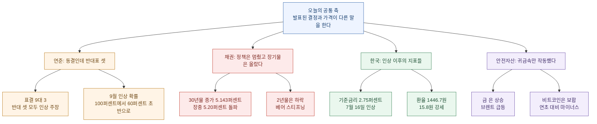
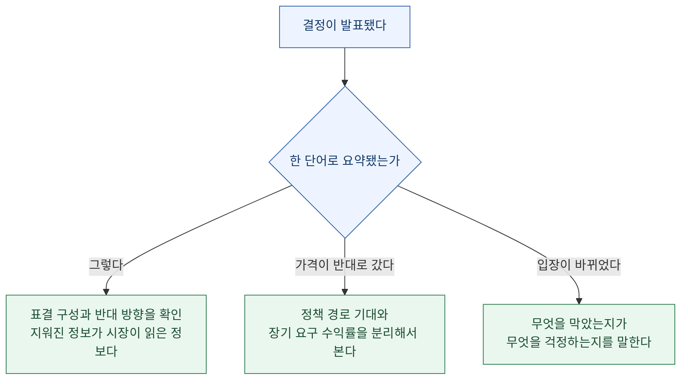

[오전 AI·LLM 다이제스트](/blog/ai-llm-it-news-2026-07-30)에서는 규칙이 적혀 있는 것과 실제로 구속하는 것이 다르다는 이야기를 했다. 시장 쪽 목록을 펼치니 같은 구조가 한 칸 옆에서 반복된다.

> **결정은 한 단어로 발표되고, 가격은 그 단어를 안 믿는다고 말한다.**

연준은 어제 **5회 연속 동결**을 발표했다. 헤드라인은 "동결" 세 글자다. 그런데 표결은 **9대 3**이었고, 반대한 세 명은 전부 **인하가 아니라 인상**을 주장했다. 그리고 같은 날 30년물 국채 금리는 **19년 만의 최고**를 찍었다.

동결이라는 단어에는 이 셋이 다 들어가지 않는다.

확인 기준은 2026년 7월 30일 KST 오전이고, 미국 시장 데이터는 yfinance, 한국 거시는 한국은행 ECOS와 한국부동산원 R-ONE API로 직접 수집했다. **이 글은 사실 정리이고 투자 조언이 아니다.** 개별 종목 매매 판단이나 계좌 배분에 대한 내용은 담지 않았고, 공모주 관련 항목은 일정과 종목명을 일반화했다.

## 오늘 목록을 한 장으로 보면

## 동결인데 왜 반대표가 셋인가

정책금리는 **3.50에서 3.75퍼센트** 구간에 그대로 남았다. 5회 연속이다. 여기까지가 헤드라인이다.

표결 내역을 보면 성격이 달라진다.

| 항목 | 내용 |
|---|---|
| 표결 | **9 대 3** |
| 반대 3인 | 해맥, 카시카리, 로건 |
| 반대 방향 | **전원 인상 주장** (인하 아님) |
| 3인 동시 반대 | 2016년 9월 이후 처음 |
| 신임 의장 초기 기준 | **1970년 이후 최다** (로이터) |

여기서 두 가지를 나눠 읽어야 한다.

첫째, **반대의 방향이 한쪽으로 몰렸다.** 위원회 내 이견이 "더 완화하자"와 "더 긴축하자"로 갈린 게 아니라, 반대한 셋이 전부 같은 쪽을 봤다. 이건 위원회가 둘로 쪼개진 게 아니라 **한쪽 끝이 두꺼워진** 모양이다.

둘째, **비교 기준이 두 개 붙어 있다.** "2016년 9월 이후 첫 3인 동시 반대"는 절대 빈도 기준이고, 로이터가 쓴 "신임 의장 초기 반대표로는 1970년 이후 최다"는 **의장 임기 초라는 조건을 건 기준**이다. 두 문장은 다른 걸 재고 있다. 인용할 때 조건절을 떼면 곧바로 과장이 된다.

시장 반응도 이 이견을 반영했다. **9월 인상 확률이 100퍼센트에서 60퍼센트 초반으로** 내려왔다. 즉 시장은 "동결"이라는 결과보다 **"3명이 인상을 주장했다"는 구성**을 읽고 다음 회의 기대를 조정했다.

여기서 방향을 한 번 더 확인해야 한다. 반대표가 인상 쪽으로 셋이나 나왔는데 **9월 인상 확률은 오히려 떨어졌다.** 언뜻 모순처럼 보인다.

이걸 설명하는 방식은 크게 둘이다. 하나는 회의 전에 이미 인상이 거의 확실한 것으로 가격에 반영돼 있었고(100퍼센트였다), 실제 결과가 동결로 나오면서 그 기대가 되돌려졌다는 것이다. 다른 하나는 성명문이나 기자회견에서 나온 표현이 반대표의 무게를 상쇄했다는 것이다.

어느 쪽인지는 이 숫자만으로 안 갈린다. 그래서 **표결과 확률을 한 문장에 붙일 때는 "무엇이 먼저 반영돼 있었는가"를 같이 적어야 한다.** 100에서 60으로 내렸다는 서술은 출발점이 100이었다는 사실을 빼면 완전히 다른 이야기가 된다.

> 이게 오늘 오전 글과 이어지는 자리다. 결정문은 한 줄이고, 그 한 줄이 지운 정보가 시장이 실제로 반응한 정보였다.

### 반대가 왜 전부 인상 쪽이었나

위원회 안에서 인상을 주장한다는 건 **현재 정책이 충분히 긴축적이지 않다고 본다**는 뜻이다. 그 판단이 나오려면 대체로 다음 중 하나 이상이 필요하다.

| 근거 유형 | 확인할 지표 |
|---|---|
| 인플레이션 재가속 | 근원 PCE 전월 대비, 기대인플레이션 |
| 노동시장 과열 지속 | 임금 상승률, 실업률, 구인배율 |
| 금융여건 완화 | 신용스프레드, 주가, 실질금리 |
| 공급 충격 | 유가, 운임, 원자재 |

오늘 밤 21시 30분에 **미국 근원 PCE와 2분기 GDP**가 나온다. 반대표 셋의 근거가 첫 번째 줄이었는지가 여기서 한 번 갈린다. 그리고 어제 유가가 하루 7.5퍼센트 올랐다는 사실은 네 번째 줄과 무관하지 않다.

즉 오늘 밤 지표는 **어제 결정의 사후 채점표**가 된다. 반대한 셋이 옳았는지를 시장이 가격으로 판정한다.

## 진짜 사건은 채권에서 났다

정책금리가 멈춰 있는 동안 장기물이 움직였다.

| 구간 | 값 |
|---|---|
| 30년물 종가 | **5.143퍼센트** |
| 30년물 장중 고점 | **5.20퍼센트 돌파** |
| 직전 동일 수준 | **2007년 7월** (19년 만) |
| 2년물 | **하락** |
| 커브 형태 | **베어 스티프닝** |

베어 스티프닝은 짧은 쪽이 내리고 긴 쪽이 오르면서 커브가 가팔라지는 상태다. 이 조합이 뜻하는 건 대체로 이렇다. **단기 정책 경로에 대한 기대는 완화 쪽으로 이동했는데, 장기 인플레이션이나 재정 위험에 대한 요구 수익률은 오히려 올라갔다는 것.**

제프리 건들락의 코멘트가 이 상황을 압축한다.

> **"채권시장이 워시에게 인플레이션에 대해 행동하라고 말하는 것이다."**

여기서 조심할 게 하나 있다. 이건 **관측이 아니라 해석**이다. 30년물이 5.143퍼센트라는 건 관측이고, 그게 "채권시장이 의장에게 보내는 메시지"라는 건 한 사람의 읽기다. 지난주 정리한 원칙을 그대로 적용하면, **방향은 데이터가 말하고 원인은 조합에서만 나온다.** 장기물 상승의 원인이 인플레이션 기대인지 재정 공급 부담인지 기간 프리미엄 재평가인지는 이 숫자 하나로는 안 갈린다.

다만 확실한 건 하나 있다. **정책은 멈췄다고 발표했는데 조달 비용의 긴 쪽은 19년 만의 고점으로 갔다.** 발표와 가격이 다른 말을 하고 있다.

### 장기금리 상승을 세 갈래로 갈라 보는 법

30년물이 올랐다는 관측 하나에서 서로 다른 결론 셋이 나올 수 있다. 갈라 보는 방법은 이렇다.

| 후보 원인 | 함께 움직여야 할 것 | 오늘 확인 가능 여부 |
|---|---|---|
| 인플레이션 기대 상승 | 기대인플레이션(BEI), 유가, 원자재 | 유가는 급등, BEI는 **오늘 결측** |
| 기간 프리미엄 재평가 | 변동성 지표, 커브 기울기 | 커브는 스티프닝 확인 |
| 재정 공급 부담 | 발행 계획, 입찰 응찰률 | 별도 확인 필요 |
| 안전자산 수요 이탈 | 금·달러 방향 | 금은 **올랐다**(이탈과 반대) |

여기서 오늘 데이터가 하나를 약하게 배제한다. **금이 2.78퍼센트 올랐다.** 안전자산에서 돈이 빠져나가는 국면이면 금도 같이 눌려야 하는데 그렇지 않았다. 그러니 "위험선호가 살아나면서 채권에서 돈이 빠졌다"는 설명은 오늘 조합과 잘 안 맞는다.

반대로 **유가 7.5퍼센트 급등 + 금 상승 + 장기금리 상승**의 조합은 인플레이션 경로에 대한 우려 쪽에 더 무게를 싣는다. 다만 기대인플레이션 지표가 오늘 결측이라 **확인이 아니라 정황**이다. 이 차이를 문장에 남겨 둬야 내일 지표가 나왔을 때 판단을 고칠 수 있다.

> 지난주에 적어 둔 원칙이 그대로 적용된다. **단계별 판단표에는 "근거가 나온 단계"를 같이 적어라.** 틀렸을 때 어디를 다시 볼지가 거기서 나온다.

### 경계선을 미리 적어 두면

수집기에 임계값을 박아 뒀다. 10년물 4.8퍼센트, 30년물 5퍼센트, 변동성지수 22, 유가 90달러, 달러지수 105다.

오늘은 **30년물과 유가가 동시에 경계선을 넘었다.** 이 표기 방식의 장점은 넘었을 때만이 아니라 **안 넘었을 때도 정보가 된다**는 데 있다. 오늘 달러지수는 경계선 아래에 있고, 그 사실이 "금리 상승이 달러 강세를 동반하지 않았다"는 관찰로 바로 이어진다.

## 한국은 인상 이후 어디에 서 있나

한국은행 ECOS에서 직접 뽑은 값이다.

| 지표 | 값 | 비고 |
|---|---|---|
| 기준금리 | **2.75퍼센트** | 2026년 7월 16일 인상 |
| 원달러 환율 종가 | **1,446.7원** | 15.8원 강세 |
| 가계신용 | **1,993.1조 원** | 2026년 1분기, 전년 대비 3.54퍼센트 증가 |
| 가계대출 연체율 | **0.45퍼센트** | |
| 6월 통관수출 | **1,021.7억 달러** | 전년 대비 70.8퍼센트 증가 |
| 6월 무역수지 | **360.9억 달러 흑자** | |

수출 증가율이 눈에 띄게 크다. 여기서 지난주에 정리한 분해 원칙을 적용해야 한다. **수출액 증가는 물량 증가와 같지 않다.** 반도체 단가가 크게 오른 국면이라 금액 증가분에 가격 요인이 얼마나 들어 있는지를 따로 봐야 한다. 시점 보정, 가격과 물량 분해, 품목별, 국가별 네 방향으로 갈라 보기 전까지는 "수출이 70퍼센트 늘었다"는 문장만으로 체질 개선을 말할 수 없다.

부동산 쪽은 한국부동산원 R-ONE 주간 통계 30주차 기준이다.

| 지역 | 매매수급지수 |
|---|---|
| 서울 | **113.47** |
| 강북권 | **116.67** |

100을 넘으면 매수 우위다. 강북권이 서울 평균보다 높다는 게 이번 주차의 특징이다.

수급지수는 가격 지수가 아니라 **중개업소 설문 기반의 심리 지표**라는 점을 같이 기억해야 한다. 매수 우위가 곧 가격 상승은 아니고, 선행하는 경향이 있다는 정도로 읽는 게 맞다. 그리고 강북이 평균보다 높다는 건 서울 전체가 균질하게 움직이는 게 아니라 **권역별로 갈리고 있다**는 뜻이다. 여기서도 오늘 일본 사례와 같은 2축이 필요하다. 지역 안에서 다시 갈라 봐야 한다.

### 가계신용 1993조를 어떻게 읽나

이 숫자는 단독으로는 거의 아무 말도 하지 않는다. 같이 놓아야 뜻이 생기는 값들이 있다.

| 같이 볼 값 | 오늘 값 | 읽는 법 |
|---|---|---|
| 증가율 | 전년 대비 3.54퍼센트 | 잔액보다 속도가 정책 판단에 가깝다 |
| 연체율 | 0.45퍼센트 | 부실 발생 여부. 낮으면 아직 견디는 중 |
| 기준금리 | 2.75퍼센트 (7월 16일 인상) | 조달 비용이 방금 올랐다 |
| 부동산 수급 | 서울 113.47 | 신규 차입 수요의 방향 |

이 넷을 같이 놓으면 이렇게 읽힌다. **잔액은 계속 늘고 있고, 증가 속도는 완만하고, 아직 부실로는 안 번졌고, 그런데 이자 부담이 방금 올라갔고, 매수 심리는 여전히 우위다.**

여기서 지난주에 적어 둔 두 가지가 그대로 걸린다.

- **평균은 위험을 숨긴다.** 연체율 0.45퍼센트는 전체 평균이고, 터질 곳은 평균 안에 가려진다. 차주 구간별 분포가 없으면 이 숫자로 안심할 근거가 안 된다.
- **이자를 알면서 산다는 건 가격이 더 오른다고 본다는 뜻이다.** 금리가 오른 직후에도 매수 우위가 유지되면, 차입 비용 상승분을 기대 수익이 덮는다고 보는 참여자가 아직 많다는 얘기다.

오늘 한국은행이 **시스템리스크 상호연계성 보고서**와 **7월 경제심리지수(ESI)** 를 발표한다. 가계신용이 1,993조 원대이고 기준금리가 막 인상된 국면에서 나오는 상호연계성 보고서라, **어느 부문 간 연결을 위험 경로로 지목하는지**가 관전 포인트다. 상호연계성 보고서는 대체로 "어디가 위험한가"보다 "어디와 어디가 붙어 있어서 하나가 흔들리면 같이 흔들리는가"를 다룬다. 그래서 지목된 연결 자체가 당국의 관심 지도다.

## 사상 최대인데 기대는 밑돌았다

어제 발표된 국내 대형 메모리 업체의 2분기 확정 실적이 오늘 시장의 출발점이다. 이 건은 어제 글에서 다뤘지만, 오늘 삼성전자 부문별 세부 실적이 나오므로 숫자를 다시 정리해 둔다.

| 항목 | 값 |
|---|---|
| 매출 | **79조 3,187억 원** |
| 영업이익 | **60조 5,426억 원** |
| 영업이익률 | 약 **76퍼센트** |

분기 사상 최대다. 그리고 동시에 컨센서스를 밑돌았다.

| 전망 시점 | 집계 | 매출 | 영업이익 |
|---|---|---|---|
| 7월 27일 | 증권사 22곳 | 83조 6,460억 | 63조 6,594억 |
| 7월 24일 | 증권사 14곳 | 84조 597억 | 64조 889억 |
| 리포트 범위 | | | 60조에서 71조 |

확정치는 매출과 영업이익 모두 컨센서스를 **약 5퍼센트 하회**했다. 그러니 "사상 최대"와 "기대 하회"가 둘 다 참이다. 앞은 과거에 견줬고 뒤는 전망에 견줬을 뿐이다.

여기서 놓치기 쉬운 게 세 번째 줄이다. **리포트 범위가 60조에서 71조까지 벌어져 있었다.** 폭이 11조다. 확정치 60조 5,426억은 이 범위의 **하단 근처**다. 평균만 보면 "5퍼센트 하회"인데, 범위를 보면 **가장 보수적인 전망에 가까웠다**는 게 더 정확한 서술이다.

컨센서스는 평균이고, 평균은 분산을 지운다. 지난주에 정리한 문장이 여기에도 걸린다. **평균은 위험을 숨긴다.**

쟁점은 이 하회가 **구조적 둔화**인지 **차세대 고대역폭 메모리 전환기의 일시적 공백**인지다. 이건 3분기 실적과 하반기 가격 협상 결과가 나와야 갈린다. 오늘 나오는 경쟁사 부문별 세부 실적이 첫 번째 참고점이 된다. 잠정 영업이익은 89조 4,000억 원으로 발표돼 있고, 두 회사 합산 2분기 영업이익은 150조 원 선이다.

> 오늘 세부 실적을 볼 때 확인할 것은 총액이 아니라 **부문별 구성**이다. 총액이 같아도 메모리와 비메모리, 파운드리 중 어디서 나왔느냐에 따라 다음 분기 전망이 갈린다.

## 안전자산은 어디로 갔나

| 자산 | 값 | 변동 |
|---|---|---|
| 브렌트유 | 90.40 | **+7.50퍼센트** |
| 금 | 4,148.6 | +2.78퍼센트 |
| 은 | 58.60 | +2.27퍼센트 |
| 비트코인 | 63,823 | -0.08퍼센트 (연초 대비 -28퍼센트) |

이 표에서 읽어야 할 건 개별 등락이 아니라 **분기점**이다.

장기금리가 19년 최고로 가고 유가가 하루 7.5퍼센트 급등한 날, 안전자산 수요는 **귀금속으로만 갔다.** 비트코인은 보합이었고 연초 대비로는 마이너스 28퍼센트다.

"디지털 금"이라는 서사가 여러 해 동안 반복됐는데, 실제로 인플레이션 압력과 금리 불안이 동시에 온 날 **작동한 건 실물 귀금속뿐이었다.** 한 번의 관측으로 서사를 폐기할 수는 없지만, 적어도 오늘 데이터는 그 서사와 반대 방향이다.

여기서 정확히 말해야 할 게 있다. **비트코인이 떨어진 게 아니라 안 움직였다.** 마이너스 0.08퍼센트는 사실상 보합이다. 그러니 "위험자산으로 취급받아 매도됐다"는 설명도 오늘 데이터로는 못 한다. 오늘 말할 수 있는 건 **안전자산 수요가 몰린 날 그 흐름에 참여하지 않았다**는 것뿐이다.

연초 대비 마이너스 28퍼센트라는 값은 다른 층위의 정보다. 하루치 반응과 연간 성과는 다른 질문에 답하는 숫자이고, 둘을 한 문장에 붙이면 하루 보합이 마치 하락 추세의 연장처럼 읽힌다. **기간을 밝히지 않은 등락은 인용될 때 반드시 짧은 쪽으로 오해된다.**

유가 쪽도 마찬가지다. 브렌트가 하루 7.5퍼센트 오른 건 큰 움직임인데, 이 크기의 일간 변동은 대체로 수급 뉴스나 지정학 이벤트를 동반한다. 원인을 특정하지 못한 상태에서 "인플레이션 압력"으로만 넘기면, 다음 주에 되돌려졌을 때 판단을 고칠 근거가 남지 않는다.

## 일본과 아시아는 왜 갈렸나

지난주에 정리한 **가로(나라) 곱하기 세로(업종) 2축** 원칙이 오늘도 그대로 먹힌다.

| 대상 | 변동 |
|---|---|
| 일본 반도체 장비주 A | **-10.6퍼센트** |
| 일본 반도체 장비주 B | **-8.4퍼센트** |
| 일본 완성차 대표주 | **+7.2퍼센트** |
| 중국 대형 플랫폼주 | **+4.3퍼센트** |
| 항셍지수 1개월 | **+11.6퍼센트** |

같은 나라 안에서 업종이 정반대로 갈렸다. 장비 체인만 무너졌고 완성차는 크게 올랐다. **"일본 증시가 빠졌다"는 요약이 성립하지 않는 날**이다.

이런 날 "아시아 증시 하락"이라는 헤드라인을 그대로 받으면 원인을 통째로 놓친다. 빠진 건 지역이 아니라 **특정 공급망 레이어**다.

그리고 항셍 1개월 수익률이 플러스 11.6퍼센트라는 건 이 그림을 한 번 더 뒤집는다. 같은 기간에 아시아 안에서 **반도체 장비 체인은 빠지고 중화권 플랫폼은 올랐다.** 지역으로 묶는 서술은 이 대비를 통째로 지운다.

읽는 순서를 고정하면 이런 실수가 줄어든다.

| 순서 | 확인 |
|---|---|
| 1단계 | 나라별로 갈리는가 |
| 2단계 | 같은 나라 안에서 업종이 갈리는가 |
| 3단계 | 갈린 업종이 나라를 건너 일치하는가 |
| 4단계 | 기간을 바꾸면 순위가 뒤집히는가 |

오늘은 2단계에서 이미 갈렸고, 3단계에서 "반도체 장비"라는 공통 레이어가 드러났고, 4단계에서 항셍 1개월이 하루짜리 그림과 다른 방향을 보여 줬다. **1단계에서 멈추면 세 개를 다 놓친다.**

## 당국은 무엇을 바꿨나

정부가 **단일종목 레버리지 ETF와 ETN에 대한 총량규제**를 도입했다. 이건 위치가 중요한 결정이다.

바로 이틀 전까지 당국의 공식 입장은 **"안정화 대책을 낼 국면이 아니다"** 였다. 그런데 총량규제는 명백히 개입이다. 즉 **입장 자체가 한 발 이동했다.**

여기서 지난주 야부리에서 정리한 읽기 하나가 적용된다. **지원책처럼 보이는 관리책, 관리책처럼 보이는 신호**를 구분해야 한다는 것이다. 총량규제는 시장을 부양하는 조치가 아니라 특정 상품군의 레버리지 총량을 묶는 조치다. 대책을 낼 국면이 아니라고 말하면서 특정 부문의 총량을 묶었다면, **당국이 위험하다고 보는 지점이 어디인지**가 그 선택 안에 드러난다.

> 무엇을 막았는지가 무엇을 걱정하는지를 말한다.

총량규제라는 수단 자체도 읽을거리다. 가격이나 거래를 직접 건드리지 않고 **발행 잔액의 상한을 묶는** 방식이기 때문이다. 이건 개별 투자자의 판단을 막는 게 아니라 **시장 전체가 특정 방향으로 쌓을 수 있는 총량**에 천장을 두는 조치다.

그래서 이 결정에서 읽을 수 있는 건 두 가지다. 첫째, 당국이 우려하는 게 개별 손실이 아니라 **집중도**라는 것. 둘째, 대책이 아니라고 말하면서 쓸 수 있는 수단 중 **가장 조용한 쪽**을 골랐다는 것. 지수 방어나 수급 개입은 훨씬 시끄럽다.

말과 조치가 어긋나 보일 때는 대개 조치 쪽이 더 정확하다. 말은 시장 심리를 고려해서 조정되지만, 조치는 실제로 무엇을 막아야 하는지에서 나오기 때문이다.

## 오늘 일정과 이 리포트의 한계

오늘 확인해야 할 일정 몇 가지다. 공모주 관련 항목은 종목명과 확정 일정을 일반화해 적는다.

- **하반기 첫 공모주 청약이 오늘 개시된다.** 공모가는 밴드 내에서 확정됐다. 하반기 IPO 시장의 첫 리트머스가 된다.
- **다른 한 건은 청약 일정을 8월 중순에서 8월 말로 연기했다.** 급락장을 피하려는 조정으로 읽힌다.
- **최대주주 변경 공시가 3차 연기된 건이 있다.** 연기가 반복되는 건 그 자체가 정보다.
- **21시 30분 미국 근원 PCE와 2분기 GDP** 가 나온다. 어제 채권 움직임의 해석이 여기서 한 번 갈린다.

그리고 이 리포트에는 명시해야 할 한계가 둘 있다.

**첫째, 지금은 개장 전이라 전자공시 수집분이 13건이다.** 전일 마감 기준 354건과 비교하면 오전 스냅샷일 뿐이고, 종목 단위 이슈는 마감 후 재수집분에서 확정된다. 이 시각의 공시 건수를 하루치로 읽으면 안 된다.

**둘째, FRED 20개 시리즈가 오늘 전량 수집 실패했다.** 그래서 미국 물가·고용·신용스프레드 수치가 이 리포트에서 비어 있다. 금리는 대체 티커로 메웠지만 CPI와 PCE, 신용스프레드는 채워 넣지 못했다. **없는 값을 있는 것처럼 쓰지 않기 위해 비운 채로 둔다.**

수집 과정에서 잡은 API 함정들은 [별도 글](/blog/ecos-fred-api-traps-daily-digest-v2)로 분리했다. 그중 하나는 하마터면 오늘 리포트에 기준금리를 틀리게 쓸 뻔한 건이다.

## 오늘 목록에서 챙길 것

1. **동결이라는 단어를 표결 구성으로 열어 본다.** 9대 3이고 반대가 전원 인상 방향이면, 그건 동결이 아니라 "이번에는 참았다"에 가깝다.
2. **정책금리와 장기금리를 같은 문장에 넣지 않는다.** 오늘처럼 방향이 갈릴 때 둘을 섞으면 문장이 무의미해진다.
3. **수출 금액 증가를 물량 증가로 읽지 않는다.** 단가가 크게 움직인 국면에서는 특히 그렇다.
4. **비어 있는 값을 채우지 않는다.** 오늘 FRED 결측분은 비운 채 두는 게 맞다. 대체값으로 메우면 다음에 그 대체 사실이 사라진다.

---

오전 글은 규칙이 적혀 있어도 실행이 안 읽으면 구속이 아니라는 이야기였다. 이 글은 결정이 발표돼도 가격이 안 믿으면 그건 아직 결정이 아니라는 이야기다. 발표문과 표결 내역, 정책금리와 30년물, 당국의 말과 당국의 조치. **셋 다 앞의 것만 읽으면 뒤의 것을 놓친다.**
