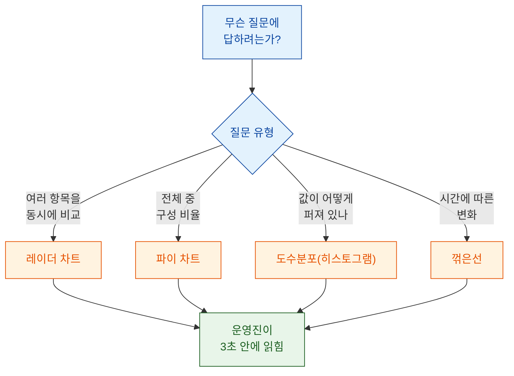
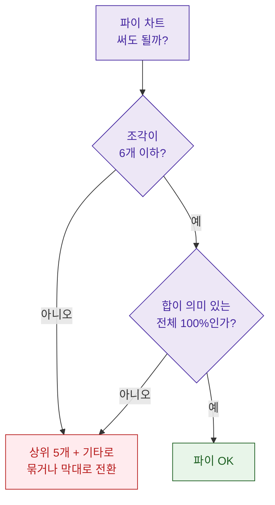

> "표는 잘 봤는데, 그래서 결론이 뭐예요?" — 이 한마디를 안 듣기 위해 나는 차트를 다시 그린다.

데이터 분석가로 일하면서 가장 자주 깨달은 사실이 하나 있다. 내가 아무리 정교한 쿼리를 짜서 숫자를 뽑아도, 운영진 회의에서 그 숫자가 3초 안에 읽히지 않으면 없는 것과 같다는 것. 오늘은 비개발 부서가 바로 이해하는 차트를 matplotlib로 만드는 내 나름의 기준과 디자인 패턴을, 세 가지 대표 유형(레이더·파이·도수분포)으로 풀어보려 한다. 참고로 이 글에 나오는 수치와 지표는 전부 설명용 더미다.

## 왜 "표를 잘 만드는 것"보다 "차트를 고르는 것"이 먼저일까?

내가 처음 저지른 실수는, 데이터를 뽑자마자 습관적으로 막대그래프부터 그린 것이다. 하지만 차트는 "예뻐 보이려고" 그리는 게 아니라 "무슨 질문에 답하려고" 그리는 것이다. 질문이 다르면 답하는 그림도 달라야 한다.

내가 지금 쓰는 판단 순서는 이렇다.



이 흐름만 지켜도 "왜 이 차트냐"는 질문에 항상 대답할 수 있다. 차트 유형은 취향이 아니라 질문의 함수라는 걸 몸으로 익히는 데 시간이 좀 걸렸다.

## 레이더 차트: 여러 항목의 균형을 어떻게 한 장으로 보여줄까?

레이더 차트(방사형 차트)는 한 대상이 여러 축에서 얼마나 균형 잡혀 있는지 볼 때 최고다. 예를 들어 어떤 캐릭터나 상품이 공격·방어·기동·회복·유틸 다섯 가지 능력치에서 어떤 모양인지 보여줄 때, 표로 다섯 숫자를 나열하는 것보다 오각형 모양 하나가 훨씬 빨리 읽힌다.

내가 쓰는 최소 코드는 이렇다. 핵심은 축을 원형으로 닫아주는 것.

```python
import numpy as np
import matplotlib.pyplot as plt

labels = ["공격", "방어", "기동", "회복", "유틸"]
values = [82, 60, 74, 45, 68]  # 전부 더미 값

# 원을 닫기 위해 첫 값을 끝에 한 번 더 붙인다
angles = np.linspace(0, 2 * np.pi, len(labels), endpoint=False).tolist()
values += values[:1]
angles += angles[:1]

fig, ax = plt.subplots(figsize=(5, 5), subplot_kw=dict(polar=True))
ax.plot(angles, values, color="#1565c0", linewidth=2)
ax.fill(angles, values, color="#1565c0", alpha=0.15)
ax.set_xticks(angles[:-1])
ax.set_xticklabels(labels)
ax.set_ylim(0, 100)
ax.set_title("캐릭터 A 능력치(더미)", pad=20)
plt.tight_layout()
```

여기서 내가 챙기는 가독성 포인트는 세 가지다.

| 포인트 | 이유 |
| --- | --- |
| 축 눈금 범위를 0~100으로 고정 | 대상 여러 개를 겹쳐 그릴 때 크기 비교가 공정해진다 |
| 채우기 투명도(alpha)를 낮게 | 두세 개 겹쳐도 안쪽이 비쳐 보여 안 뭉갠다 |
| 축 개수는 5~7개 이내 | 축이 많아지면 사람 눈이 모양을 못 읽는다 |

레이더는 강력하지만 함정도 있다. 축 순서를 바꾸면 모양이 완전히 달라져 보인다는 것. 그래서 나는 축 순서를 한 번 정하면 보고서 안에서 절대 바꾸지 않는다.

## 파이 차트: 언제 써도 되고, 언제 절대 쓰면 안 될까?

파이 차트는 "전체를 100으로 봤을 때 각 조각이 몇 퍼센트냐"는 질문에만 써야 한다. 나는 파이를 쓸지 말지 이렇게 판단한다.



과금 유형별 매출 구성처럼 "전체 중 비율"이 핵심일 때는 파이가 직관적이다. 다만 조각이 일곱 개를 넘어가면 사람 눈은 각도 차이를 못 읽는다. 그럴 때 나는 상위 다섯 개만 남기고 나머지를 "기타"로 묶는다.

```python
import matplotlib.pyplot as plt

labels = ["소액권", "중액권", "대액권", "정기권", "기타"]
share = [38, 24, 18, 12, 8]  # 더미 비율(%)
colors = ["#1565c0", "#42a5f5", "#90caf9", "#ffb74d", "#cfd8dc"]

fig, ax = plt.subplots(figsize=(5, 5))
ax.pie(
    share, labels=labels, colors=colors,
    autopct="%1.0f%%", startangle=90,
    wedgeprops=dict(width=0.45),  # 도넛으로 만들면 가운데가 비어 덜 답답하다
    pctdistance=0.78,
)
ax.set_title("과금 유형별 매출 구성(더미)")
plt.tight_layout()
```

내가 파이에서 꼭 지키는 건 도넛 형태로 만들어 가운데를 비우는 것, 그리고 조각마다 퍼센트 숫자를 직접 얹는 것이다. 색만 보고 범례를 왔다 갔다 하게 만들면 운영진은 금세 피곤해한다. 금액을 표기할 때도 통화기호 대신 "원"이나 "달러"로 적어 오해를 줄인다.

## 도수분포: "평균은 함정"이라는 걸 어떻게 보여줄까?

내가 가장 아끼는 차트가 도수분포(히스토그램)다. 예를 들어 유저별 결제액 평균이 3만 원이라고 하면, 운영진은 "다들 3만 원쯤 쓰는구나"라고 오해한다. 하지만 실제로는 대부분 0원 근처에 몰려 있고 소수의 고액 결제가 평균을 끌어올린 경우가 흔하다. 이 "쏠림"을 한 장으로 보여주는 게 히스토그램이다.

```python
import numpy as np
import matplotlib.pyplot as plt

rng = np.random.default_rng(42)
# 대부분 소액, 소수 고액인 더미 분포
spend = np.concatenate([rng.exponential(8000, 900), rng.normal(120000, 20000, 60)])
spend = np.clip(spend, 0, None)

fig, ax = plt.subplots(figsize=(7, 4))
ax.hist(spend, bins=40, color="#42a5f5", edgecolor="white")
ax.axvline(spend.mean(), color="#e65100", linewidth=2, label="평균")
ax.axvline(np.median(spend), color="#2e7d32", linewidth=2, label="중앙값")
ax.set_xlabel("유저별 결제액(원, 더미)")
ax.set_ylabel("유저 수")
ax.set_title("결제액 분포 — 평균과 중앙값이 이렇게 다르다")
ax.legend()
plt.tight_layout()
```

평균선(주황)과 중앙값선(초록)을 함께 그으면, 두 선이 벌어져 있는 것만으로 "평균이 대표값이 아니다"라는 메시지가 즉시 전달된다. 나는 이 한 장으로 "고액 소수를 위한 정책"과 "다수 소액을 위한 정책"을 나눠야 한다는 논의를 여러 번 이끌어냈다.

도수분포에서 신경 쓰는 건 구간(bin) 개수다. 너무 적으면 쏠림이 뭉개지고, 너무 많으면 들쭉날쭉해서 못 읽는다. 나는 보통 30~50개 사이에서 몇 번 바꿔보며 모양이 가장 안정적인 값을 고른다.

## 세 차트를 관통하는 내 공통 디자인 규칙은?

유형은 달라도 나는 항상 같은 원칙을 적용한다.

| 규칙 | 한 줄 이유 |
| --- | --- |
| 강조색은 하나만 | 다 강조하면 아무것도 안 강조된다 |
| 회색을 배경 색으로 적극 사용 | 중요하지 않은 건 조용히 있게 |
| 제목에 "결론"을 쓴다 | "결제액 분포"보다 "평균은 대표값이 아니다"가 낫다 |
| 숫자를 그림 위에 직접 얹는다 | 축과 값 사이를 눈이 왕복하지 않게 |
| 폰트 크기는 회의실 뒷자리 기준 | 프로젝터로 안 보이면 없는 차트다 |

특히 제목에 결론을 쓰는 습관은, 예전에 Metabase 대시보드와 matplotlib 이미지를 섞어 보고서를 자동 생성하면서 배운 것이다. 차트 제목이 곧 그 슬라이드의 메시지가 되면, 발표자가 말을 얹지 않아도 그림만으로 이야기가 흐른다.

## 마무리

차트는 데이터를 "장식"하는 단계가 아니라 "번역"하는 단계다. 나는 숫자를 다루는 사람이지만, 결국 회의실에서 이기는 건 잘 고른 차트 한 장이었다. 질문 유형으로 차트를 고르고(레이더는 균형, 파이는 비율, 히스토그램은 쏠림), 강조색 하나와 결론형 제목으로 다듬는 것. 이 작은 규칙들이 "그래서 결론이 뭐예요?"라는 말을 안 듣게 해줬다. 다음 회의 자료를 만들기 전에, 막대그래프부터 그리는 손을 잠깐 멈추고 "나는 지금 무슨 질문에 답하려는가"를 먼저 물어보길 권한다.

## 참고자료

- [[game-metrics-7-definitions]] — 지표 정의(DAU·리텐션·ARPPU 등)를 먼저 잡아야 차트가 산다
- [[arpu-vs-arppu]] — 평균의 함정을 이해하면 히스토그램의 가치가 보인다
- [[retention-curve-beyond-m1]] — 곡선형 지표를 시각화할 때의 관점
- [[revenue-simulation-dau-pu-arppu]] — 구성 비율(파이)로 매출을 분해해 보는 사례
- [[game-data-sql-recipes-retention-ltv]] — 차트에 앞선 데이터 추출 레시피
- https://github.com/DBhyeong/game-data-recipes

<!-- 안전: 합성/더미 데이터, 회사·실데이터·PII 없음. -->
