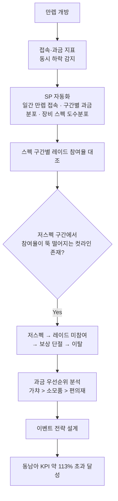
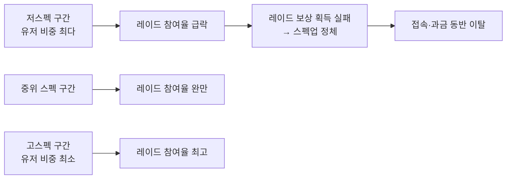
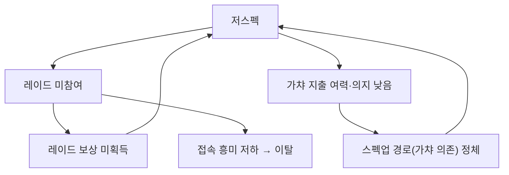

만렙 개방 이벤트를 준비할 때만 해도 기대가 컸다. 레벨 상한이 풀리면 유저들이 새 목표를 향해 더 오래 붙어있을 거라고 봤다. 그런데 개방하고 2\~3주쯤 지나자 접속 지표와 과금 지표가 **동시에** 꺾이는 걸 봤다. 처음엔 "만렙 찍고 할 거 없어서 그런가" 정도로 넘겼다. 숫자를 더 파보니 훨씬 구체적인 구조가 있었다. 라이브 게임 하나에서 실제로 뜯어봤던 이 분석을 — 게임명과 실제 수치는 빼고 — 방법론 중심으로 정리한다.

전체 흐름부터 본다.



## 만렙 '개방'이 왜 이탈의 시작점이 되나?

레벨업 구간에서는 목표가 명확하다. 다음 레벨, 다음 스킬. 그런데 만렙(레벨 상한, 더 이상 캐릭터 레벨이 오르지 않는 지점)에 도달하면 성장의 축이 레벨에서 **장비 스펙**(장비 강화·세팅 수준을 종합한 값, 흔히 '전투력'이라 부른다)으로 바뀐다. 다음 목표는 레이드(다수 유저가 함께 도전하는 엔드콘텐츠 보스전)다.

여기서 문제가 생긴다. 레벨업은 누구나 시간만 들이면 따라간다. 하지만 장비 스펙은 그렇지 않다. 강화 재화, 확률형 아이템, 파티 매칭까지 얽히면서 유저 간 격차가 순식간에 벌어진다. "할 게 없어서 이탈"이라는 가설로는 이 격차를 설명할 수 없었다. 그래서 스펙 자체의 **분포**를 봐야 했다.

## 구간별 장비 스펙 분포는 어떻게 뽑았나?

매일 손으로 뽑을 수 있는 양이 아니었다. 만렙 도달자는 매일 늘어나고, 스펙 값도 매일 바뀐다. 그래서 Stored Procedure(SP, DB에 저장해두고 매일 자동으로 돌리는 쿼리 묶음)로 세 가지를 매일 자동 집계했다.

- **일간 만렙 접속자** 수와 재접속 흐름
- **구간별 과금분포** — 과금액대별로 유저를 나눠 컨텐츠 매출분포와 겹쳐 보기
- **장비 스펙 도수분포** — 스펙 값을 구간으로 쪼개 구간마다 몇 명이 있는지 세는 표(히스토그램의 기초)

집계 결과는 Excel에서 도수분포표·레이더 차트·파이 차트로 시각화했다. 레이더 차트는 스펙 구간별 특성을 한눈에 비교하는 용도였고, 파이 차트는 과금 항목 비중을 볼 때 썼다. 개념만 옮기면 이런 구조다.

```sql
-- 개념 예시(합성). 실제 스키마 아님.
SELECT
    spec_bucket,                                   -- 장비 스펙 구간(low/mid/high 등)
    COUNT(DISTINCT user_id)                                    AS user_cnt,
    CAST(COUNT(DISTINCT CASE WHEN raid_flag = 1 THEN user_id END) AS FLOAT)
        / NULLIF(COUNT(DISTINCT user_id), 0)                   AS raid_join_rate
FROM   max_level_daily_status
WHERE  play_date = @target_date
GROUP  BY spec_bucket;
```

스펙 구간(spec_bucket)과 레이드 참여 여부(raid_flag)만 로그에 심어두면, 나머지는 매일 SP가 채워준다. 나는 그 결과표를 보고 판단만 하면 됐다.

## 스펙 분포가 레이드 미참여로 어떻게 이어지나?

도수분포표를 그려보고 알았다. 유저가 고르게 퍼져 있는 게 아니라 **저스펙 구간에 가장 많이 몰려** 있었다. 그리고 그 구간에서 레이드 참여율이 완만하게 떨어지는 게 아니라 **뚝 끊기듯** 떨어지는 컷라인이 보였다.



이 컷라인이 결정적이었다. "만렙 찍고 할 거 없어서 이탈"이 아니라 "스펙이 컷라인 아래라 레이드 입구에서 걸러져서 이탈"이었던 것이다. 레이드는 파티 콘텐츠라 스펙이 부족한 한 명 때문에 클리어가 막히는 경우가 흔하고, 그러다 보니 저스펙 유저는 초대조차 잘 안 됐다. 참여 자체가 막히니 보상도 못 받고, 보상을 못 받으니 스펙도 못 올리는 구조였다.

## 저스펙 유저는 왜 스펙업을 못 하고 멈추나?

구간별 과금분포를 겹쳐 보니 답이 나왔다. 과금 우선순위는 **가챠 > 소모품 > 편의재** 순이었고, 그중에서도 가챠가 매출에서 차지하는 비중이 압도적으로 컸다. 문제는 스펙업의 핵심 경로 역시 가챠에 크게 의존한다는 점이다. 저스펙 유저는 애초에 과금 여력이나 의지가 낮은 층이 많았고, 그러니 가챠로 스펙을 뒤집을 기회 자체가 적었다.



레이드 미참여 → 보상 단절 → 스펙 정체 → 다시 레이드 미참여. 여기에 가챠 의존적인 스펙업 경로가 겹치면서 저스펙 유저는 스스로 빠져나올 지렛대가 없는 루프에 갇혀 있었다. 접속률과 과금이 동시에 빠진 이유가 여기서 설명됐다 — 두 지표가 사실 같은 원인(스펙 컷라인)에서 갈라져 나온 증상이었던 거다.

## 이 분석은 어떤 액션으로 이어졌나?

문제의 좌표가 "저스펙 구간 유저가 레이드 진입 컷라인 아래에 몰려 있다"로 좁혀지자, 대응은 명확해졌다. 이 구간을 겨냥한 이벤트 전략을 설계해 유관부서와 함께 실행했다. 저스펙 유저가 참여 가능한 완화된 진입 조건이나 스펙업 보조 수단을 이벤트로 붙이는 방향이었다(내부 이벤트 설계 상세는 비공개).

결과적으로 이 전략이 붙은 지역에서 **상반기 목표 KPI 매출을 약 113% 초과 달성**했다. 상반기 전체 KPI도 최종 달성으로 마무리됐다. 숫자 자체보다 강조하고 싶은 건, 분석이 "이탈했다"는 진단에서 끝나지 않고 "어느 구간을 어떻게 건드려야 하는가"라는 실행 가능한 좌표까지 내려갔기 때문에 이 결과가 나왔다는 점이다.

## 정리 — 이탈은 증상이고, 분포는 원인을 가리킨다

- **만렙 개방** 후에는 성장 축이 레벨에서 **장비 스펙**으로 바뀌고, 다음 목표는 **레이드**다.
- 접속·과금 이탈은 하나의 원인이 아니라 **장비 스펙 도수분포**로 쪼개봐야 구조가 보인다.
- 저스펙 구간에 유저가 몰려 있고, 그 구간에서 **레이드 참여율이 컷라인처럼 끊긴다**는 게 핵심 발견이었다.
- 과금 우선순위(가챠 > 소모품 > 편의재)와 스펙업 경로가 겹치면서 저스펙 유저는 **자력으로 못 빠져나오는 루프**에 갇힌다.
- 문제 좌표가 구체적일수록 이벤트 전략도 구체적이 되고, 실행 후 KPI로 다시 검증할 수 있다.

접속률과 과금이 같이 빠질 때 "둘 다 나쁘다"로 뭉뚱그리지 않고 도수분포까지 내려가 보는 습관 — 이게 증상과 원인을 구분하는 방법이라고 생각한다. 다음 글에서는 이 저스펙 루프를 조기에 잡아내기 위해 만렙 도달 시점부터 어떤 지표를 코호트로 추적했는지 정리한다.

- 방법론·합성 스키마 레시피: [github.com/DBhyeong/game-data-recipes](https://github.com/DBhyeong/game-data-recipes)
