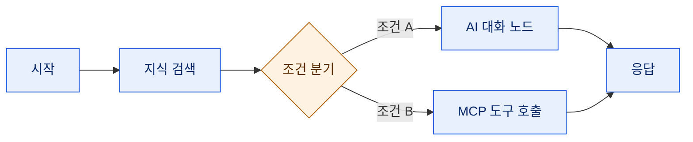
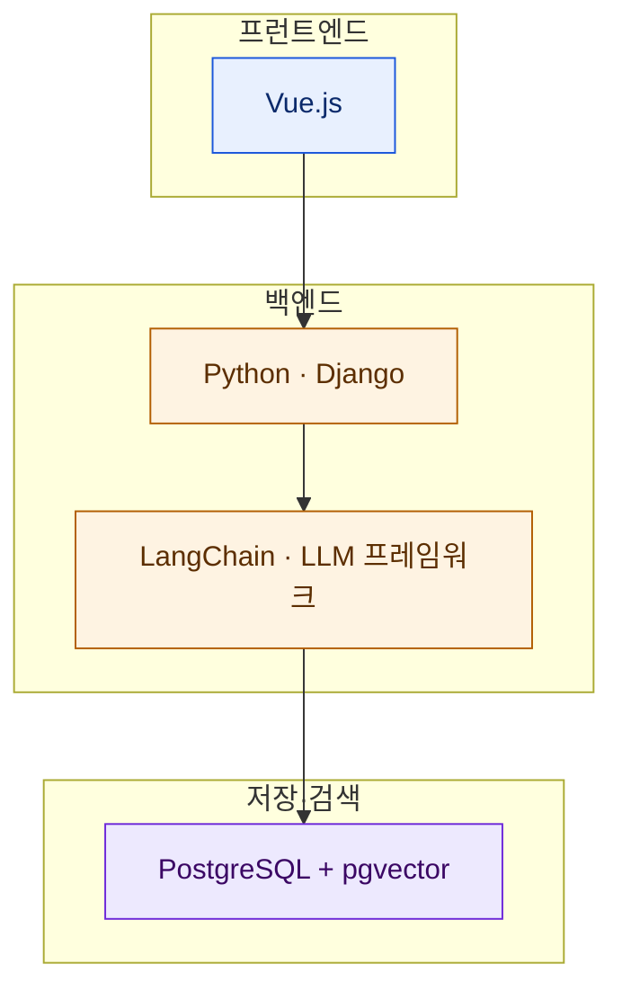

# MaxKB — 기업용 오픈소스 RAG 에이전트 플랫폼

> 나는 방금 내 지식 창고를 [[knowledge-vault-fts-graph-mcp-search|무벡터 SQLite + MCP로 검색]]되게 만들었다. 벡터도 임베딩도 없이, 가볍게. 그런데 **똑같은 문제**를 **정반대 방식**으로, 그것도 기업 규모로 푸는 오픈소스가 눈에 들어왔다 — MaxKB다. 국내 파이토치 커뮤니티(9bow/박정환 님)에서 소개글로 접했고, 사실관계는 공식 저장소로 직접 확인해봤다.

## MaxKB가 푸는 문제는 뭔가?

LLM을 업무 시스템에 붙일 때 누구나 첫 벽에 부딪힌다. **모델이 우리 회사 문서와 도메인 지식을 모른다**는 것. 아무리 똑똑한 모델도 사내 규정, 제품 매뉴얼, 상담 이력은 학습한 적이 없다.

MaxKB는 이 문제를 **RAG(검색 증강 생성)**로 푼다. 이름부터 "Max Knowledge Brain", 즉 지식 두뇌를 표방한다.

RAG를 한 줄로 풀면 이렇다. 질문이 오면 **먼저 내 문서에서 관련 근거를 검색**하고, 그 근거를 모델에게 같이 던져 **근거 기반으로 답하게** 하는 것. 모델의 기억에만 의존하지 않으니, 프로젝트 설명대로 "환각(없는 사실을 지어내는 것)을 효과적으로 줄인다".


활용 시나리오로는 **지능형 고객 상담, 사내 지식 베이스, 학술 연구, 교육 현장**을 든다.

## 핵심 기능 다섯 가지는?

MaxKB는 자신을 다섯 축으로 소개한다. 공식 저장소 기준 그대로 정리하면 이렇다.

| 축 | 무엇을 |
|---|---|
| **RAG 파이프라인** | 문서 직접 업로드 + 온라인 문서 자동 수집, 자동 분할·벡터화, 근거 기반 Q&A |
| **에이전트 워크플로우** | 워크플로우 엔진 + 함수 라이브러리 + MCP 도구 사용으로 복잡한 업무 흐름 조율 |
| **손쉬운 통합** | 코드 없이 서드파티 시스템에 붙여 지능형 질의응답 추가 |
| **모델 불문** | 사설(DeepSeek·Llama·Qwen) + 공개(OpenAI·Claude·Gemini·MiniMax) 모두 지원 |
| **멀티모달** | 텍스트·이미지·오디오·비디오 입출력 기본 지원 |

여기서 눈여겨볼 건 두 번째, **에이전트 워크플로우**다. 단순 Q&A 봇을 넘어, 시작 → 지식 검색 → 조건 분기 → AI 대화 노드를 **캔버스 위에서 연결**해 동작 흐름을 짜는 GUI 편집기를 제공한다. 검색만 하는 게 아니라, 검색 결과를 조건에 따라 분기시키고 도구를 호출하는 **에이전트**를 코드 없이 조립하는 셈이다.



## 무엇으로 만들었나?

기술 스택이 흥미롭다. 특히 **데이터베이스 선택**이.



포인트는 **별도의 전용 벡터 데이터베이스가 없다**는 것. Pinecone이나 Milvus 같은 벡터 DB를 따로 두지 않고, **PostgreSQL 하나에 pgvector 확장**을 얹어 지식 베이스와 벡터 검색을 함께 처리한다. 운영해야 할 인프라가 하나 줄어드는, 실용적인 선택이다.

## 설치는 얼마나 쉬운가?

**도커 컨테이너 하나**면 끝난다.

```bash
docker run -d --name=maxkb --restart=always -p 8080:8080 -v ~/.maxkb:/opt/maxkb 1panel/maxkb
```

컨테이너가 올라오면 `http://서버IP:8080` 으로 접속. 기본 관리자 계정은 `admin`, 초기 비밀번호는 `MaxKB@123..`(끝에 점 두 개까지) 이다.

> ⚠️ 초기 비밀번호가 **문서에 공개**돼 있다는 건, 접속 가능한 사람 누구나 안다는 뜻이다. 외부에 노출되는 서버라면 **띄우자마자 비밀번호부터 바꾸고**, 8080 포트를 함부로 열어두지 말자. 이건 MaxKB만의 문제가 아니라 "기본 크레덴셜을 그대로 두는" 모든 셀프호스팅의 고전적 사고 지점이다.

## 라이선스에 함정은 없나?

여기서 상업 도입 전 반드시 짚어야 할 두 가지가 있다.

첫째, **GPL-3.0**. 자유롭게 쓰고 고칠 수 있지만, 파생물을 **배포**할 땐 같은 라이선스로 소스를 공개해야 하는 **카피레프트** 조건이 붙는다. 사내에서만 쓰면 대개 배포에 해당하지 않지만, 이걸 고쳐서 제품에 실어 외부에 내보낼 계획이라면 법무 검토가 필요하다.

둘째, 저장소를 뜯어보다 발견한 건데 — 릴리즈 노트 곳곳에 **X-Pack**이라는 태그가 붙은 기능들이 있다(음성 입력, 역할별 권한 세분화 등). 이건 MaxKB가 순수 오픈소스가 아니라 **오픈코어(open-core)** 모델이라는 신호다. 즉 **핵심은 GPL로 공개, 일부 기업용 기능은 유료 확장**으로 분리돼 있다. "오픈소스니까 전부 무료"라고 넘겨짚으면 정작 필요한 기능이 유료 벽 뒤에 있을 수 있다.

참고로 최신 릴리즈는 **v2.10.3-lts**(2026년 7월 3일 공개), 개발 주체는 GitHub의 **1Panel-dev** 조직이다.

## 내가 만든 볼트와는 뭐가 다른가?

여기가 내가 이 글을 쓴 진짜 이유다. 나는 최근 내 파일 창고를 검색되게 만들면서 MaxKB와 **정반대 선택**을 했다. 둘을 나란히 놓으면, "LLM에게 내 지식을 물리는" 스펙트럼의 양 끝이 보인다.

| | 내 개인 볼트 | MaxKB |
|---|---|---|
| 목표 | 내 파일을 정확히 찾기 | 기업 지식 Q&A·상담 에이전트 |
| 검색 원리 | FTS5 키워드 + 관계 그래프 (**무벡터**) | RAG (**벡터 유사도**) |
| 저장소 | SQLite 파일 하나 | PostgreSQL + pgvector |
| 인터페이스 | MCP(에이전트가 직접 질의) | 웹 UI + 워크플로우 편집기 + API |
| 배포 | 로컬 스크립트 | 도커 컨테이너 |
| 대상 | 개인 한 명 | 멀티유저·권한·상담봇(기업) |
| 라이선스 | 그냥 내 것 | GPL-3.0 + X-Pack |

방향이 갈리는 지점은 명확하다. 내 볼트는 **"내가 이미 아는 파일에서 정확한 한 줄"**을 찾는 게 목적이라, 키워드와 구조 그래프로 충분했다. 반면 MaxKB는 **"질문의 의미와 비슷한 문서를 폭넓게"** 끌어와 답을 합성해야 하니 벡터 유사도(RAG)가 맞다. 정밀 조회냐, 의미 검색이냐. 개인이냐, 조직이냐.

그래서 결론은 "무엇이 낫다"가 아니라 **"언제 무엇"**이다.

- 혼자, 이미 아는 파일 더미를 정확히 뒤지고 싶다 → **가벼운 무벡터 색인**으로 충분하다.
- 여러 사람이, 방대한 문서에 자연어로 묻고, 상담봇·워크플로우까지 얹어야 한다 → **MaxKB 같은 RAG 플랫폼**이 답이다.

내가 벡터DB를 피한 건 벡터가 나빠서가 아니라, 내 문제엔 과했기 때문이다. MaxKB를 보며 그 경계를 다시 확인했다.

> 도구의 무게는 문제의 무게에 맞춰야 한다. 남이 도커로 푸는 걸 나는 파일 하나로 풀 수도 있고, 그 반대도 성립한다. 중요한 건 **내 문제의 크기를 정직하게 재는 것**이더라.

---

**출처·확인**: 공식 저장소 [github.com/1Panel-dev/MaxKB](https://github.com/1Panel-dev/MaxKB) 의 README·릴리즈를 직접 확인해 정리했다. 국내에선 파이토치 한국 커뮤니티의 9bow(박정환) 님 소개글을 통해 처음 접했다. 버전·라이선스·설치 명령은 글 작성 시점(2026-07-08) 기준이며, 도입 전 최신 저장소를 다시 확인하길 권한다.
