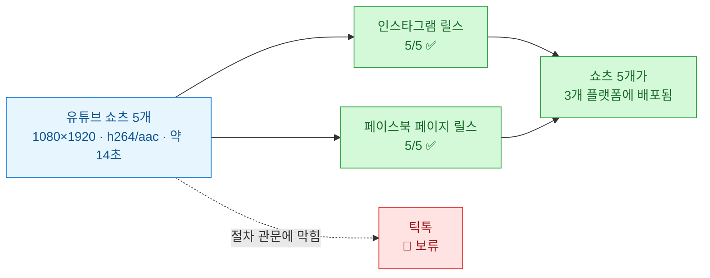
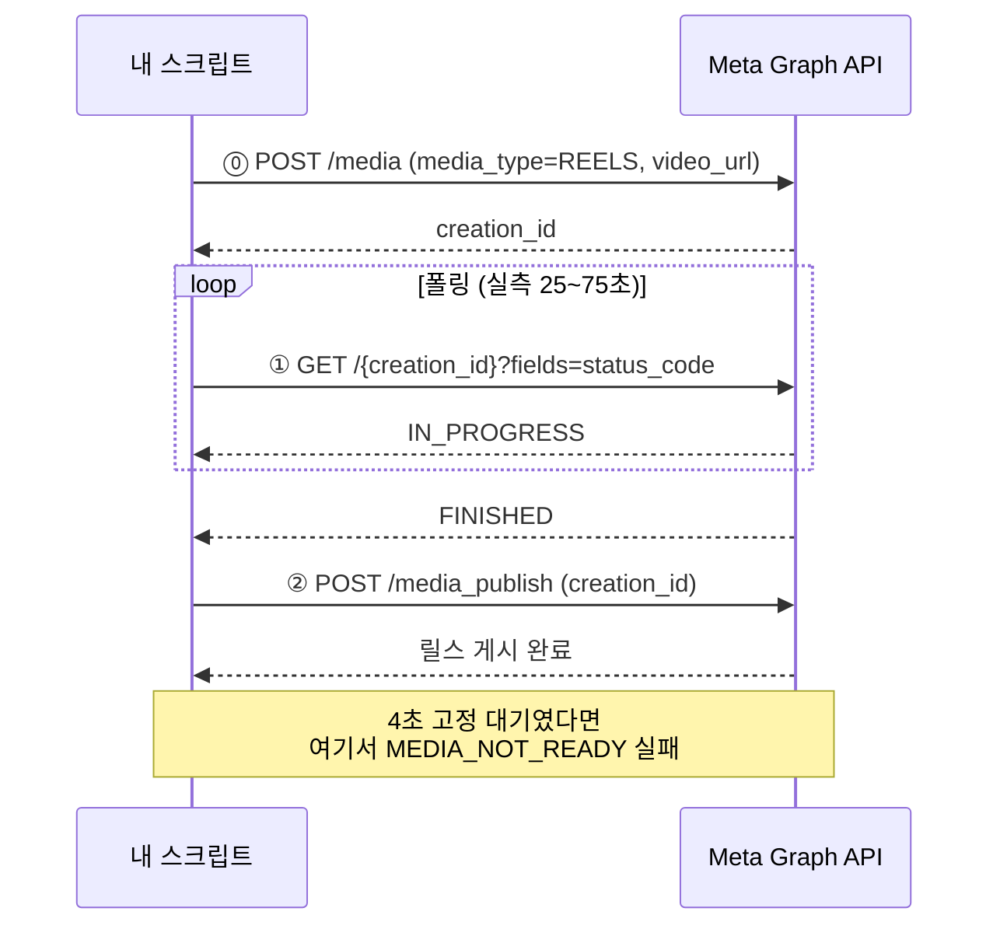
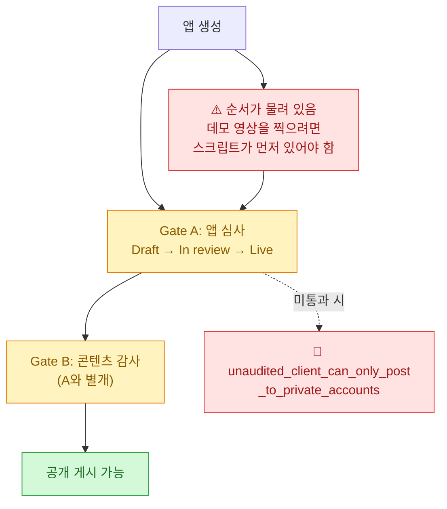

유튜브에 올린 쇼츠 5개를 **인스타그램 릴스와 페이스북 페이지 릴스에 API로 배포**했다. 결과는 5/5, 5/5로 다 나갔다. 그런데 이 글에서 정말 남기고 싶은 건 성공한 부분이 아니라 **중간에 저지른 사고**다.

먼저 오늘 한 일을 한 장으로.



## 사진 올리던 스크립트를 왜 못 썼나?

나는 이미 인스타그램에 카드 이미지를 API로 올리는 스크립트를 갖고 있었다. 그래서 처음엔 "영상 경로만 넣으면 되겠지" 했다. **세 군데서 막혔다.**

| 항목 | 사진 (기존) | 릴스 (필요) |
|---|---|---|
| 컨테이너 파라미터 | `image_url` | **`media_type=REELS` + `video_url`** |
| 대기 방식 | **4초 고정 대기** | **`status_code` 폴링 → `FINISHED`** |
| 업로드 헬퍼 | jpg/png/webp만 허용 | mp4 허용 필요 |

막힌 지점은 전부 **내가 만든 화이트리스트**였다. mime 타입 판별 함수가 jpg/png/webp 외에는 예외를 던지고, URL 검증이 이미지 확장자만 통과시키고, 크기 상한이 8MB로 박혀 있었다. 정작 임시 호스팅 서비스 자체는 mp4를 1GB까지 받는데 말이다. **내 코드가 나를 막고 있었다.**

그런데 **진짜 함정은 대기 방식**이었다.

사진은 컨테이너를 만들고 4초 기다렸다가 게시하면 됐다. 그 숫자가 어디서 왔는지 지금 보면 그냥 "대충 이 정도면 되더라"였다. 영상은 다르다. 실측해 보니 **15초짜리 영상 하나를 메타가 인코딩하는 데 25\~75초**가 걸렸다.



**4초 고정 대기를 그대로 썼으면 5개 전부 `MEDIA_NOT_READY`로 실패했을 것이다.** 폴링은 선택이 아니라 필수였다.

공유 모듈은 기존 이미지 경로를 안 깨는 쪽으로 확장했다. `kind`(image/video)별로 확장자·크기상한·URL패턴·에러문구를 분리하고, 기존 함수는 새 함수를 부르는 래퍼로 남겼다. 그리고 **사진 게시를 dry-run으로 돌려 회귀를 확인**했다. 되던 게 계속 되는지 보는 건 30초면 되는데, 안 하면 나중에 조용히 깨져 있다.

## ⚠️ 되돌릴 수 없는 걸 배치로 돌렸다

여기가 이 글의 핵심이다.

인스타그램 5개를 올리면서 **5분 간격을 두려고 했다.** 연속으로 몰아 올리면 스팸으로 읽히니까. 그런데 그 생각을 실행에 옮기려는 시점에 **이미 5개가 전부 나가 있었다.** 실제 소요는 **5분 21초**. 5개가 그 안에 다 게시됐다.

원인은 단순하다. 1개를 검증하고 나머지 4개를 배치 스크립트로 연속 실행 중이었다. **배치는 내 마음이 바뀌는 걸 기다려 주지 않는다.**

그리고 되돌릴 수가 없었다.

> **인스타그램 그래프 API에는 삭제 엔드포인트가 없다.**

올린 릴스를 API로 지울 방법이 없다. 앱에서 손으로 지우는 것 말고는. 이게 사진이었으면 그러려니 했을 텐데, 릴스 5개가 1분 간격으로 줄줄이 올라간 피드는 보기가 좋지 않다.

**교훈을 두 줄로 적었다.**

1. **되돌릴 수 없는 외부 게시는 배치로 연속 실행하기 전에 간격과 범위를 먼저 확정한다.** 실행 중에 바꿀 수 있다고 생각하면 안 된다.
2. **묶음 게시 전 `--dry-run`은 선택이 아니다.** 특히 삭제 엔드포인트가 없는 플랫폼에서는.

조치로 배치 스크립트에 `--interval-ms`(기본 5분)를 넣었고, **페이스북 게시부터 적용**했다.

이 사고가 알려준 게 하나 더 있다. 나는 그동안 [[social-syndication-9-channels-api|신디케이션]]을 만들면서 "실패하면 재시도하면 되지"를 기본값처럼 깔고 있었다. 그런데 **게시는 실패보다 성공이 무섭다.** 실패는 재시도하면 되고, 성공은 되돌릴 수 없다.

## 페이스북이 인스타그램보다 단순했다

의외였다. 같은 메타인데 페이스북 릴스가 훨씬 편했다.

| 항목 | Instagram | Facebook |
|---|---|---|
| 파일 전달 | **공개 URL만 허용** → 임시 호스팅 경유 필수 | **바이너리 직접 전송** |
| 임시 호스팅 | 필요 | **불필요** |
| 단계 | `/media` → 폴링 → `/media_publish` | `start` → `transfer` → `finish` |
| 캡션 URL | **클릭 불가** | **클릭 가능** |
| 길이 상한 | 15분 | 90초 |

**인스타그램은 파일을 URL로만 받는다.** 그래서 로컬 mp4를 어딘가에 임시로 올려서 공개 URL을 만든 다음 그 URL을 넘겨야 한다. 페이스북은 업로드 세션을 열고 **바이너리를 그냥 쏘면 된다.** 중간 단계가 통째로 사라진다.

그리고 **캡션의 링크가 실제로 클릭된다**는 게 컸다. 인스타그램은 캡션에 URL을 써도 클릭이 안 되니 "프로필 링크에서"라고 쓸 수밖에 없다. 그래서 캡션 전략을 둘로 나눴다.

- **인스타그램**: 해시태그 7개 포함 (도달을 해시태그에 기댐)
- **페이스북**: 해시태그 없이 **링크 중심** (페북은 해시태그 도달 효과가 낮고 링크가 실제로 눌림)

## 권한은 문서보다 probe가 정확하다

페이스북 릴스를 올리려면 권한이 있어야 하는데, **내 토큰에 그 권한이 있는지 확인할 방법이 없었다.**

- 페이지의 `tasks` 필드로 권한 목록을 물어보니 → **400 (nonexisting field)**
- 토큰을 디버그하려니 → 앱 시크릿을 `.env.local`에 안 두는 정책이라 불가

그래서 **엔드포인트를 직접 두드려 봤다.** 다만 게시가 되면 안 되니까 **읽기와 무해한 단계만** 골라서.

```
GET  /{page-id}/video_reels          → 200 {"data":[]}
POST /{page-id}/video_reels
     upload_phase=start              → 200 {"video_id":..., "upload_url":...}
```

`start`는 **업로드 세션만 여는 단계**라 게시되지 않는다. 세션은 그냥 만료된다. 이걸로 "현재 토큰으로 릴스 게시 가능"을 확인했고, **권한 재발급 없이 진행**했다.

이게 요즘 내가 반복해서 배우는 것 같다. [[pdf-inspector-korean-pdf-benchmark|어제 pdf-inspector를 잴 때]]도 문서가 말하는 것과 코드가 하는 게 달랐다. **문서는 의도를 적고, probe는 사실을 알려준다.** 다만 probe할 땐 **부수효과가 없는 단계를 골라야** 한다. 그게 아니면 그냥 실행이지 확인이 아니다.

## 틱톡은 코드 문제가 아니라 절차 문제였다

메타를 끝내고 틱톡으로 갔다가 **코드를 한 줄도 안 쓰고 멈췄다.**

메타식 접근이 통할 줄 알았다. 토큰 받고, 엔드포인트 두드리고, 게시. 틱톡은 **관문이 두 개**다.



**가장 큰 블로커**가 이거였다. 공식 문서는 이렇게 적어 놨다.

> "All content posted by unaudited clients will be restricted to private viewing mode."

읽으면 "영상이 비공개로 올라가나 보다" 싶다. **실제 동작은 더 엄격하다.** 에러 코드가 `unaudited_client_can_only_post_to_private_accounts`다. **영상이 비공개가 되는 게 아니라, 대상 계정 자체가 비공개여야 한다.** 공개 계정이면 게시 호출 자체가 튕긴다.

즉 **코드가 완벽해도 첫 호출에서 실패**한다. 그리고 순서가 고약하게 물려 있다 — **심사에 데모 영상이 필요한데, 데모 영상을 찍으려면 스크립트가 먼저 있어야 한다.**

그 밖에 확인한 것들.

- 미심사 상태: **24시간당 최대 5명**의 사용자만 게시 가능
- 샌드박스도 해결책이 아님 — 공개 영상용 Content Posting API를 지원하지 않음
- **심사 기간에 공식 수치가 없다.** 검색하면 "1\~3일"이 나오는데, 확인해 보니 **다른 제품(Mini Games) 문서의 수치**였다. 신뢰할 근거가 아니다
- 계정당 하루 약 15개 상한 (심사 여부 무관)

그래서 **비용 판단으로 넘겼다.**

| | 메타 | 틱톡 |
|---|---|---|
| 소요 | 토큰 재사용, 당일 5개 게시 | 약관 페이지 2장 + 샌드박스 + 데모 영상 + 앱 심사 + 콘텐츠 감사 |
| 기간 | 즉시 | **불명**, 반려 가능성 존재 |
| 대안 | — | 앱에서 수동 업로드 시 5개당 약 10분 |

**주 1회 배치를 돌리는데 API 자동화가 회수되는 시점이 언제인지 모르겠다.** 수동 10분이면 그냥 손으로 올리는 게 나을 수도 있다. 결정을 미뤄 뒀다. 자동화가 항상 답은 아니다.

## 배포를 늘려도 안 풀리는 게 하나 있다

기술 얘기 말고 데이터 얘기 하나.

어제 올린 쇼츠 2개가 각각 **1,614회와 1,480회**를 찍었다. 합쳐서 3,108회. 소재를 데이터 분석에서 반도체·투자·양극화로 바꾼 게 유효했다 — 열흘 전 쇼츠들이 202\~580회였으니 **3\~8배**다.

같은 날 올린 **롱폼은 14회**다.

| 콘텐츠 | 조회 |
|---|---|
| 쇼츠 2개 합계 | **3,108** |
| 같은 날 롱폼 | **14** |

하루밖에 안 지났으니 초기 구간인 건 감안해야 한다. 그런데 이전 롱폼들도 48·52·23회였다. **쇼츠가 3,108회를 모으는 동안 롱폼이 14회면, 쇼츠→롱폼 연결이 거의 작동하지 않는다는 뜻**이다.

오늘 나는 그 쇼츠를 **플랫폼 3개로 늘렸다.** 그런데 연결이 안 되는 구조에서 배포처를 늘리면, **조회수는 늘고 목적지는 그대로**다. 배포는 유통 문제를 풀지 콘텐츠 문제를 풀지 않는다. 다음에 볼 건 채널을 더 늘리는 게 아니라 **쇼츠에서 롱폼으로 넘어가게 만드는 것**이다.

## 정리

오늘 만든 것.

| 파일 | 내용 |
|---|---|
| `instagram_reels_publish.mjs` | IG 릴스 단건 (폴링 옵션 포함) |
| `facebook_reels_publish.mjs` | FB 페이지 릴스 단건 (3단계 업로드) |
| `reels_batch_publish.mjs` | 묶음 순차 게시 (`--interval-ms` 기본 5분) |
| `temporary_image_upload.mjs` | `kind: image\|video` 분리 확장 (기존 경로 보존) |

남은 것도 적어 둔다.

- **간격 보정 미적용** — `--interval-ms` 대기가 **인코딩 시간 위에 더해진다.** 그래서 5분을 요청했는데 실제 간격이 5분 20\~35초로 나왔다. 처리 소요를 빼서 보정해야 정확해진다
- **토큰 만료** — 페이지 토큰이 8월 하순 만료 예상
- **틱톡 결정 보류** — API 진행 / 수동 / 재검토
- **쇼츠→롱폼 연결** — 위에 쓴 그거

---

*측정·작업일 2026-07-15. 조회수는 유튜브 Data API v3 실시간 통계 기준이며, Analytics API는 07-12까지만 집계돼 있어 시청 지속시간·유입경로는 07-16 이후 재조회 예정이다. 인코딩 소요 25\~75초는 15초 분량 영상 5건의 실측값이다. 틱톡 관련 내용은 2026-07-15 기준 공식 문서 조사분이며 코드는 작성하지 않았다.*
