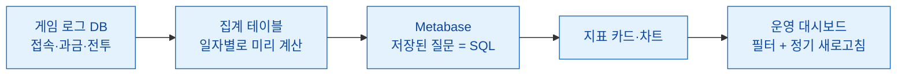
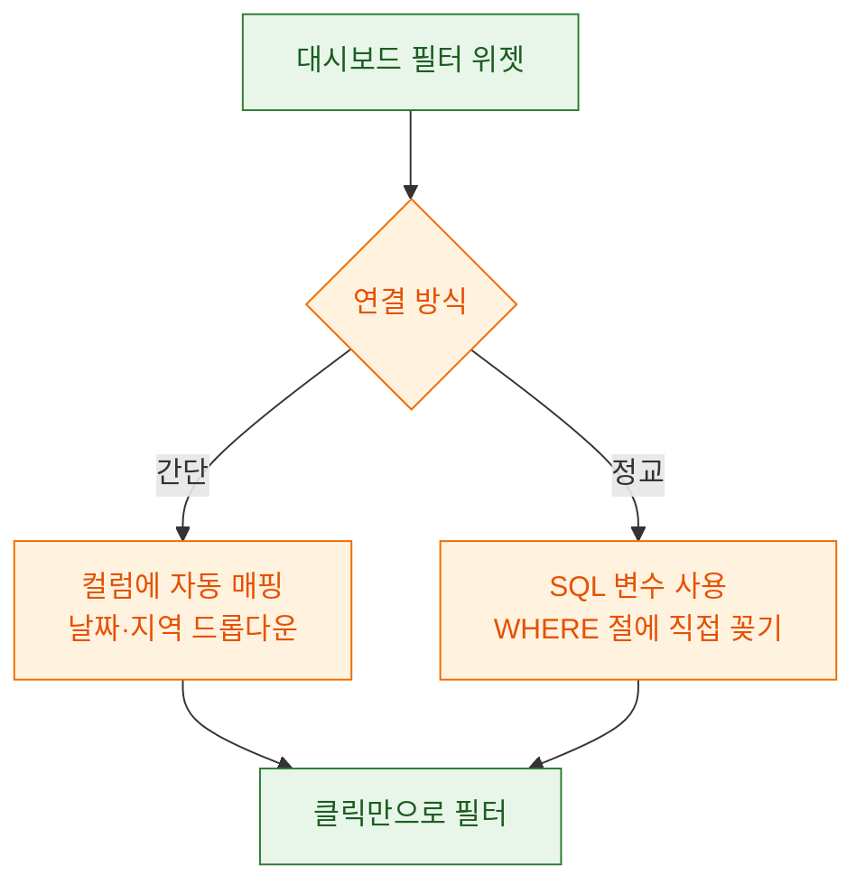
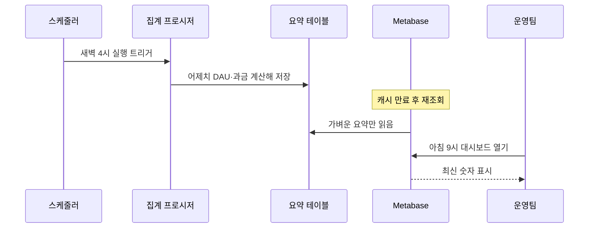

> "대시보드 몇 개 띄워놓고 그래프만 쳐다보는 사람" — 데이터 분석가를 이렇게 오해하는 사람이 많다. 그런데 그 대시보드를 처음 만드는 일부터가 은근히 손이 많이 간다.

게임 운영팀에서 나한테 제일 자주 하는 부탁이 있다. "형, 매일 아침에 열어볼 수 있는 화면 하나만 만들어줘." DAU가 어제보다 빠졌는지, 과금 유저가 줄었는지, 신규 이벤트가 먹혔는지를 한 화면에서 보고 싶다는 거다. 나는 이걸 Metabase로 푼다. 오늘은 내가 운영 대시보드를 처음 만들 때 밟는 순서를, 정말 처음 만드는 사람 기준으로 하나씩 풀어 보려고 한다. 참고로 이 글에 나오는 수치·게임·테이블 이름은 전부 예시용 더미다. 실제 데이터는 하나도 없다.

## Metabase가 뭐길래 이걸 쓰나?

한 줄로 말하면, SQL 결과를 예쁜 카드와 차트로 바꿔주고 그걸 대시보드에 붙여주는 도구다. 엑셀로 매일 표를 새로 뽑아 붙이는 대신, 쿼리 한 번 저장해두면 Metabase가 정해진 시각마다 알아서 다시 돌려 최신 숫자로 갈아 끼운다. 개발자가 아니어도 화면에서 클릭 몇 번으로 필터를 걸 수 있다는 게 운영팀 입장에서 제일 큰 매력이다.

전체 흐름을 먼저 그림으로 보자. 데이터가 어디서 와서 화면까지 어떻게 도달하는지다.



핵심은 가운데 B 단계다. 원본 로그를 대시보드가 그때그때 통째로 훑게 하면 화면이 느려터진다. 그래서 나는 하루치를 미리 계산해 집계 테이블에 쌓아두고, Metabase는 그 가벼운 테이블만 읽게 만든다. 이 얘기는 뒤에서 다시 하겠다.

## 어떤 지표를 카드로 올려야 하나?

처음 만드는 사람이 제일 많이 하는 실수가 "숫자를 다 올리는 것"이다. 카드가 서른 개쯤 되면 아무도 안 본다. 나는 운영팀이 매일 아침 3분 안에 훑을 수 있는 여섯~여덟 개로 줄인다. 게임 운영에서 내가 기본으로 올리는 지표는 이 정도다.

| 지표 | 쉬운 설명 | 왜 보나 |
| --- | --- | --- |
| DAU | 하루에 접속한 유저 수 | 게임이 살아있는지 보는 맥박 |
| 신규 유저(NRU) | 오늘 처음 들어온 사람 | 마케팅이 먹히는지 |
| D1 리텐션 | 오늘 온 신규가 내일 다시 오는 비율 | 초반 재미가 있는지 |
| PU 비율 | 접속자 중 돈 쓴 사람 비율 | 과금 전환이 되는지 |
| ARPPU | 결제한 사람 1인당 평균 결제액 | 큰손이 붙었는지 |
| 재구매율 | 산 사람이 또 사는 비율 | BM이 지속되는지 |

용어가 낯설 수 있으니 두 개만 풀어 쓴다. ARPPU는 "돈 쓴 사람들만" 놓고 평균 낸 값이다. 전체 유저로 나누는 ARPU와 다르다. 신규 대규모 유입으로 ARPU는 떨어져도 ARPPU는 오를 수 있는데, 그럼 "큰손이 붙었다"는 신호다. 재구매율은 한 번 결제한 유저가 정해진 기간 안에 다시 결제하는 비율이다. 이게 꺾이면 이벤트 상품이 물렸다는 뜻이라 나는 특히 예민하게 본다.

지표를 정했으면 각각을 Metabase에서 "질문(Question)"으로 만든다. 질문은 결국 저장된 SQL 한 덩어리다. 예를 들어 DAU 카드는 이런 모양의 쿼리가 된다. 아래는 전부 더미 테이블 이름을 쓴 예시다.

```sql
-- 최근 30일 일자별 접속 유저 수 (더미 예시)
SELECT
    play_date,
    COUNT(DISTINCT user_key) AS dau
FROM daily_login_summary   -- 미리 집계해 둔 요약 테이블
WHERE play_date >= DATEADD(DAY, -30, CAST(GETDATE() AS DATE))
GROUP BY play_date
ORDER BY play_date;
```

이 질문 하나를 저장하면 "숫자 카드"로도, "꺾은선 차트"로도 쓸 수 있다. 하나 만들어두고 화면 표시 방식만 바꾸는 식이다.

## 필터는 어떻게 붙여야 운영팀이 편할까?

카드만 있으면 반쪽짜리다. 운영팀은 "동남아 서버만", "지난 7일만", "iOS만" 같은 조건을 스스로 걸고 싶어 한다. 이걸 매번 나한테 물어보면 서로 피곤하니까, 대시보드 상단에 필터 위젯을 달아준다.

Metabase에서 필터를 붙이는 방식은 두 갈래다.



정교하게 가려면 SQL 안에 변수를 심는다. Metabase는 중괄호 두 개로 변수를 표시한다. 이렇게 써두면 운영팀이 대시보드에서 지역을 고를 때마다 그 값이 쿼리에 자동으로 꽂힌다.

```sql
-- 지역 필터를 받는 질문 (더미 예시)
SELECT play_date, COUNT(DISTINCT user_key) AS dau
FROM daily_login_summary
WHERE play_date >= DATEADD(DAY, -30, CAST(GETDATE() AS DATE))
  [[ AND region_code = {{region}} ]]   -- 대괄호 두 개 = 값 없으면 이 줄 통째로 무시
GROUP BY play_date
ORDER BY play_date;
```

여기서 대괄호 두 개로 감싼 부분이 포인트다. 운영팀이 지역을 안 고르면 그 줄 전체가 사라져서 전체 지역 기준으로 나온다. "필터를 비워두면 전부 보여줘"라는 흔한 요구를 이 한 줄로 해결한다. 나는 날짜 범위, 지역, 플랫폼(iOS/안드로이드) 세 개를 기본 필터로 깔아두는 편이다. 이 세 개면 운영팀 질문의 대부분이 셀프서비스로 풀린다.

## 매일 자동으로 새로고침되게 하려면?

대시보드가 어제 숫자를 물고 있으면 아무도 안 믿는다. 정기 새로고침을 두 층위로 나눠서 건다.

첫째 층위는 데이터 자체를 미리 계산해 두는 파이프라인이다. 나는 원본 로그를 밤사이에 한 번 훑어서 일자별 요약 테이블로 만들어 둔다. MS-SQL 환경이면 이 집계를 Stored Procedure로 짜서 스케줄러에 물린다. 말이 어렵지, "매일 새벽 4시에 어제치 숫자를 계산해서 요약 테이블에 넣어라"를 예약해 두는 것뿐이다.



둘째 층위는 Metabase 쪽 캐시와 구독이다. Metabase는 질문 결과를 잠깐 캐시에 담아두는데, 이 캐시 유효시간을 데이터 갱신 주기에 맞춰준다. 데이터가 하루 한 번 바뀌는데 캐시를 5분으로 잡으면 DB만 괜히 두들긴다. 반대로 운영 중 실시간에 가깝게 봐야 하는 카드는 짧게 잡는다. 그리고 대시보드 "구독" 기능으로 매일 아침 정해진 시각에 이미지 형태 요약을 메신저나 메일로 쏘게 걸어두면, 운영팀이 굳이 접속 안 해도 핵심 숫자가 먼저 도착한다.

새로고침 설정을 표로 정리하면 이렇다.

| 대상 | 갱신 방식 | 주기(예시) |
| --- | --- | --- |
| 요약 테이블 | Stored Procedure + 스케줄러 | 매일 04:00 |
| 질문 캐시 | Metabase 캐시 TTL | 6시간 |
| 실시간성 카드 | 짧은 캐시 | 10분 |
| 아침 요약 발송 | 대시보드 구독 | 매일 09:00 |

## 처음 만들 때 내가 겪은 함정들

세팅을 처음 하면 꼭 밟는 지뢰가 있다. 미리 알면 반나절을 아낀다.

첫째, 대시보드를 원본 로그에 직접 물리면 느리다. 앞에서 계속 강조한 이유가 이거다. 수천만 행짜리 로그를 매 조회마다 훑으면 카드 하나 뜨는 데 몇십 초씩 걸린다. 반드시 요약 테이블을 거쳐라.

둘째, 한글 깨짐이다. MS-SQL과 파이썬을 섞어 파이프라인을 돌릴 때 연결 문자열에서 인코딩을 UTF-8로 맞춰주지 않으면 지역명이나 아이템명이 물음표로 나온다. 연결 옵션에서 코드페이지를 UTF-8(65001)로 잡아주면 예방된다.

셋째, 지표 정의를 문서로 안 박아두면 나중에 싸운다. "리텐션이 접속 기준이야, 결제 기준이야?" 같은 질문이 두 달 뒤에 꼭 나온다. 나는 대시보드 맨 위에 텍스트 카드로 각 지표의 정의를 한 줄씩 적어둔다. 이게 나중에 나를 살린다.

## 마무리

정리하면 순서는 이렇다. 봐야 할 지표를 예닐곱 개로 추린다 → 각각을 저장된 질문(SQL)으로 만든다 → 날짜·지역·플랫폼 필터를 대시보드에 붙인다 → 요약 테이블과 캐시로 정기 새로고침을 건다 → 지표 정의를 화면에 적어둔다. 이 다섯 단계면 운영팀이 매일 아침 열어보는 대시보드가 완성된다.

처음엔 카드 하나 만드는 것도 버벅대지만, 두어 번 만들어보면 손에 붙는다. 중요한 건 화려함이 아니라 "매일 같은 숫자를, 같은 정의로, 알아서 갱신되게" 만드는 것이다. 그래야 운영팀이 그래프가 꺾이는 순간을 놓치지 않고, 나는 그때부터 진짜 분석을 시작할 수 있다. 대시보드는 답이 아니라 질문을 던지는 도구라는 걸, 나는 매번 다시 배운다.

## 참고자료

- [[game-metrics-7-definitions]] — DAU·리텐션·ARPPU 같은 기본 지표 정의 모음
- [[arpu-vs-arppu]] — ARPU와 ARPPU를 헷갈리지 않는 법
- [[cohort-m1-retention-sql]] — 코호트 기반 초반 리텐션 SQL
- [[revenue-simulation-dau-pu-arppu]] — DAU·PU비율·ARPPU로 매출을 쪼개 보는 시뮬레이션
- [[game-data-sql-recipes-retention-ltv]] — 리텐션·LTV 계산용 SQL 레시피 모음
- 예제 코드 저장소: https://github.com/DBhyeong/game-data-recipes

<!-- 안전: 합성/더미 데이터, 회사·실데이터·PII 없음. -->
