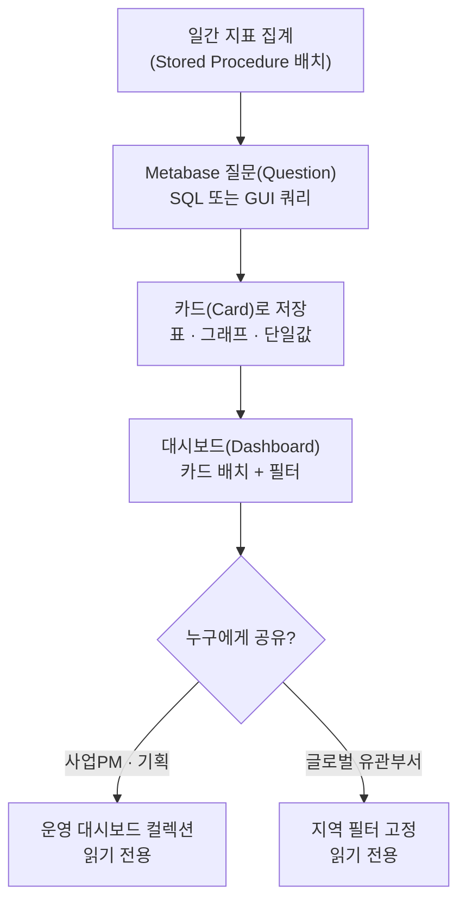
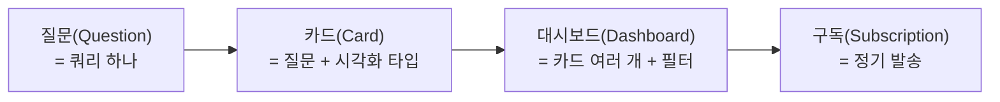
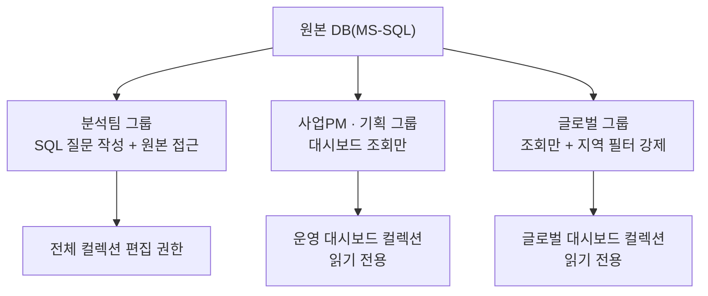

라이브 게임을 운영하다 보면 지표를 보고 싶어하는 사람이 분석가 혼자가 아니다. 사업PM은 이번 주 매출이 계획대로 가는지 궁금하고, 기획은 지난 패치 이후 지표가 어떻게 움직였는지 궁금하고, 글로벌 유관부서는 자기 지역 숫자만 빠르게 확인하고 싶어한다. 문제는 이 사람들이 SQL을 못 짠다는 점이다.

초반엔 그때그때 쿼리를 돌려서 결과를 캡처해 슬랙으로 보내줬다. 하루 이틀은 괜찮은데 매주 반복되니 내가 "살아있는 조회 버튼"이 돼버렸다. 어제 보낸 캡처가 오늘도 맞는지, 필터를 살짝만 바꿔도 되는지 매번 나를 거쳐야 했다. 그래서 Metabase(오픈소스 BI·대시보드 툴 — SQL을 몰라도 쿼리 결과를 표·그래프로 조회할 수 있게 해주는 도구)를 끌어와, "내가 매번 눌러주는 조회"를 "알아서 보는 대시보드"로 바꿨다.

먼저 전체 흐름부터 본다.



## 왜 SQL 결과를 캡처해서 보내면 안 됐나?

캡처 공유의 문제는 세 가지였다. 첫째, **시점이 고정된다.** 오늘 뽑은 숫자는 오늘 것일 뿐인데, 캡처는 다음 날에도 그대로 남아 있어 "이거 최신 맞아요?"라는 질문을 계속 받았다. 둘째, **필터를 바꿀 때마다 나를 거쳐야 한다.** "이거 서버별로도 볼 수 있어요?" 같은 요청 하나에 쿼리를 다시 짜고 다시 캡처해야 했다. 셋째, **내가 병목이 된다.** 휴가라도 가면 그 주는 아무도 숫자를 못 본다.

이 세 가지를 한 번에 푸는 방법은 "내가 조회해서 넘겨주는 것"이 아니라 "상대가 직접 열어보는 것"을 만드는 일이었다. 그게 Metabase 대시보드였다.

## Metabase에서 질문·카드·대시보드는 어떻게 다른가?

세 용어를 헷갈리면 설계가 꼬인다. 정리하면 이렇다.



- **질문(Question)**: 쿼리 하나. SQL 에디터로 직접 짤 수도 있고, 비개발자도 조립 가능한 GUI 편집기(테이블 선택 → 필터 → 집계를 클릭으로 쌓는 방식)로 만들 수도 있다.
- **카드(Card)**: 질문 결과에 시각화 타입(표·라인그래프·단일값 등)을 입혀 저장한 것. 대시보드에 붙일 수 있는 최소 단위다.
- **대시보드(Dashboard)**: 카드 여러 개를 배치하고 날짜·서버·지역 같은 필터를 얹은 화면. 사업PM·기획이 실제로 보는 건 이거 하나다.

분석가가 SQL로 짠 질문도, 기획이 GUI로 조립한 질문도 결국 같은 카드 형태로 대시보드에 얹힌다. 이 구조를 이해하고 나면 "새 요청이 올 때마다 새 쿼리"가 아니라 "기존 카드를 재배치"로 절반은 해결된다는 게 보인다.

## 비개발 팀이 알아서 보는 대시보드는 어떻게 짜야 하나?

카드를 아무렇게나 늘어놓으면 결국 또 나한테 "이거 어디서 봐요?"라는 질문이 돌아온다. 대시보드는 **보는 사람의 질문 순서**를 따라 배치해야 한다.

- **최상단**: 단일값 카드로 "오늘 DAU", "이번 주 매출 진척률" 처럼 한눈에 상태만 보이게. 매출 시뮬레이션 모델(예상매출 = DAU × PU% × ARPPU)에서 다뤘던 세 변수를 여기 올려두면, PM이 "어디가 빠졌는지"를 대시보드만 보고도 짐작할 수 있다.
- **중간**: 트렌드 라인 그래프로 목표선 대비 실제선을 겹쳐 보여준다. "언제부터 벌어지기 시작했나"는 표보다 그래프가 훨씬 빠르다.
- **하단**: 유형별(신규/복귀/기존)·서버별 표. 픽률·이용률처럼 이전 글에서 다룬 격차형 지표는 표로 남겨야 필요할 때 파고들 수 있다.
- **필터**: 날짜·서버·지역을 대시보드 상단에 고정해두면, "지난주는요?", "동남아만 보고 싶어요" 같은 요청을 상대가 직접 클릭으로 해결한다.

핵심은 **모든 걸 한 화면에 넣지 않는 것**이다. 상태 확인용 대시보드와 원인 파고들기용 대시보드를 분리해두면, 사업PM은 앞의 것만 보고 대부분 끝난다.

## 권한은 어떻게 나눠야 안전하면서 안 막히나?

대시보드를 열어놨다고 전부 공개하면 안 된다. 매출 원본 데이터나 서버별 상세 로그까지 사업PM·기획이 직접 SQL로 뒤지게 둘 필요는 없고, 그건 오히려 사고 소지다. 그래서 그룹 단위로 접근 범위를 나눴다.



- **분석팀**: 원본 테이블 접근 + SQL 질문 작성 가능. 새 카드를 만드는 것도 이 그룹의 일이다.
- **사업PM·기획**: 정해진 컬렉션(대시보드 묶음)만 읽기 전용으로. 질문을 새로 짜게 하지 않는다 — 그건 다시 병목을 만드는 일이다.
- **글로벌 유관부서**: 읽기 전용이되, 자기 지역 데이터만 보이도록 필터를 강제해둔다. 다른 지역 숫자까지 열어줄 이유는 없다.

원칙은 하나다. **만드는 권한은 좁게, 보는 권한은 필요한 만큼만 넓게.** 이렇게 나눠두면 "권한 요청" 자체가 줄어든다.

## 정기 리포트는 사람이 계속 눌러줘야 하나?

아니다. Metabase 대시보드는 구독(Subscription) 기능으로 정해진 시간에 이메일이나 슬랙으로 스냅샷을 자동 발송할 수 있다. 이건 사이드 프로젝트에서 크롤링 데이터를 SMTP로 자동 리포트하던 것과 같은 발상이다 — **반복되는 발송은 자동화하고, 사람은 판단할 때만 대시보드를 연다.**

더 나아가 파이썬 API(`metabasepy`)로 Metabase 자체를 코드에서 다뤄본 적도 있다. 특정 카드 결과를 주기적으로 끌어와 다른 자동 리포트 파이프라인에 끼워 넣는 식이다.

```python
# 개념 예시(합성). 실제 접속 정보·카드ID 아님.
from metabasepy import Client

client = Client(
    username=os.environ["METABASE_USER"],
    password=os.environ["METABASE_PASSWORD"],
    base_url=os.environ["METABASE_URL"],
)
client.authenticate()
# 카드(Card) 하나를 코드로 조회 — 정기 리포트 자동화에 재활용
card_data = client.cards.get(card_id=os.environ["METABASE_CARD_ID"])
```

이렇게 해두면 대시보드는 "사람이 열어보는 화면"이면서 동시에 "다른 자동화가 재사용하는 데이터 소스"도 된다.

## 정리 — 대시보드는 만드는 게 끝이 아니라 안 열어봐도 되게 만드는 것

- 캡처 공유는 시점 고정·병목·재작업 세 가지 문제를 낳는다. 대시보드는 그걸 "상대가 직접 열어보는 것"으로 바꾼다.
- **질문(쿼리) → 카드(시각화) → 대시보드(배치+필터)** 구조를 이해하면 새 요청 대부분은 재배치로 끝난다.
- 배치는 **보는 사람의 질문 순서**대로: 상태(단일값) → 흐름(그래프) → 원인 파고들기(표).
- 권한은 **만드는 권한은 좁게, 보는 권한은 필요한 만큼만**. 사업PM·기획·글로벌은 읽기 전용 컬렉션으로 분리한다.
- 정기 발송은 구독 기능과 Python API로 자동화하고, 사람은 판단할 때만 연다.

이전 두 글에서 다룬 매출 분해와 픽률 격차 진단도, 결국은 이 대시보드 위에 카드 몇 개로 올라가야 유관부서가 반복해서 쓸 수 있다. 다음 글에서는 이 대시보드에 얹을 지표 하나(재구매율)를 조기경보 코호트로 만드는 방법을 정리한다.

- 파이프라인·자동 리포트 코드: [github.com/DBhyeong/game-data-analysis](https://github.com/DBhyeong/game-data-analysis)
