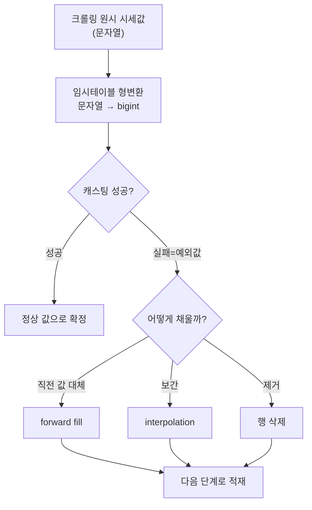
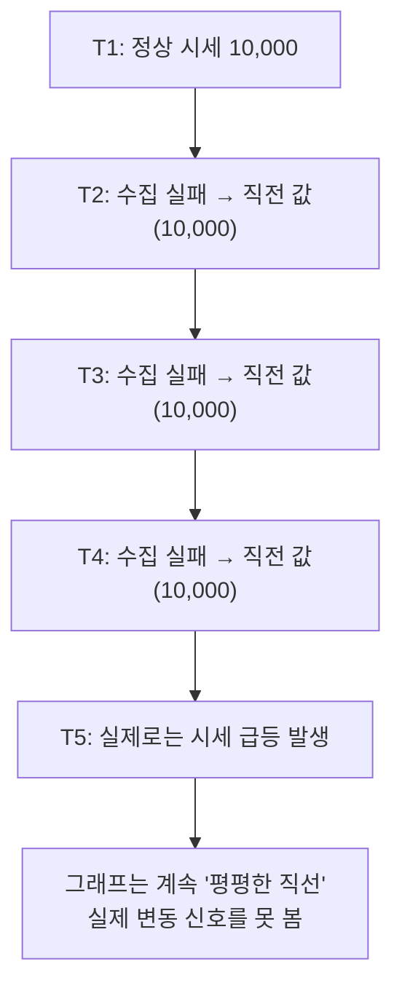
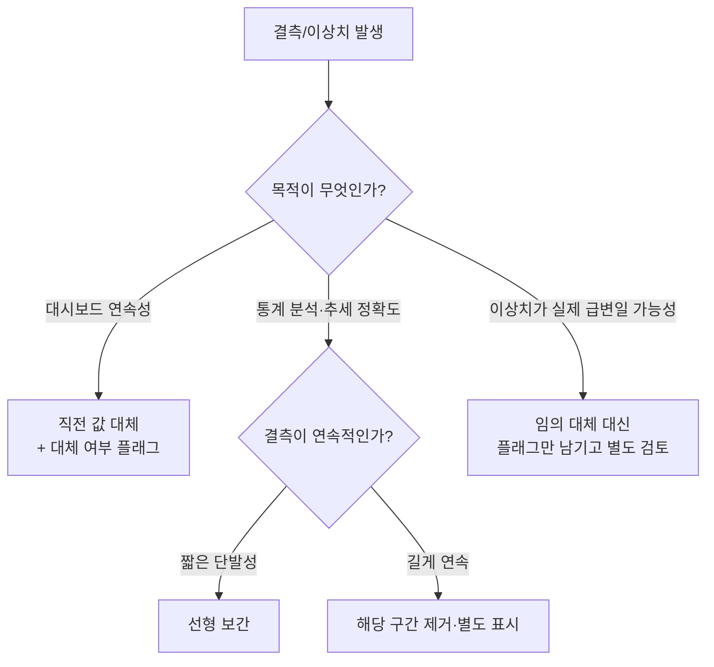

사이드 프로젝트로 게임 아이템 현금시세를 매일 크롤링해서 쌓던 파이프라인 얘기를 지난 글에서 했다. 그때 인코딩 문제 뒤에 잠깐 스치듯 적었던 결정이 하나 있다. 임시테이블에서 시세 문자열을 bigint(정수)로 바꾸다가 캐스팅이 실패하는 값 — 쉼표가 이상하게 붙었거나, 페이지 구조가 바뀌어 엉뚱한 텍스트가 긁혀 온 경우 — 이 나오면 **직전 시세 값으로 대체**했다. 당시엔 별생각 없이 "그래프 안 끊기게" 정도의 이유로 골랐는데, 나중에 다른 결측치 처리 방식들을 비교해보다가 이게 항상 맞는 선택은 아니라는 걸 깨달았다. 이 글은 그 재고 과정을 정리한 것이다.

(크롤링은 개인 사이드 프로젝트였고, robots.txt·이용약관과 요청 간 딜레이(레이트리밋)를 지키는 선에서 돌렸다.)

전체 흐름부터 본다.

## 예외값을 왜 지우지 않고 '직전 값'으로 채웠나?

이 파이프라인의 최종 목적지는 매일 아침 SMTP로 발송되는 리포트와 Metabase 대시보드였다. 사람이 매일 보는 그래프가 목적지라면, **끊기지 않고 이어지는 선**이 중요하다. 하루치 값이 캐스팅 실패로 빠지면, 그 자리를 그냥 비워둘 경우 대시보드에서 시세가 0으로 곤두박질친 것처럼 보이거나, 아예 그 날짜만 그래프에서 구멍이 난다. 둘 다 다음 날 아침 "이거 왜 이래요?"라는 질문을 만든다.

그래서 나는 **직전 값 대체(forward fill)** 를 골랐다. 구현도 단순했다. 시간순으로 정렬한 뒤 가장 최근의 정상 값을 그대로 끌어오면 끝이다. 자동화 배치 안에 넣기도 쉽고, 리포트를 받는 사람 입장에서도 "어제와 같다"는 값이 "알 수 없음"보다 훨씬 덜 놀랍다. 결정 자체는 합리적이었다. 문제는 그 다음이었다.

## 보간은 왜 후보에서 빠졌나?

결측치를 채우는 또 다른 방법으로 **보간(interpolation)** 이 있다. 결측 시점의 앞뒤 정상 값을 이용해 중간값을 추정하는 방식이다. 예를 들어 어제 시세가 10,000원이고 이틀 뒤가 12,000원이면, 그 사이 빠진 하루를 11,000원 정도로 채우는 식이다.

통계적으로는 직전 값 대체보다 "그럴듯해" 보인다. 값이 계단식으로 뚝뚝 끊기지 않고 부드럽게 이어지기 때문이다. 그런데 시세 데이터에는 이 그럴듯함이 오히려 함정이었다. 아이템 현금시세는 선형으로 움직이지 않는다. 패치, 이벤트, 특정 아이템 수급 이슈로 하루 만에 급등락하는 게 정상적인 패턴이다. 보간은 "값이 부드럽게 변한다"는 가정을 깔고 들어가는데, 이 가정 자체가 시세 데이터의 실제 움직임과 어긋난다. 게다가 앞뒤 값을 모두 확보한 뒤에야 계산할 수 있어서, 매일 값이 하나씩 쌓이는 실시간 배치 구조와도 맞지 않았다. 결국 "정교해 보이지만 이 파이프라인의 성격과 안 맞는 선택"으로 판단해 제외했다.

## 직전 값 대체, 막상 써보니 어떤 함정이 있었나?

직전 값 대체를 쓰면서 뒤늦게 깨달은 건, 이 방식이 결측이 **하루짜리 단발성**일 때만 무난하다는 점이다. 크롤링 실패가 이틀, 사흘 연속되면 얘기가 달라진다.

값이 며칠째 똑같이 복제되는 걸 "안정적인 시세"로 오독하기 쉽다는 게 첫 번째 함정이었다. 실제로는 수집이 안 됐을 뿐인데, 그래프만 보면 마치 시세가 진짜로 멈춘 것처럼 보인다. 두 번째는 **이상치와 진짜 급변을 구분 못 한다**는 점이다. 직전 값 대체는 "이 값이 왜 이상한가"를 따지지 않는다. 캐스팅 실패든, 진짜 시세가 순간적으로 튄 것이든 같은 처리를 받는다. 노이즈를 걷어내려다가 진짜 신호까지 같이 눌러버릴 수 있다는 뜻이다.

## 그래서 지금 다시 고른다면 기준은 뭘까?

세 방식을 한 축에 놓고 보면, 정답은 하나가 아니라 **목적에 따라 갈린다**는 걸 알 수 있다.

| 방식 | 채우는 방법 | 장점 | 단점 | 맞는 상황 |
|---|---|---|---|---|
| 직전 값 대체 | 가장 최근 정상 값을 그대로 복제 | 구현 단순, 자동화 배치에 넣기 쉬움, 그래프가 끊기지 않음 | 연속 결측 시 값이 오래 굳어짐(stale), 진짜 급변을 가릴 수 있음 | 대시보드·리포트처럼 연속성이 우선이고 결측이 단발성일 때 |
| 선형 보간 | 결측 앞뒤 정상 값 사이를 추정 | 통계적으로 매끄럽고 앞뒤 맥락을 반영 | 비선형·급변 데이터엔 실제와 다른 값 생성, 앞뒤 값이 모두 있어야 계산 가능 | 값이 완만하게 움직이는 지표, 사후 배치 분석 |
| 결측 제거 | 캐스팅 실패 행을 아예 버림 | 가짜 값을 만들지 않아 신뢰도 높음 | 시계열 연속성 깨짐, 일별 집계·그래프에 구멍 | 통계 분석·모델링처럼 정확도가 연속성보다 중요할 때 |

이 기준으로 다시 보면, 내가 골랐던 직전 값 대체는 "매일 자동으로 나가는 리포트의 연속성"이라는 목적에는 맞는 선택이었다. 다만 거기서 멈추면 안 됐다. 연속 결측이 며칠 이상 이어지면 자동으로 채우지 않고 **플래그를 남겨 사람이 확인**하게 하거나, 리포트/대시보드용 값과 별도로 **통계 분석용 원본 결측 표시**를 따로 남겨두는 보완이 필요했다. "일단 채워서 안 끊기게 하자"와 "이 값이 진짜인지 채운 값인지 구분해두자"는 동시에 할 수 있는 일이었는데, 처음엔 그 둘을 하나로 뭉뚱그렸던 게 이번에 다시 짚어보며 얻은 교훈이다.

## 정리 — 결측 처리는 "무엇을 지키려는가"의 문제였다

- 직전 값 대체는 구현이 단순하고 리포트 연속성엔 유리하지만, 연속 결측과 진짜 이상치를 구분 못 하는 함정이 있다.
- 선형 보간은 통계적으로 매끄럽지만, 시세처럼 급변이 정상인 데이터엔 오히려 실제와 다른 값을 만든다.
- 결측 제거는 가짜 값을 만들지 않지만, 대시보드처럼 연속성이 필요한 곳엔 구멍을 남긴다.
- 세 방식 중 "정답"은 없고, **이 값을 누가 어떤 목적으로 소비하는가**가 기준이 된다. 나는 그 기준을 처음부터 명시적으로 세우지 않고 직관으로 골랐다가, 나중에야 대체 여부를 구분할 장치가 필요하다는 걸 알았다.

다음 글에서는 이 파이프라인의 나머지 구간 — SMTP 자동 리포트와 Google Drive 업로드까지 이어지는 전체 배포 흐름을 정리할 예정이다.

- 현금시세 모니터링 파이프라인: [github.com/DBhyeong/game-data-analysis](https://github.com/DBhyeong/game-data-analysis)
