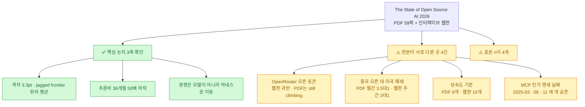
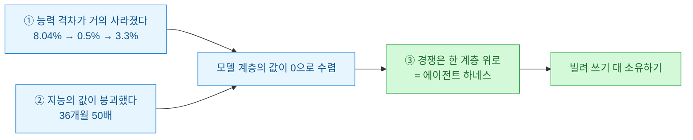
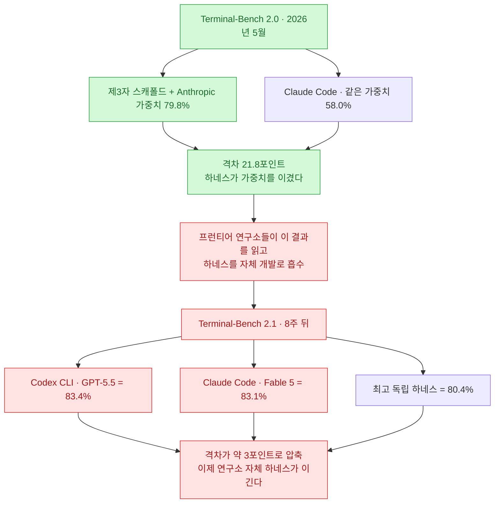
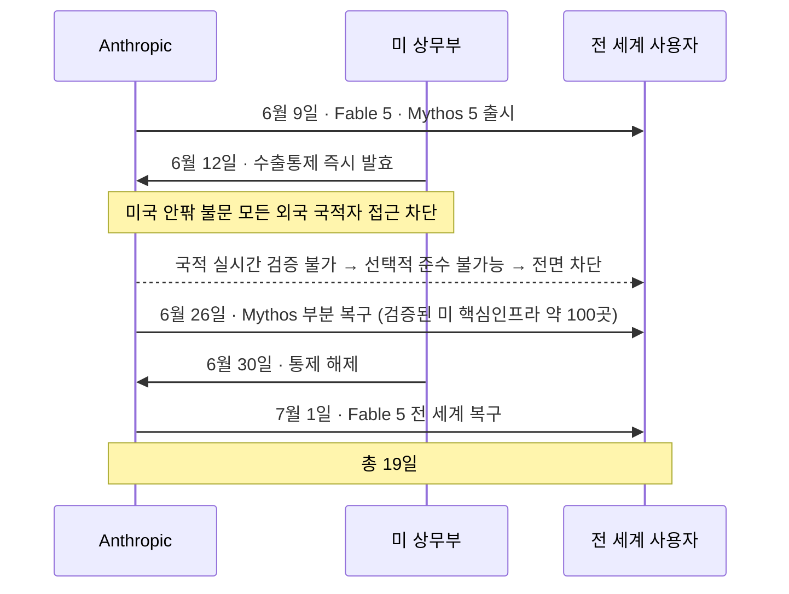

[[ai-llm-it-news-2026-07-18|이틀 전 다이제스트]]에서 Mozilla의 **The State of Open Source AI 2026**을 짧게 다뤘다. 격차 3.3퍼센트포인트, 추론비 50배 하락, 개발자 79퍼센트가 오픈모델을 쓰는데 프로덕션은 51퍼센트. 세 줄로 요약하고 넘어갔는데, 뒤늦게 국내 커뮤니티 정리본을 읽다가 마음이 불편해졌다.

**정리본이 잘못돼서가 아니라, 내가 세 줄을 2차 자료로 썼기 때문이다.** 그래서 PDF 59쪽 전문과 인터랙티브 웹판을 둘 다 받아 나란히 놓고 대조했다.

이 보고서는 서두에서 스스로 이렇게 선언한다 — **"약점을 감추는 주장은 광고에 불과하다."** 그 기준을 보고서 자신에게 적용해 본 셈이다.

결과부터: **핵심 논지는 전부 원문에서 확인됐다.** 내가 앞서 쓴 세 수치도 정확했다. 그런데 예상 못 한 게 나왔다. **같은 보고서가 PDF판과 웹판에서 다른 숫자를 말하는 곳이 네 군데 있었다.** 그리고 표본 크기 `n`이 네 개나 돌아다녔다.

## 오늘 대조한 결과 한눈에

## 보고서의 핵심 논지는 뭔가?

세 축이다. 그리고 세 번째가 이 보고서의 진짜 기여다.

앞의 둘은 이미 여러 곳에서 다뤄진 얘기다. **세 번째가 새롭다.** 모델이 상품화될수록 잠금(lock-in)의 무게 중심이 모델 위에 얹히는 층 — 오케스트레이션 루프·도구·메모리·샌드박스·권한 모델 — 으로 옮겨간다는 것이고, 보고서는 그 층을 **하네스(harness)**라 부른다. 열린 웹 시대의 브라우저가 사용자 대신 서버와 협상하는 "사용자 에이전트"였던 역할이 한 계층 위에서 재현된다는 비유다.

## 능력 격차 3.3퍼센트포인트는 무슨 뜻인가?

✅ 수치는 원문 그대로다. PDF 7쪽 제목이 통째로 "The capability gap: 8.04% → 0.5% → 3.3%"이다. 2024년 1월 8.04퍼센트에서 2024년 8월 0.5퍼센트로 좁혀졌고, 2025년 2월 DeepSeek-R1이 잠시 미국 최상위와 사실상 동률이 됐다가, 폐쇄형 추론 모델이 앞서 나가며 2026년 3월 3.3퍼센트로 다시 벌어졌다.

**중요한 건 이 숫자가 평균이라는 점이고, 원문도 그렇게 못 박는다.** PDF 8쪽 제목이 "A 3.3% average hides a **jagged frontier**"다.

| 영역 | 상태 |
|---|---|
| 코딩·지시 따르기·일반 지식 | 동률이거나 근접 |
| 추론·롱컨텍스트 검색·에이전트 작업 | 격차가 여기 집중 |

그래서 원문의 결론은 "오픈 모델이 충분히 좋은가"가 아니라 **"당신의 작업에 무엇이 필요한가"**가 올바른 질문이라는 것이다. 참고로 PDF 7쪽 출처주는 "아레나 상위 10위 중 6개가 여전히 폐쇄 모델"이라고 덧붙인다.

## "50배 하락"에는 각주가 붙어 있다

여기가 내가 이틀 전 글에서 놓친 대목이다. ⚠️ **50배는 맞지만, 내가 쓴 프레이밍이 정확하지 않았다.**

수치 자체는 확인된다 — 36개월간 100만 토큰당 20달러에서 0.40달러. 비교군도 원문에 있다(닷컴 대역폭 2.6배, PC 컴퓨팅 3.4배). 오픈웨이트가 이 붕괴를 이끌었다는 것도 맞다. Llama 3.1이 2024년 7월 바닥값을 0.88달러로 끌어내리며 **한 분기에 11배** 급락시켰다.

🔴 **그런데 20달러라는 출발점이 GPT-4급 가격이 아니다.** PDF 9쪽 각주가 명시한다.

> Nov '22 point = **text-davinci-003**, the frontier-class model before GPT-4
> 50× frontier-class price Nov '22 → GPT-4-class price Dec '25 (**112× from GPT-4's \$45 launch**)

즉 50배는 **2022년 11월 프런티어급에서 2025년 12월 GPT-4급까지를 가로질러** 비교한 값이다. GPT-4 출시가 45달러를 기준으로 잡으면 오히려 **112배**다. 그러니 "GPT-4급이 50배 떨어졌다"고 쓰면 부정확하다. 나도 이틀 전에 그렇게 썼으니 여기서 정정한다.

## 진짜 새로운 논지: 하네스가 새 전선이다

이 보고서에서 제일 재밌는 데이터가 여기 있다. **두 번의 벤치마크가 8주 만에 결론을 뒤집는다.**

**8주 만에 21.8포인트가 3포인트로 압축됐다.** 보고서의 해석이 날카롭다 — 연구소들이 가중치와 스캐폴드를 **하나의 제품으로 함께 출하**하기 시작했고, 하네스가 특정 연구소 가중치에 밀착 조율될수록 그 아래 가중치는 교체 불가능해진다. **잠금은 최적화의 부산물로 온다.** 원문은 여기에 "검증된 최상위 계층에 오픈 모델은 하나도 없다"고 덧붙인다.

그런데 반전이 있다. **모든 모델을 중립 스캐폴드 위에 올리면 그림이 달라진다.**

| 모델 | 점수 | 태스크당 비용 |
|---|---|---|
| Claude Opus 4.8 | 71.91% | 2.41달러 |
| Claude Opus 4.7 | 68.54% | 1.98달러 |
| **GLM 5.2 (오픈)** | **67.79%** | **0.43달러** |

**능력 차이는 몇 포인트인데 가격 차이는 5배다.** 원문의 프레임이 정확히 그거다 — "중립 하네스 위에서는 가격 격차가 5배".

여기서 오늘 좀 소름 돋은 게 있다. **GLM 5.2를 오늘 하루에 세 번 마주쳤다.** [[ai-llm-it-news-2026-07-20|다이제스트]]에서 허깅페이스가 침해 포렌식을 돌린 모델이 GLM 5.2였고, [[openwiki-agent-docs-cli-okf-review|OpenWiki]]의 자기 저장소 CI가 쓰는 모델도 GLM 5.2였다. 그리고 여기선 중립 벤치마크의 최강 오픈 모델로 나온다. 세 사례가 서로 무관한데 같은 결론을 가리킨다 — **"가격이 5분의 1인데 쓸 만하면 사람들은 그걸 쓴다."**

## 미터기는 왜 규모에서 고장 나나?

보고서에서 가장 강렬한 세 사례다. 그런데 여기가 **2차 요약본이 원문을 가장 크게 벗어난 곳**이기도 하다.

| 기업 | 원문 서술 | ⚠️ 인용 시 주의 |
|---|---|---|
| **Microsoft** | 2026년 6월 30일까지 Claude Code 라이선스 대부분 취소, 토큰 과금이 **해당 사업부** 연간 AI 예산을 몇 달 만에 소진 | 🔴 전사가 아니라 **Experiences + Devices 사업부**(엔지니어 약 5천 명). 원문 카드가 범위를 빼서 "대부분 취소"로 읽힌다 |
| **Uber** | 2026년 AI 코딩 예산 4개월 만에 소진, 엔지니어당 월 500~2,000달러 청구 뒤 도구당 월 1,500달러 상한 | 🔴 500~2,000달러는 **파워유저 구간**이고 평균은 월 150~250달러. "엔지니어당 500~2,000"으로 옮기면 과장 |
| **Stripe** | 오픈 모델 자체호스팅으로 추론비 **73% 절감**(지수 1.00 → 0.27), vLLM 위에서 GPU 3분의 1로 하루 5천만 API 호출 | ⚠️ 근거가 사실상 단일 벤더 블로그. Stripe 자체 발표는 확인 못 함 |

⚠️ 하나 더. **PDF의 이 페이지에는 출처주가 아예 없다.** 이 보고서에서 드문 경우다(웹판 Citations에는 항목별 링크가 있다).

그래도 보고서의 진단 문장은 옳다고 본다 — **"도구가 너무 유용해서 아껴 쓸 수 없을 때는, 경제성을 빌리는 것보다 소유하는 것이 더 중요해진다."** 마침 오늘 [[ai-llm-it-news-2026-07-20|Fable 5가 요금제에 편입되면서 주간 한도의 50퍼센트로 묶였다]]. 미터기 얘기가 남 일이 아니다.

## 19일 동안 프런티어 모델이 꺼졌다

선택권(optionality)이 추상이 아니라는 걸 보여주는 사례다. ✅ 원문에도 있고, 별도 1차 보도로도 교차확인됐다.

PDF 30쪽 제목이 그대로다 — "**For nineteen days, the newest frontier model went dark.**" 웹판에만 있는 디테일이 더 아프다. 모델이 꺼진 시각은 **금요일 오후 5시 21분**이었다.

Mozilla CTO의 서한 문장이 이 사건의 요지다.

> 가장 앞선 모델 중 하나가 **정부가 편지를 보냈다는 이유로** 어디서나 꺼졌다. 그 모델을 빌려 쓰던 모든 기업이 **자기 것이 아닌 스위치**가 존재한다는 걸 알게 됐다.

보고서의 결론은 이렇다 — **"모델은 끌 수 있다. 그러나 당신이 쥔 기계에서 이미 돌아가고 있는 사본은 누구도 끌 수 없다."**

## 오픈이 아직 못 넘은 벽은 뭔가?

보고서가 가장 정직한 대목이다. 그리고 ⚠️ **2차 요약본이 결정적 단서를 통째로 빠뜨린 곳**이기도 하다.

✅ 도입에서는 오픈이 앞선다(79퍼센트 대 71퍼센트). 그런데 프로덕션 도달은 **오픈 51퍼센트, 폐쇄 63퍼센트**로 뒤집힌다. 원인은 모델 성능이 아니라 운영 도구와 신뢰다. 스택 성숙도 히트맵에서 커뮤니티 활동성은 4.00, 도입 용이성 3.63인데 **표준화 2.83, 엔터프라이즈 준비도 2.79**로 모든 계층에서 반복적으로 낮다.

🔴 **그런데 부록에 이런 자기고백이 있다.** 이 히트맵은 "**측정이 아니라 의도적으로 서수적이고 방향성 있는 판단(deliberately ordinal, directional judgments rather than measurements)**"이며, 고정 루브릭을 "**일관성을 위해 AI 보조를 받아**" 적용했다는 것이다.

**4.00이니 2.79니 하는 숫자를 측정치처럼 인용하면 원문 의도를 왜곡한다.** 나는 이 자백을 넣은 게 오히려 이 보고서를 신뢰하게 만든 대목이라고 본다. 광고였다면 안 썼을 문장이다.

## PDF와 웹판이 다른 네 군데

여기가 이 글을 쓰게 만든 발견이다. **같은 보고서인데 판본에 따라 숫자가 다르다.**

| 항목 | PDF판 | 웹판 |
|---|---|---|
| OpenRouter 오픈 토큰 비중 | 차트 y축 최대 40%, 2026년 6월 라벨은 "**still climbing**". 과반이라는 서술 없음 | "2025년 말 3분의 1 → **2026년 중반 과반**", "이제 프로덕션 토큰의 과반" |
| 중국 오픈 대 미국 폐쇄 | **월간** 82조 대 23조, **3.5대 1** | **주간** 약 18조 대 5.5조, **3대 1**(FT 분석) |
| 성숙도 채점 기준 수 | **9개 기준** (본문·부록 모두) | "scored across **10 criteria**" |
| MCP 인가 명세 시점 | 타임라인 "**Jun '25** OAuth 2.1 in spec" | 본문 "**2025-11-25** specification", Citations "**2025-03-26** spec" |

⚠️ 참고로 Mozilla 공식 블로그도 OpenRouter 비중을 "대략 3분의 1"로만 쓴다. **즉 "과반"은 웹판 본문에만 있는 서술이다.**

그리고 표본 크기. 커뮤니티 정리본이 "n=1,410 설문"이라고 쓴 걸 보고 확인해 봤더니, 이 보고서 안에서 `n`이 **네 개** 돌아다닌다.

| 표기 | 위치 | 실제 의미 |
|---|---|---|
| **1,494** | 부록 | 조사 적격 응답자 전체(2026년 5월 19~29일 현장조사) |
| **1,410** | 본문 | **오픈모델 현역 + 이탈 개발자** 서브셋 |
| 1,411 | 표 | 같은 표의 다른 표기 |
| 954 | 다른 섹션 | 전문 개발자 |
| 950+ | 공식 블로그 | 또 다른 표기 |

**그러니 "n=1,410 설문"이라고 단정하면 틀린다.** "전체 1,494명, 오픈모델 관련 1,410명"이 정확하다.

이걸 두고 보고서를 깎아내릴 생각은 없다. 59쪽짜리 보고서를 PDF와 인터랙티브 웹으로 동시에 내면서 데이터가 계속 갱신되면 이런 어긋남은 난다. **다만 인용하는 쪽은 어느 판본을 봤는지 밝혀야 한다.** 나는 앞으로 이 보고서를 인용할 때 "PDF 몇 쪽 기준"을 붙이기로 했다.

## 다섯 가지 베팅

마지막 장은 행동 지침이다. 다섯 개 중 어느 것도 프런티어 모델 성능을 이길 것을 요구하지 않는다는 점이 좋았다.

| 베팅 | 요지 |
|---|---|
| ① 오픈 하네스를 구축하라 | 오픈 가중치와 **함께 설계된** 하네스. 범용이든 특정 수직 영역이든 |
| ② 메모리를 소유하라 | 스택에서 유일하게 복리로 쌓이는 자산. 이식 가능·추가 전용 형식으로 방화벽 뒤에 |
| ③ 이식 가능한 권한을 풀어라 | 하네스 정중앙의 미해결 구멍. 생태계 12개 프레임워크·10개 하네스·3개 피어 프로토콜에 걸친 표준이 **0개** |
| ④ 미터기를 깨라 | 자체호스팅 손익분기는 **하루 약 8천 대화**. 값이 싸고 지루한 지금 제2공급원 확보 |
| ⑤ 오픈 기본값을 복수화하라 | 공급자가 하나뿐인 공유지는 공유지가 아니다 |

③번을 좀 더 보자. **인증(authentication)은 표준화됐는데 인가(authorization)는 표준이 없다.** MCP 명세가 인가를 OAuth 2.1로 옮겼고 A2A v1.0이 서명된 Agent Card를 표준화했지만, **둘 다 인증에서 멈춘다.** 에이전트가 누구인지 아는 것은 그 에이전트가 무엇을 해도 되는지에 대해 아무것도 말해 주지 않는다.

그래서 읽기(reads)와 쓰기(writes)를 갈라야 한다는 게 보고서의 처방이다. 읽기는 되돌릴 수 있으니 대체로 기본 허용, 쓰기는 비싸고 되돌리기 어려우니 확인·승인 임계값·비용 상한·취소 권한을 여기 몰아넣는 것이다. 그리고 사람이 최후 방어선이 되는 방식은 이미 한계다 — **CoSAI의 MCP 위협 모델이 최상위 위협으로 꼽은 게 "동의 피로(consent fatigue)"**, 즉 사용자가 프롬프트 대부분을 습관적으로 승인해 버리는 패턴이다.

⭐ 그리고 **④번 미터기 항목의 사례가 오늘 제일 서늘했다.** Uber 요금은 이용자들이 보조금 가격에 삶을 재편한 뒤 **약 92퍼센트** 올랐다. 보고서의 문장이 이렇다 — **"낮은 가격은 결코 제품이 아니었다. 잠금이 제품이었다."** 보고서는 AI 토큰 가격 인상 시점을 **2027~28년쯤**으로 본다.

## 오늘 걸러낸 것 (팩트체크 로그)

| 주장 | 판정 | 근거 |
|---|---|---|
| 격차 3.3pt / 비용 50배 / 79%·51%·63% | ✅ **확정** | PDF 5·7·8·9·14쪽 원문 일치 |
| "GPT-4급이 20달러 → 0.40달러" | ⚠️ **프레이밍 부정확** | 20달러는 GPT-4 이전 text-davinci-003. GPT-4 출시가 기준 **112배** |
| "OpenRouter 오픈 토큰 과반" | ⚠️ **웹판 한정** | PDF는 "still climbing". 공식 블로그는 "약 3분의 1" |
| "n=1,410 설문" | ⚠️ **부정확** | 전체 1,494 / 1,410은 오픈모델 개발자 서브셋. n이 4개 |
| 히트맵 4.00·2.79 | ⚠️ **측정치 아님** | 부록이 "서수적·방향성 판단, AI 보조 채점"이라 자인 |
| Microsoft "라이선스 대부분 취소" | 🔴 **범위 누락** | 전사 아님. Experiences + Devices 사업부 |
| Uber "엔지니어당 월 500~2,000달러" | 🔴 **과장** | 파워유저 구간. 평균은 150~250달러 |
| Stripe 73% 절감 | ⚠️ **근거 얇음** | 사실상 단일 벤더 블로그. Stripe 자체 발표 확인 불가 |
| DeepSeek ARR 2.2억 달러 | ⚠️ **시점 누락** | 원문은 "**2025년 중반 기준**" |
| Databricks "+65%" | ⚠️ **미세 차이** | 원문은 "**65% 초과**" |
| 수출통제 19일 | ✅ **확정** | 원문 + 1차 보도(Forbes·TechCrunch·CNBC·Anthropic 뉴스룸) 교차확인 |
| 하네스 벤치마크 전 수치 | ✅ **확정** | Terminal-Bench 2.0·2.1, vals.ai Terminus-2 전부 일치 |
| "Mozilla Foundation 보고서" | 🔴 **없는 귀속** | 표지 "AN INAUGURAL **MOZILLA** ASSESSMENT", 서명 "CTO, **Mozilla**" |

마지막 줄은 내가 이전 글에서 이미 한 번 정정했던 항목인데, 이번에 부록까지 확인해 확정했다. 부록의 "About Mozilla"는 Mozilla Project 산하 여러 법인을 나열할 뿐 **보고서를 특정 법인에 귀속시키지 않는다.** 그냥 "Mozilla"라고 쓰는 게 원문 준수다.

## 그래서 내가 챙긴 것

- **2차 자료로 세 줄 요약하지 않는다.** 이틀 전 내 글의 세 수치는 다행히 맞았지만, "GPT-4급 50배"라는 프레이밍은 각주를 안 봐서 틀렸다. 요약본이 나쁜 게 아니라 **각주가 헤드라인을 뒤집는 경우가 있다**는 걸 잊었던 거다.
- **판본을 밝히고 인용한다.** PDF와 웹판이 네 군데 다르다는 건 이 보고서만의 문제가 아니라, 인터랙티브 리포트가 흔해진 시대의 일반 문제다. 앞으로 "PDF 몇 쪽 기준"을 붙인다.
- **자백이 있는 보고서를 더 믿는다.** 히트맵 점수를 "측정이 아니라 판단"이라고 부록에 적어 둔 것, 오픈이 못 넘은 벽 네 가지를 따로 정리한 것, DeepSeek의 안전 지수 F 등급을 그대로 실은 것. 광고라면 뺐을 문장들이다. **약점을 감추는 주장은 광고에 불과하다**는 자기 선언을 이 보고서는 대체로 지켰다.

정작 이 보고서에서 내 작업에 바로 걸리는 건 ②번 베팅이었다. **스택에서 유일하게 복리로 쌓이는 자산이 메모리라는 것.** 나는 몇 년째 평문 마크다운 볼트를 굴리면서 그게 취미인 줄 알았는데, 이 보고서 기준으로는 그게 유일하게 복리로 쌓는 행위였다. 모델은 계속 갈아탈 거고 하네스도 바뀔 텐데, 축적된 문맥은 접근이 끊기는 순간 재구성이 안 된다. 그 문장 하나가 오늘 59쪽 중에 제일 오래 남았다.
