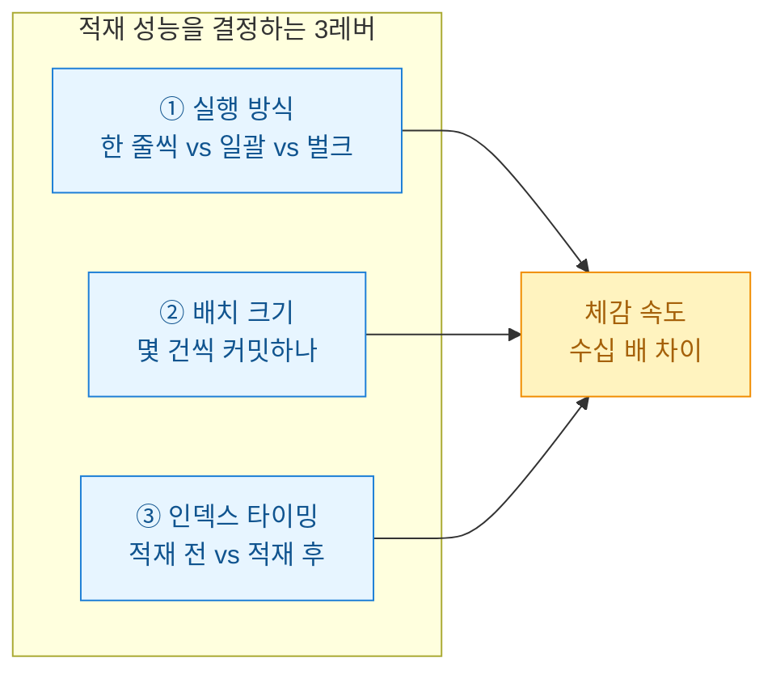
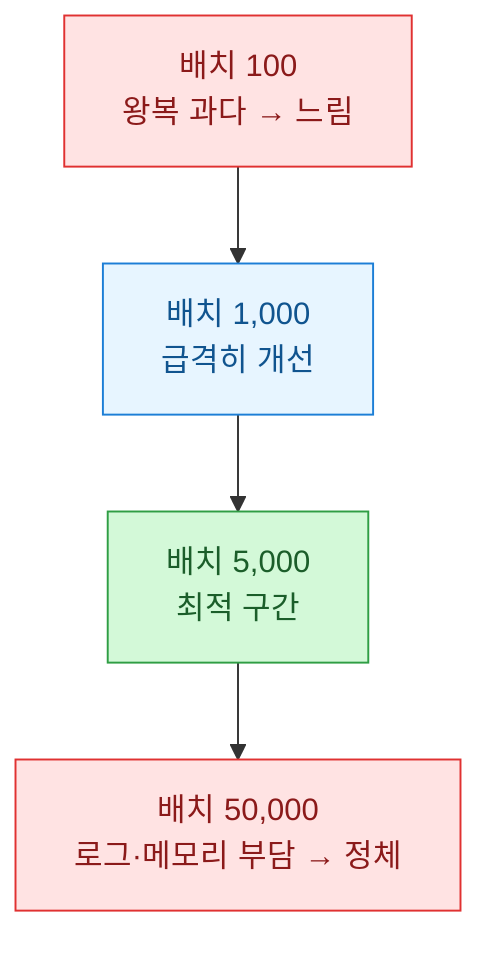
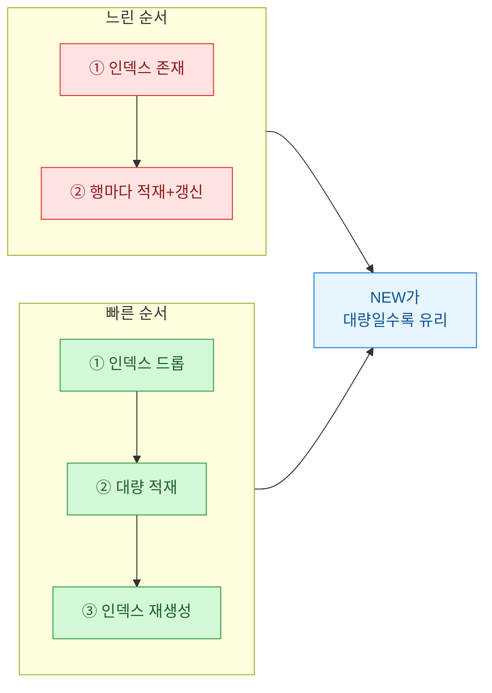
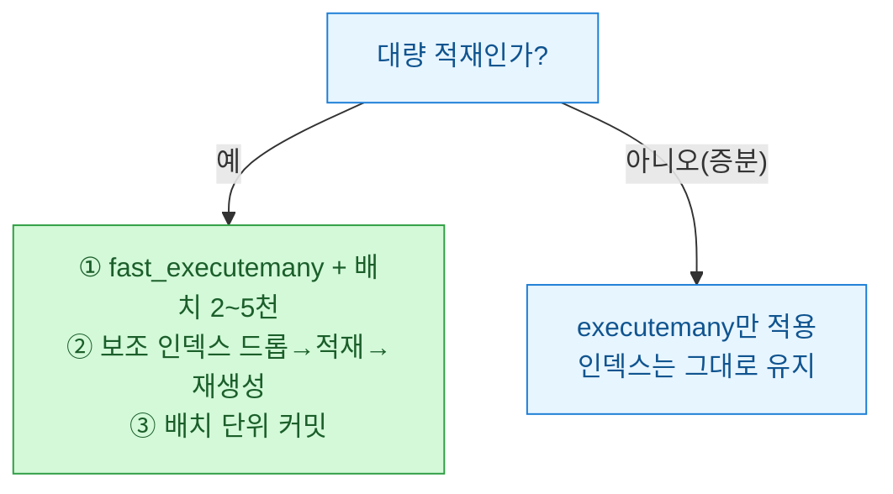

게임 로그 30만 건을 MS-SQL에 밀어넣는 야간 배치가 새벽까지 안 끝난 날이 있었다. 코드를 열어보니 `for`문 안에서 한 줄씩 `INSERT`. 그날 나는 "적재도 튜닝 대상"이라는 걸 뼈저리게 배웠다. 오늘은 그때 내가 뜯어본 세 가지 레버 — **일괄 실행(executemany)**과 **배치 크기(batch size)**, 그리고 **인덱스 타이밍(index timing)**을 합성 데이터로 다시 벤치마크한 기록이다.



## 왜 한 줄씩 INSERT는 느린가?

느림의 정체는 SQL 문법이 아니라 **왕복(round-trip)**이다. `INSERT` 한 번마다 네트워크로 나갔다 오고, 기본 자동커밋이면 트랜잭션 로그까지 매번 확정한다. 30만 건이면 30만 번의 왕복과 30만 번의 커밋이다.

| 병목 | 한 줄씩 | 개선 방향 |
|------|---------|-----------|
| 네트워크 왕복 | 행마다 1회 | 여러 행을 한 요청에 |
| 커밋 횟수 | 행마다 1회 | 배치 단위로 묶기 |
| 인덱스 갱신 | 행마다 재정렬 | 적재 후 일괄 생성 |

정리하면, 개별 작업 자체는 빠른데 **횟수**가 죽인다. 그러니 횟수를 줄이는 게 튜닝의 전부다.

## executemany는 정말 빠른가 — 그리고 함정은?

`pyodbc`에서 `executemany`만 써도 빨라지지만, 옵션 하나를 빼먹으면 무늬만 일괄이다. 아래처럼 `fast_executemany = True`를 켜야 드라이버가 값을 실제로 묶어 보낸다.

```python
import pyodbc

# 합성 데이터: (유저ID, 스테이지, 점수)
rows = [(uid, uid % 50, (uid * 7) % 10000) for uid in range(300000)]

conn = pyodbc.connect(CONN_STR, autocommit=False)
cur = conn.cursor()
cur.fast_executemany = True   # ← 이 한 줄이 핵심

sql = "INSERT INTO game_log (user_id, stage, score) VALUES (?, ?, ?)"

BATCH = 5000
for i in range(0, len(rows), BATCH):
    cur.executemany(sql, rows[i:i + BATCH])
    conn.commit()   # 배치 단위로만 커밋
```

함정 두 가지. 첫째, `fast_executemany`를 안 켜면 내부적으로 여전히 한 줄씩 돈다. 둘째, `autocommit=True`면 배치로 묶어도 커밋이 행마다 터져 이득이 반감된다. **묶어서 보내고, 묶어서 커밋한다** — 두 개가 세트다.

## 배치 크기는 클수록 좋은가?

아니다. 배치를 키우면 왕복은 줄지만 트랜잭션 로그와 메모리가 커지고, 너무 크면 오히려 느려지거나 락이 길어진다. 합성 데이터 30만 건으로 배치 크기만 바꿔가며 재본 결과다(수치는 내 로컬 기준의 상대 감각이니 절대치보다 곡선 모양을 보라).



| 방식 | 배치 크기 | 상대 소요 시간 |
|------|-----------|----------------|
| 한 줄씩 INSERT | 1 | 100 (기준) |
| executemany | 1,000 | 6 |
| executemany | 5,000 | 4 |
| BULK INSERT / bcp | 파일 일괄 | 2 |

교훈은 단순하다. **1 → 1,000** 구간에서 대부분의 이득이 나오고, 그 이후는 수확 체감이다. 나는 보통 2,000~5,000 사이에서 타협한다.

## 인덱스는 언제 만들어야 하나?

이게 가장 반직관적이었다. 인덱스가 걸린 테이블에 적재하면, 행이 들어올 때마다 인덱스 트리를 갱신하느라 느려진다. 그래서 **대량 적재 전에 인덱스를 지우고, 적재가 끝난 뒤 한 번에 다시 만드는** 전략이 통한다.



```sql
-- 적재 전: 비클러스터드 인덱스 제거
DROP INDEX ix_game_log_user ON game_log;

-- (여기서 executemany 배치 적재 수행)

-- 적재 후: 인덱스 한 번에 재생성
CREATE NONCLUSTERED INDEX ix_game_log_user
    ON game_log (user_id) INCLUDE (score);
```

단, 만능은 아니다. **소량 증분 적재**라면 드롭/재생성 비용이 더 크니 그냥 두는 게 낫다. 이 전략은 "테이블을 통째로 새로 채우는 야간 배치" 같은 대량 상황에서 빛난다. 그리고 클러스터드 인덱스(물리 정렬 기준)는 함부로 지우면 재생성이 비싸므로, 나는 보조 인덱스만 대상으로 삼는다.

## 그래서 내 결론은?



야간 배치는 이 세 레버를 조합한 뒤 새벽 세 시가 아니라 자정 전에 끝났다. 핵심은 하나다 — 적재 속도는 SQL을 더 영리하게 쓰는 문제가 아니라 **왕복과 갱신 횟수를 줄이는 문제**다. 다음엔 `BULK INSERT`와 스테이징 테이블 패턴을 같은 방식으로 벤치마크해 볼 생각이다.

> 본문 수치는 공개·더미 데이터를 로컬에서 측정한 상대 감각이며, 환경에 따라 달라진다. 특정 제품·구성에 대한 성능 보증이 아니다.
