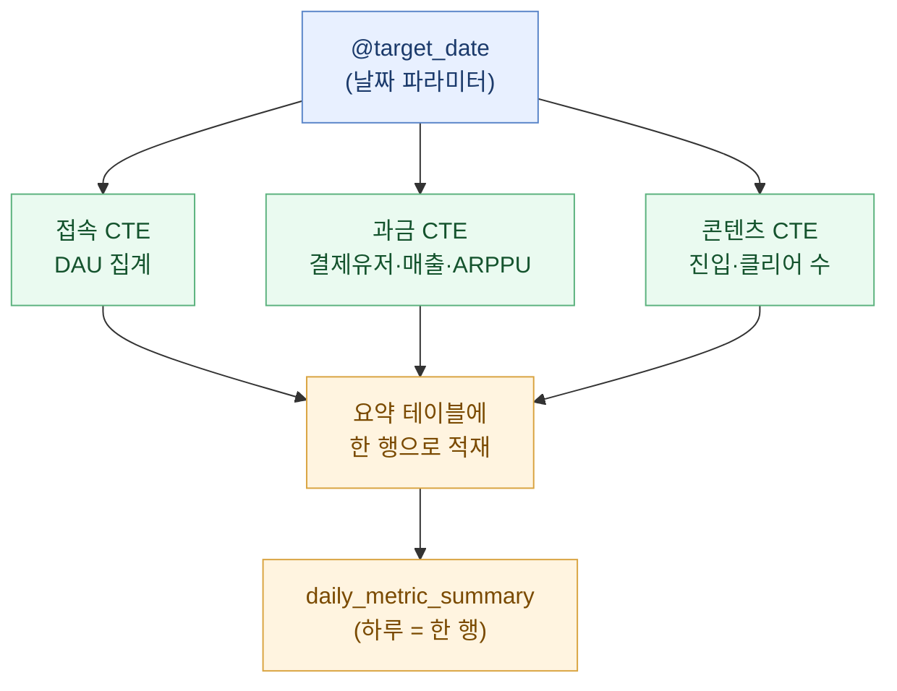
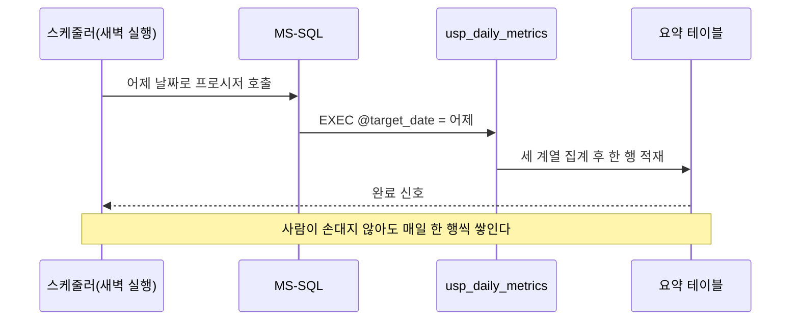

> 매일 아침 같은 쿼리 일곱 개를 순서대로 복붙하던 나를, 어느 날 문득 미워하게 됐다. 그래서 그 손노동을 통째로 프로시저 하나에 밀어 넣기로 했다.

라이브 게임 운영 데이터를 맡으면서 내 아침은 늘 똑같았다. 커피를 내리고, SSMS를 열고, 어제 날짜를 넣은 쿼리를 하나씩 실행한다. 접속 지표 한 번, 과금 지표 한 번, 콘텐츠 지표 한 번. 결과를 스프레드시트에 붙여넣고, 숫자가 이상하면 다시 쿼리를 뜯어본다. 이걸 매일 했다. 주말에 누가 대신 돌려주지도 않으니 월요일엔 사흘치가 밀려 있었다.

이 글은 그 반복을 **Stored Procedure**(줄여서 SP, 데이터베이스 안에 저장해 두고 이름만 불러 실행하는 쿼리 묶음) 하나로 접은 이야기다. 회사·게임·실제 테이블명은 전부 빼고, 구조와 개념만 합성 예시로 옮겼다.

## 왜 쿼리를 손으로 돌리는 게 문제였나?

문제는 시간이 아니었다. 진짜 문제는 **일관성**이었다.

같은 지표라도 그날그날 손이 미끄러지면 값이 달라진다. 어제는 접속 기준을 "로그인 1회 이상"으로 잡았는데, 오늘은 무심코 "플레이 5분 이상"으로 필터를 바꿔 넣는 식이다. 사람이 매번 조건을 다시 타이핑하는 한, 어제와 오늘의 숫자가 같은 정의로 뽑혔다고 아무도 보장하지 못한다.

| 손으로 돌릴 때 | SP로 자동화한 뒤 |
|---|---|
| 매일 조건을 다시 타이핑 → 정의가 미끄러짐 | 정의가 프로시저 안에 한 번만 박혀 고정 |
| 실행 순서를 사람이 기억 | 순서가 코드로 보장 |
| 주말·휴가 때 구멍 | 스케줄러가 대신 실행 |
| "어제 값 다시" = 처음부터 다시 | 파라미터 하나만 바꿔 재실행 |

표를 만들고 나니 답은 뻔했다. 지표의 정의를 사람 머릿속이 아니라 코드 안에 못 박아야 한다.

## SP 하나에 지표 세 계열을 어떻게 담았나?

내가 매일 보던 지표는 크게 세 계열이었다. **접속**(누가 얼마나 들어왔나), **과금**(얼마를 결제했나), **콘텐츠**(어떤 콘텐츠를 얼마나 소비했나). 이 셋을 각각 CTE(임시 결과 블록)로 계산한 뒤, 마지막에 하나의 요약 테이블에 채워 넣는 구조로 짰다.

핵심 설계 원칙은 딱 하나였다. **"기준 날짜를 파라미터로 받는다."** 어제를 뽑든, 지난주 화요일을 다시 뽑든, 날짜만 넘기면 되게.

```sql
-- 합성 예시: 실제 스키마 아님, 개념 설명용 더미
CREATE PROCEDURE dbo.usp_daily_metrics
    @target_date DATE  -- 뽑고 싶은 날짜 하나만 받는다
AS
BEGIN
    SET NOCOUNT ON;

    -- 1) 접속 계열: 그날 로그인한 순수 유저 수(DAU 성격)
    ;WITH access_cte AS (
        SELECT COUNT(DISTINCT user_key) AS dau
        FROM   dummy_login_log
        WHERE  login_date = @target_date
    ),
    -- 2) 과금 계열: 결제유저수 · 결제금액 · 인당결제액(ARPPU 성격)
    pay_cte AS (
        SELECT COUNT(DISTINCT user_key)            AS paying_users,
               SUM(pay_amount)                     AS revenue,
               SUM(pay_amount) * 1.0
                 / NULLIF(COUNT(DISTINCT user_key),0) AS arppu
        FROM   dummy_pay_log
        WHERE  pay_date = @target_date
    ),
    -- 3) 콘텐츠 계열: 특정 콘텐츠 진입/클리어 횟수
    content_cte AS (
        SELECT SUM(enter_cnt)  AS content_enter,
               SUM(clear_cnt)  AS content_clear
        FROM   dummy_content_log
        WHERE  play_date = @target_date
    )
    -- 세 계열을 한 줄로 합쳐 요약 테이블에 적재
    INSERT INTO daily_metric_summary
        (metric_date, dau, paying_users, revenue, arppu,
         content_enter, content_clear)
    SELECT @target_date, a.dau, p.paying_users, p.revenue,
           p.arppu, c.content_enter, c.content_clear
    FROM   access_cte a
    CROSS JOIN pay_cte p
    CROSS JOIN content_cte c;
END
```

값은 전부 더미다. 중요한 건 코드가 아니라 흐름이다. 날짜 하나를 받아서 → 세 계열을 각자 집계하고 → 한 행으로 묶어 요약 테이블에 쌓는다. 아침마다 하던 일곱 번의 복붙이 `EXEC dbo.usp_daily_metrics '2026-07-09'` 한 줄로 줄었다.



## 매일 저절로 돌게 하려면 무엇이 더 필요했나?

프로시저를 만들었다고 자동화가 끝난 건 아니다. **누가 매일 이 프로시저를 불러줄 것인가**가 남는다. 여기서 두 갈래가 있었다.

첫째는 DB 안의 스케줄러(SQL Server Agent Job)에 얹는 방법. 매일 새벽 정해진 시각에 "어제 날짜로 프로시저를 실행하라"는 잡을 걸어두면 된다. 둘째는 바깥에서 파이썬으로 부르는 방법. `pymssql` 같은 드라이버로 접속해 프로시저를 호출하고, 결과를 시각화 도구나 파일로 흘려보낸다. 나는 지표를 대시보드로도 봐야 했기에 파이썬 쪽을 얹었다.



여기서 한 가지 실무 함정을 적어둔다. 파이썬으로 MS-SQL에 붙을 때 한글이 깨지는 일이 잦다. 연결 문자열에서 인코딩 옵션(예: codepage를 UTF-8로 맞추는 설정)을 명시해 두지 않으면, 콘텐츠 이름 같은 한글 컬럼이 물음표로 나온다. 이걸 모르고 반나절을 날린 적이 있어서, 지금은 접속 설정에 인코딩을 제일 먼저 박아 둔다.

## 어제 값을 다시 뽑아야 할 때는 어떻게 하나?

자동화의 진짜 가치는 여기서 나온다. 로그가 늦게 들어와서 어제 숫자가 덜 찼거나, 결제 취소가 뒤늦게 반영돼 매출을 다시 계산해야 할 때가 반드시 온다.

손으로 돌리던 시절엔 이게 재앙이었다. 어느 조건을 어떻게 넣었는지 기억이 안 나니 처음부터 다시 짰다. 지금은 다르다. 같은 프로시저에 날짜만 다시 넘기면 된다. 재적재 전에 그날 행을 지우고 다시 넣는 "지우고 다시 쌓기" 한 줄만 앞에 붙여두면, 며칠치를 한 번에 되메울 수도 있다.

```sql
-- 특정 구간을 통째로 다시 뽑는 되메우기(backfill) 예시
DECLARE @d DATE = '2026-07-01';
WHILE @d <= '2026-07-07'
BEGIN
    DELETE FROM daily_metric_summary WHERE metric_date = @d; -- 그날 지우고
    EXEC dbo.usp_daily_metrics @d;                           -- 다시 채운다
    SET @d = DATEADD(DAY, 1, @d);
END
```

정의가 프로시저 안에 한 번만 박혀 있으니, 언제 다시 뽑아도 같은 정의로 나온다. 과거와 현재가 같은 잣대로 계산된다는 이 사소한 보장이, 지표를 신뢰할 수 있게 만드는 전부였다.

## 마무리

돌아보면 이 작업은 대단한 기술이 아니었다. CTE 몇 개를 묶고, 파라미터 하나를 받고, 스케줄러에 얹었을 뿐이다. 그런데 효과는 기술의 크기와 비례하지 않았다. 아침의 손노동이 사라졌고, 무엇보다 **"어제와 오늘의 숫자가 같은 정의로 뽑혔다"**는 확신이 생겼다.

데이터 분석에서 자동화의 목적은 게으름이 아니라 일관성이다. 사람이 매번 조건을 다시 타이핑하는 한, 숫자는 언제든 미끄러진다. 정의를 코드 안에 못 박아 두는 순간부터, 나는 숫자를 뽑는 사람이 아니라 숫자를 해석하는 사람이 될 수 있었다. 다음엔 이 요약 테이블 위에 리텐션 곡선과 과금 구간 분포를 얹은 이야기를 적어보려 한다.

## 참고자료

- [[game-metrics-7-definitions]] — 접속·과금·잔존 세 계열로 핵심 지표 7종을 한 장에 정의한 글
- [[paying-tier-distribution-bm-balancing]] — 과금 구간별 분포로 BM 밸런싱 근거를 만든 이야기
- [[cohort-m1-retention-sql]] — 코호트 기반 M1 리텐션을 SQL로 계산하기
- [[arpu-vs-arppu]] — ARPU와 ARPPU, 무엇이 어떻게 다른가
- game-data-recipes 저장소: https://github.com/DBhyeong/game-data-recipes

<!-- 안전: 합성/더미 데이터, 회사·실데이터·PII 없음. -->
