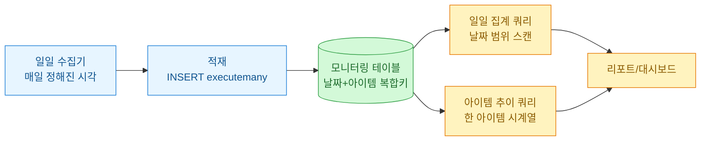
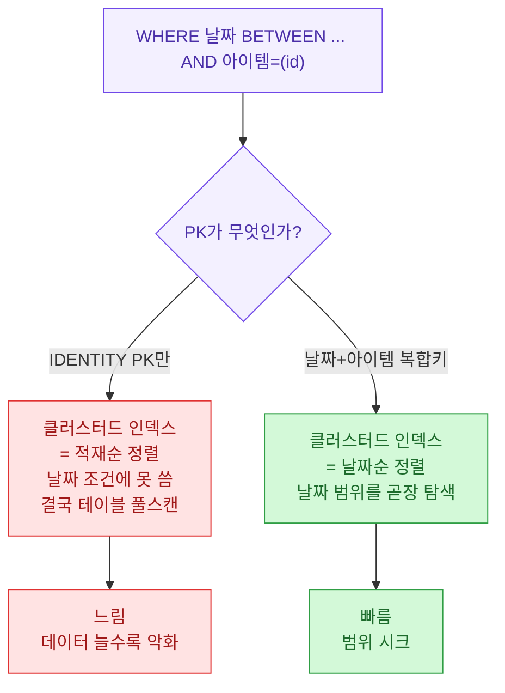
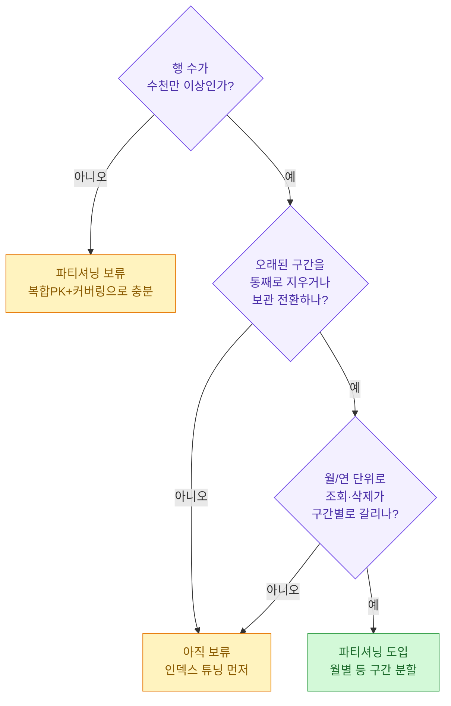
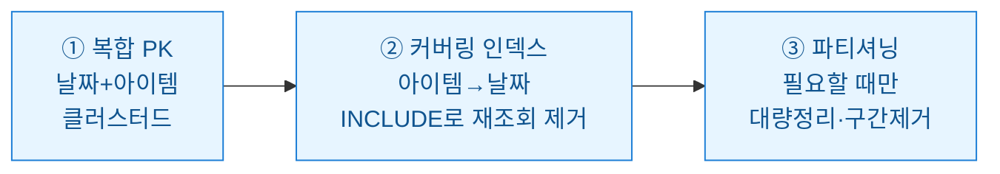

매일 같은 시각에 아이템별 시세와 거래량을 한 번씩 적재하는 모니터링 테이블을 오래 굴리다 보면, 처음엔 잘 돌던 일일 집계 쿼리가 어느 날부터 느려진다. 오늘은 시계열 적재에 맞게 MSSQL 테이블을 설계하는 방법을 정리해 본다. 아래 나오는 스키마·수치·쿼리 결과는 전부 **합성(더미) 데이터**이고, 특정 서비스의 실제 구성과는 무관하다.

## 이 글은 무엇을 다루나?

먼저 전체 그림부터 도식으로 본다.



핵심은 이 테이블이 두 방향으로 읽힌다는 점이다. 하나는 "특정 날짜 범위의 전체 아이템"(리포트), 다른 하나는 "특정 아이템의 긴 기간 추이"(추적). 이 둘을 모두 빠르게 만드는 게 목표다.

## 왜 그냥 IDENTITY PK만 두면 느려지나?

가장 흔한 초기 설계는 그냥 자동 증가 정수(`bigint IDENTITY`)를 PK로 두는 것이다. 처음엔 문제없다. 그런데 이 PK는 "적재 순서"일 뿐, 우리가 실제로 조회하는 조건인 "날짜"나 "아이템"과 아무 상관이 없다.



MSSQL에서 PK는 기본적으로 **클러스터드 인덱스(clustered index)**, 즉 데이터 자체의 물리적 정렬 순서다. IDENTITY로 잡으면 데이터가 "들어온 순서"로 정렬되어 있어서, 날짜로 걸러야 할 때 정렬을 못 써먹고 전체를 훑는다. 반면 정렬 순서 자체를 우리가 조회하는 축(날짜)에 맞추면 범위 조회가 곧장 "시크(seek)"로 풀린다.

## 그럼 테이블을 어떻게 짜야 하나?

합성 스키마로 기본형을 제시한다. 게임 아이템 시세를 매일 적재한다고 가정했다.

```sql
-- 합성(더미) 스키마입니다. 실제 서비스와 무관합니다.
CREATE TABLE dbo.item_price_daily
(
    snapshot_date   date        NOT NULL,   -- 관측 날짜(하루 1행/아이템)
    item_id         int         NOT NULL,   -- 아이템 식별자
    unit_price      decimal(18,2) NOT NULL, -- 단위당 시세(원)
    trade_count     int         NOT NULL,   -- 당일 거래 건수
    collected_at    datetime2(0) NOT NULL   -- 실제 적재 시각(감사용)
        CONSTRAINT DF_ipd_collected DEFAULT (sysdatetime()),
    CONSTRAINT PK_item_price_daily
        PRIMARY KEY CLUSTERED (snapshot_date, item_id)
);
```

여기서 설계 결정 세 가지를 표로 정리한다.

| 결정 | 선택 | 이유 |
| --- | --- | --- |
| 클러스터드 키 | `(snapshot_date, item_id)` | 리포트가 날짜 범위로 읽으니 날짜를 앞에 둔다 |
| 날짜 타입 | `date`(시간 없음) | 하루 1스냅샷이라 시각 불필요, 8→3바이트로 가벼움 |
| 적재 시각 | 별도 `collected_at` 컬럼 | "언제 실제로 넣었나"는 키와 분리해 감사용으로만 |
| 중복 방지 | 복합 PK가 곧 유니크 | 같은 날 같은 아이템 두 번 적재를 막아줌 |

`snapshot_date`(논리적 관측일)와 `collected_at`(물리적 적재 시각)을 나누는 게 은근히 중요하다. 재적재나 지연 보정이 생겼을 때 "원래 며칠자 데이터인가"와 "실제로 언제 넣었나"가 달라지는데, 한 컬럼에 뭉쳐 두면 나중에 둘을 구분할 수가 없다.

## 커버링 인덱스는 무엇이고 왜 필요한가?

복합 PK 하나로 날짜 리포트는 빨라졌다. 그런데 "특정 아이템 한 개의 90일 추이" 같은 반대 방향 조회는 여전히 느리다. 클러스터드 정렬이 날짜 우선이라, 아이템으로 먼저 걸러야 하는 쿼리는 정렬을 못 쓴다.

이때 넣는 게 **커버링 인덱스(covering index)**다. 조회에 쓰는 컬럼을 키에 두고, 결과로 필요한 컬럼을 `INCLUDE`에 얹어서, 인덱스만 읽고도 쿼리가 끝나게(=원본 테이블로 되돌아가는 "키 조회"를 없애게) 만드는 것이다.

```sql
-- 아이템별 시계열 조회를 위한 커버링 인덱스
CREATE NONCLUSTERED INDEX IX_ipd_item_date
    ON dbo.item_price_daily (item_id, snapshot_date)
    INCLUDE (unit_price, trade_count);
```


이제 두 인덱스가 역할을 나눠 갖는다.

| 인덱스 | 정렬 축 | 잘 푸는 쿼리 |
| --- | --- | --- |
| PK (클러스터드) | 날짜 → 아이템 | "이 날짜 범위 전체 아이템" 리포트 |
| IX_ipd_item_date | 아이템 → 날짜 | "이 아이템 한 개의 긴 추이" 추적 |

주의할 점: 인덱스는 공짜가 아니다. 매일 INSERT할 때마다 인덱스도 같이 갱신되고 저장 공간도 더 쓴다. `INCLUDE`에 컬럼을 욕심내서 다 넣으면 인덱스가 사실상 테이블 복제본이 되니, 실제로 그 조회에서 반환하는 컬럼만 넣는다.

## 파티셔닝은 언제 넣어야 하나?

파티셔닝은 큰 테이블을 날짜 구간별 조각으로 물리적으로 나눠 두는 기법이다. 다들 멋있어 보여서 처음부터 넣고 싶어 하는데, 대부분의 모니터링 테이블은 **처음엔 필요 없다.** 판단 흐름을 도식으로 정리했다.



파티셔닝의 진짜 이득은 두 가지다. 첫째, 오래된 월 구간을 `TRUNCATE`나 스위치로 **통째로 즉시 제거**할 수 있다(대량 DELETE보다 훨씬 빠르고 로그도 덜 쓴다). 둘째, 쿼리가 특정 월만 볼 때 나머지 파티션을 아예 건너뛰는 **파티션 제거(partition elimination)**가 일어난다.

월별 파티셔닝의 뼈대만 합성 예시로 보인다.

```sql
-- 합성 예시: 월 단위 파티셔닝 뼈대
-- 1) 경계값을 나누는 파티션 함수(월 첫날 기준)
CREATE PARTITION FUNCTION PF_month (date)
    AS RANGE RIGHT FOR VALUES
    ('2026-01-01', '2026-02-01', '2026-03-01', '2026-04-01');

-- 2) 파티션을 파일그룹에 매핑(여기선 전부 PRIMARY로 단순화)
CREATE PARTITION SCHEME PS_month
    AS PARTITION PF_month ALL TO ([PRIMARY]);

-- 3) 클러스터드 키의 선행 컬럼(snapshot_date)을 파티션 기준으로 테이블 생성
CREATE TABLE dbo.item_price_daily_p
(
    snapshot_date date NOT NULL,
    item_id       int  NOT NULL,
    unit_price    decimal(18,2) NOT NULL,
    trade_count   int  NOT NULL,
    collected_at  datetime2(0) NOT NULL DEFAULT (sysdatetime()),
    CONSTRAINT PK_ipd_p PRIMARY KEY CLUSTERED (snapshot_date, item_id)
) ON PS_month (snapshot_date);
```

포인트는 파티션 기준 컬럼(`snapshot_date`)이 클러스터드 키의 **맨 앞**에 있어야 한다는 것이다. 우리가 앞서 복합 PK를 `(snapshot_date, item_id)`로 잡아둔 덕분에 파티셔닝으로 넘어갈 때 구조를 크게 안 바꿔도 된다. 초기 설계가 나중 선택지를 열어 두는 셈이다.

## 실제로 얼마나 차이 나나?

합성 데이터로 감을 잡아 본다. 아래는 실제 측정값이 아니라 설계 차이를 설명하려고 만든 **더미 수치**다.

| 설계 | 테이블 행 수(합성) | 일일 집계 쿼리 논리적 읽기(합성) | 체감 |
| --- | --- | --- | --- |
| IDENTITY PK만 | 2,000만 | 약 18만 페이지(풀스캔) | 갈수록 느려짐 |
| 날짜+아이템 복합 PK | 2,000만 | 약 900페이지(범위 시크) | 빠름 |
| + 커버링 인덱스 | 2,000만 | 아이템 추이도 약 300페이지 | 양방향 빠름 |
| + 월 파티셔닝 | 2,000만 | 해당 월 파티션만 스캔 | 대량 정리까지 빨라짐 |

"논리적 읽기(logical reads)"는 쿼리가 만진 페이지 수라고 보면 되는데, 이 숫자가 작을수록 대체로 빠르다. 실제 서비스에서는 `SET STATISTICS IO ON`을 켜고 자기 데이터로 직접 재보는 게 맞다. 위 표는 방향성만 보여주는 예시다.

## 정리하면



세 줄 요약.

- 클러스터드 키를 **조회 축(날짜)**에 맞춰라. IDENTITY PK만 두면 커질수록 풀스캔으로 느려진다.
- 반대 방향(아이템별 추이) 조회는 **커버링 인덱스**로 인덱스만 읽고 끝나게 만들어라.
- **파티셔닝은 기본값이 아니다.** 수천만 행 + 구간 단위 정리/조회가 실제로 있을 때만 넣고, 그전엔 복합 키와 커버링 인덱스로 충분하다.
