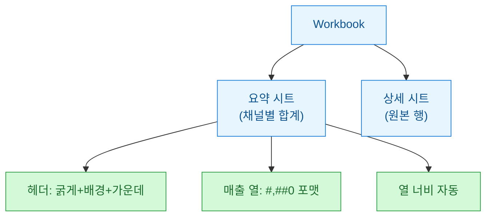

매주 월요일 아침, 나는 똑같은 일을 반복했다. MS-SQL에서 지난주 지표를 뽑고, 결과를 복사해 엑셀에 붙이고, 헤더를 굵게 만들고, 숫자에 천 단위 콤마를 넣고, 차트를 그렸다. 30분짜리 노가다. 이걸 파이썬 **openpyxl(오픈파이엑셀)**로 자동화한 뒤로는 스크립트 한 번이면 끝난다. 오늘은 그 패턴을 정리해 둔다.

> 참고: 아래 데이터는 전부 합성/더미다. 실제 지표·고객 정보는 하나도 들어 있지 않다.

## 전체 흐름은 어떻게 생겼나?


핵심은 "**쿼리 결과(raw)**와 **보여줄 리포트(view)**를 분리"하는 것이다. DB에서는 가공 없는 숫자만 가져오고, 보기 좋은 형태는 전부 openpyxl 쪽에서 만든다.

## 왜 pandas.to_excel 대신 openpyxl인가?

간단히 표로 비교했다.

| 방식 | 장점 | 한계 |
|------|------|------|
| `df.to_excel()` | 한 줄로 끝, 빠름 | 서식·차트·시트 레이아웃 제어가 거의 안 됨 |
| **openpyxl** 직접 | 셀 서식·차트·병합·열 너비 완전 제어 | 코드가 길어짐 |
| 둘 다 | pandas로 쓰고 openpyxl로 후처리 | 워크북 로드/저장 2번 |

리포트가 "누군가에게 보여줄 문서"라면 서식이 곧 품질이다. 그래서 나는 openpyxl로 직접 그리는 쪽을 택했다.

## MS-SQL에서 결과는 어떻게 가져오나?

집계는 DB에게 맡긴다. 파이썬이 행을 다 받아 합산하는 것보다 SQL의 `GROUP BY`가 훨씬 빠르다.

```sql
-- 주간 채널별 매출 요약 (더미)
SELECT
    channel                     AS 채널,
    COUNT(*)                    AS 주문수,
    SUM(amount)                 AS 매출액
FROM dbo.orders
WHERE order_date >= DATEADD(DAY, -7, CAST(GETDATE() AS DATE))
GROUP BY channel
ORDER BY 매출액 DESC;
```

```python
import pyodbc

conn = pyodbc.connect(
    "DRIVER={ODBC Driver 17 for SQL Server};"
    "SERVER=localhost;DATABASE=demo;Trusted_Connection=yes;"
)
cur = conn.cursor()
cur.execute(SQL)                     # 위 쿼리 문자열
headers = [d[0] for d in cur.description]   # 컬럼명
rows = cur.fetchall()                # 데이터 행
conn.close()
```

`cur.description`에서 컬럼명을 뽑아 두면, 헤더를 하드코딩하지 않아도 된다. 쿼리만 바꾸면 리포트가 따라온다.

## 시트 분리와 서식은 어떻게 입히나?



```python
from openpyxl import Workbook
from openpyxl.styles import Font, PatternFill, Alignment

wb = Workbook()
ws = wb.active
ws.title = "요약"

# 헤더 쓰기 + 서식
head_fill = PatternFill("solid", fgColor="1C7ED6")
head_font = Font(bold=True, color="FFFFFF")
for col, name in enumerate(headers, start=1):
    c = ws.cell(row=1, column=col, value=name)
    c.fill = head_fill
    c.font = head_font
    c.alignment = Alignment(horizontal="center")

# 데이터 쓰기
for r, row in enumerate(rows, start=2):
    for col, val in enumerate(row, start=1):
        ws.cell(row=r, column=col, value=val)

# '매출액'(3번째 열)에 천 단위 콤마
for r in range(2, len(rows) + 2):
    ws.cell(row=r, column=3).number_format = "#,##0"
```

여기서 자주 넘어지는 지점이 **숫자 포맷(number_format)**이다. `"#,##0"`은 값을 바꾸는 게 아니라 표시만 바꾼다. 실제 셀 값은 여전히 숫자라 나중에 엑셀에서 합계를 걸어도 정상 동작한다. 콤마를 넣겠다고 `f"{val:,}"`로 문자열을 넣으면, 그 순간 셀이 텍스트가 돼 차트와 수식이 전부 깨진다. 겪어 봐서 안다.

열 너비는 손으로 맞추면 끝이 없으니, 각 열 최대 글자 수 기준으로 자동 계산한다.

```python
from openpyxl.utils import get_column_letter

for col in range(1, len(headers) + 1):
    letter = get_column_letter(col)
    longest = max(
        len(str(ws.cell(row=r, column=col).value or ""))
        for r in range(1, ws.max_row + 1)
    )
    ws.column_dimensions[letter].width = longest + 4
```

## 차트는 어떻게 붙이나?

리포트에 막대 하나만 있어도 설득력이 다르다. openpyxl의 `BarChart`로 붙인다.

```python
from openpyxl.chart import BarChart, Reference

chart = BarChart()
chart.title = "채널별 매출"
chart.type = "col"

data = Reference(ws, min_col=3, min_row=1,
                 max_row=len(rows) + 1)          # 매출액 + 헤더
cats = Reference(ws, min_col=1, min_row=2,
                 max_row=len(rows) + 1)          # 채널명
chart.add_data(data, titles_from_data=True)
chart.set_categories(cats)
ws.add_chart(chart, "F2")                        # F2 위치에 앵커

wb.save("report.xlsx")
```

`Reference`에서 `min_row`를 헤더 포함이냐 아니냐로 한 칸 어긋나게 잡는 실수가 잦다. **data는 헤더 포함(1행부터)**, **categories는 데이터만(2행부터)**로 기억하면 편하다.

## 정리하면

| 실수 포인트 | 처방 |
|-------------|------|
| 콤마를 문자열로 박음 | `number_format="#,##0"` (값 아님, 표시만) |
| 헤더 하드코딩 | `cur.description`에서 컬럼명 추출 |
| 차트 참조 행 어긋남 | data=헤더 포함, categories=데이터만 |
| 열 너비 수동 | 최대 글자 수 기준 자동 계산 |

집계는 DB에게, 서식은 openpyxl에게. 이 역할 분담만 지키면 매주 30분짜리 반복 작업이 스크립트 한 줄로 줄어든다. 다음엔 이걸 스케줄러에 물려 월요일 아침 메일함에 리포트가 도착하게 만드는 이야기를 써 볼까 한다.
