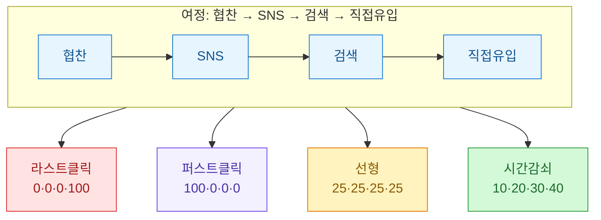
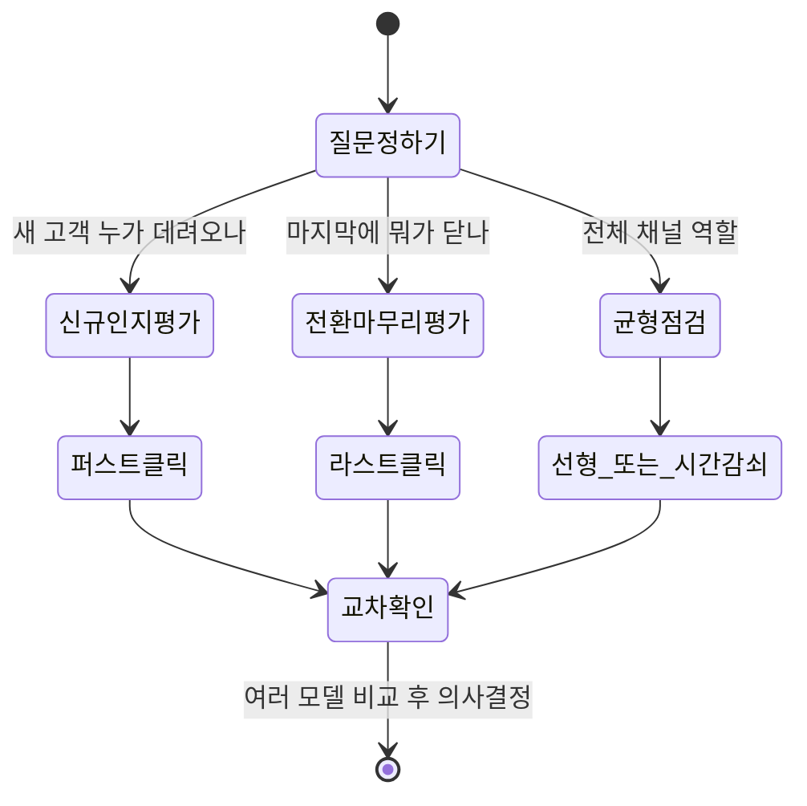
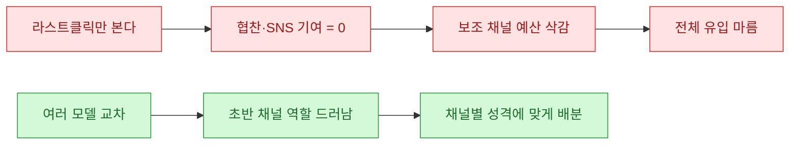

리포트를 만들다 보면 늘 같은 질문에 걸린다. "그래서 이 매출은 어느 채널 덕분이지?" 대시보드가 기본으로 보여주는 답은 거의 항상 **마지막 클릭(last click)**이다. 전환 직전에 클릭한 채널에 매출을 100% 몰아주는 방식. 편하긴 한데, 이걸 그대로 믿고 예산을 짜면 조용히 일하던 채널들이 통째로 억울해진다.

이 글은 그 억울함을 데이터로 풀어보는 기록이다. **아래 모든 수치와 표는 합성(더미) 데이터**이고, 실제 회사·브랜드·계정과는 무관하다. 채널도 전부 가상("검색", "협찬", "SNS", "직접유입")으로 뒀다.

## 라스트클릭이 대체 뭘 놓치는가?

먼저 큰 그림부터. 한 명의 고객이 전환(구매)하기까지 대개 여러 번 우리 콘텐츠를 스친다. 그 경로를 **여정(journey)**이라고 부른다.


라스트클릭은 이 그림에서 **마지막 D(직접유입)에게만** 매출을 준다. 처음 이 고객을 데려온 협찬도, 기억을 되살린 SNS도 기여도 0으로 기록된다. 문제는, 이런 "초반·중반 채널"일수록 라스트클릭 리포트에서 저평가되고 → 예산이 깎이고 → 전체 유입이 마르는 악순환에 빠지기 쉽다는 점이다.

**어트리뷰션(attribution)**이라는 말이 바로 이 "매출을 채널들에 어떻게 나눠줄까"의 문제다.

## 어떻게 생긴 문제인지 숫자로 보자

합성 데이터로 여정 로그를 하나 만들어 보자. 각 행은 "한 사용자의 전환까지의 채널 순서"다.

```python
# 합성 데이터: 실제 데이터가 아닌 예시용 더미입니다.
import pandas as pd

journeys = pd.DataFrame({
    "user": ["u1", "u2", "u3", "u4", "u5"],
    "path": [
        ["협찬", "SNS", "검색", "직접유입"],
        ["SNS", "검색", "직접유입"],
        ["협찬", "직접유입"],
        ["검색", "직접유입"],
        ["SNS", "협찬", "직접유입"],
    ],
    "revenue": [50000, 30000, 40000, 20000, 60000],  # 원
})
```

이 데이터에서 **라스트클릭**으로 채널별 매출을 집계하면 이렇게 된다. 마지막 채널만 보면 되니 계산도 단순하다.

```python
def last_click(df):
    df = df.copy()
    df["credited"] = df["path"].apply(lambda p: p[-1])
    return df.groupby("credited")["revenue"].sum()

print(last_click(journeys))
```

결과(합성):

| 채널 | 라스트클릭 매출(원) | 비중 |
|---|---|---|
| 직접유입 | 200,000 | 100% |
| 검색 | 0 | 0% |
| SNS | 0 | 0% |
| 협찬 | 0 | 0% |

전 매출이 "직접유입" 한 곳으로 쏠렸다. 상식적으로 협찬과 SNS가 사람을 데려왔는데도, 리포트상으론 아무 일도 안 한 채널이 된다. 이게 라스트클릭의 맹점을 극단적으로 보여주는 그림이다.

## 그럼 어떤 방식으로 나눠줄 수 있나?

매출을 나누는 규칙은 여러 가지가 있다. 대표적인 네 가지를 비교하면 이렇다.

| 모델 | 나누는 규칙 | 잘 맞는 상황 | 한계 |
|---|---|---|---|
| 라스트클릭 | 마지막 채널 100% | 전환 유도 채널만 볼 때 | 초반 기여 완전 무시 |
| 퍼스트클릭 | 첫 채널 100% | 신규 인지 채널 평가 | 전환 마무리 무시 |
| 선형(linear) | 모든 채널 균등 분배 | 골고루 볼 때 | 진짜 중요한 접점도 균등 취급 |
| 시간감쇠(time decay) | 전환에 가까울수록 더 많이 | 최근 접점 중시 | 가중치 기준이 임의적 |

그림으로 보면 "같은 여정, 다른 배분"이 한눈에 들어온다.



핵심은 "정답 모델"을 찾는 게 아니다. **여러 렌즈로 같은 데이터를 보면 라스트클릭 하나만 볼 때 안 보이던 채널의 역할이 드러난다**는 것이다.

## 선형·시간감쇠로 다시 나눠보면?

이제 같은 합성 데이터에 선형과 시간감쇠를 적용해 보자. 선형은 여정에 등장한 채널 수로 매출을 균등 분배한다. 시간감쇠는 전환에 가까울수록 가중치를 크게 준다(여기선 마지막 접점부터 반씩 줄여가는 방식으로 단순화).

```python
def linear(df):
    rows = []
    for _, r in df.iterrows():
        share = r["revenue"] / len(r["path"])
        for ch in r["path"]:
            rows.append((ch, share))
    return pd.DataFrame(rows, columns=["ch", "rev"]).groupby("ch")["rev"].sum()

def time_decay(df, half=0.5):
    # 마지막 접점 가중치 1, 그 앞은 half배씩 감소
    rows = []
    for _, r in df.iterrows():
        n = len(r["path"])
        weights = [half ** (n - 1 - i) for i in range(n)]
        total = sum(weights)
        for ch, w in zip(r["path"], weights):
            rows.append((ch, r["revenue"] * w / total))
    return pd.DataFrame(rows, columns=["ch", "rev"]).groupby("ch")["rev"].sum()

print(linear(journeys).round(0))
print(time_decay(journeys).round(0))
```

세 모델을 나란히 놓으면(합성 데이터 기준, 단위 원) 그림이 완전히 달라진다.

| 채널 | 라스트클릭 | 선형 | 시간감쇠 |
|---|---|---|---|
| 직접유입 | 200,000 | 55,000 | 108,000 |
| 검색 | 0 | 32,000 | 34,000 |
| SNS | 0 | 43,000 | 30,000 |
| 협찬 | 0 | 70,000 | 28,000 |

(위 표의 선형·시간감쇠 값은 예시로 반올림한 합성 수치다. 요점은 정확한 숫자가 아니라 **분포의 변화**다.)

라스트클릭에선 0원이던 협찬이 선형에선 오히려 가장 큰 기여 채널로 올라온다. 이게 "협찬·SNS가 실제로 하던 일"이다. 초반에 사람을 데려오는 역할. 라스트클릭 하나만 봤다면 이 채널들 예산부터 잘랐을 거다.

## 그럼 어떤 모델을 써야 하나?

솔직히 말하면 "하나만 골라 정답으로 쓰기"는 위험하다. 내가 실무에서 기대는 원칙은 이렇다.



- **질문을 먼저 정한다.** "신규 인지에 뭐가 기여하나"를 묻는데 라스트클릭을 보는 건 애초에 틀린 렌즈다.
- **최소 두 개 모델을 교차 확인한다.** 라스트클릭과 선형만 나란히 봐도, 어느 채널이 "마무리형"이고 어느 채널이 "물꼬형"인지 성격이 갈린다.
- **모델 간 순위가 크게 뒤집히는 채널을 주목한다.** 협찬처럼 라스트클릭 0인데 선형에서 1위인 채널이 바로 "라스트클릭이 억울하게 만든" 곳이다.

한 가지 덧붙이면, 이 모든 건 **여정 로그(사용자별 채널 순서)가 있어야** 가능하다. 채널별 합계만 있으면 어트리뷰션은 애초에 시작을 못 한다. 그래서 나는 리포트를 설계할 때 집계 전에 "누가 어떤 순서로 왔나"를 남기는 걸 먼저 챙긴다.

## 정리



핵심 3줄:

- 라스트클릭은 편하지만 전환 직전 채널에 매출을 몰아줘서, 초반에 사람을 데려온 협찬·SNS의 기여를 통째로 지운다.
- 퍼스트/선형/시간감쇠로 다시 나눠보면 "라스트클릭 0원" 채널이 실은 유입의 물꼬였음이 드러난다.
- 정답 모델을 찾기보다 **질문에 맞는 렌즈를 고르고 여러 모델을 교차 확인**하는 게 실무적으로 안전하다. (그러려면 채널별 합계가 아니라 사용자별 여정 로그를 먼저 남겨야 한다.)
