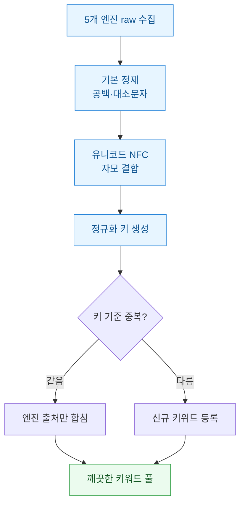
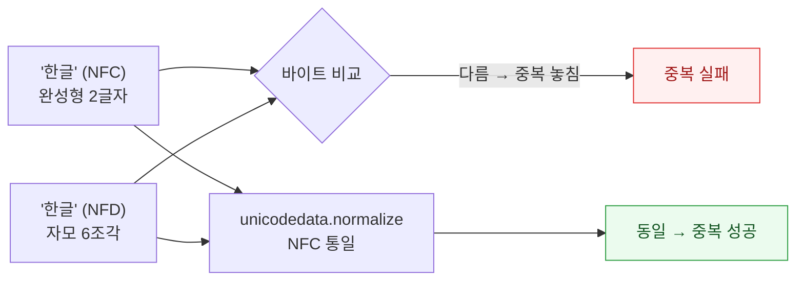
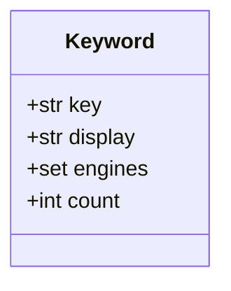

키워드 리서치를 하다 보면 늘 같은 벽에 부딪혔다. 구글, 네이버, 다음, 유튜브, 빙 다섯 곳에서 연관검색어(자동완성·추천 키워드)를 긁으면 금세 수천 개가 쌓인다. 문제는 이게 "깨끗한 목록"이 아니라는 거였다. 앞뒤 공백이 붙은 놈, 대문자만 다른 놈, 눈으로는 똑같은데 컴퓨터는 다른 글자로 세는 놈이 뒤섞여 있었다. 처음엔 엑셀 중복 제거 한 번이면 되겠지 했다가 크게 데였다. 여기서는 그 삽질 끝에 정착한 정규화(normalization, 표기를 하나의 표준형으로 통일하는 것) 레시피를 정리한다.

전체 흐름부터 도식으로 깔아두고 시작한다.



## 왜 엑셀 중복 제거로는 안 됐나?

첫 시도는 다섯 개 CSV를 세로로 붙이고 "중복된 값 제거" 버튼을 누른 거였다. 5천 행이 4천8백 행으로 줄었다. 그런데 눈으로 훑어보니 `강남 맛집`과 `강남 맛집 `(뒤에 공백)이 둘 다 살아 있었다. 엑셀 입장에선 마지막 공백 한 칸 때문에 서로 다른 값이다.

문제를 유형별로 갈라보니 셋이었다.

| 겉보기 | 실제 차이 | 예시 |
|---|---|---|
| 같아 보임 | 앞뒤·중간 공백 | `강남 맛집` vs `강남  맛집 ` |
| 같아 보임 | 대소문자 | `SEO 도구` vs `seo 도구` |
| 완전 같아 보임 | 자모 결합 방식 | `한글`(NFC) vs `한글`(NFD) |

앞의 둘은 그래도 짐작이 갔다. 세 번째가 진짜 함정이었다. 화면상 완벽하게 똑같은 글자인데 중복으로 안 잡혔다.

## 공백과 대소문자는 어디까지 손대야 하나?

기본 정제는 단순하다. 다만 순서와 강도를 정해둬야 나중에 헷갈리지 않는다. 나는 이렇게 고정했다.

```python
import re

def basic_clean(s: str) -> str:
    s = s.strip()                 # 앞뒤 공백 제거
    s = re.sub(r"\s+", " ", s)    # 중간 연속 공백을 한 칸으로
    return s
```

여기서 대소문자를 아예 소문자로 눌러버릴지는 고민이 있었다. `iPhone`처럼 표기 자체가 브랜드인 경우가 있어서다. 그래서 원문은 살리고 **중복 판정에 쓰는 키만 소문자로** 만들기로 했다. 화면에 보여줄 원문과 비교용 키를 분리한 것이다. 이 분리가 뒤에서 핵심이 된다.

## 눈에 똑같은 글자를 왜 다르게 셌나?

세 번째 함정의 정체는 유니코드였다. 한글 `가`는 한 덩어리 완성형(NFC)으로도, `ㄱ+ㅏ` 자모 분해형(NFD)으로도 저장될 수 있다. 맥에서 만든 파일이나 일부 웹 응답은 NFD로 오는 경우가 있다. 화면에 그려질 땐 똑같이 `가`인데 바이트로는 전혀 다르다.



해법은 한 줄이었다. 모든 문자열을 NFC로 강제 통일하면 자모 조각들이 완성형으로 다시 합쳐진다.

```python
import unicodedata

def normalize_key(s: str) -> str:
    s = basic_clean(s)
    s = unicodedata.normalize("NFC", s)  # 자모 결합 통일
    return s.lower()                     # 비교용 키는 소문자
```

이 `normalize_key`를 통과시키자 아까 안 잡히던 쌍둥이들이 한꺼번에 하나로 접혔다.

## 정규화 키와 원문을 어떻게 같이 보관했나?

중복을 지우는 것만큼 중요한 게 "이 키워드가 어느 엔진에서 나왔나"였다. 다섯 엔진 중 세 곳에서 동시에 뜨는 키워드는 그만큼 수요가 두껍다는 신호라 출처를 버리기 아까웠다. 그래서 키로 묶되 원문과 출처는 합치는 구조로 갔다.



딕셔너리로 병합하면 코드도 짧다. 키가 처음 보이면 등록하고 이미 있으면 엔진 출처만 더한다.

```python
def merge(rows):
    # rows: (engine, raw_text) 튜플 목록
    pool = {}
    for engine, raw in rows:
        key = normalize_key(raw)
        if not key:
            continue
        if key not in pool:
            pool[key] = {"display": basic_clean(raw),
                         "engines": set(), "count": 0}
        pool[key]["engines"].add(engine)
        pool[key]["count"] += 1
    return pool
```

이렇게 돌리자 5천여 건이 실제 고유 키워드 3천여 개로 접혔다. 내 경우엔 원본 대비 약 40% 가까이가 표기 변형·엔진 간 중복이었다. `display`엔 사람이 읽을 원문을 남기고 `engines`엔 출처 집합을 담으니 나중에 "3개 엔진 이상에서 뜬 것만" 같은 필터도 바로 걸렸다.

## 마무리

정리하면 순서가 전부였다. 공백을 다듬고, NFC로 자모를 합치고, 소문자 키로 접되 원문과 출처는 살린다. 특히 눈에 안 보이는 자모 정규화는 한글 데이터를 다룰 때 두고두고 발목을 잡는 지점이라 꼭 챙겨두면 좋다. 다음엔 여기서 나온 키워드 풀을 검색량·경쟁도와 붙여 우선순위를 매기는 과정을 정리해볼 생각이다.

> 크롤링으로 연관검색어를 수집할 땐 각 엔진의 robots·이용약관과 요청 간격(레이트리밋)을 지키자. 위 코드는 정규화 로직을 보여주기 위한 합성 예시다.
