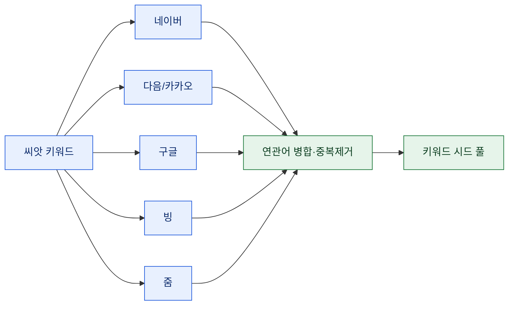

# 멀티엔진 연관검색어 수집

> 키워드 리서치를 하다 보면 첫 단추가 늘 같다. "씨앗 키워드 몇 개에서 연관어를 얼마나 넓게 펼치느냐." 그런데 한 엔진에서만 뽑으면 그 엔진 사용자층의 편향이 그대로 시드에 박힌다. 네이버는 쇼핑·블로그 색이 강하고, 구글은 정보성, 다음·줌은 또 다르다. 그래서 여러 엔진에서 한 번에 긁어 합쳤다. 이 글은 그 수집기를 만드는 레시피다. (수집은 각 사이트의 robots·약관·호출 한도를 지키는 선에서.)

## 왜 한 엔진으론 부족한가?

연관검색어는 그 엔진 사용자들이 실제로 뭘 같이 검색했는지의 그림자다. 즉 **엔진마다 다른 모집단**을 본다. 같은 씨앗을 넣어도 네이버에서 나오는 연관어와 구글에서 나오는 연관어가 겹치면서도 어긋난다. 그 교집합은 확실한 수요, 차집합은 놓치기 쉬운 틈새다.



## 연관어는 사실 두 종류다

수집 전에 구분할 게 있다. 화면에서 보는 "연관검색어"와, 검색창에 칠 때 뜨는 "자동완성(suggest)"은 다른 소스다.

- **연관검색어**: 검색 결과 페이지 하단/우측에 뜨는 관련 질의. 보통 **HTML을 스크래핑**해서 특정 영역을 파싱한다.
- **자동완성**: 검색창 입력 중 뜨는 추천어. 대개 별도 **suggest 엔드포인트가 JSON**을 준다. 이건 브라우저 없이 그 API를 직접 부르면 끝난다.

둘을 함께 모으면 시드가 훨씬 두꺼워진다. 하나는 "결과 기반 관련어", 하나는 "입력 기반 추천어"라 성격이 다르기 때문이다.

## 엔진마다 접근이 다르다

한 방식으로 다 커버되지 않는다. 엔진별로 데이터가 어디서 오는지가 다르니, 접근도 갈린다.

| 엔진 | 소스 | 방식 |
|---|---|---|
| 네이버 | 결과 페이지 연관검색어 영역 | HTML 스크래핑(특정 컨테이너 파싱) |
| 다음/카카오 | suggest 엔드포인트 | JSON API 직접 호출(PC·모바일 분리) |
| 구글 | 결과 페이지 관련 검색 | HTML 스크래핑(HTTP/2 필요할 때 있음) |
| 빙 | 결과 페이지 관련 검색 | HTML 스크래핑 |
| 줌 | 결과 페이지 연관어 | HTML 스크래핑 |

## HTML 스크래핑 쪽 — requests + 파서

결과 페이지에서 연관어 영역을 긁는 건 requests로 페이지를 받아 파서로 특정 블록을 집는 패턴이다. 한글 씨앗은 URL 인코딩(`quote`)을 꼭 거친다.

```python
import requests
from bs4 import BeautifulSoup
from urllib.parse import quote

def naver_related(keyword):
    url = f"https://search.naver.com/search.naver?query={quote(keyword)}"
    html = BeautifulSoup(requests.get(url, timeout=10).text, "html.parser")
    box = html.find("div", {"class": "related_srch"})   # 연관검색어 컨테이너
    if not box:
        return []
    return [a.get_text(strip=True) for a in box.select("a")]
```

컨테이너 클래스명은 사이트 개편 때 바뀌므로, "못 찾으면 빈 리스트"로 안전하게 빠지게 짜는 게 중요하다. 파서는 `BeautifulSoup`도 되고, CSS/XPath가 편하면 `parsel`의 `Selector`도 좋다.

## 자동완성 쪽 — suggest JSON을 직접 호출

자동완성은 브라우저가 필요 없다. suggest 엔드포인트가 주는 JSON을 그대로 받으면 된다. PC와 모바일 엔드포인트가 나뉜 곳은 둘 다 부르면 커버리지가 넓어진다.

```python
def daum_suggest(keyword):
    url = f"https://suggest.search.daum.net/sushi/pc/get?q={quote(keyword)}"
    data = requests.get(url, timeout=10).json()
    return data.get("subkeys", [])       # 응답 구조는 엔진마다 다름
```

## 구글이 안 될 때 — httpx HTTP/2로 갈아타기

구글 결과 페이지는 순정 `requests`로 때때로 막히거나 빈 응답을 준다. 이럴 때 **HTTP/2를 지원하는 `httpx`**로 바꾸면 풀리는 경우가 많다. 최신 프로토콜·헤더 협상이 필요한 상대에겐 클라이언트를 바꾸는 게 답일 때가 있다.

```python
import httpx
client = httpx.Client(http2=True, timeout=10)   # pip install "httpx[http2]"
resp = client.get(f"https://www.google.com/search?hl=ko&q={quote(keyword)}")
```

## 마지막 — 병합하고 중복을 걷어낸다

엔진별 결과를 모았으면 하나의 시드 풀로 합친다. 공백·대소문자·중복을 정리하고, 어느 엔진에서 나왔는지 출처를 함께 달아두면 나중에 가중치를 줄 때 쓸 수 있다.

```python
def merge_keywords(*lists):
    seen, out = set(), []
    for lst in lists:
        for kw in lst:
            k = kw.strip()
            if k and k.lower() not in seen:
                seen.add(k.lower()); out.append(k)
    return out
```

여러 엔진에 **동시 등장한 키워드일수록 수요가 확실**하니, 등장 엔진 수를 세어 정렬하면 시드 우선순위가 자연히 잡힌다.

## 조심할 것

몇 가지 함정이 있다. **구조 변경** — 결과 페이지의 연관어 영역 클래스는 수시로 바뀌므로, 셀렉터가 어긋나면 조용히 빈손이 된다. 수집 건수 헬스체크를 걸어라. **인코딩** — 한글 씨앗은 `quote`로 감싸야 하고, 응답 인코딩이 깨지면 명시적으로 지정한다. **호출 예의** — 요청 간 간격과 백오프를 두고, robots·약관을 확인하고, 과한 빈도는 피한다. 관찰이 목적이지 부하가 목적이 아니다.

## 정리 — 시드의 폭이 리서치의 폭이다

| 소스 | 성격 | 수집 |
|---|---|---|
| 연관검색어 | 결과 기반 관련어 | HTML 스크래핑 |
| 자동완성 | 입력 기반 추천어 | suggest JSON |
| 멀티엔진 | 편향 상쇄 | 병합·출처 표기 |

> 키워드 리서치의 품질은 정교한 분석보다 **시드의 폭**에서 갈린다. 한 엔진의 눈으로만 보면 그 엔진이 못 보는 수요는 영원히 안 보인다. 여러 창을 동시에 여는 것, 그게 첫 단추다. 여기에 유튜브 같은 자동완성 소스를 하나 더 붙이는 것도 같은 패턴으로 쉽게 확장된다.

*수집은 각 사이트의 robots·이용약관·호출 한도를 준수하는 범위에서만 이뤄져야 합니다.*
