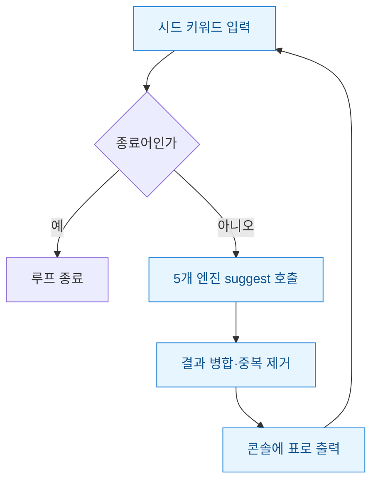
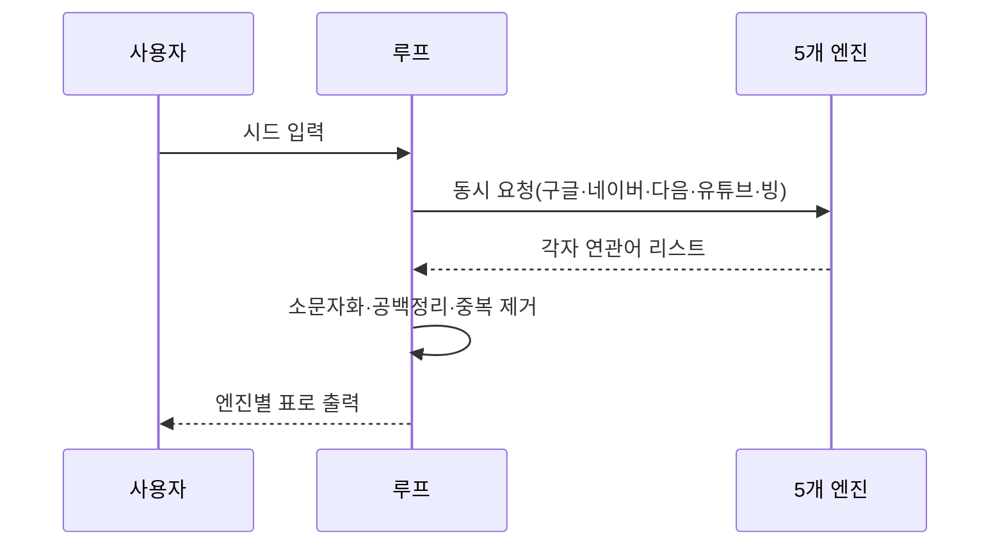
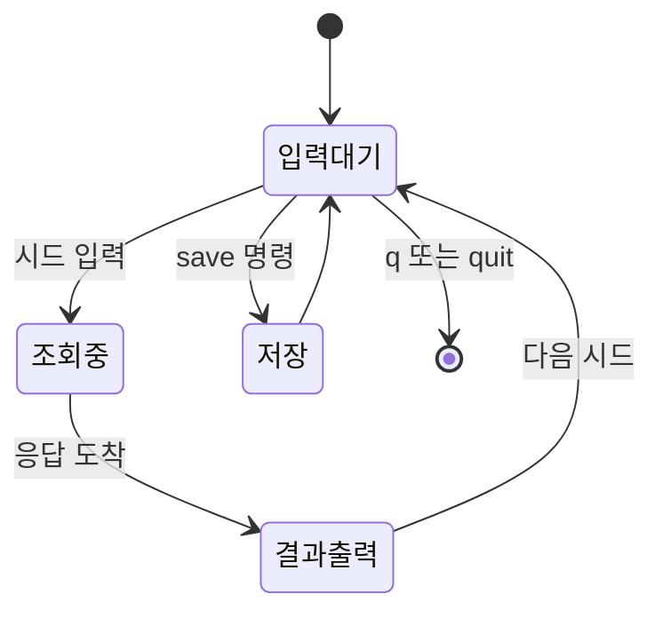

키워드 리서치를 하다 보면 매번 브라우저를 열고, 검색창에 시드(seed·씨앗) 키워드를 치고, 아래로 뜨는 자동완성을 눈으로 훑는 짓을 반복하게 된다. 구글 하나면 몰라도 네이버·다음·유튜브·빙까지 다 돌면 창을 다섯 번 열어야 한다. 나는 이 반복이 지겨워서 "시드만 계속 입력받고, 다섯 엔진 연관어를 한 번에 뱉는" 작은 CLI 루프를 만들었다. 대단한 크롤러가 아니라 각 검색엔진이 공개한 자동완성(suggest) API를 그냥 두드리는 수준이다. 그런데 이 소소한 루프 하나가 리서치 속도를 확 바꿨다.

먼저 전체 그림부터.



## 왜 브라우저 대신 입력 루프였나?

핵심은 "리서치는 원래 반복 작업"이라는 점이다. 키워드 하나를 넣으면 연관어가 뜨고, 그중 흥미로운 걸 다시 시드로 넣어 파고든다. 이 흐름은 REPL(입력받고-처리하고-출력하고 다시 입력받는 대화형 루프)과 똑같다. 그래서 처음부터 화면·버튼을 만들 이유가 없었다. `while True`로 입력만 계속 받으면 됐다.

엔진마다 공개된 자동완성 엔드포인트가 있다. 검색창 밑에 뜨는 그 추천어를 JSON으로 돌려주는 주소다. 다섯 곳을 표로 정리하면 이렇다.

| 엔진 | 성격 | 비고 |
|---|---|---|
| 구글 | 글로벌 검색 의도 | 파라미터로 언어 지정 |
| 네이버 | 국내 검색 습관 | 국내 쇼핑·정보성 강함 |
| 다음 | 국내 보조 | 네이버와 겹치되 다른 롱테일 |
| 유튜브 | 영상 소비 의도 | 같은 시드도 결과가 딴판 |
| 빙 | 영문·해외 | 국내와 안 겹치는 키워드 |

같은 "캠핑"을 넣어도 유튜브는 "캠핑 브이로그", 네이버는 "캠핑용품 추천"이 위로 온다. 엔진을 섞어야 검색 의도가 입체적으로 보인다.

## 다섯 엔진을 어떻게 한 번에 호출했나?

시드 하나가 들어오면 다섯 엔진에 요청을 보낸다. 순서대로 기다리면 느려서 병렬로 던졌다.



코드는 표준 라이브러리 `concurrent.futures`로 충분했다. 엔진별 함수를 하나로 맞춰두면 나중에 엔진을 더 붙이기도 쉽다.

```python
import requests
from concurrent.futures import ThreadPoolExecutor

def google_suggest(seed):
    url = "https://suggestqueries.google.com/complete/search"
    r = requests.get(url, params={"client": "firefox", "q": seed}, timeout=4)
    return r.json()[1]  # 두 번째 원소가 추천어 리스트

ENGINES = {"google": google_suggest, "naver": naver_suggest, ...}

def fetch_all(seed):
    result = {}
    with ThreadPoolExecutor(max_workers=5) as ex:
        futures = {name: ex.submit(fn, seed) for name, fn in ENGINES.items()}
        for name, fut in futures.items():
            try:
                result[name] = fut.result()
            except Exception:
                result[name] = []   # 한 엔진 실패해도 나머지는 보여준다
    return result
```

여기서 배운 건 **한 엔진이 죽어도 루프 전체가 멈추면 안 된다**는 것이다. 빙이 이따금 타임아웃을 내는데 초창기엔 그 예외 하나가 프로그램을 통째로 죽였다. 엔진별로 `try/except`를 감싸 빈 리스트로 떨구니 나머지 네 엔진 결과는 멀쩡히 나왔다.

## 처음 UX가 왜 불편했고 무엇을 고쳤나?

돌아는 갔는데 쓰다 보니 짜증나는 지점이 계속 나왔다. 이걸 상태 흐름으로 그려놓고 하나씩 고쳤다.



고친 것 세 가지다. 첫째, **종료 방법**. 처음엔 Ctrl+C로만 껐는데 그때마다 빨간 에러가 떴다. `q`·`quit`·빈 입력을 종료어로 받아 깔끔히 빠져나오게 했다.

둘째, **결과 보기**. 다섯 엔진 결과를 그냥 쭉 print하니 어느 게 어느 엔진인지 뒤섞였다. 엔진 이름을 헤더로 얹고 왼쪽 정렬 표로 끊어주니 눈이 편해졌다.

셋째, **저장**. 파고들다 보면 좋은 키워드가 스크롤 위로 사라진다. `save`를 치면 그 세션에서 본 연관어 전체를 CSV로 떨구게 했다. 나중에 스프레드시트에서 검색량과 붙여 우선순위를 매기기 좋다.

```python
while True:
    seed = input("시드> ").strip()
    if seed.lower() in {"", "q", "quit"}:
        break
    if seed.lower() == "save":
        export_csv(session_rows); continue
    for name, words in fetch_all(seed).items():
        print(f"[{name}] " + " · ".join(words[:8]))
        session_rows.extend((name, seed, w) for w in words)
```

## 남은 한 줄 교훈

화면부터 그리지 않고 **반복 흐름을 그대로 코드로 옮긴 게** 이 도구의 전부다. 리서치처럼 "넣고-보고-다시 넣는" 작업은 입력 루프 하나로 대부분 커버된다. 다음엔 여기에 각 키워드의 대략적 검색 수요를 붙여 자동으로 정렬해줄 생각이다. 참고로 공개 suggest API도 남용하면 차단당하니 요청 사이에 짧은 간격을 두고, 각 서비스 약관과 레이트리밋은 미리 확인하는 게 안전하다.
