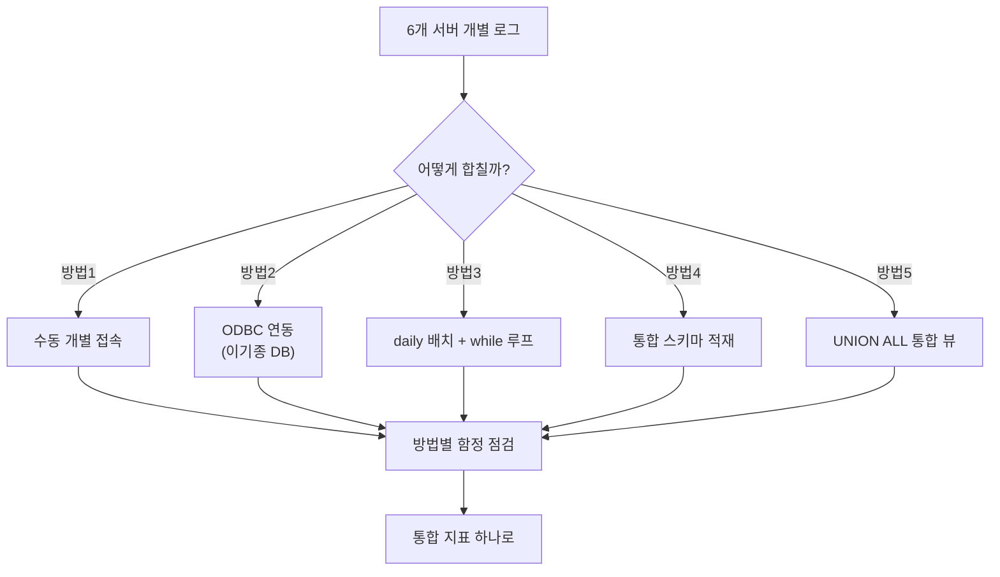
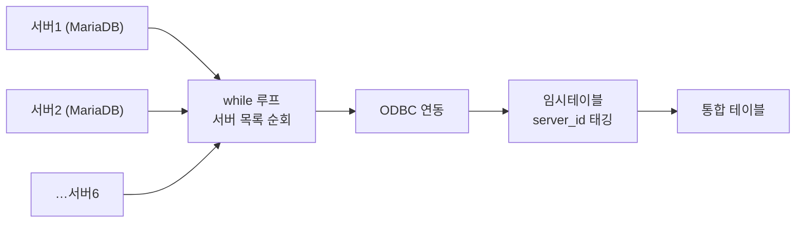
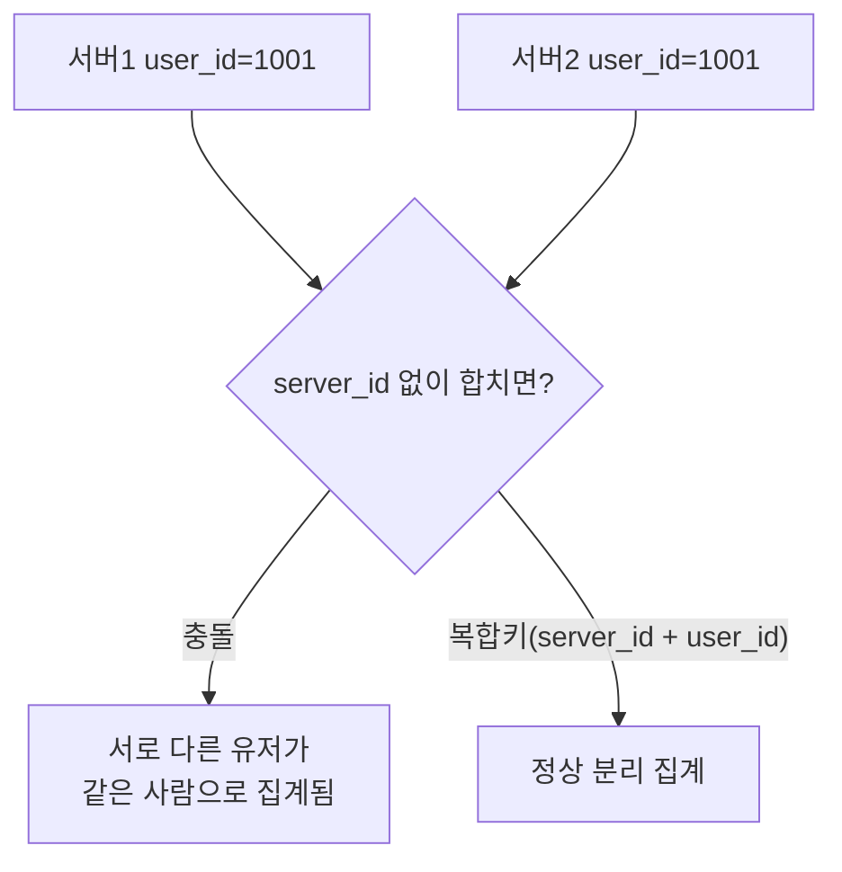

지표 하나 보자고 서버를 여섯 번 접속해야 했던 시절이 있었다. 라이브 게임은 부하 분산 때문에 여러 서버로 쪼개 운영되는 경우가 많은데, 픽률(신규 캐릭터가 실제로 얼마나 선택되는지 보는 지표) 하나를 구하려 해도 서버 6개의 로그를 다 긁어 합쳐야 했다. 그런데 정작 막혔던 건 지표 계산식이 아니라 **"이걸 대체 어떻게 하나로 합칠 것인가"**였다. 이 글은 그 합치는 방법 자체를 — 실제로 썼던 방식과 검토했던 대안들을 — 함정까지 포함해 비교한 것이다.

먼저 전체 그림부터 본다.



## 왜 서버마다 따로 접속해서 보면 안 되나?

가장 단순한 방법은 서버 하나하나에 직접 접속해 같은 쿼리를 돌리고, 결과를 엑셀에서 손으로 더하는 것이다. 지표가 하나뿐이고 서버가 두세 개면 이 방법도 버틴다. 문제는 서버가 6개로 늘고 지표가 여러 개로 늘어나는 순간이다.

수작업은 서버 수만큼 늘어나는 게 아니라 **서버 수 × 지표 수만큼** 늘어난다. 게다가 사람이 복사·붙여넣기를 반복하다 보면 서버 하나를 빼먹어도 표는 완성된 것처럼 보인다. 어제까지는 이 방식으로도 버텼는데, 오늘 갑자기 숫자가 이상하다면 십중팔구 서버 하나가 조용히 빠진 것이다. **자동화되지 않은 통합은 "합쳤다"가 아니라 "합친 줄 알았다"에 가깝다.**

## 서로 다른 DB 엔진을 하나의 연결로 묶으려면?

서버마다 DB 엔진 자체가 다를 수도 있다. 내가 다루던 환경은 서버별 운영 DB가 MariaDB였고, 집계는 MySQL 쪽에서 하고 있었다. 이럴 때 쓴 방법이 **ODBC(Open Database Connectivity — 제조사가 다른 DB를 같은 방식으로 연결하게 해주는 표준 인터페이스) 연동**이다. MariaDB 쪽 서버들을 MySQL에서 ODBC로 붙여, 쿼리 레벨에서 원격 데이터를 끌어올 수 있게 만들었다.

```sql
-- 개념 예시(합성 스키마). 실제 연결정보·서버 실명은 미포함.
-- ODBC로 연결된 원격 서버에서 당일 로그만 끌어온다.
SELECT
    server_id,
    user_id,
    hero_id
FROM   OPENQUERY(MARIADB_LINK,
       'SELECT user_id, hero_id FROM action_log WHERE action_date = CURDATE()')
       AS remote;
```

편해 보이지만 함정이 세 가지 있었다. 첫째, **방언 차이** — 날짜 함수·문자셋 표기가 DB마다 달라 그대로 복사하면 깨진다. 둘째, **인코딩** — 한글 데이터가 오가는 구간에서 문자셋을 명시하지 않으면 글자가 깨지는 건 단골 사고였다. 셋째, **원격 조인 성능** — 여러 서버에 걸친 JOIN은 네트워크 왕복이 쌓여 순식간에 느려진다. 그래서 원격 쪽에서는 조인을 최소화하고, 집계 단위로 필요한 것만 끌어오는 방향으로 정리했다.

## 매일 자동으로 걷어오게 만들려면?

연결 방법을 정했다고 끝이 아니다. 이 집계를 **매일** 돌려야 한다면, 서버 6개를 매번 사람이 순서대로 확인할 순 없다. 그래서 서버 목록을 두고 **daily 추출 배치를 while 루프**로 돌렸다 — 서버 목록을 하나씩 순회하며 같은 추출 쿼리를 반복 실행하는 구조다.



```python
# 개념 예시(합성). 실제 서버 목록·DSN·자격증명은 환경변수로 관리.
for server in server_list:                 # while 루프로 서버를 순회
    conn = connect_odbc(server["dsn"])      # 서버별 ODBC 연결
    rows = conn.execute(DAILY_EXTRACT_SQL, target_date)
    stage_table.insert(rows, server_id=server["id"])   # server_id 태깅 필수
    conn.close()
```

여기서 겪은 함정은 두 가지다. 하나는 **직렬 처리의 지연** — 서버 하나가 응답이 느리면 뒤에 있는 서버 전부가 밀린다. 다른 하나는 더 위험한 **사일런트 실패**다. 서버 하나가 타임아웃 나도 예외 처리를 제대로 안 해두면 루프는 그냥 다음 서버로 넘어가고, 배치는 "성공"으로 끝난다. 그날 지표만 슬쩍 낮게 나온다. 이걸 겪은 뒤로는 서버별 성공/실패를 별도 로그 테이블에 반드시 남기게 했다. **자동화는 반복을 줄이지만, 실패를 눈에 보이게 만들지 않으면 오히려 더 위험하다.**

## 다 모은 다음엔 어떻게 저장해야 나중에 안 꼬이나?

서버별 데이터를 다 끌어왔다고 바로 합치면 안 된다. 서버마다 유저 ID가 **독립적으로 채번**되기 때문이다. 서버1의 1001번과 서버2의 1001번은 완전히 다른 사람인데, `server_id` 없이 `user_id`만으로 합치면 이 둘이 같은 사람으로 뭉개진다.



그래서 통합 테이블의 기본 원칙은 하나다. **`server_id`를 항상 복합키의 일부로 포함시킨다.** 픽률이든 DAU든 이 원칙이 깨지면 숫자는 나오는데 틀린 숫자가 나온다. 더 나쁜 건 이 오류가 에러를 던지지 않는다는 점이다 — 쿼리는 성공하고 표는 그럴듯하게 채워진다. 그래서 통합 스키마 설계 단계에서 이 부분만큼은 리뷰를 꼼꼼히 했다.

## 배치 대신 실시간으로 합쳐 보고 싶으면 어떨까?

daily 배치는 "어제까지의 통합 지표"에는 강하지만, "지금 당장" 확인이 필요할 땐 느리다. 이럴 때 검토한 대안이 **UNION ALL로 묶은 통합 뷰**다 — 서버별 테이블을 뷰 하나로 묶어두고, 조회 시점에 바로 합쳐서 보는 방식이다. 배치 없이 즉시 조회가 가능하다는 장점이 있지만, 서버마다 스키마가 컬럼 순서나 타입에서 미묘하게 어긋나면 뷰 자체가 깨지고, 실시간 조인은 무겁다는 함정이 그대로 따라온다.

결국 정리한 원칙은 이거였다. **지표성 데이터(픽률·DAU 같은 반복 집계)는 daily 배치로, 급하게 한 번 확인할 때만 통합 뷰로.** 방법을 하나로 통일하려 하지 않고 용도에 맞게 나눠 쓰는 것 자체가 다섯 번째 방법이었던 셈이다.

## 정리 — 합치는 방법 자체가 설계 문제다

- **수동 개별 접속**: 서버 2~3개까지만 버틴다. 서버가 늘면 사람이 실수로 빠뜨린다.
- **ODBC 연동**: 이기종 DB를 하나의 쿼리로 묶지만, 방언·인코딩·원격 조인 성능이 함정.
- **daily 배치 + while 루프**: 반복을 자동화하지만, 직렬 지연과 사일런트 실패를 반드시 로그로 잡아야 한다.
- **통합 스키마(server_id 복합키)**: 이걸 놓치면 서로 다른 유저가 같은 사람으로 합쳐진다.
- **UNION ALL 통합 뷰**: 즉시 조회엔 좋지만 배치를 완전히 대체하진 못한다.

여러 서버를 "하나처럼 보이게" 만드는 일은 지표 계산보다 먼저 풀어야 하는 설계 문제였다. 다음 글에서는 이렇게 합친 통합 데이터에 흔히 숨는 정합성 함정 — 중복 집계, 서버 간 시간대 불일치 — 을 점검하는 방법을 정리한다.

- 방법론·합성 스키마 레시피: [github.com/DBhyeong/game-data-recipes](https://github.com/DBhyeong/game-data-recipes)
