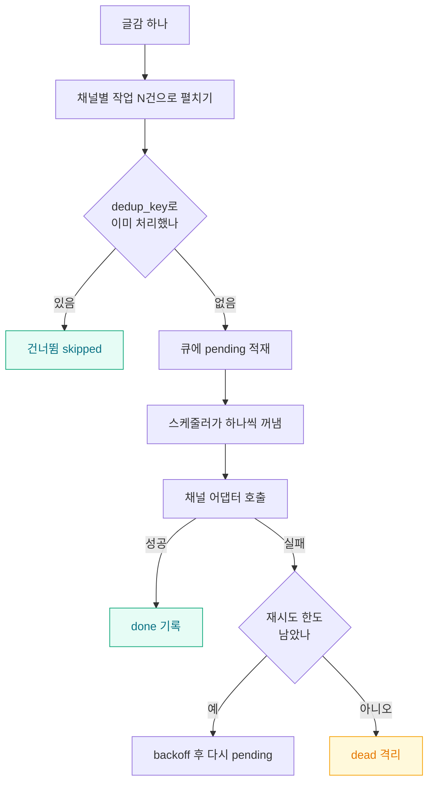
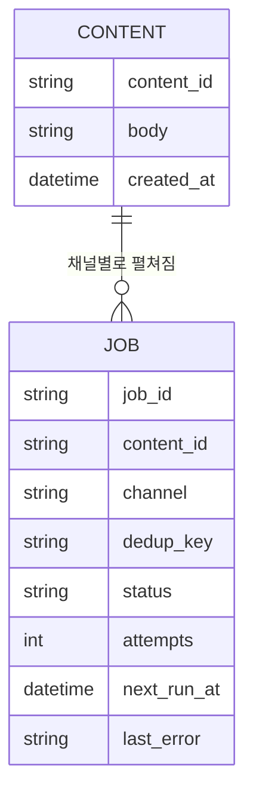
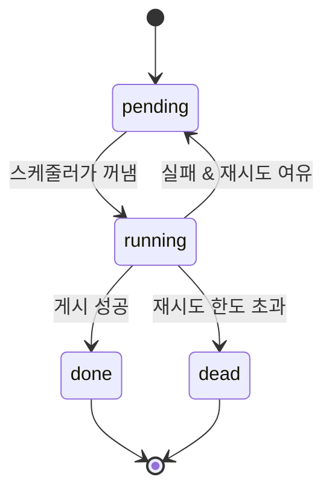

한동안 SNS 자동 포스팅을 "for 루프 하나면 끝나는 일"로 생각했다. 채널 목록을 돌면서 순서대로 글을 던지면 되는 거 아닌가. 그런데 채널이 여덟 개를 넘고 하루에 수십 편을 뿌리기 시작하니 이 순진한 루프가 여기저기서 터졌다. 한 채널이 타임아웃 나면 뒤 채널이 다 밀리고, 재실행하면 앞에서 성공한 채널에 같은 글이 두 번 올라갔다. 실패한 게 뭔지도 로그를 뒤져야 알 수 있었다.

결국 "글을 뿌리는 코드"가 아니라 **"작업 큐(대기열, 처리할 일을 줄 세워두는 저장소)"** 를 먼저 설계해야 했다. 이 글은 수백 건 규모를 반자동으로 굴리면서 중복·실패·재시도를 어떻게 큐 구조로 흡수했는지에 대한 기록이다.



## 왜 for 루프로 뿌리면 안 됐나?

가장 아팠던 건 **재실행 시 중복 게시**였다. 스무 편을 여덟 채널에 올리는 도중 15번째에서 스크립트가 죽으면, 다시 돌릴 때 1\~14번이 또 올라간다. SNS는 대부분 멱등성(같은 요청을 여러 번 보내도 결과가 한 번과 같은 성질)을 보장하지 않아서, 같은 글이 두 번 게시되면 그냥 두 개가 된다.

두 번째는 **실패의 전파**였다. 순차 루프에서는 한 채널이 느려지면 전체가 그 속도에 묶인다. 세 번째는 **관측 불가능**이었다. 무엇이 성공하고 무엇이 실패했는지가 코드 흐름 속에만 있고 어디에도 남지 않았다.

이 세 문제의 공통 원인은 하나였다. **"처리할 일"과 "처리하는 행위"가 분리돼 있지 않다**는 것. 일을 데이터로 먼저 만들어 저장해두면 세 문제가 동시에 풀린다.

## 큐를 어떤 데이터 모델로 잡았나?

핵심은 작업 한 건을 행(row) 하나로 만드는 것이다. 글감 하나가 여덟 채널로 나가면 작업은 여덟 건이 된다. 각 행에 **dedup_key(중복 판별 키)** 를 붙여 "이 글감을 이 채널에 이미 처리했는가"를 한 번의 조회로 판단한다.



dedup_key는 `content_id + channel`을 합쳐 만든다. 이걸 유니크 제약으로 걸면 데이터베이스가 중복 적재 자체를 막아준다. 재실행해도 이미 있는 작업은 삽입이 거부되니, **스크립트가 몇 번을 죽고 되살아나도 한 채널에 한 번만** 나간다.

```python
import sqlite3, hashlib

def enqueue(db, content_id, body, channels):
    for ch in channels:
        dedup = hashlib.sha1(f"{content_id}:{ch}".encode()).hexdigest()
        try:
            db.execute(
                "INSERT INTO job(job_id, content_id, channel, dedup_key, status, attempts) "
                "VALUES(?,?,?,?, 'pending', 0)",
                (dedup, content_id, ch, dedup),
            )
        except sqlite3.IntegrityError:
            pass  # 이미 큐에 있음 = 중복 → 조용히 건너뜀
    db.commit()
```

## 상태를 몇 개로 나눠야 재시도가 깔끔한가?

작업 하나의 생애를 상태(status)로 표현하면 재시도 로직이 조건문 덩어리에서 상태 전이로 바뀐다. 나는 다섯 상태로 정리했다.



running으로 바꾸는 순간이 중요하다. 여기서 **조건부 업데이트**로 원자적 선점(여러 워커가 같은 작업을 동시에 집는 것을 막음)을 한다. `WHERE status='pending'`이 걸린 UPDATE가 한 행만 running으로 바꿀 수 있으니, 실수로 프로세스를 두 번 띄워도 한 작업이 두 번 나가지 않는다.

```python
def claim_next(db):
    row = db.execute(
        "SELECT job_id FROM job WHERE status='pending' "
        "AND next_run_at <= datetime('now') ORDER BY next_run_at LIMIT 1"
    ).fetchone()
    if not row:
        return None
    cur = db.execute(
        "UPDATE job SET status='running' WHERE job_id=? AND status='pending'",
        (row[0],),
    )
    db.commit()
    return row[0] if cur.rowcount == 1 else None  # 선점 실패면 None
```

## 실패를 어떻게 재시도로 흡수했나?

무작정 즉시 재시도하면 대부분 같은 이유로 또 실패한다. 레이트리밋(호출 횟수 제한)에 걸린 거라면 오히려 상황을 악화시킨다. 그래서 **지수 백오프(재시도 간격을 시도마다 두 배씩 늘림)** 로 다음 실행 시각을 미룬다.

| 시도 | 대기 | 다음 상태 |
|---|---|---|
| 1회 실패 | 1분 | pending |
| 2회 실패 | 2분 | pending |
| 3회 실패 | 4분 | pending |
| 4회 실패 | — | dead(격리) |

한도를 넘긴 작업은 삭제하지 않고 **dead 상태로 격리**한다. 이게 중요했다. 죽은 작업을 지워버리면 "왜 이 채널만 안 올라갔지"를 영영 모른다. dead로 남겨 last_error까지 붙여두면, 나중에 원인을 고친 뒤 그 행들만 다시 pending으로 되살릴 수 있다.

```python
import math

def on_failure(db, job_id, err, max_attempts=3):
    row = db.execute("SELECT attempts FROM job WHERE job_id=?", (job_id,)).fetchone()
    attempts = row[0] + 1
    if attempts >= max_attempts:
        db.execute("UPDATE job SET status='dead', attempts=?, last_error=? WHERE job_id=?",
                   (attempts, err[:500], job_id))
    else:
        delay_min = 2 ** (attempts - 1)  # 1, 2, 4분
        db.execute(
            "UPDATE job SET status='pending', attempts=?, last_error=?, "
            "next_run_at=datetime('now', ?) WHERE job_id=?",
            (attempts, err[:500], f'+{delay_min} minutes', job_id),
        )
    db.commit()
```

실제로 이 구조로 바꾸고 나서, 밤사이 한 채널이 통째로 먹통이 돼도 아침에 dead 몇 건만 남아 있었다. 나머지 채널은 멀쩡히 다 나갔고, 살아난 채널의 dead를 한 줄 UPDATE로 되살리면 끝이었다. 예전 같으면 어디까지 나갔는지 몰라 전체를 다시 돌리며 중복을 각오했을 일이다.

## 정리하며

큐 설계의 요점은 화려한 메시지 브로커가 아니었다. **작업을 데이터로 먼저 만들고, dedup_key로 중복을 막고, 상태 전이로 재시도를 표현한다.** 이 셋이면 SQLite 한 파일로도 수백 건 규모가 견딘다.

다음엔 dead 작업이 쌓일 때 슬랙으로 알림을 쏘는 관측 계층을 붙일 생각이다. 지금은 아침에 테이블을 직접 조회해 확인하는데, 이 마지막 수동 단계까지 없애면 "반자동"이 진짜 "자동"에 가까워질 것 같다.
