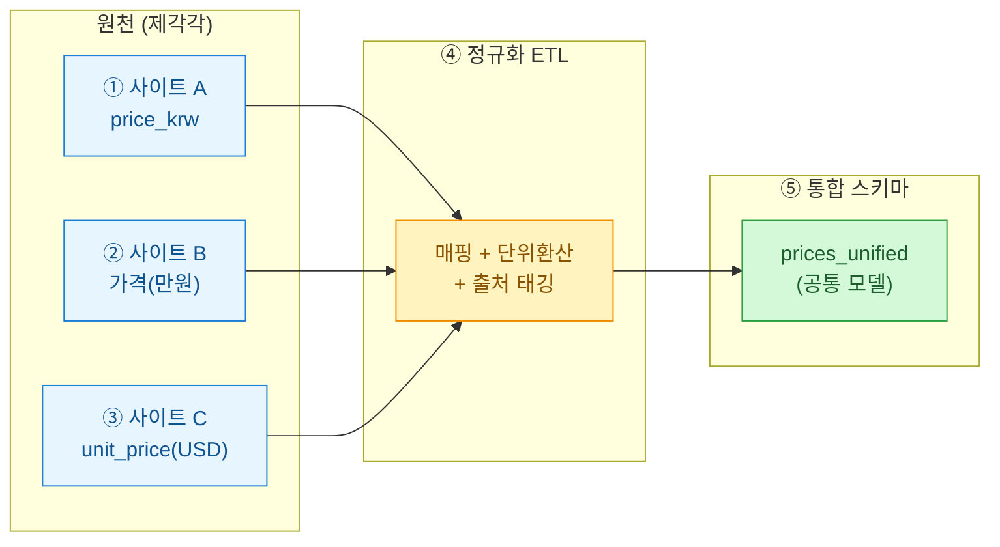
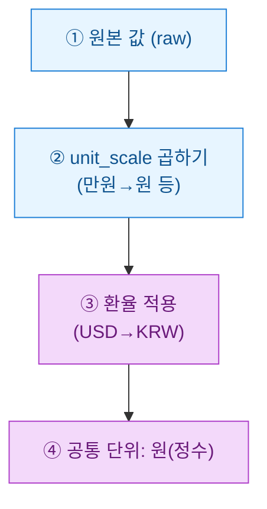

여러 중개 사이트에서 같은 아이템의 시세를 긁어 모으다 보면 늘 같은 벽에 부딪힌다. A 사이트는 `price_krw`, B 사이트는 `가격`, C 사이트는 `unit_price` — 뜻은 같은데 이름도 단위도 다 다르다. 이걸 하나의 테이블에 부어 비교하려면 결국 **정규화(normalization)**, 즉 서로 다른 표기를 공통 규칙으로 맞추는 작업이 필요하다. 오늘은 그 통합 ETL을 어떻게 설계했는지 일기처럼 남긴다.

> 공개·더미 데이터 기준의 설계 예시이며, 특정 서비스의 실데이터나 투자·거래 권유가 아니다.

## 전체 그림은 어떻게 생겼나?

먼저 파이프라인 전체를 한 장으로 봐야 머릿속이 정리된다. 원천은 여러 개, 도착지는 하나다.



핵심은 가운데 ETL 단계에서 세 가지를 동시에 처리한다는 점이다. **컬럼 매핑**, **단위 환산**, 그리고 **출처 태깅**. 이 셋을 분리해서 생각하면 코드가 훨씬 깔끔해진다.

## 컬럼은 어떻게 하나로 맞추나?

가장 먼저 하는 일은 각 사이트의 컬럼을 공통 필드로 대응시키는 매핑 표를 만드는 것이다. 코드가 아니라 **설정(config)**으로 관리해야 사이트가 늘어도 코드를 안 건드린다.

| 공통 필드 | 사이트 A | 사이트 B | 사이트 C |
|---|---|---|---|
| `item_id` | `code` | `상품코드` | `sku` |
| `price` | `price_krw` | `가격` | `unit_price` |
| `currency` | (고정 KRW) | (고정 KRW) | (고정 USD) |
| `unit_scale` | 1 | 10000 (만원) | 1 |
| `observed_at` | `crawled` | `수집시각` | `ts` |

`unit_scale`이 핵심이다. B 사이트는 "3.5"가 3만 5천 원을 뜻하므로 배율 10000을 곱해야 한다. 이런 규칙을 데이터가 아니라 매핑 표에 박아두면, 나중에 "왜 이 값이 이렇게 나왔지?"를 표만 보고 추적할 수 있다.

## 단위와 통화는 어디서 통일하나?

값을 부을 때 세 단계를 순서대로 거친다. 순서를 지키는 게 중요하다 — 환율을 먼저 곱하고 배율을 나중에 곱하면 결과가 틀어진다.



여기서 실무 함정이 하나 있다. 환율을 코드 상수로 박으면 과거 데이터가 오늘 환율로 재계산돼 버린다. 그래서 환율은 **수집 시점 기준**으로 별도 테이블에서 조인해 온다. 시세 데이터는 "그때 그 값"이어야 의미가 있기 때문이다.

## 출처 컬럼은 왜 반드시 남겨야 하나?

통합했다고 원천 정보를 버리면 안 된다. 나중에 "이 이상치, 어느 사이트에서 온 거야?"를 못 답하면 데이터를 신뢰할 수 없다. 그래서 통합 테이블에는 값뿐 아니라 **출처(provenance)**를 같이 적재한다.

```sql
-- 합성/더미 예시. 통합 시세 테이블
CREATE TABLE prices_unified (
    item_id      TEXT      NOT NULL,   -- 공통 아이템 키
    price_krw    BIGINT    NOT NULL,   -- 원 단위 정수로 통일
    observed_at  TIMESTAMP NOT NULL,   -- 수집 시각
    source_site  TEXT      NOT NULL,   -- 출처: 'A' / 'B' / 'C'
    source_raw   TEXT,                 -- 원본 값 문자열 그대로 보관
    fx_rate      NUMERIC,              -- 적용 환율 (KRW=1)
    ingested_at  TIMESTAMP DEFAULT now()
);
```

`source_site`와 `source_raw`가 없는 통합 테이블은 감사(audit)가 불가능하다. `source_raw`에 원본 문자열을 그대로 남겨두면, 파싱 버그를 나중에 발견해도 재처리가 가능하다. 실제로 B 사이트가 "3.5만" 같은 문자열을 던진 적이 있는데, 이 컬럼 덕분에 뒤늦게 배율 파싱을 고칠 수 있었다.

이제 통합 뷰에서 사이트별 최저가를 뽑는 건 간단하다.

```sql
-- 아이템별 최신 최저가 + 어느 사이트인지
SELECT DISTINCT ON (item_id)
       item_id,
       price_krw,
       source_site,
       observed_at
FROM   prices_unified
WHERE  observed_at >= now() - INTERVAL '1 day'
ORDER  BY item_id, price_krw ASC, observed_at DESC;
```

## 정리하면 무엇이 남나?

| 원칙 | 왜 |
|---|---|
| 매핑은 코드가 아닌 설정으로 | 사이트 추가 시 코드 무수정 |
| 단위 환산은 정해진 순서로 | 배율↔환율 순서 뒤바뀜 방지 |
| 환율은 수집 시점 조인 | 과거 시세 왜곡 방지 |
| 출처 컬럼 필수 보관 | 이상치 추적·재처리 가능 |
| 공통 단위는 원(정수) | 부동소수 오차 회피 |

결국 통합의 품질은 "값을 얼마나 잘 합쳤나"가 아니라 "합친 값이 어디서 왔는지 되짚을 수 있나"에서 갈린다. 출처 컬럼 하나가 통합 테이블의 신뢰도를 결정한다 — 이게 여러 번 데어보고 얻은 결론이다.
