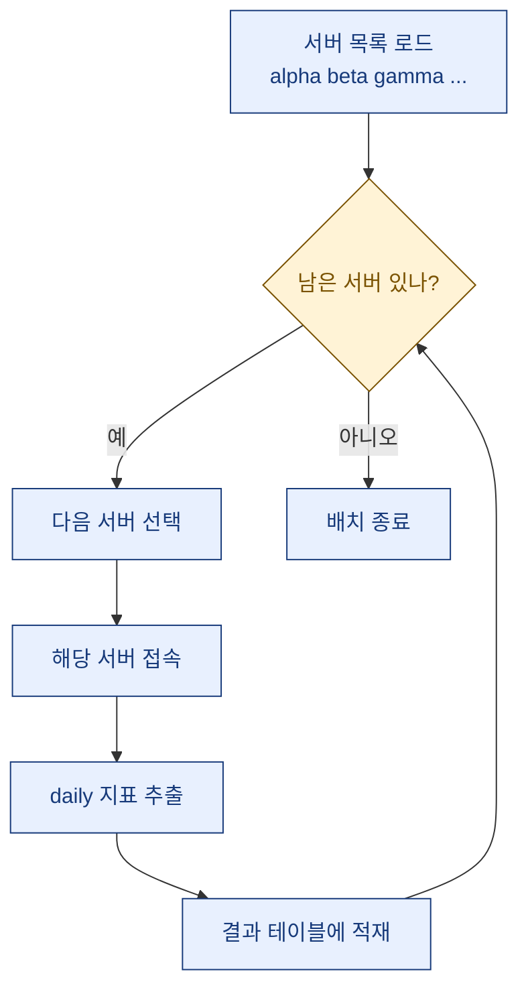
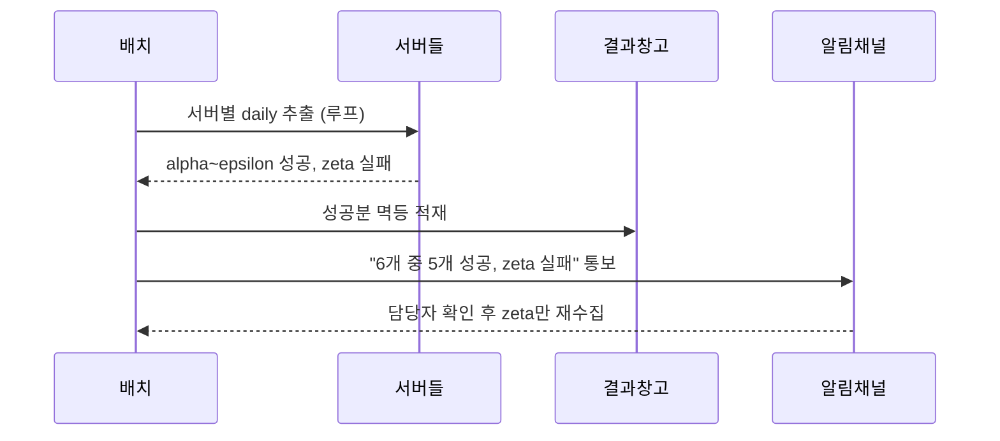

# 여러 게임 서버 지표를 매일 자동 수집하는 while 루프 추출 패턴

> "서버 하나가 밤사이 응답을 안 했는데, 배치 전체가 멈춰서 여섯 서버 지표가 통째로 빵꾸났다." 이 문장을 두 번 겪고 나서야 나는 루프를 다시 짰다.

게임 지표 일을 하다 보면 서버가 여러 개인 상황을 자주 만난다. 지역별로, 혹은 신규/기존으로 서버가 나뉘어 있고, 각 서버마다 접속·과금·픽률 같은 지표를 **매일** 뽑아야 한다. 손으로 여섯 번 쿼리를 돌릴 순 없으니 자연스럽게 "서버 목록을 반복문으로 돌리자"가 된다. 그런데 이 단순해 보이는 while 루프가, 막상 운영에 올리면 조용히 사람을 배신한다. 오늘은 내가 실제로 데인 자국들을 합성 예시로 일반화해 적어둔다. (아래 서버명·수치·테이블명은 전부 더미다.)

## 왜 서버마다 따로 도는 반복문이 필요한가?

가장 순진한 그림부터 보자. 서버 목록을 하나씩 꺼내서, 각 서버에 붙어 그날 지표를 뽑고, 결과 테이블에 쌓는 구조다.



여기서 핵심은 "서버마다 접속 정보가 다르다"는 점이다. 나는 이기종 DB를 섞어 쓰는 환경이었는데, 한쪽은 MySQL 계열이고 결과를 모으는 창고는 MS-SQL 쪽이었다. 그래서 ODBC로 원격 서버에 붙어 원본을 긁어오고, 중간 가공은 임시테이블(#temp)에서 돌린 뒤, 최종만 창고 테이블에 넣는 흐름을 썼다. 반복 단위(서버)마다 접속 문자열과 추출 쿼리를 갈아끼우는 것이다.

문제는, 이 그림에는 **실패가 없다**는 것이다. 현실의 서버는 밤사이 점검을 하고, 네트워크가 끊기고, 어떤 날은 응답이 30초씩 늦는다.

## 어떤 함정이 사람을 배신하나?

내가 실제로 밟은 지뢰들을 표로 정리해봤다.

| 함정 | 증상 | 뿌리 원인 |
| --- | --- | --- |
| 전체 중단 | 서버 하나 실패 → 배치 전체 사망, 나머지 지표도 공백 | 예외를 루프 밖에서 잡음 |
| 무한 루프 | 실패한 서버를 다시 큐에 넣다가 영원히 반복 | 커서를 안 넘기는 재시도 |
| 중복 적재 | 재실행하니 같은 날 지표가 두 번 쌓임 | 멱등하지 않은 INSERT |
| 커넥션 누수 | 며칠 뒤 "커넥션 풀 고갈"로 다 죽음 | 서버마다 연결을 안 닫음 |
| 조용한 결측 | 아무도 모르게 한 서버만 매일 빠짐 | 부분 실패에 알림이 없음 |

이 중 제일 무서운 건 마지막이다. 배치는 "성공"이라고 초록불을 켜는데, 실제로는 여섯 중 다섯만 들어온다. 리텐션이나 ARPPU를 그 데이터로 계산하면 숫자가 미묘하게 틀리고, 몇 주 뒤 리포트를 보다가 "어? 이 서버 왜 이렇게 낮지?" 하고 뒤늦게 발견한다. 데이터 분석가에게 가장 나쁜 오류는 "터지는 오류"가 아니라 "안 터지고 틀린 값"이다.

## 안전한 while 루프는 어떻게 생겼나?

핵심 원칙은 딱 세 개다. **서버 단위로 격리하고, 실패해도 다음으로 넘어가고, 무슨 일이 있었는지 남긴다.** 파이썬 의사코드로 옮기면 이렇다.

```python
servers = load_server_list()   # [{"name": "alpha", "dsn": ...}, ...]
results = {"ok": [], "fail": []}
i = 0

while i < len(servers):
    s = servers[i]
    i += 1                      # 성공/실패와 무관하게 먼저 전진 (무한루프 차단)
    conn = None
    try:
        conn = connect(s["dsn"], timeout=30)   # 서버별 타임아웃
        rows = extract_daily(conn, run_date)   # 그날치만 뽑기
        upsert_metrics(s["name"], run_date, rows)  # 멱등 적재
        results["ok"].append(s["name"])
    except Exception as e:
        log.warning("server %s failed: %s", s["name"], e)
        results["fail"].append(s["name"])      # 죽지 않고 기록만
    finally:
        if conn:
            conn.close()                       # 커넥션 반드시 반납

notify_if_partial(results, run_date)           # 하나라도 실패면 알림
```

포인트를 짚어보면:

- **`i += 1`을 try보다 먼저** 둔다. 실패한 서버를 재시도하려다 커서를 안 넘겨 무한 루프에 빠지는 사고를 원천 차단한다. 재시도가 필요하면 별도의 재시도 큐로 분리하지, 같은 루프 안에서 뱅뱅 돌리지 않는다.
- **try/except를 서버 하나마다** 감싼다. 예외를 루프 바깥에서 잡으면 한 서버가 여섯을 다 죽인다. 안쪽에서 잡아야 alpha가 죽어도 beta\~zeta는 산다.
- **finally에서 close.** 서버마다 연결을 열고 안 닫으면 며칠 뒤 커넥션 풀이 마른다. 나는 이걸로 주말에 호출당한 적이 있다.

## 재실행해도 안전하려면(멱등성)?

배치는 언젠가 반드시 다시 돌린다. 새벽에 실패해서 아침에 손으로 재실행하거나, 스케줄러가 겹쳐 두 번 뜨거나. 그때 같은 날 데이터가 두 번 쌓이면 안 된다. 그래서 나는 적재를 항상 "그 서버, 그 날짜"를 키로 하는 upsert로 짠다. 개념만 옮기면 이렇다.

```sql
-- 같은 (서버, 날짜) 는 지우고 다시 넣는다 = 몇 번 돌려도 결과 동일
DELETE FROM daily_metrics
 WHERE server_name = :server AND stat_date = :run_date;

INSERT INTO daily_metrics (server_name, stat_date, dau, paying_users, revenue_krw)
SELECT :server, :run_date, dau, pu, rev
  FROM #tmp_today;   -- 임시테이블에서 가공 끝낸 결과만
```

"지우고 넣기"가 촌스러워 보여도, 부분 실패 후 특정 서버만 콕 집어 재수집할 때 이만큼 마음 편한 게 없다. 예시 수치로 감을 잡자면, 재실행 전후로 alpha 서버의 그날 매출이 1,240,000원으로 **똑같이** 나와야 정상이다. 두 번 돌렸다고 2,480,000원이 되면 멱등성이 깨진 거다.

## 부분 실패를 어떻게 알아채나?

마지막 퍼즐은 알림이다. 여섯 서버 중 다섯만 들어온 걸 사람이 눈치채게 만들어야 한다. 흐름으로 그리면 이렇다.



규칙은 간단하다. **전부 성공했을 때는 조용히, 하나라도 실패하면 시끄럽게.** 나는 실패 서버 이름과 사유를 한 줄로 묶어 알림을 쏘고, 그 서버만 다시 돌리는 재수집 명령을 따로 둔다. 이렇게 해두면 "조용한 결측"이라는 최악의 시나리오가 사라진다. 초록불이 켜졌으면 진짜로 여섯이 다 들어온 것이다.

## 마무리

여러 서버를 while 루프로 도는 일일 추출은, 겉보기엔 "목록 돌리면서 쿼리 날리기"라 다섯 줄이면 끝날 것 같다. 하지만 운영에서 살아남는 배치와 그렇지 않은 배치를 가르는 건 화려한 로직이 아니라, **격리(하나가 죽어도 나머지는 산다) · 멱등성(몇 번 돌려도 결과가 같다) · 관측성(무슨 일이 있었는지 남고 알린다)** 이 세 가지다. 오늘 내가 데인 자국을 정리한 이유도 결국 하나다. 새벽에 서버 하나가 삐끗해도, 아침의 내가 커피를 마시며 "아 zeta만 다시 돌리면 되네" 하고 말 수 있게. 지표를 다루는 사람에게 안정적인 파이프라인은 곧 신뢰할 수 있는 숫자다.

## 참고자료

- [[game-metrics-7-definitions]] — DAU·과금·ARPPU 등 이 글에서 뽑는 지표들의 정의
- [[game-data-sql-recipes-retention-ltv]] — 추출한 원본으로 리텐션·LTV를 계산하는 SQL 레시피
- [[cohort-m1-retention-sql]] — 코호트 M1 리텐션을 SQL로 만드는 법
- [[revenue-simulation-dau-pu-arppu]] — DAU·PU·ARPPU로 매출을 분해·시뮬레이션하기
- https://github.com/DBhyeong/game-data-recipes

<!-- 안전: 합성/더미 데이터, 회사·실데이터·PII 없음. -->
