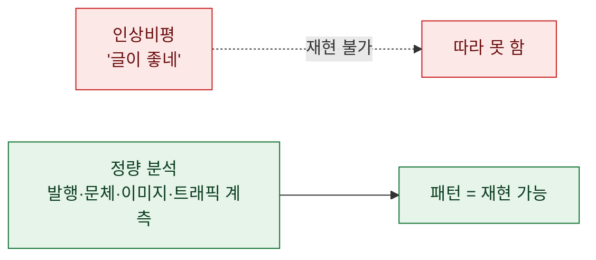
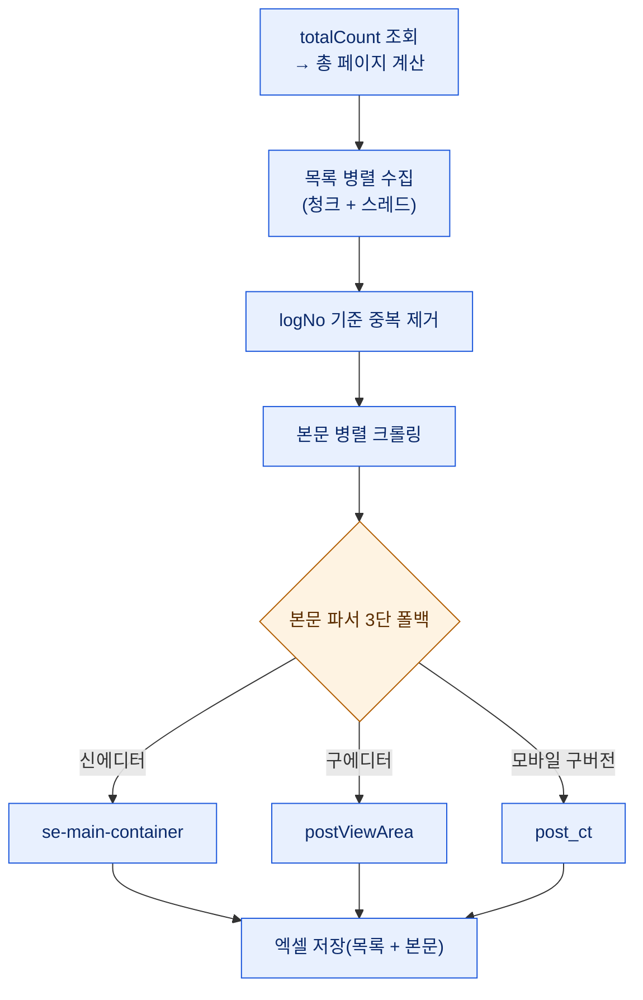
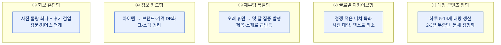
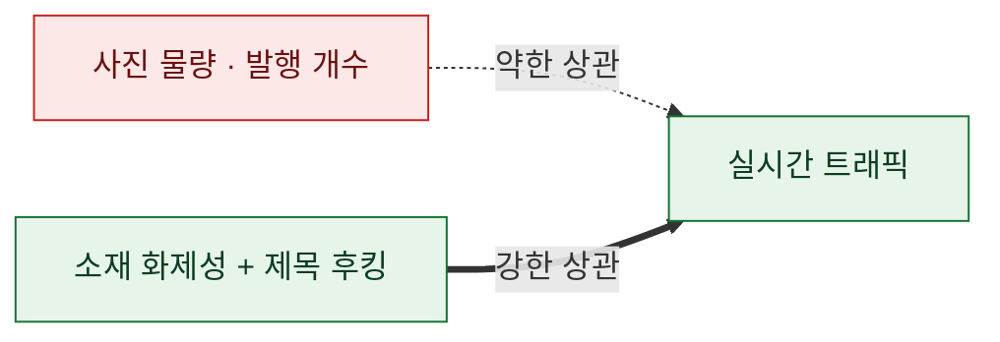
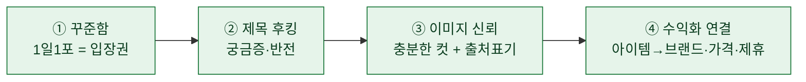

# 블로그 벤치마킹을 '감'이 아니라 '데이터'로

> **"저 블로그는 왜 잘될까?"** 를 감으로 답하는 게 싫었다. 그래서 한 니치(패션 큐레이션)의 상위 블로그 **13개를 통째로 크롤링**해, 발행 이력·꾸준함·글감·문체·이미지 배치·실시간 트래픽을 **숫자로** 뜯어봤다. 이 글은 그 방법과, 데이터가 알려준 "성공 문법"의 기록이다. (⚠️ 분석 대상 블로그·인물은 **전부 익명화**했고, 수집 데이터는 분석 후 **폐기**했다. 특정 블로그를 따라 하라는 글이 아니라, 공개 데이터에서 읽어낸 **패턴과 그 리스크**에 대한 기록이다.)

## 왜 감이 아니라 데이터인가?

벤치마킹은 보통 "이 사람 글 좋네" 같은 인상비평으로 끝난다. 그런데 그건 재현이 안 된다. 내가 알고 싶었던 건 인상이 아니라 **구조**였다. 몇 개를 올리는지, 얼마나 꾸준한지, 제목을 어떻게 짓는지, 사진을 몇 장 쓰는지, 그래서 **무엇이 트래픽과 상관있는지**. 전부 세어볼 수 있는 것들이다.

## 어떻게 수집했나?

네이버 블로그는 '전체 글' 목록을 비공식 JSON 엔드포인트로 준다. 여기에 **글 수(totalCount)**가 들어 있어서, 그걸로 **총 페이지 수를 먼저 계산**하고 끝까지 자동으로 훑게 만들었다. 그다음 각 글의 모바일 페이지에서 본문을 뽑았다.

기술적으로 신경 쓴 세 가지.

- **본문 파서 3단 폴백** — 네이버 블로그는 신에디터(SE3), 구에디터(smarteditor 2.0), 아주 오래된 모바일(post_ct)이 섞여 있다. 하나만 노리면 옛 글이 통째로 빈다. 그래서 세 컨테이너를 순서대로 시도했다.
- **rate-limit 매너** — 429/5xx엔 **지수 백오프**로 재시도하고, 요청마다 딜레이를 넣고, 동시 스레드를 **일부러 낮게**(3개) 잡았다. 남의 서버를 두드리는 일이니, 빠르게보다 **얌전하게**가 원칙이다.
- **엑셀 저장 함정** — 본문이 `https://`로 시작하면 엑셀 엔진이 셀을 URL로 오인해 텍스트를 통째로 날린다. `strings_to_urls=False`로 꺼서 막았다.

> ⚠️ **수집 윤리**: 공개된 글 목록/본문만, 얌전한 속도로, **분석 목적**으로만 모았다. 로그인 뒤 콘텐츠나 개인정보는 건드리지 않았고, 분석이 끝난 원본은 폐기했다. 스크래핑은 대상 서비스의 약관·부하를 항상 먼저 생각해야 한다.

## 무엇을 쟀나?

숫자로 만든 축은 다섯 개였다.

| 축 | 계측한 것 |
|---|---|
| **발행 이력·꾸준함** | 첫 글, 실질 운영 시작, **1일1포 이상 연속 유지 개월수** |
| **글감(소재)** | 어떤 키워드·유형이 반복되나(빈도 집계) |
| **문체** | 존댓말/반말 비율, 이모지·해시태그 밀도, 템플릿화 정도 |
| **본문·이미지 배치** | 최근 글의 실제 HTML을 파싱해 **이미지 수·텍스트 블록·콜라주·출처 표기** |
| **성과** | 실시간 방문자(누적/오늘) — 조회수 컬럼은 비어 있어 방문자로 대체 |

## 무엇을 발견했나 — 운영 아키타입 다섯 형

13개를 숫자로 늘어놓으니, 이름을 지워도 **다섯 가지 유형**으로 갈렸다.

흥미로운 건, **꾸준함(1일1포 지속) 1위 블로그가 오늘 트래픽에서는 최하위**였다는 점이다. 물량으로는 압도적인데, 순간 화제성은 낮았다. 반대로 **오래 쉬다가 올해 몇 달만 집중 발행한 재부팅형이 오늘 실시간 방문 1·2위**를 찍었다.

## 그래서 핵심 인사이트는?

한 문장으로 줄면 이렇다. **물량이 아니라 '소재 선택 + 제목'이 트래픽을 만든다.**

이미지를 22장씩 넣는 물량형보다, 사진은 10장 남짓이어도 **제목에 궁금증을 심은** 쪽이 오늘 방문에서 앞섰다. 생산 노력(사진 수)과 성과가 **비례하지 않는다**는 게 데이터가 준 가장 반직관적인 교훈이었다.

## 데이터가 말하는 '성공 문법'은?

일반화하면 **네 박자**로 수렴했다. 어느 유형이든 이 넷을 갖췄다.

**① 꾸준함은 실력이 아니라 입장권이었다.** 성실 블로그는 예외 없이 1일1포 이상을 몇 년, 혹은 몇 달이라도 몰아서 지켰다. 다만 꾸준함만으로 트래픽 1위가 되진 않았다 — 입장권이지 우승컵은 아니다.

**② 제목 후킹은 몇 개의 반복 패턴**으로 계측됐다(특정 문구가 아니라 구조로 옮긴다).

| 후킹 유형 | 구조 |
|---|---|
| 말줄임 미끼 | "…했는데" 로 문장을 끊어 클릭 유도 |
| 반전·숫자 대비 | 기대와 어긋나는 숫자·나이 대비 |
| 반응 증폭 | "난리 난 / 역대급 / 오늘자" 계열 강조어 |
| 정체 유발 | "그게 뭔지"를 본문에서만 밝히는 구조 |
| 대결·논란 | "A vs B", "논란의 —" 프레임 |
| 리스트·요약 | "TOP N / 총정리 / 1분 요약" |

**③ 이미지는 신뢰 장치**였다. 모바일 체류를 위해 사실상 8\~12장이 기본선이었고, 여러 컷을 한 화면에 압축하는 **콜라주**와 **출처 캡션·인용 표기**가 상위권일수록 꼼꼼했다. 출처 표기는 뒤에서 말할 저작권 리스크의 **최소 방어**이기도 하다.

**④ 수익화**는 "착장/아이템 → 브랜드·가격 → 커머스 링크·제휴·협찬"의 공통 문법으로 흘렀다.

## ⚠️ 하지만 — 리스크와 윤리

데이터가 "이렇게 하면 트래픽이 난다"를 알려줘도, **해도 되는지는 다른 문제**다. 이 판을 뜯어보며 오히려 또렷해진 위험 넷.

- **초상권·저작권**: 인물 사진의 대량 사용은 **회색지대**다. 출처 표기·언론 인용은 최소한의 방어일 뿐 완전한 면책이 아니고, 상업적 이용이면 특히 위태롭다.
- **선정성**: 자극적 신체·노출 후킹은 트래픽엔 유리해도 **저품질·성인성 제재와 브랜드 훼손**으로 돌아온다.
- **AI 대량생산 필터**: 데이터에서 **문체가 정보 카드형으로 정형화**되는 흐름이 보였다. 효율적이지만, 검색엔진의 **유사문서·저품질 필터**에 걸리기 쉽다. 결국 차별화는 **개인의 관점·코멘트**에서 나온다.
- **소재 휘발성**: 화제 소재는 금방 식는다. **경쟁이 적은 니치**나 **가격·정보 자산의 축적**이 화제 의존형보다 방어력이 높았다.

## 정리하며

이 작업의 결론은 "패션 블로그 잘하는 법"이 아니다. **"벤치마킹을 감이 아니라 데이터로 하면, 남들이 인상비평으로 흘리는 걸 구조로 볼 수 있다"** 는 것이다. 크롤러 하나와 몇 개의 축이면, 한 니치의 성공/실패 문법을 재현 가능한 형태로 뽑아낼 수 있다.

그리고 데이터는 겸손도 가르쳤다. **가장 부지런한 사람이 1등은 아니었고, 사진을 가장 많이 넣은 사람도 1등이 아니었다.** 결정타는 늘 **무엇을, 어떤 제목으로** 였다.

> 분석의 목적은 베끼기가 아니라 **판을 읽는 것**이다. 판을 읽고 나면, 따라갈지 비켜설지는 그다음 선택이더라. 그리고 그 선택엔 트래픽만이 아니라 **리스크와 윤리**도 같이 얹혀야 한다.

---

> **투명성 노트**: 이 글은 개인의 **데이터 분석 방법론과 일반화된 시장 패턴**만 다룬다. 분석한 블로그의 실제 계정명·특정 인물·수집한 본문은 **일절 공개하지 않으며**, 수집 데이터는 분석 후 폐기했다. 크롤링은 공개 페이지에 한해 얌전한 속도로 수행했다.
