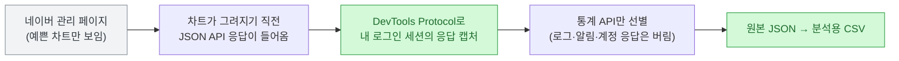
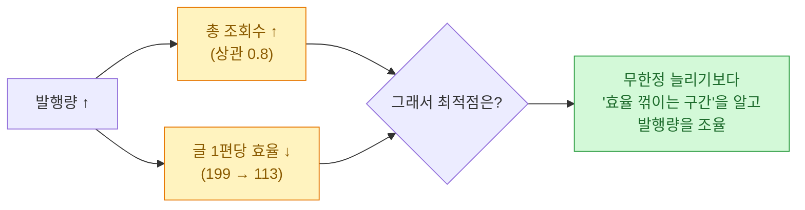
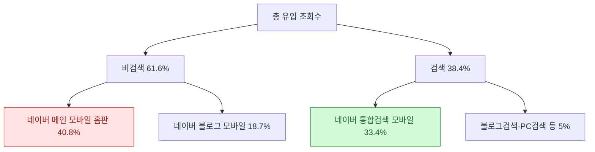
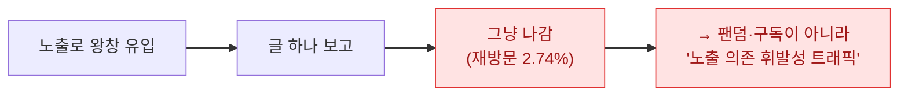
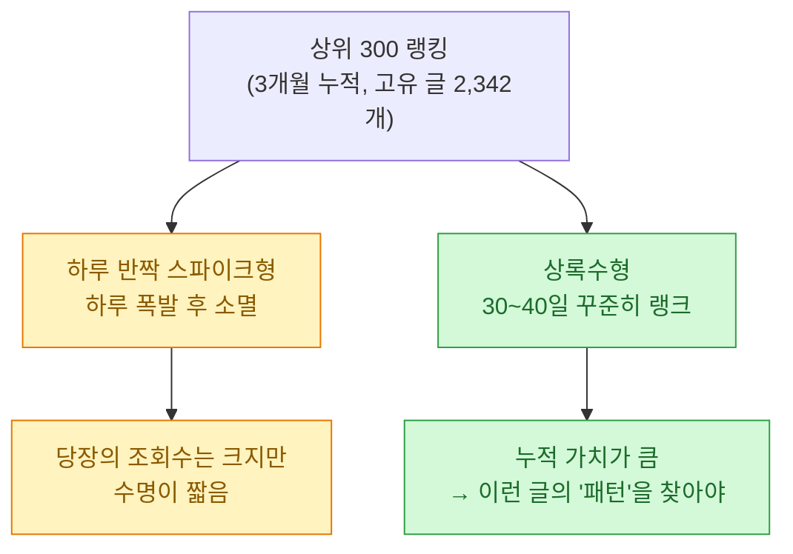
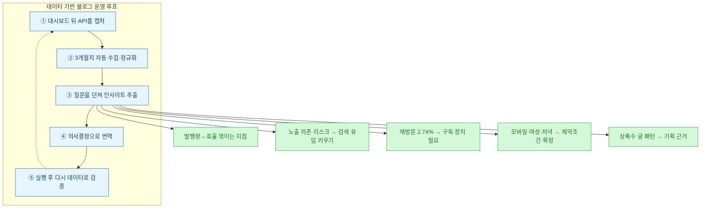

> 이건 남의 서비스 분석이 아니라 **내 네이버 블로그(연예·이슈 채널)를 내가 뜯어본 기록**이다. 데이터 분석가로 밥 벌어먹으면서 정작 내 콘텐츠는 감으로 굴리고 있었다는 게 좀 부끄러워서 시작했다.

## 왜 갑자기 내 블로그를 뜯었나

네이버 블로그 관리 페이지에 들어가면 조회수, 유입경로, 성별·연령 같은 걸 **예쁜 차트**로 보여준다. 문제는 딱 거기까지라는 거다. "어제 몇 명 왔어요" "이번 주 이 글이 인기예요" — 요약은 주는데, **내가 원하는 각도로 다시 자를 raw 데이터는 안 준다.** 15일 치 조회수를 CSV로 내려받아서 발행 횟수랑 상관을 보고 싶어도, 화면엔 막대그래프만 떠 있다.

명색이 데이터 분석하는 사람인데, 정작 내 콘텐츠는 "오늘 좀 잘 나왔네" 수준의 감으로 굴리고 있었다. 그래서 마음먹었다. **대시보드가 안 주면, 대시보드가 쓰는 데이터를 직접 가져오자.**

## 대시보드 뒤에서 무슨 일이 벌어지나 — 패킷을 떴다

여기서 핵심 발상 하나. 그 예쁜 차트도 결국 **어딘가에서 JSON 숫자를 받아와서** 그리는 거다. 브라우저 개발자도구(F12)의 네트워크 탭을 열고 통계 페이지를 눌러보면, 화면이 그려지기 직전에 API 응답(XHR)이 우르르 들어온다. **그 응답이 곧 원본 데이터다.**

그래서 크롬을 디버깅 모드로 띄우고(**Chrome DevTools Protocol**, 로컬 `127.0.0.1:9222`), 이미 로그인돼 있는 내 세션 위에서 통계 페이지 14개를 순회하며 들어오는 JSON 응답을 전부 받아 적었다.

한 번 훑으니 **분석에 쓸 수 있는 통계 API가 25개** 나왔다. 크게 두 갈래다.

| 출처 | 엔드포인트 성격 | 뽑히는 것 |
|---|---|---|
| **관리 통계**(admin) | `visit/cv`·`uv`·`visit`·`averageDuration` / `referer` / `hour` / `demoCv` / `device` / `rank` | 일별 조회수·순방문·체류시간, 유입경로, 시간대, 성별·연령, 기기, **글별 상위 300 랭킹** |
| **크리에이터 어드바이저** | `home/soaring-contents` / `realtime-summary` / `trend/demo` / `trend/category` / `inflow-analysis` | 급상승 글, 실시간 유입, 인구통계·카테고리별 **트렌드 검색어** |

> ⚠️ 안전 선긋기: 이건 **내 계정 데이터**를 내 로그인 세션으로 본 것뿐이다. **쿠키·인증 토큰·세션 값은 한 줄도 저장하지 않았고**, 남의 데이터를 긁는 공개 API도 아니다(로그인해야만 내 숫자가 나온다). 관리 페이지가 POST로 쏘는 텔레메트리 로그(`jackpotlog`)나 계정·알림 응답은 통계가 아니라 전부 제외했다.

## 하루치 말고 3개월치를, 손 안 대고

한 번 구조를 파악하고 나니 그다음은 자동화였다. 대시보드에서 날짜를 하루하루 바꿔 클릭하는 대신, **날짜를 파라미터로 넣어 API를 순회 호출**하면 된다. 2026년 2월 19일부터 5월 18일까지, 3개월치를 이렇게 긁었다.

**511번 호출, 실패 0.** 관리 페이지를 수백 번 클릭했으면 며칠 걸렸을 일이, 캡처한 스키마를 재사용하니 한 번에 끝났다. 이게 자동화의 진짜 값어치다 — **"대시보드"라는 닫힌 화면을 "내가 쿼리할 수 있는 데이터셋"으로 바꾼 것.** 여기서부터가 분석의 시작이었다.

## 첫 번째 질문 — 트래픽은 대체 어떻게 늘어난 걸까

3개월을 이어 붙이니 성장 곡선이 한눈에 들어왔다. **처음 14일 평균 하루 조회수 72.6 → 마지막 14일 평균 8,125.** 약 **110배**. 최고일(5/15)은 하루 13,174까지 찍었다.

감으론 "글을 많이 써서겠지" 싶었는데, 데이터로 보니 그게 꽤 선명했다.

| 구간 | 하루 평균 발행 | 하루 평균 조회수 |
|---|---|---|
| 2/19 ~ 3/30 | 4.2편 | 376 |
| 3/31 ~ 5/18 | **48.4편** | **7,093** |

3월 말에 발행량을 하루 4편 → 48편으로 확 올린 시점과 트래픽 급증이 겹쳤다. 발행량과 조회수의 **상관계수는 0.78~0.81**, 그중 **3일 시차(lag)에서 0.81로 가장 높았다.** 오늘 많이 쓰면 그 효과가 2~3일 뒤 조회수로 번지더라는 얘기다.

> 물론 상관은 인과가 아니다. 발행량 말고도 계절 이슈·알고리즘 변화가 섞였을 것이다. 다만 "많이 쓰면 대체로 같이 오른다"는 방향성은 데이터가 분명히 말하고 있었다.

## 그런데 많이 쓴다고 비례해서 오르진 않더라

여기서 감으로는 절대 못 봤을 게 나왔다. 발행량 구간별로 **글 한 편당 조회수**를 갈라 보니, 많이 쓸수록 **편당 효율은 오히려 떨어졌다.**

| 하루 발행량 | 하루 평균 조회수 | **글 1편당 조회수** |
|---|---|---|
| 1편 이하 | 185 | 24.8 |
| 15편 안팎 | 3,822 | **198.8** |
| 40편 안팎 | 6,612 | 172.3 |
| 51편 초과 | 7,482 | **113.4** |

총량은 늘어도 한 편이 데려오는 사람은 줄어드는, 전형적인 **수확 체감**이다. "무조건 많이"가 아니라 "**어디서 효율이 꺾이는지**"를 알아야 발행 노동을 어디에 쓸지 정할 수 있다. 대시보드의 막대그래프로는 죽었다 깨어나도 안 보이는 각도다.

## 트래픽이 '어디서' 오는지가 제일 무서웠다

성장보다 더 오래 들여다본 건 유입 구조였다. 3개월 누적으로 보면 이렇다.

**유입의 40.8%가 네이버 메인 모바일 '홈판' 노출 하나에서 왔다.** 비검색 노출을 합치면 61.6%. 이게 왜 무섭냐면 — **노출은 내가 통제할 수 없다.** 네이버가 홈에 걸어주면 폭발하고, 안 걸어주면 그날로 반토막이다. 검색 유입(38.4%)은 내가 제목·키워드로 쌓아갈 수 있는 자산이지만, 노출 유입은 **알고리즘에 인질로 잡힌 트래픽**이다.

숫자로 보고 나니 전략이 명확해졌다. 지금 잘 나온다고 안심할 게 아니라, **통제 가능한 검색 유입 비중을 의도적으로 키워야** 이 트래픽이 오래간다.

## 근데 정작, 아무도 다시 안 온다

유입 다음으로 충격이었던 지표. **재방문율 2.74%, 방문자 1명당 평균 1.05회 방문.** 사실상 **한 번 왔다 가면 끝**이라는 뜻이다.

조회수 8천, 1만이 찍혀도 그게 **쌓이는 독자**가 아니라 **스쳐 가는 노출**이라는 걸, 재방문율 한 줄이 말해줬다. 이슈성 콘텐츠의 숙명이긴 한데, 그래서 더더욱 "이웃·구독으로 남길 장치"와 "다시 찾게 만들 상록수 글"이 필요하다는 결론으로 이어졌다.

## 누가, 언제 보는가

독자층과 시간대는 오히려 깔끔하게 일관됐다.

| 축 | 데이터 | 함의 |
|---|---|---|
| **성별** | 여성 82.7% | 제목·소재를 여성 독자 기준으로 |
| **기기** | 모바일 93.3% | **모바일에서 읽히는 제목 길이·가독성**이 1순위 제약 |
| **연령** | 트렌드 타깃 여성 40~60대 | 관심사·표현을 그 세대에 맞춤 |
| **시간대** | 저녁 20~23시 최대 | 발행·모니터링을 저녁 피크에 배치 |

특히 **모바일 93%**는 그냥 넘길 숫자가 아니다. 제목이 PC에선 다 보여도 모바일에선 잘린다. "모바일 한 줄에 안 걸리는 제목은 없는 제목"이라는 규칙이 여기서 나왔다.

## 오래 가는 글 vs 하루 반짝

마지막으로 글별 랭킹(상위 300)을 3개월 이어 붙이니, **똑같이 조회수가 높아도 결이 다른 두 종류**가 갈렸다.

어떤 글은 발행 당일 확 뜨고 다음 날 사라졌고, 어떤 글은 40일 가까이 매일 상위권에 남았다. **한 번의 폭발보다 오래 남는 글이 훨씬 값지다.** 그럼 상록수 글은 어떤 제목·소재였나? 를 되물으면, 그게 바로 다음 콘텐츠 기획의 근거가 된다.

## 그래서 — 대시보드로는 못 뽑는 인사이트란

3개월을 데이터로 훑고 내린 결론은 결국 이거였다. **대시보드는 "무슨 일이 있었나"를 서술하고, 원본 데이터는 "그래서 뭘 할 것인가"를 결정하게 해준다.**

같은 조회수 1만이라도, 그게 **노출로 스쳐 간 1만**인지 **검색으로 쌓인 1만**인지에 따라 완전히 다른 얘기다. 그 차이는 관리 페이지의 숫자 하나로는 절대 안 보이고, **유입·재방문·랭킹 지속성을 교차**해야 비로소 보인다. 데이터 분석을 "왜 해야 하냐"고 물으면, 나는 이제 이렇게 답한다 — **감으로는 "많이 나왔다"까지밖에 못 가지만, 데이터로는 "왜, 어디서, 누가, 무엇이 오래가나"까지 가고, 거기서야 다음 수가 나온다.**

## 마무리 — 내 콘텐츠를 데이터로 본다는 것

솔직히 뜯어보기 전엔 "그냥 많이 쓰면 오르는 거 아냐?"였다. 뜯고 나니 **많이 쓰면 오르긴 하는데 효율은 꺾이고, 잘 나오는 것 같아도 대부분 노출에 인질로 잡혀 있고, 사람은 쌓이지 않고 스쳐 간다**는, 훨씬 입체적인 그림이 나왔다. 남의 회사 데이터를 분석하던 습관을 처음으로 내 콘텐츠에 돌려봤을 뿐인데, 앞으로 뭘 고쳐야 할지가 다섯 개나 선명해졌다.

대시보드가 안 주는 걸 굳이 패킷까지 떠서 가져온 이유가 이거다. **분석가의 무기는 결국 "원본 데이터에 직접 손을 댈 수 있는가"에서 갈린다.** 다음 글에서는 이 데이터로 실제 발행 전략을 어떻게 바꿨는지, 검증까지 이어서 써볼 생각이다.

## 참고 · 방법 메모

- 수집: 크롬 DevTools Protocol로 로그인 세션의 통계 API JSON 응답 캡처 → 데이터셋별 CSV 정규화(관리 통계 11종 + 크리에이터 어드바이저 14종, 3개월·511호출·실패 0).
- 분석: 일별 CV/UV/visit/체류시간 병합 테이블 + 발행량 조인(상관·시차·버킷), 유입·재방문·시간대·인구통계·글별 랭킹 지속성.
- 관련 글: [[marketing-data-analysis-case-study|마케팅 데이터 분석 사례]] · [[price-monitoring-pipeline-crawl-mssql|가격 모니터링 파이프라인]] · [[retention-curve-beyond-m1|리텐션 곡선 읽기]]

<!-- 안전: 회사 실데이터·고객/제3자 PII·API키/쿠키/토큰 없음. 분석 대상은 본인 소유 네이버 블로그의 본인 데이터이며, 블로그 핸들·개별 글 제목(제3자 실명 포함 가능)은 익명화. 인증정보·세션은 저장/공개하지 않음. 수치는 codex_blog_analysis 산출물(3개월 분석·패킷 리포트) 기준. -->
