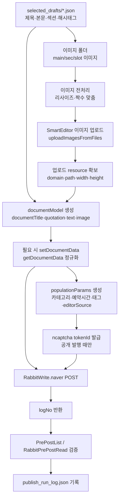
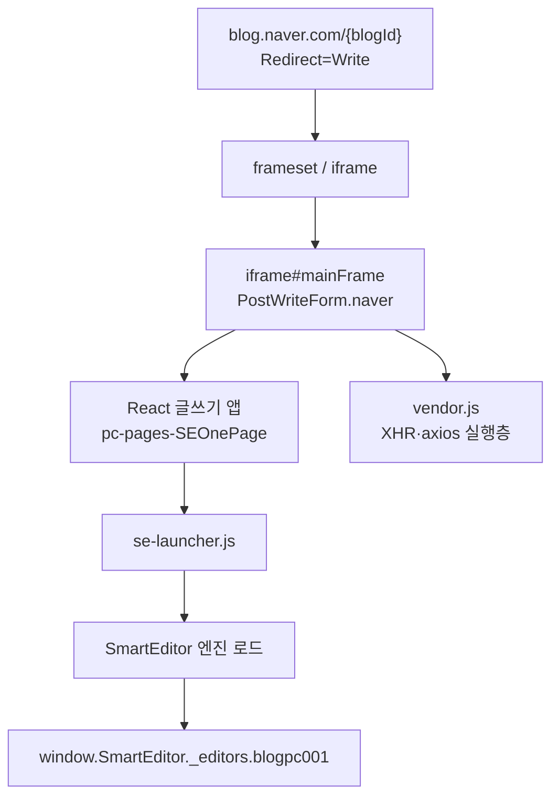
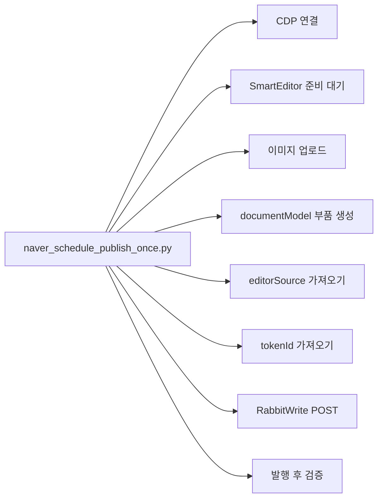
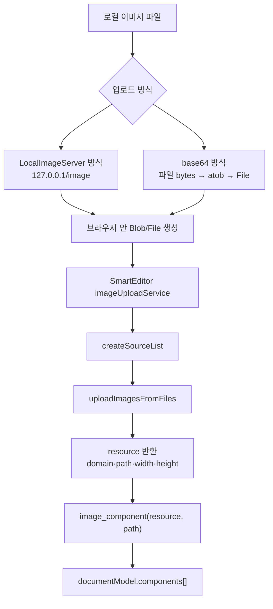
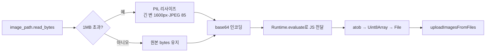
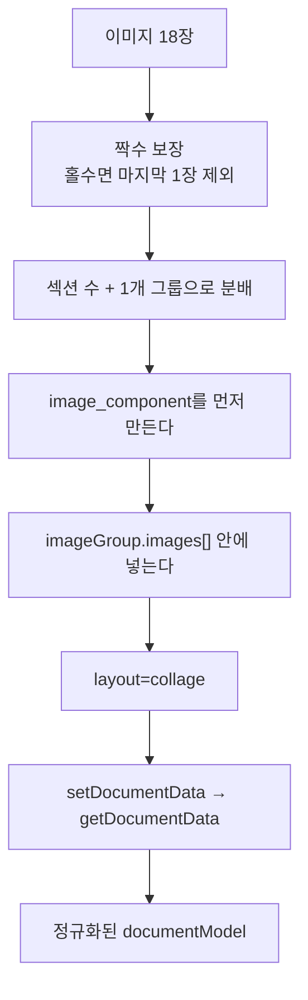
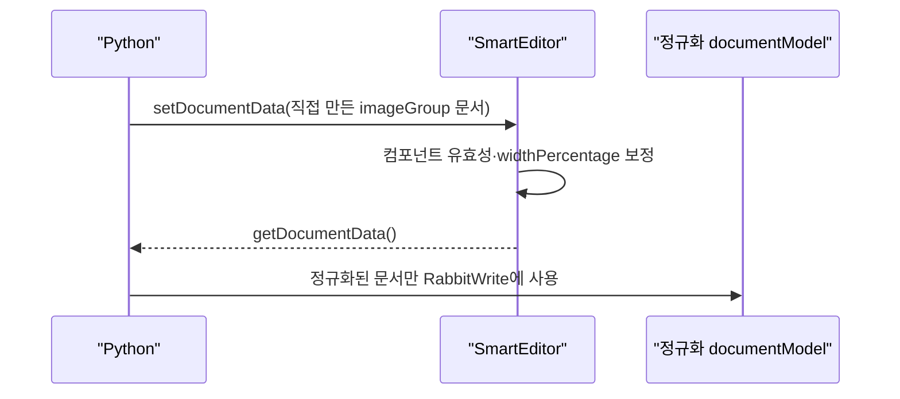
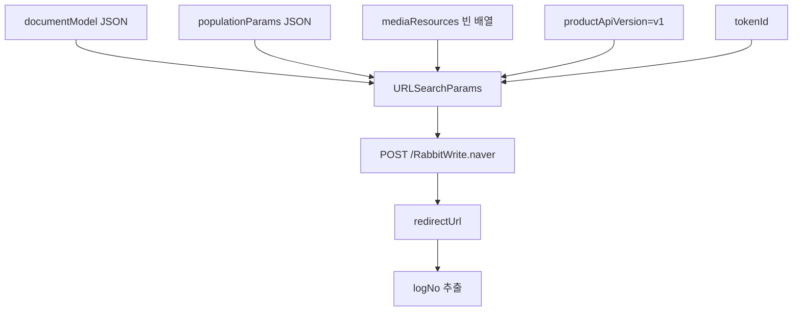
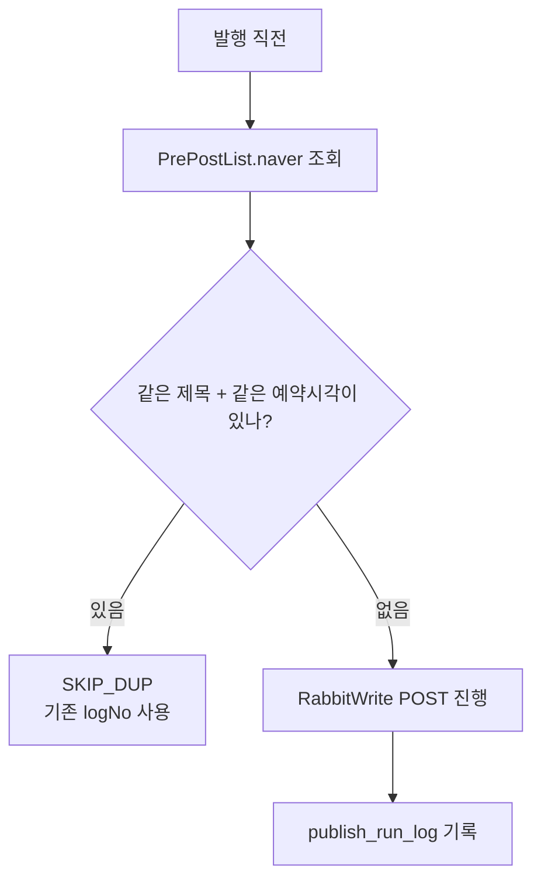
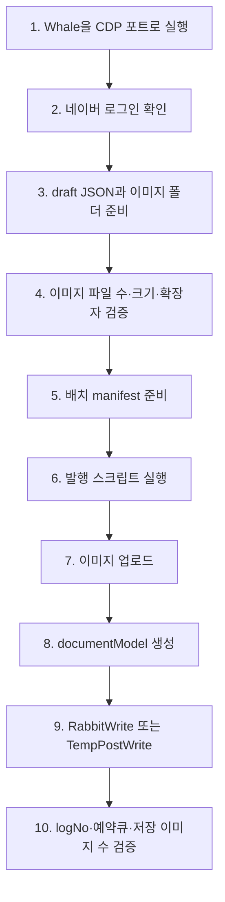

처음 폴더를 열었을 때는 파일이 너무 많아서 잠깐 멈칫했다. `scripts/`에는 파이썬 발행기가 잔뜩 있고, `analysis/`에는 네이버 에디터 JS 번들이 풀려 있고, `selected_drafts/`에는 글 초안 JSON과 이미지 폴더가 쌓여 있었다. 겉으로 보면 "네이버 블로그 자동 발행" 한 줄인데, 실제로는 **브라우저 세션, SmartEditor 내부 모델, 이미지 업로드 서비스, 발행 POST, 예약 검증**이 전부 엮여 있었다.

이번 글은 `C:\Users\user2401\Downloads\claude_naver_blog_automation\claude_naver_blog_automation` 폴더를 기준으로 내가 이해한 내용을 다시 정리한 것이다. 공개 글이기 때문에 쿠키 값, `editorSource`, `tokenId` 같은 세션 값은 넣지 않는다. 이런 값은 자동화가 성공하는 데 필요하지만, 공개 저장소나 블로그에 나오면 안 되는 재료다.

앞서 [[social-syndication-9-channels-api|SNS·블로그 신디케이션 자동화]]에서는 여러 채널에 글을 뿌리는 큰 그림을 봤고, [[youtube-api-mp4-srt-thumbnail-shorts-pipeline|YouTube 업로드 파이프라인]]에서는 API 업로드 전에 패키지를 만드는 일이 핵심이라고 썼다. 네이버 블로그 자동 발행도 결은 비슷했다. **발행 버튼을 누르는 자동화가 아니라, 발행 버튼이 서버로 보내는 재료를 정확히 만들어 주는 자동화**였다.

## 전체 자동 발행은 어떤 그림이었나?

내가 정리한 전체 흐름은 이렇다.



여기서 제일 중요한 단어가 `documentModel`이다. 네이버 SmartEditor는 화면에 보이는 글을 내부적으로 JSON 문서로 들고 있다. 제목도 컴포넌트, 인용구도 컴포넌트, 이미지도 컴포넌트, 본문 문단도 컴포넌트다. 그래서 자동화 스크립트는 브라우저에 글자를 하나씩 타이핑하지 않는다. 대신 **네이버 에디터가 이해하는 문서 JSON을 직접 만든다.**

쉽게 말하면 이렇다.

| 사람이 보는 것 | 자동화에서 다루는 것 |
|---|---|
| 글 제목 | `documentTitle` 컴포넌트 |
| 후킹 문장 | `quotation` 컴포넌트 |
| 본문 문단 | `text` 컴포넌트 안의 `paragraph` |
| 이미지 | 업로드 resource를 담은 `image` 컴포넌트 |
| 2단 이미지 묶음 | `imageGroup` 컴포넌트 |
| 해시태그 | 링크 없는 text node 묶음 |
| 예약 시간 | `populationParams.populationMeta.prePost*` 필드 |

처음에는 "브라우저 자동화면 Playwright로 버튼 클릭하면 되지 않나?"라고 생각하기 쉽다. 그런데 이 프로젝트는 훨씬 더 안쪽으로 들어가 있었다. Whale 브라우저를 CDP로 붙잡고, iframe 안 SmartEditor 객체를 기다린 다음, 에디터 내부 업로드 서비스와 서버 POST를 직접 호출한다.

## 폴더 안 파일들은 어떤 역할로 나뉘나?

전체 파일을 다 읽을 필요는 없었다. 핵심은 몇 개로 좁혀졌다.

| 파일 | 내가 본 역할 |
|---|---|
| `NAVER_WRITE_FLOW2.md` | 네이버 글쓰기 페이지 부팅, JS 번들, `RabbitWrite.naver` POST 구조 분석 노트 |
| `scripts/naver_schedule_publish_once.py` | 공통 발행 엔진. CDP 연결, 에디터 대기, 이미지 업로드, 발행 POST, 검증 함수가 들어 있음 |
| `scripts/naver_publish_searb_sd_batch_20260529.py` | 배치 발행기. draft JSON과 이미지 폴더를 읽고 예약 발행을 반복 |
| `scripts/imagegroup_builder.py` | 여러 이미지를 2단 콜라주 `imageGroup`으로 묶는 빌더 |
| `scripts/naver_publish_searb_imagegroup_one.py` | imageGroup 방식으로 1편을 즉시 발행하고 저장 결과를 검증 |
| `scripts/naver_tempsave_searb_test.py` | 공개 발행이 아니라 임시저장으로 보내는 테스트 |
| `scripts/_rabbitwrite_capture.py` | 실제 발행 POST를 서버로 보내기 직전에 가로채 구조를 확인한 안전 캡처 |
| `scripts/_token_trace.py` | ncaptcha `tokenId`가 어떻게 발급되는지 관찰 |
| `scripts/extract_naver_cookies.py` | CDP로 로그인 쿠키 존재 여부를 확인하는 진단 도구 |
| `analysis/chunks/pc-pages-SEOnePage...js` | 글쓰기 React 앱 청크. payload 키가 모여 있는 JS |
| `analysis/vendor.js` | axios/XHR 같은 네트워크 실행층 |
| `analysis/se_engine/se-launcher.js` | SmartEditor 엔진 로딩 쪽 |

이 구분을 하고 나니 구조가 보였다. JS 분석은 "네이버 에디터가 원래 어떤 식으로 돌아가는가"를 보는 데 쓰였고, Python 코드는 그 구조 위에 실제 자동 발행 흐름을 얹는 역할을 했다.

## 네이버 글쓰기 화면은 어떻게 부팅되나?

네이버 블로그 글쓰기 화면은 겉보기보다 한 겹 더 복잡했다. 최상위 페이지 안에 iframe이 있고, 그 iframe 안에서 SmartEditor ONE이 React 앱으로 뜬다.



자동화 스크립트는 이 마지막 객체를 기다린다.

```python
ready = cdp.eval("""
(() => {
  const f = document.querySelector('iframe#mainFrame');
  if (!f) return false;
  const w = f.contentWindow;
  return !!(w.SmartEditor && w.SmartEditor._editors && w.SmartEditor._editors.blogpc001);
})()
""")
```

`SmartEditor._editors.blogpc001`가 생겼다는 건, 네이버 에디터가 글쓰기 기능을 쓸 수 있는 상태가 됐다는 뜻이다. 자동화는 이 객체가 생기기 전에는 이미지도 못 올리고, 문서도 정규화하지 못하고, 발행도 안정적으로 못 한다.

`analysis/`의 JS 분석에서 재미있었던 점은 `RabbitWrite.naver` 같은 발행 URL이 정적 번들에 노골적으로 박혀 있지 않았다는 것이다. `pc-pages-SEOnePage...js`에는 `documentModel`, `populationParams`, `mediaResources`, `productApiVersion` 같은 payload 키가 모여 있었지만, 최종 URL 문자열은 정적 grep만으로 확정하기 어려웠다. 그래서 `_rabbitwrite_capture.py`처럼 CDP Fetch 도메인으로 실제 요청을 보내기 직전에 가로채는 방식이 필요했다.

이건 꽤 실무적인 교훈이다. **번들 JS를 읽는 것만으로는 부족하고, 실제 브라우저가 어떤 요청을 내보내는지 같이 봐야 한다.**

## Python 공통 발행기는 무엇을 해 주나?

`scripts/naver_schedule_publish_once.py`는 이름은 "once"지만 사실상 공통 라이브러리였다. 다른 배치 스크립트들이 이 파일을 import해서 `BLOG_ID`, `CATEGORY_ID`, `WRITE_URL`을 바꿔 끼운다.



코드의 핵심 함수는 이런 식으로 나뉜다.

| 함수 | 역할 |
|---|---|
| `get_or_open_write_target()` | CDP로 붙을 Whale 탭을 찾거나 새 글쓰기 탭을 연다 |
| `wait_for_editor()` | iframe 안 `SmartEditor._editors.blogpc001`가 생길 때까지 기다린다 |
| `upload_image()` | 로컬 이미지를 브라우저 안 `File`로 만들어 SmartEditor 업로드 서비스에 넣는다 |
| `image_component()` | 업로드 결과 resource를 네이버 문서용 image JSON으로 바꾼다 |
| `fetch_editor_source()` | `PostWriteFormManagerOptions.naver`에서 발행용 `editorSource`를 가져온다 |
| `get_token()` | ncaptcha SDK에서 `tokenId`를 발급받는다 |
| `publish()` | `RabbitWrite.naver`로 최종 발행 POST를 보낸다 |
| `verify_prepost()` | 예약 목록과 예약 글 상세를 다시 읽어 정상 등록 여부를 확인한다 |

여기서 CDP는 Chrome DevTools Protocol이다. 쉽게 말하면 "브라우저 개발자도구가 브라우저를 조종하는 통로"다. 스크립트는 Whale 브라우저의 디버깅 포트에 붙고, 그 브라우저가 이미 로그인한 네이버 세션을 그대로 사용한다.

그래서 로그인 상태가 매우 중요하다. `extract_naver_cookies.py`가 따로 있는 이유도 이 때문이다. `NID_AUT`, `NID_SES`, `BUC` 같은 쿠키가 살아 있어야 발행 권한이 있다. 특히 httpOnly 쿠키는 `document.cookie`로 안 보이기 때문에 CDP의 `Network.getCookies`로 확인해야 한다.

## 이미지는 어떻게 파일 업로드로 들어가나?

내가 제일 자세히 보고 싶었던 부분이 이미지였다. 결론부터 말하면, 이 자동화는 이미지를 그냥 HTML ``로 끼워 넣지 않는다. 먼저 네이버 SmartEditor의 이미지 업로드 서비스를 통해 파일을 올리고, 그 결과로 받은 `domain/path/width/height` 정보를 `documentModel` 안의 이미지 컴포넌트에 넣는다.

이미지 업로드 흐름은 두 방식이 있었다.



`naver_schedule_publish_once.py`의 방식은 로컬 임시 HTTP 서버를 띄운다. 브라우저가 `http://127.0.0.1:{port}/image`에서 이미지를 fetch하고, 그 Blob으로 `File` 객체를 만든다.

핵심 흐름만 줄이면 이렇다.

```javascript
const res = await fetch("http://127.0.0.1:PORT/image", { mode: "cors" });
const blob = await res.blob();
const file = new File([blob], "image.jpg", {
  type: "image/jpeg",
  lastModified: Date.now()
});

const service =
  w.SmartEditor._editors.blogpc001
   ._videoUploadService._imageUploadService;

const sourceList = service.createSourceList(["codex-" + Date.now()], [file]);
const uploaded = await service.uploadImagesFromFiles(sourceList);
```

배치 발행기인 `naver_publish_searb_sd_batch_20260529.py`는 base64 방식을 썼다. 파이썬에서 이미지를 읽고, 필요하면 PIL로 리사이즈한 뒤, 브라우저 JS에서 `atob()`로 다시 bytes를 만들어 `File` 객체로 바꾼다.



왜 굳이 리사이즈가 들어갔을까. 큰 이미지를 base64로 브라우저에 밀어 넣으면 CDP 메시지가 커지고, 업로드가 느려지거나 멈출 수 있기 때문이다. 실제 노트에도 큰 base64 chunk 문제를 줄이기 위해 `MAX_INLINE_BYTES = 1_000_000`, `RESIZE_LONGEST = 1600`, `RESIZE_QUALITY = 85` 같은 기준이 들어가 있었다.

## 업로드 결과 resource는 어떻게 image 컴포넌트가 되나?

이미지 업로드가 끝나면 네이버 쪽에서 resource 객체가 돌아온다. 자동화는 그 안에서 `domain`, `path`, `originalWidth`, `originalHeight`, `fileSize` 같은 값을 찾아낸다. 그리고 이 값을 네이버 문서 JSON의 `image` 컴포넌트로 바꾼다.

중요한 필드는 이런 것이다.

| 필드 | 의미 |
|---|---|
| `src` | 실제 이미지 표시 URL. 보통 `blogfiles.pstatic.net/... ?type=w1` 형태 |
| `internalResource` | 네이버 내부 업로드 리소스라는 표시 |
| `represent` | 대표 이미지 여부. 글 전체에서 첫 대표 이미지만 `true` |
| `path`, `domain` | 업로드된 파일의 네이버 경로와 도메인 |
| `width`, `height` | 에디터에 표시할 크기 |
| `originalWidth`, `originalHeight` | 원본 이미지 크기 |
| `contentMode` | `normal` 또는 `fit` 같은 표시 방식 |
| `origin.srcFrom` | 로컬 파일에서 올라온 이미지라는 표시 |

단일 이미지 글에서는 대략 이런 식으로 들어간다.

```text
documentTitle
quotation
image(represent=true, contentMode=normal)
text(intro)
quotation
image(represent=false, contentMode=fit)
text(section)
...
text(closing + hashtags + related links)
```

여기서 `mediaResources`가 비어 있는 점도 처음엔 헷갈릴 수 있다.

```json
{"image":[],"video":[],"file":[]}
```

이미지를 안 올렸다는 뜻이 아니다. 이미지는 먼저 SmartEditor 업로드 서비스로 올라갔고, 본문 `documentModel` 안에 `image` 컴포넌트로 들어갔다. `mediaResources`는 별도 첨부 리소스나 미사용 리소스 정리 목록에 가깝게 남아 있고, 이 파이프라인에서는 빈 배열로 보낸다.

## imageGroup 콜라주는 왜 따로 빌더가 필요했나?

일반 `image` 컴포넌트만 쓰면 글이 길어진다. 특히 기사형 글에서 사진을 15~20장 넣으면 세로로 끝없이 쌓인다. 그래서 `imageGroup`을 썼다. 네이버 뷰어에서는 2장씩 한 행으로 묶인 콜라주처럼 보인다.

`IMAGEGROUP_COLLAGE_NOTES2.md`와 `scripts/imagegroup_builder.py`를 보면 핵심은 세 가지다.



`imageGroup`의 모양은 대략 이렇다.

```json
{
  "@ctype": "imageGroup",
  "layout": "collage",
  "contentMode": "extend",
  "caption": null,
  "images": [
    {
      "@ctype": "image",
      "src": "https://blogfiles.pstatic.net/...",
      "represent": true,
      "widthPercentage": 48.33,
      "origin": { "srcFrom": "local", "@ctype": "imageOrigin" }
    }
  ]
}
```

`widthPercentage`는 같은 행 안에서 이미지가 좌우를 얼마나 차지할지 정하는 값이다. 계산은 어렵지 않다. 이미지의 종횡비를 기준으로 나눠 갖는다.

```text
widthPercentage = 내 이미지 종횡비 / 같은 행 이미지들의 종횡비 합계 * 100
```

다만 실제 운영에서는 이 값을 사람이 완벽하게 맞추지 않아도 된다. `naver_publish_searb_imagegroup_one.py`가 `setDocumentData()`로 문서를 에디터에 넣고, 다시 `getDocumentData()`로 꺼내면서 SmartEditor가 내부적으로 값을 정규화한다. 이 라운드트립이 중요하다.



이 과정을 넣은 이유는 단순하다. 내가 추측으로 만든 JSON이 네이버 에디터 안에서 조용히 탈락할 수 있기 때문이다. 실제 노트에도 `layout`이 틀리거나 필드가 부족하면 `setDocumentData` 뒤에 컴포넌트가 사라지는 문제가 기록되어 있었다. 그래서 **보냈다고 믿지 말고, 에디터에서 다시 꺼내 살아남았는지 확인**하는 방식이 안전했다.

## 발행 POST는 어떤 구조였나?

최종 공개 발행은 `RabbitWrite.naver`로 간다. `scripts/naver_schedule_publish_once.py`의 `publish()` 함수가 이 부분을 맡는다.



본문 필드는 여섯 개다.

| 필드 | 설명 |
|---|---|
| `blogId` | 발행할 블로그 ID |
| `documentModel` | 제목, 본문, 이미지, 콜라주까지 들어간 문서 JSON |
| `mediaResources` | 이 흐름에서는 `{"image":[],"video":[],"file":[]}` |
| `populationParams` | 공개 설정, 카테고리, 예약 시간, 태그, `editorSource` |
| `productApiVersion` | 일반 글은 `v1` |
| `tokenId` | ncaptcha SDK에서 받은 발행 토큰 |

공개 발행과 임시저장은 거의 같지만 중요한 차이가 있다.

| 구분 | 엔드포인트 | tokenId | 예약 필드 | 용도 |
|---|---|---:|---:|---|
| 공개/예약 발행 | `/RabbitWrite.naver` | 필요 | 가능 | 실제 글을 공개하거나 예약 |
| 임시저장 | `/RabbitTempPostWrite.naver` | 없음 | 없음 | 초안 저장, 검토 후 수동 발행 |

임시저장은 공개 발행이 아니기 때문에 `tokenId`가 필요 없었다. `naver_tempsave_searb_test.py`는 `RabbitTempPostWrite.naver`로 5개 필드만 보내고, `TempPostListCount`가 증가했는지 확인한다. 글을 바로 공개하지 않고 검토용 초안을 쌓아야 할 때 이 흐름이 더 안전하다.

## 예약 발행은 어디서 정해지나?

예약 발행은 `populationParams.populationMeta` 안에 들어간다. 사람이 네이버 에디터에서 예약 시간을 고르는 것과 같은 정보를 JSON으로 넣는 셈이다.

```json
{
  "populationMeta": {
    "categoryId": 10,
    "postWriteTimeType": "pre",
    "prePostYear": 2026,
    "prePostMonth": 5,
    "prePostDate": 29,
    "prePostHour": 17,
    "prePostMinute": 18,
    "tags": "태그1,태그2",
    "autoSaveNo": 1748000000000
  }
}
```

즉시 발행이면 `postWriteTimeType`이 `now`가 되고, 예약이면 `pre`가 된다. `prePostYear/Month/Date/Hour/Minute`가 실제 예약 시각이다.

배치 발행기는 이 부분을 manifest에서 읽는다.

```text
publish_schedule_batch_*.json
└─ entries[]
   ├─ ent: 글 번호
   └─ scheduled_at: "YYYY-MM-DD HH:mm"
```

그리고 각 글마다 초안과 이미지 폴더를 매칭한다.

```text
selected_drafts/
├─ searb_sd0529_ent_30_draft.json
└─ images_20260529_sd_ent_30/
   ├─ main.jpg
   ├─ sec1.jpg
   ├─ sec2.jpg
   ├─ sec3.jpg
   └─ sec4.jpg
```

운영 관점에서 가장 좋은 점은 여기다. 실행 코드가 글 내용을 몰라도 된다. 글 내용은 draft JSON에 있고, 발행 시간은 schedule JSON에 있고, 이미지는 폴더에 있다. 스크립트는 그 셋을 연결해 네이버가 받는 payload로 바꾸기만 한다.

## 중복 발행은 어떻게 막았나?

자동 발행에서 제일 무서운 건 실패가 아니라 중복이다. 실패는 다시 실행하면 되지만, 중복 발행은 이미 공개되거나 예약 큐에 들어간 뒤에 발견된다.

그래서 `naver_publish_searb_sd_batch_20260529.py`에는 `find_duplicate_prepost()`가 들어 있었다.



이 함수는 예약 목록을 읽고, 제목이 같고 예약 시간이 거의 같은 글이 이미 있으면 새로 발행하지 않는다. 로그에는 `SKIP_DUP`으로 남긴다. 자동화 도구에서 이런 가드가 없으면, 재실행 한 번으로 같은 글이 두 번 예약될 수 있다.

## 실제 업로드는 어떤 순서로 실행하면 되나?

코드 기준으로 실제 운영 순서를 정리하면 이렇다.



실행 명령은 목적에 따라 달랐다.

```powershell
# 예약 배치 발행
python scripts/naver_publish_searb_sd_batch_20260529.py 1

# 특정 글만 재실행
python scripts/naver_publish_searb_sd_batch_20260529.py 1 --only 30

# imageGroup 콜라주 1편 발행
python scripts/naver_publish_searb_imagegroup_one.py

# 공개 발행 대신 임시저장
python scripts/naver_tempsave_searb_test.py --draft searb_game_8_draft.json --images images_20260606_game_8
```

여기서 중요한 전제는 브라우저 세션이다. 이 코드는 네이버 공식 공개 글쓰기 API를 쓰는 구조가 아니라, 로그인된 브라우저 세션과 SmartEditor 내부 API를 이용한다. 그래서 실행 전에는 반드시 본인 블로그 계정으로 로그인되어 있어야 하고, 대량 발행보다 검토 가능한 속도로 천천히 돌리는 편이 맞다.

## JS 분석은 어떤 결론을 줬나?

JS 쪽 결론은 이렇게 요약된다.

| JS 파일/영역 | 분석된 의미 |
|---|---|
| `vendor.js` | axios, XHR, `withCredentials`, form-urlencoded 같은 네트워크 실행층 |
| `pc-pages-SEOnePage...js` | 글쓰기 React 앱. `documentModel`, `populationParams`, `mediaResources`, `productApiVersion` 키가 모인 곳 |
| `250...js` | ncaptcha SDK 로딩과 `tokenId` 발급 쪽 |
| `se-launcher.js` | SmartEditor 엔진 청크를 불러와 `SmartEditor._editors.blogpc001`를 준비 |
| `se_engine/*` | 에디터 내부 컴포넌트, 문서 모델, 이미지/편집 서비스 |

특히 `productApiVersion`이 헷갈릴 수 있었다. 코드에는 `v1/v2` 분기가 있지만, 분석 노트 결론은 일반 글 자동화는 `v1`이 맞다는 쪽이었다. `v2`는 쇼핑 상품 같은 커머스 컴포넌트가 들어간 글에서 필요한 분기다. 텍스트와 이미지 중심의 일반 블로그 글은 `v1`로 충분하다.

또 하나는 `tokenId`다. `tokenId`는 공개 발행 때 들어가는 ncaptcha 토큰이다. `_token_trace.py`는 이 토큰 값 자체를 출력하지 않고 길이와 형태만 확인하도록 되어 있었다. 이 태도가 맞다. 자동화에서 인증 관련 값은 "있다/없다"만 확인하고, 실제 값은 로그와 블로그에 남기면 안 된다.

## 성공 여부는 어떻게 검증했나?

성공 검증은 단순히 HTTP 200만 보는 게 아니었다.

| 검증 | 확인하는 것 |
|---|---|
| `RabbitWrite` 응답 | `isSuccess: true`와 `redirectUrl` |
| `logNo` 추출 | 실제 글 번호가 생겼는지 |
| `PostWriteFormSeOptions` 재조회 | 저장된 `documentModel`이 서버에 남았는지 |
| `PrePostList` | 예약 글 목록에 들어갔는지 |
| `RabbitPrePostRead` | 예약 시간, 카테고리, 태그가 맞는지 |
| image count | 단일 이미지와 `imageGroup.images[]` 내부 이미지 수까지 맞는지 |
| run log | 글별 성공/실패/스킵 상태를 파일로 남겼는지 |

`naver_searb_game_8_imagegroup_result.json` 같은 결과 파일에는 전송한 컴포넌트 수와 저장된 컴포넌트 수가 함께 남아 있었다. 예시로 18장 이미지가 5개 `imageGroup`에 들어갔고, 저장 후에도 같은 수로 확인된 기록이 있었다. 이게 중요하다. 서버가 200을 줘도 이미지 그룹이 통째로 탈락하면 성공이 아니다.

## 이 자동화에서 제일 조심할 점은 무엇인가?

내 기준으로 위험한 지점은 다섯 가지였다.

| 위험 | 왜 문제인가 | 대응 |
|---|---|---|
| 쿠키·토큰 공개 | 계정 권한 유출 | `_naver_cookies.json`, `editorSource`, `tokenId`는 절대 커밋/공개 금지 |
| 로그인 만료 | `no privilege` 발생 | CDP로 `NID_AUT`, `BUC` 존재 확인 |
| 이미지 과대 | CDP/base64 업로드 불안정 | 1MB 초과 리사이즈, 긴 변 1600px 기준 |
| imageGroup 스키마 오차 | 컴포넌트가 조용히 탈락 | `setDocumentData → getDocumentData` 정규화 후 POST |
| 재실행 중복 | 같은 글 두 번 예약 | `PrePostList` 기반 `SKIP_DUP` 가드 |

그리고 이건 기술 이전의 운영 원칙인데, 이런 자동화는 자기 계정과 자기 콘텐츠 범위에서만 써야 한다. 플랫폼의 공개되지 않은 내부 흐름을 따라가는 방식은 언제든 깨질 수 있고, 과도하게 빠른 대량 발행은 계정 리스크가 된다. 그래서 이 프로젝트에도 sleep, throttling, 임시저장, 검증 발행 같은 안전장치가 붙어 있었다.

## 결국 이 구조의 본질은 무엇이었나?

처음에는 네이버 블로그 글 자동 발행이라고 해서 "버튼 클릭 자동화"를 떠올렸다. 그런데 코드를 읽고 나니 본질은 달랐다.

```text
초안 JSON은 글의 뼈대다.
이미지 업로드 resource는 본문에 들어갈 재료다.
documentModel은 네이버 에디터가 이해하는 완성 원고다.
populationParams는 발행 설정표다.
RabbitWrite는 그 원고를 서버에 넘기는 통로다.
PrePostList와 verify는 사고를 막는 검문소다.
```

이 구조가 좋은 이유는 재사용성이다. 오늘은 스포츠 기사형 글을 올리고, 내일은 게임 신작 정리 글을 올리고, 다음에는 회계/세무 글을 올려도 발행 엔진은 거의 그대로 쓴다. 바뀌는 건 draft JSON, 이미지 폴더, schedule manifest뿐이다.

블로그 자동화도 결국 [[build-tech-blog-with-quartz-github-pages|Quartz 블로그 발행 구조]]와 같은 결론으로 온다. 원고를 사람이 매번 에디터에 붙여 넣는 대신, **원고를 구조화된 파일로 만들고, 발행기는 그 구조를 플랫폼이 받는 형태로 변환한다.** 사람이 할 일은 검수와 판단이고, 반복되는 업로드와 조립은 스크립트가 맡는다.

다만 네이버 블로그 쪽은 공식 공개 API가 아니라 브라우저 세션과 내부 에디터 동작에 기대는 구조다. 그래서 오래 쓰려면 "한 번 됐다"에서 끝내면 안 된다. JS 번들이 바뀌었는지, `documentModel` 스키마가 유지되는지, imageGroup이 저장 후에도 살아 있는지, `RabbitWrite` 응답이 달라지지 않았는지를 계속 검증해야 한다.

결론은 이렇다. 이 폴더의 자동화는 꽤 완성도가 높다. 단순 매크로가 아니라, 네이버 SmartEditor의 문서 모델을 이해하고, 이미지 업로드 리소스를 정식 컴포넌트로 바꾸고, 발행/예약/임시저장/검증까지 묶은 구조다. 다만 공개 블로그에 남길 때는 인증 값은 전부 덜어내고, 흐름과 사고 방지 장치 중심으로 기록하는 게 맞다. 자동화의 핵심은 "몰래 빠르게 많이 올리기"가 아니라, **내가 만든 글과 이미지를 같은 품질로 반복 발행할 수 있게 만드는 운영 구조**다.
